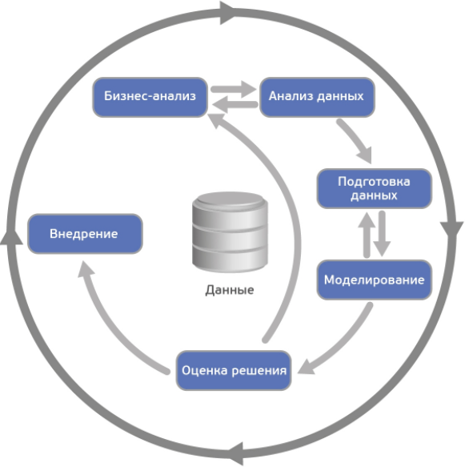
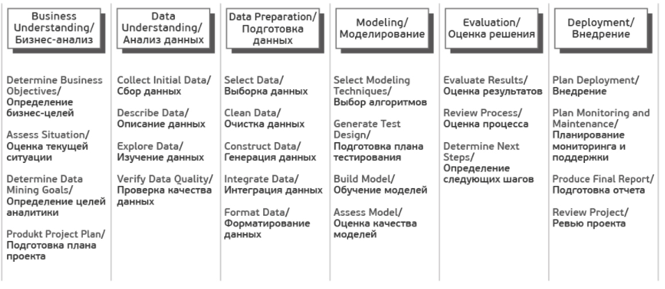

---
jupyter:
  jupytext:
    text_representation:
      extension: .md
      format_name: markdown
      format_version: '1.3'
      jupytext_version: 1.16.7
  kernelspec:
    display_name: Python 3 (ipykernel)
    language: python
    name: python3
---

<!-- #region slideshow={"slide_type": "slide"} toc=true editable=true -->
# Лекция 2: Этапы решения задачи машинного обучения. Методология CRISP-DM

- Московский государственный технический университет им. Н.Э. Баумана
- Московский политехнический университет

Красников Александр Сергеевич

https://github.com/askras/bmstu_machinelearning/

2024-2025
<!-- #endregion -->

<!-- #region slideshow={"slide_type": "slide"} editable=true -->
## CRoss Industry Standard Process for Data Mining (CRISP-DM)

**CRoss Industry Standard Process for Data Mining (CRISP-DM)**– стандарт, описывающий общие процессы и подходы к аналитике данных, используемые в промышленных data-mining проектах независимо от конкретной задачи и индустрии.

**аналитический проект** состоит из:
* Бизнес-анализ (Business understanding)
* Анализ данных (Data understanding)
* Подготовка данных (Data preparation)
* Моделирование (Modeling)
* Оценка результата (Evaluation)
* Внедрение (Deployment)
<!-- #endregion -->

<!-- #region slideshow={"slide_type": "slide"} editable=true -->
Методология не жесткая. Она допускает вариацию в зависимости от конкретного проекта – можно возвращаться к предыдущим шагам, можно какие-то шаги пропускать, если для решаемой задачи они не важны:


<!-- #endregion -->

<!-- #region slideshow={"slide_type": "slide"} editable=true -->
Каждый из этих этапов в свою очередь делится на задачи. На выходе каждой задачи должен получаться определенный результат. 

Задачи следующие:


<!-- #endregion -->

<!-- #region slideshow={"slide_type": "slide"} editable=true -->
## Несколько базовых понятий машинного обучения
Пусть у бизнеса есть некая интересующая его величина — **y** (например, вероятность оттока клиента). А также есть данные — **x** (например, обращения клиента в техподдержку), от которых может зависеть y. Бизнес хочет понимать, как именно **y** зависит от **x**, чтобы в дальнейшем через настройку **x** он мог влиять на **y**. Таким образом, задача проекта — найти функцию **f**, которая лучше всего моделирует исследуемую зависимость $y = f(x).$

Под моделью мы будем понимать формулу $f(x)$ либо программу, реализующую эту формулу. Любая модель описывается, во-первых, своим алгоритмом обучения (это может быть регрессия, дерево решений, градиентный бустинг и прочее), а во-вторых, набором своих параметров (которые у каждого алгоритма свои). Обучение модели – процесс поиска таких параметров, при которых модель лучше всего аппроксимирует наблюдаемые данные.

Обучающая выборка – таблица, содержащая пары **x** и **y**. Строки в этой таблице называются кейсами, а столбцы – атрибутами. Атрибуты, обладающие достаточной предсказательной способностью, будем называть предикторами. В случае с обучением «без учителя» (например, в задачах кластеризации), обучающая выборка состоит только из **x**. Скоринг – это применение найденной функции $f(x)$ к новым данным, по которым y пока неизвестен. Например, в задаче кредитного скоринга сначала моделируется вероятность несвоевременной оплаты долга клиентом, а затем разработанная модель применяется к новым заявителям для оценки их кредитоспособности.
<!-- #endregion -->

<!-- #region slideshow={"slide_type": "slide"} editable=true -->
## Пошаговое описание методологии
<!-- #endregion -->

<!-- #region slideshow={"slide_type": "slide"} editable=true -->
### Бизнес-анализ (Business Understanding)
На первом шаге нам нужно определиться с целями ,обозначить содержание и границы проекта.

Первым делом знакомимся с заказчиком и пытаемся понять, что же он на самом деле хочет (или рассказываем ему). На следующие вопросы хорошо бы получить ответ.
* Организационная структура: кто участвует в проекте со стороны заказчика, кто выделяет деньги под проект, кто принимает ключевые решения, кто будет основным пользователем? Собираем контакты.
* Какова бизнес-цель проекта?
Например, уменьшение оттока клиентов.
* Существуют ли какие-то уже разработанные решения? Если существуют, то какие и чем именно текущее решение не устраивает?
<!-- #endregion -->

<!-- #region slideshow={"slide_type": "subslide"} editable=true -->
#### Текущая ситуация (Assessing current solution)
Когда вместе с заказчиком разобрались, что мы хотим, нужно оценить, что мы можем предложить с учетом текущих реалий.

Оцениваем, хватает ли ресурсов для проекта.

* Есть ли доступное железо или его необходимо закупать?
* Где и как хранятся данные, будет ли предоставлен доступ в эти системы, нужно ли дополнительно докупать/собирать внешние данные?
* Сможет ли заказчик выделить своих экспертов для консультаций на данный проект?
<!-- #endregion -->

<!-- #region slideshow={"slide_type": "subslide"} editable=true -->
#### Типичные риски следующие.

* Не уложиться в сроки.
* Финансовые риски (например, если спонсор потеряет заинтересованность в проекте).
* Малое количество или плохое качество данных, которые не позволят получить эффективную модель.
* Данные качественные, но закономерности в принципе отсутствуют и, как следствие, полученные результаты не интересны заказчику.

Важно, чтобы заказчик и исполнитель говорили на одном языке, поэтому перед началом проекта лучше составить глоссарий и договориться об используемой в рамках проекта терминологии. Так, если мы делаем модель оттока для телекома, необходимо сразу договориться, что именно мы будем считать оттоком – например, отсутствие значительных начислений по счету в течение 4 недель подряд.<br>

Далее стоит (хотя бы грубо) оценить ROI. В machine-learning проектах обоснованную оценку окупаемости часто можно получить только по завершению проекта (либо пилотного моделирования), но понимание потенциальной выгоды может стать хорошим драйвером для всех.<br>
<!-- #endregion -->

<!-- #region slideshow={"slide_type": "subslide"} editable=true -->
#### Решаемые задачи с точки зрения аналитики (Data Mining goals)
После того, как задача поставлена в бизнес-терминах, необходимо описать ее в технических терминах. В частности, отвечаем на следующие вопросы.

* Какую метрику мы будем использовать для оценки результата моделирования (а выбрать есть из чего: Accuracy, RMSE, AUC, Precision, Recall, F-мера, $R^2$, Lift, Logloss  и т.д.)?
* Каков критерий успешности модели (например, считаем AUC равный 0.65 — минимальным порогом, 0.75 — оптимальным)?
* Если объективный критерий качества использовать не будем, то как будут оцениваться результаты?
<!-- #endregion -->

<!-- #region slideshow={"slide_type": "subslide"} editable=true -->
#### План проекта (Project Plan)
Как только получены ответы на все основные вопросы и ясна цель проекта, время составить план проекта. План должен содержать оценку всех шести фаз внедрения.
<!-- #endregion -->

<!-- #region slideshow={"slide_type": "slide"} editable=true -->
### Анализ данных (Data Understanding)
Начинаем реализацию проекта и для начала смотрим на данные. На этом шаге никакого моделирования нет, используется только описательная аналитика.<br>

Цель шага – понять слабые и сильные стороны предоставленных данных, определить их достаточность, предложить идеи, как их использовать, и лучше понять процессы заказчика. Для этого мы строим графики, делаем выборки и рассчитываем статистики. 
<!-- #endregion -->

<!-- #region slideshow={"slide_type": "subslide"} editable=true -->
#### Сбор данных (Data collection)

Для начала нужно понимать, какими данными располагает заказчик. Данные могут быть:

* собственные (1st party data),
* сторонние данные (3rd party),
* «потенциальные» данные (для получения которых необходимо организовать сбор).

Необходимо проанализировать все источники, доступ к которым предоставляет заказчик. Если собственных данных недостаточно, возможно, стоит закупить сторонние или организовать сбор новых данных.
<!-- #endregion -->

<!-- #region slideshow={"slide_type": "subslide"} editable=true -->
#### Описание данных (Data description)
Далее смотрим на доступные нам данные.

* Необходимо описать данные во всех источниках (таблица, ключ, количество строк, количество столбцов, объем на диске).
* Если объем слишком велик для используемого ПО, создаем сэмпл данных.
* Считаем ключевые статистики по атрибутам (минимум, максимум, разброс, кардинальность и т.д.).
<!-- #endregion -->

<!-- #region slideshow={"slide_type": "subslide"} editable=true -->
#### Исследование данных (Data exploration)
С помощью графиков и таблиц исследуем данные, чтобы сформулировать гипотезы относительно того, как эти данные помогут решить задачу.
<br>
В мини-отчете фиксируем, что интересного нашли в данных, а также список атрибутов, которые потенциально полезны.
<!-- #endregion -->

<!-- #region slideshow={"slide_type": "subslide"} editable=true -->
#### Качество данных (Data quality)
Важно еще до моделирования оценить качество данных, так как любые несоответствия могут повлиять на ход проекта. Какие могут быть сложности с данными?

* Пропущенные значения.
К примеру, мы делаем модель классификации клиентов банка по их продуктовым предпочтениям, но, поскольку анкеты заполняют только клиенты-заемщики, атрибут «уровень з/п» у клиентов-вкладчиков не заполнен.
* Ошибки данных (опечатки)
* Неконсистентная кодировка значений (например «M» и «male» в разных системах)
<!-- #endregion -->

<!-- #region slideshow={"slide_type": "slide"} editable=true -->
### Подготовка данных (Data Preparation)
Подготовка данных – это традиционно наиболее затратный по времени этап machine learning проекта (в описании говорится о 50-70% времени проекта, по нашему опыту может быть еще больше). Цель этапа – подготовить обучающую выборку для использования в моделировании.
<!-- #endregion -->

<!-- #region slideshow={"slide_type": "subslide"} editable=true -->
#### Отбор данных (Data Selection)
Для начала нужно отобрать данные, которые мы будем использовать для обучения модели. <br>

Отбираются как атрибуты, так и кейсы.<br>

Например, если мы делаем продуктовые рекомендации посетителям сайта, мы ограничиваемся анализом только зарегистрированных пользователей.

При выборе данных аналитик отвечает на следующие вопросы.<br>

* Какова потенциальная релевантность атрибута решаемой задаче?
*Так, электронная почта или номер телефона клиента как предикторы для прогнозирования явно бесполезны. А вот домен почты (mail.ru, gmail.com) или код оператора в теории уже могут обладать предсказательной способностью.*
* Достаточно ли качественный атрибут для использования в модели? 
*Если видим, что большая часть значений атрибута пуста, то атрибут, скорее всего, бесполезен.*
Стоит ли включать коррелирующие друг с другом атрибуты?
* Есть ли ограничения на использование атрибутов?
*Например, политика компании может запрещать использование атрибутов с персональной информацией в качестве предикторов.*
<!-- #endregion -->

<!-- #region slideshow={"slide_type": "subslide"} editable=true -->
#### Очистка данных (Data Cleaning)
Когда отобрали потенциально интересные данные, проверяем их качество.

* Пропущенные значения => нужно либо их заполнить, либо удалить из рассмотрения
* Ошибки в данных => попробовать исправить вручную либо удалить из рассмотрения
* Несоответствующая кодировка => привести к единой кодировке

На выходе получается 3 списка атрибутов – качественные атрибуты, исправленные атрибуты и забракованные.
<!-- #endregion -->

<!-- #region slideshow={"slide_type": "subslide"} editable=true -->
#### Генерация данных (Constructing new data)
Часто генерация признаков (**feature engineering**) – это наиболее важный этап в подготовке данных: грамотно составленный признак может существенно улучшить качество модели.<br>

К генерации данных можно отнести:

* агрегацию атрибутов (расчет sum, avg, min, max, var и т.д.),
* генерацию кейсов (например, oversampling или алгоритм SMOTE),
* конвертацию типов данных для использования в разных моделях (например, SVM традиционно работает с интервальными данными, а CHAID с номинальными),
* нормализацию атрибутов (feature scaling),
* заполнение пропущенных данных (missing data imputation).
<!-- #endregion -->

<!-- #region slideshow={"slide_type": "subslide"} editable=true -->
#### Интеграция данных (Integrating data)
Хорошо, когда данные берутся из корпоративного хранилища (КХД) или заранее подготовленной витрины. Однако часто данные необходимо загружать из нескольких источников и для подготовки обучающей выборки требуется их интеграция. Под интеграцией понимается как «горизонтальное» соединение (Merge), так и  «вертикальное» объединение (Append), а также агрегация данных. На выходе, как правило, имеем единую аналитическую таблицу, пригодную для поставки в аналитическое ПО в качестве обучающей выборки.
<!-- #endregion -->

<!-- #region slideshow={"slide_type": "subslide"} editable=true -->
#### Форматирование данных (Formatting Data)
Наконец, нужно привести данные к формату, пригодному для моделирования (только для тех алгоритмов, которые работают с определенным форматом данных). *Так, если речь идет об анализе временного ряда – к примеру, прогнозируем ежемесячные продажи торговой сети – возможно, его нужно предварительно отсортировать.*
<!-- #endregion -->

<!-- #region slideshow={"slide_type": "slide"} editable=true -->
### Моделирование (Modeling)
На четвертом шаге наконец-то начинается самое интересное — обучение моделей. Как правило, оно выполняется итерационно – мы пробуем различные модели, сравниваем их качество, делаем перебор гиперпараметров и выбираем лучшую комбинацию. Это наиболее приятный этап проекта.
<!-- #endregion -->

<!-- #region slideshow={"slide_type": "subslide"} editable=true -->
#### Выбор алгоритмов (Selecting the modeling technique)

Необходимо определиться, какие модели будем использовать (благо, их множество). Выбор модели зависит от решаемой задачи, типов атрибутов и требований по сложности (например, если модель будет дальше внедряться в Excel, то RandomForest и XGBoost явно не подойдут). При выборе следует обратить внимание на следующее.

* Достаточно ли данных, поскольку сложные модели как правило требуют большей выборки?
* Сможет ли модель обработать пропуски данных (какие-то реализации алгоритмов умеют работать с пропусками, какие-то нет)?
* Сможет ли модель работать с имеющимися типами данных или необходима конвертация?
<!-- #endregion -->

<!-- #region slideshow={"slide_type": "subslide"} editable=true -->
#### Планирование тестирования (Generating a test design)
Далее надо решить, на чем мы будем обучать, а на чем тестировать нашу модель. 

Традиционный подход – это разделение выборки на 3 части (обучение, валидацию и тест) в примерной пропорции 60/20/20. В этом случае обучающая выборка используется для подгонки параметров модели, а валидация и тест для получения очищенной от эффекта переобучения оценки ее качества. Более сложные стратегии предполагают использование различных вариантов кросс-валидации. 

Здесь же прикидываем, как будем делать оптимизацию гиперпараметров моделей –  сколько будет итераций по каждому алгоритму, будем ли делать grid-search или random-search.
<!-- #endregion -->

<!-- #region slideshow={"slide_type": "subslide"} editable=true -->
#### Обучение моделей (Building the models)

Запускаем цикл обучения и после каждой итерации фиксируем результат. На выходе получаем несколько обученных моделей.

Кроме того, для каждой обученной модели фиксируем следующее.

* Показывает ли модель какие-то интересные закономерности?
*Например, что точность предсказания на 99% объясняется всего одним атрибутом.*
* Какова скорость обучения/применения модели?
*Если модель обучается 2 дня, возможно, стоит поискать более эффективный алгоритм или уменьшить обучающую выборку.*
* Были ли проблемы с качеством данных? 
*Например, в тестовую выборку попали кейсы с пропущенными значениями, и из-за этого не вся выборка проскорилась.*
<!-- #endregion -->

<!-- #region slideshow={"slide_type": "subslide"} editable=true -->
#### Оценка результатов (Assessing the model)
После того, как был сформирован пул моделей, нужно их еще раз детально проанализировать и выбрать модели-победители. На выходе неплохо иметь список моделей, отсортированный по объективному и/или субъективному критерию.

Задачи шага:

* провести технический анализ качества модели (ROC, Gain, Lift и т.д.),
* оценить, готова ли модель к внедрению в КХД (или куда нужно),
* достигаются ли заданные критерии качества,
* оценить результаты с точки зрения достижения бизнес-целей. Это можно обсудить с аналитиками заказчика.

Если критерий успеха не достигнут, то можно либо улучшать текущую модель, либо пробовать новую.

Прежде чем переходить к внедрению нужно убедиться, что:

* результат моделирования понятен (модель, атрибуты, точность)
* результат моделирования логичен 
*Например, мы прогнозируем отток клиентов и получили ROC AUC, равный 95%. Слишком хороший результат – повод проверить модель еще раз.
* мы попробовали все доступные модели
* инфраструктура готова к внедрению модели 
*Заказчик: «Давайте внедрять! Только у нас места нет в витрине…».*
<!-- #endregion -->

<!-- #region slideshow={"slide_type": "slide"} editable=true -->
### Оценка результата (Evaluation)
Результатом предыдущего шага является построенная математическая модель (model), а также найденные закономерности (findings). На пятом шаге мы оцениваем результаты проекта.
<!-- #endregion -->

<!-- #region slideshow={"slide_type": "subslide"} editable=true -->
#### Оценка результатов моделирования (Evaluating the results)

Если на предыдущем этапе мы оценивали результаты моделирования с технической точки зрения, то здесь мы оцениваем результаты с точки зрения достижения бизнес-целей.

Адресуем следующие вопросы:

* Формулировка результата в бизнес-терминах. Бизнесу гораздо легче общаться в терминах $ и ROI, чем в абстрактных Lift или R2<br>

**Классический пример диалога**
Аналитик: Наша модель показывает десятикратный lift!<br>
Бизнес: Я не впечатлён…<br>
Аналитик: Вы заработаете дополнительных 100K$ в год!<br>
Бизнес: С этого надо было начинать! Поподробнее, пожалуйста...<br>
Формулировка результата в бизнес-терминах. Бизнесу гораздо легче общаться в терминах $ и ROI, чем в абстрактных Lift или R2
Классический пример диалога
Аналитик: Наша модель показывает десятикратный lift!
Бизнес: Я не впечатлён…
Аналитик: Вы заработаете дополнительных 100K$ в год!
Бизнес: С этого надо было начинать! Поподробнее, пожалуйста...
* В целом насколько хорошо полученные результаты решают бизнес-задачу?
Найдена ли какая-то новая ценная информация, которую стоит выделить отдельно? 
К примеру, компания-ритейлер фокусировала свои маркетинговые усилия на сегменте «активная молодежь», но, занявшись прогнозированием вероятности отклика, с удивлением обнаружила, что их целевой сегмент совсем другой –  «обеспеченные дамы 40+».В целом насколько хорошо полученные результаты решают бизнес-задачу?
* Найдена ли какая-то новая ценная информация, которую стоит выделить отдельно? 
*К примеру, компания-ритейлер фокусировала свои маркетинговые усилия на сегменте «активная молодежь», но, занявшись прогнозированием вероятности отклика, с удивлением обнаружила, что их целевой сегмент совсем другой –  «обеспеченные дамы 40+».*
<!-- #endregion -->

<!-- #region slideshow={"slide_type": "subslide"} editable=true jp-MarkdownHeadingCollapsed=true -->
#### Разбор полетов (Review the process)
Стоит собраться за кружкой пива за столом, проанализировать ход проекта и сформулировать его сильные и слабые стороны. Для этого нужно пройтись по всем шагам:

* Можно ли было какие-то шаги сделать более эффективными? 
*Например, из-за неповоротливости IT-отдела заказчика целый месяц ушел на согласование доступов. Не гуд!*
* Какие были допущены ошибки и как их избежать в будущем? 
*На этапе  планирования недооценили сложность выгрузки данных из источников и в результате не уложились в сроки.*
* Были ли не сработавшие гипотезы? Если да, стоит ли их повторять? 
*Аналитик: «А давайте теперь попробуем сверточную нейронную сеть… Всё становится лучше с нейросетями!»*
* Были ли неожиданности при реализации шагов? Как их предусмотреть в будущем?
*Заказчик: «Ok. А мы думали, что обучающая выборка для разработки модели не нужна…»*
<!-- #endregion -->

<!-- #region slideshow={"slide_type": "subslide"} editable=true -->
#### Принятие решения (Determining the next steps)
Далее нужно либо внедрять модель, если она устраивает заказчика, либо, если виден потенциал для улучшения, попытаться еще ее улучшить.

Если на данном этапе у нас несколько удовлетворяющих моделей, то отбираем те, которые будем дальше внедрять.
<!-- #endregion -->

<!-- #region slideshow={"slide_type": "slide"} editable=true -->
### Внедрение (Deployment)

Перед началом проекта с заказчиком всегда оговаривается способ поставки модели. В одном случае это может быть просто проскоренная база клиентов, в другом – SQL-формула, в третьем – полностью проработанное аналитическое решение, интегрированное в информационную систему. 

На данном шаге осуществляется внедрение модели (если проект предполагает этап внедрения). Причем под внедрением может пониматься как физическое добавление функционала, так и инициирование изменений в бизнес-процессах компании.
<!-- #endregion -->

<!-- #region slideshow={"slide_type": "subslide"} editable=true -->
#### Планирование развертывания (Planning Deployment)

Наконец собрали в кучу все полученные результаты. Что теперь?

* Важно зафиксировать, что именно и в каком виде мы будем внедрять, а также подготовить технический план внедрения (пароли, явки и прочее)
* Продумать, как с внедряемой моделью будут работать пользователи
*Например, на экране сотрудника колл-центра показываем склонность клиента к подключению дополнительных услуг.*
* Определить принцип мониторинга решения. Если нужно, подготовиться к опытно-промышленной эксплуатации.
*Например, договариваемся об использовании модели в течение года и тюнинге модели раз в 3 месяца.*
<!-- #endregion -->

<!-- #region slideshow={"slide_type": "subslide"} editable=true -->
#### Настройка мониторинга модели (Planning Monitoring)

Очень часто в проект включаются работы по поддержке решения. Вот что оговаривается.

* Какие показатели качества модели будут отслеживаться?
*В своих банковских проектах мы часто используем популярный в банках показатель population stability index PSI.*
* Как понимаем, что модель устарела?
*Например, если PSI больше 0.15, либо просто договариваемся о регулярном пересчете раз в 3 месяца.*
* Если модель устарела, достаточно ли будет ее переобучить или нужно организовывать новый проект?
*При существенных изменениях в бизнес-процессах тюнинга модели недостаточно, нужен полный цикл переобучения – с добавлением новых атрибутов, отбором предикторов и.т.д.*
<!-- #endregion -->

<!-- #region slideshow={"slide_type": "subslide"} editable=true -->
#### Отчет по результатам моделирования (Final Report)

По окончании проекта, как правило, пишется отчет о результатах моделирования, в который добавляются результаты по каждому шагу, начиная от первичного анализа данных и заканчивая внедрением модели. В этот отчет также можно включить рекомендации по дальнейшему развитию модели.

Написанный отчет презентуется заказчику и всем заинтересованным лицам. В отсутствие ТЗ этот отчет является главным документом проекта. Также важно поговорить с задействованными в проекте сотрудниками (как со стороны заказчика, так и со стороны исполнителя) и собрать их мнение о проекте.
<!-- #endregion -->

<!-- #region slideshow={"slide_type": "slide"} editable=true -->
## О важности планирования

Всегда есть соблазн «пробежать» первые два этапа и перейти сразу к реализации. Практика показывает, что это не всегда оправдано. 

На этапе постановки бизнес-целей (business understanding) важно как можно детальнее проговорить с заказчиком предлагаемое решение и убедиться, что ваши с ним ожидания совпадают. Бывает так, что бизнес рассчитывает получить в результате некоего «волшебного» робота, который сходу решит все его проблемы и мгновенно увеличит вдвое выручку. Поэтому, чтобы ни у кого не было разочарований по итогам проекта, всегда стоит четко проговаривать, какой именно результат получит заказчик и что он даст бизнесу.

Кроме того, не всегда заказчик может дать правильную оценку точности модели. В качестве примера: предположим, мы анализируем отклик на рекламную кампанию в интернете. Знаем, что по ссылке переходят примерно 10% клиентов. Разработанная нами модель отбирает 1000 наиболее склонных к отклику клиентов, и мы видим, что среди них переходит по ссылке каждый четвертый – получаем точность (precision) в 25%. Модель показывает неплохой результат (в 2.5 раза лучше «случайной» модели), но для заказчика точность в 25% слишком мала (он ждет цифр в районе 80-90%). И наоборот, совершенно бессмысленная модель, которая относит всех в один класс, покажет точность (accuracy), равную 90%, и формально будет удовлетворять заявленному критерию успеха. Т.е. важно вместе с заказчиком выбирать правильную меру качества модели и правильно ее интерпретировать.

Этап исследования (data understanding) важен тем, что позволяет и нам, и заказчику лучше понять его данные. У нас были примеры, когда после презентации результатов шага мы параллельно с основным проектом договаривались о новых, так как заказчик видел потенциал в найденных на этом этапе закономерностях.

В качестве другого примера приведу один из наших проектов, когда мы положились на диалог с заказчиком, ограничились поверхностным изучением данных и на этапе моделирования обнаружили, что часть данных оказалась неприменима из-за многочисленных пропусков. Поэтому всегда стоит заранее изучить данные, с которыми предстоит работать.

Наконец, хочу отметить, что, несмотря на свою полноту, методология все-таки достаточно общая. Она ничего не говорит о выборе конкретных алгоритмов и не дает готовых решений. Возможно, это и хорошо, так как всегда остается пространство для творческого поиска, ведь, повторюсь, сегодня профессия data scientist по-прежнему остается одной из наиболее творческих в IT-сфере.

<!-- #endregion -->

```python editable=true slideshow={"slide_type": ""}

```
