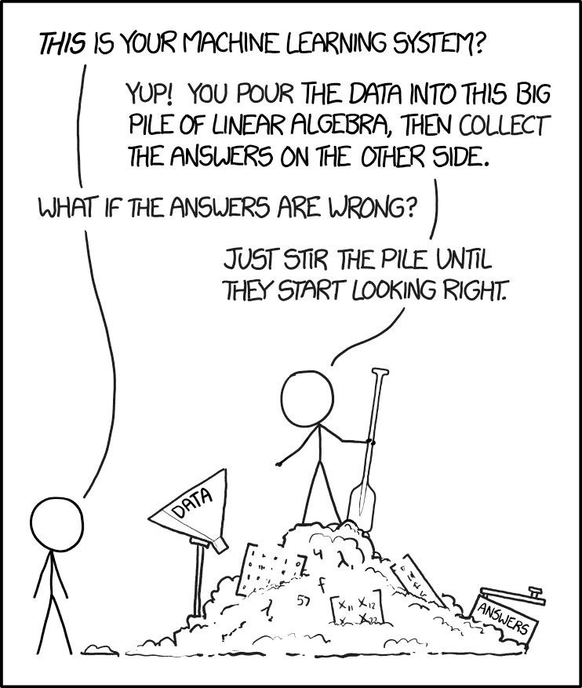
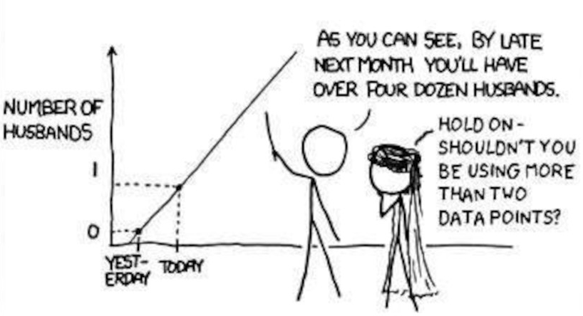

---
jupyter:
  jupytext:
    text_representation:
      extension: .md
      format_name: markdown
      format_version: '1.3'
      jupytext_version: 1.16.4
  kernelspec:
    display_name: Python 3 (ipykernel)
    language: python
    name: python3
---

<!-- #region editable=true slideshow={"slide_type": "slide"} -->
# Лекция 6: Введение в машинное обучение

**Несколько полезных вещей, которые нужно знать о машинном обучении**

Машинное обучение и анализ данных

МГТУ им. Н.Э. Баумана

Красников Александр Сергеевич

2024
<!-- #endregion -->

```python editable=true slideshow={"slide_type": "skip"} tags=["hide-input"]
# Импорт необходимых библиотек
from cycler import cycler
from IPython.core.interactiveshell import InteractiveShell
from IPython.display import display, HTML

import matplotlib_inline
import matplotlib.pyplot as plt
import mglearn
import numpy as np
import os
import pandas as pd
from pprint import pprint

# Глобальные настройки
%matplotlib inline
matplotlib_inline.backend_inline.set_matplotlib_formats('pdf', 'png')
plt.xkcd()
plt.rcParams['image.cmap'] = "viridis"
plt.rcParams['image.interpolation'] = "none"
plt.rcParams['savefig.bbox'] = "tight"
plt.rcParams['lines.linewidth'] = 1
plt.rcParams['legend.numpoints'] = 1
plt.rc('axes', prop_cycle=(cycler('color', ['#0000aa', '#ff2020', '#50ff50', 'c', '#fff000']) +
                           cycler('linestyle', ['-', '--', ':', '-.', '--'])))
```

<!-- #region editable=true slideshow={"slide_type": "slide"} -->
## Где используется машинное обучение?
- Поисковые системы (например, Google, Yandex)
- Рекомендательные системы (например, Netflix)
- Автоматический перевод (например, Google Translate, Yandex Translate)
- Понимание речи (например, Алиса, Siri, Alexa)
- Игры (например, AlphaGo)
- Беспилотные автомобили
- Персонализированная медицина
- Прогресс во всех науках: генетика, астрономия, химия, неврология, физика, ...
- ...
<!-- #endregion -->

<!-- #region editable=true slideshow={"slide_type": "slide"} -->
## Что такое машинное обучение?
- Научиться выполнять задачу, основываясь на опыте (примерах) $X$, минимизируя ошибку $\mathcal{E}$
  + Например, максимально точное распознавание человека на изображении
- Часто мы хотим изучить функцию (модель) $f$ с некоторыми параметрами модели $\omega$, которая выдает правильный вывод $y$

$$f(\omega, X) = y$$
$$\underset{\omega}{\operatorname{argmin}} \mathcal{E}(f(\omega, X))$$

- Обычно является частью *гораздо* большей системы, которая предоставляет данные $X$ в правильной форме
  + Данные необходимо собрать, очистить, нормализовать, проверить на наличие смещений данных,...
<!-- #endregion -->

<!-- #region editable=true slideshow={"slide_type": "slide"} -->
### Индуктивное смещение

- На практике нам приходится вносить в модель допущения: _индуктивное смещение_ $b$
  + Как должна выглядеть модель?
    * Имитация человеческого мозга: нейронные сети
    * Логическое сочетание входных данных: деревья решений, линейные модели
    * Найти похожие примеры: ближайшие соседи, SVM.
    * Распределение вероятностей: байесовские модели
  + Пользовательские настройки (гиперпараметры )
    * Например, глубина дерева, сетевая архитектура
  + Предположения о распределении данных, например, $X \sim N(\mu,\sigma)$
- Мы можем _переносить_ знания из предыдущих задач: $f_1, f_2, f_3, ... \Longrightarrow f_{new}$
  + Выберите правильную модель, гиперпараметры
  + Повторное использование ранее полученных значений для параметров модели $\omega$
- В итоге:

$$\underset{\omega,b}{\operatorname{argmin}} \mathcal{E}(f(\omega, b, X))$$
<!-- #endregion -->

<!-- #region editable=true slideshow={"slide_type": "slide"} -->
### Машинное обучение против статистики
Статистическое моделирование: две культуры [Брейман, 2001]
- Оба направлены на прогнозирование природных явлений:


- Статистика:
  + Помогает людям понять мир
  + Предположим, что данные генерируются в соответствии с понятной моделью.


- Машинное обучение:
  + Полностью автоматизировать задачу (частично *заменить* человека)
  + Предположим, что процесс генерации данных неизвестен.
  + Ориентировано на инженерное дело, меньше (слишком мало?) математической теории


[Брейман, 2001] Breiman, Leo. Random Forests // Machine Learning : journal. — 2001. — Vol. 45, no. 1. — P. 5—32. — doi:10.1023/A:1010933404324
<!-- #endregion -->

<!-- #region editable=true slideshow={"slide_type": "slide"} -->
## Типы машинного обучения
- **Обучение с учителем** (**Supervised Learning**): изучение *модели* $f$ на основе *маркированных данных* $(X,y)$
  + На основе новых входных данных $X$, предсказать правильный выходной сигнал $y$
- **Обучение без учителя** (**Unsupervised Learning**): исследование структуры данных $X$ для извлечения значимой информации
  + На основе входных данных $X$, найти, какие из них являются особенными, похожими, аномальными, ...
- **Обучение с частичным привлечением учителя** (**Semi-Supervised Learning**): изучение модели на основе (нескольких) помеченных и (многих) непомеченных примеров. Другие названия:  полуавтоматическое обучение, частичное обучение
  + Немаркированные примеры добавляют информацию о том, какие новые примеры, скорее всего, появятся.
- **Обучение с подкреплением** (**Reinforcement Learning**): разработка агента, который улучшает свои характеристики на основе взаимодействия с окружающей средой

Примечание: Практические системы МО могут объединять несколько типов в одной системе.
<!-- #endregion -->

<!-- #region slideshow={"slide_type": "slide"} editable=true -->
### Машинное обучение с учителем

- Обучение модели на основе маркированных  данных, а затем вычислене прогноза
- Под наблюдением: известен правильный/желаемый результат (метка)
- Подтипы: **Классификация** (**classification**) (предсказать класс) и **Регрессия** (**regression**) (предсказать числовое значение)
- Большинство алгоритмов обучения с учителем применимы для обоих типов задач
<!-- #endregion -->

<!-- #region editable=true slideshow={"slide_type": "slide"} -->


<!-- #endregion -->

<!-- #region slideshow={"slide_type": "slide"} editable=true -->
#### Классификация

- Предсказать **метку класса** (категорию), дискретную и неупорядоченную
  + Может быть **бинарной** (например, спам/не спам) или **мультиклассовой** (например, распознавание букв)
  + Многие классификаторы могут возвращать **уверенность** (**confidence**) для каждого класса
- Прогнозы модели строят **границу принятия решения** (**decision boundary**), разделяющую классы
<!-- #endregion -->

```python tags=["hide-input"] editable=true slideshow={"slide_type": "slide"}
def plot_classifier(classifier, X, y):
    '''Построитель разделяющих поверхностей для алгоритмов классификации'''

    fig, axes = plt.subplots(1, 2, figsize=(18, 6))

    mglearn.tools.plot_2d_separator(
        classifier,
        X,
        ax=axes[0],
        alpha=.4,
        cm=mglearn.cm2
    )

    scores_image = mglearn.tools.plot_2d_scores(
        classifier,
        X,
        ax=axes[1],
        alpha=.5,
        cm=mglearn.ReBl,
        function='predict_proba'
    )

    for ax in axes:
        mglearn.discrete_scatter(X[:, 0], X[:, 1], y, markers='.', ax=ax)
        ax.set_xlabel("Признак 0")
        ax.set_ylabel("Признак 1", labelpad=0)
        ax.tick_params(axis='y', pad=0)

    cbar = plt.colorbar(scores_image, ax=axes.tolist())
    cbar.set_label('Вероятность принадлежности классу', rotation=270, labelpad=6)
    cbar.set_alpha(1)
    axes[0].legend(["Класс 0", "Класс 1"], ncol=4, loc=(.1, 1.1));
```

```python editable=true slideshow={"slide_type": "slide"}
# Cинтетический набор данных
from sklearn.datasets import make_moons

X1, y1 = make_moons(n_samples=70, noise=0.2, random_state=8)
```

```python editable=true slideshow={"slide_type": "slide"}
# Логистическая регрессия
from sklearn.linear_model import LogisticRegression

lr = LogisticRegression(C=1.0e+1).fit(X1, y1)
plot_classifier(classifier=lr, X=X1, y=y1)
```

```python editable=true slideshow={"slide_type": "slide"}
# Метод ближайших соседей
from sklearn.neighbors import KNeighborsClassifier

knn = KNeighborsClassifier(n_neighbors=3).fit(X1, y1)
plot_classifier(classifier=knn, X=X1, y=y1)
```

```python editable=true slideshow={"slide_type": "slide"}
# Метод опорных векторов
from sklearn.svm import SVC

svm = SVC(kernel='rbf', gamma=2, probability=True).fit(X1, y1)
plot_classifier(classifier=svm, X=X1, y=y1)
```

<!-- #region slideshow={"slide_type": "slide"} editable=true -->
##### Пример: классификация цветов
Классификация цветков ириса по сортам (versicolor, setosa или virginica). 


<!-- #endregion -->

<!-- #region slideshow={"slide_type": "slide"} editable=true -->
##### Представление: входные характеристики и метки

- Можно сделать снимки и использовать их (значения пикселей) в качестве входных данных (Глубокое обучение)
- Можно вручную определить ряд входных признаков (features), например, длину и ширину лепестков и чашелистиков
- Каждый &laquo;пример&raquo; &mdash; это точка в (возможно, многомерном) пространстве.


<!-- #endregion -->

<!-- #region slideshow={"slide_type": "slide"} editable=true -->
#### Регрессия
- Прогнозирование непрерывной величины, например температуры, стоимости, времени, количества посетителей, ...
  + Целевая переменная является числовой
  + Некоторые алгоритмы могут возвращать **доверительный интервал** (**confidence interval**)
- Найти связь между признаковыми переменными (**predictor variables**) и **целевой переменной** (**target variable**)
<!-- #endregion -->

```python editable=true slideshow={"slide_type": "slide"}
def plot_regression(regressor, X, y):
    '''Построитель линии регрессии'''

    plt.figure(figsize=(6, 6))

    x = np.atleast_2d(np.linspace(X.min(), X.max(), 100)).T
    try:
        y_pred, sigma = regressor.predict(x, return_std=True)
        plt.fill(np.concatenate([x, x[::-1]]),
                 np.concatenate([y_pred - 1.9600 * sigma,
                                 (y_pred + 1.9600 * sigma)[::-1]]),
                 alpha=.5,
                 fc='b',
                 ec='None',
                 label='95% доверительный интервал'
                )
    except:
        # Для 'LinearRegression'
        y_pred = regressor.predict(x)

    plt.plot(X, y, 'o', c='#0000aa')
    plt.plot(np.linspace(X.min(), X.max(), 100).reshape(-1, 1), y_pred, 'b-')

    plt.xlabel("Признак")
    plt.ylabel("Целевое значение")
```

```python tags=["hide-input"] editable=true slideshow={"slide_type": "slide"}
# Cинтетический набор данных
from mglearn.datasets import make_wave

X2, y2 = make_wave(n_samples=60)
```

```python tags=["hide-input"] editable=true slideshow={"slide_type": "slide"}
# Линейная регрессия
from sklearn.linear_model import LinearRegression

lr = LinearRegression().fit(X2, y2)
plot_regression(regressor=lr, X=X2, y=y2)
```

```python tags=["hide-input"] editable=true slideshow={"slide_type": "slide"}
# Байесовская ридж регрессия
from sklearn.linear_model import BayesianRidge

ridge = BayesianRidge().fit(X2, y2)
plot_regression(regressor=ridge, X=X2, y=y2)
```

```python tags=["hide-input"] editable=true slideshow={"slide_type": "slide"}
# Регрессия гауссовского процесса
from sklearn.gaussian_process import GaussianProcessRegressor
from sklearn.gaussian_process.kernels import RBF

gp = GaussianProcessRegressor(kernel=RBF(10, (1e-2, 1e2)), n_restarts_optimizer=9, alpha=0.1, normalize_y=True).fit(X2, y2)
plot_regression(regressor=gp, X=X2, y=y2)
```

<!-- #region slideshow={"slide_type": "slide"} editable=true -->
### Машинное обучение без учителя

- Немаркированные данные или данные с неизвестной структурой
- Изучение структуры данных для извлечения информации
- Много типов, рассмотрим **кластеризацию** (**clustering**) и **уменьшение размерности** (**dimensionality reduction**).
<!-- #endregion -->

<!-- #region slideshow={"slide_type": "slide"} editable=true -->
#### Кластеризация

- Группировка данных в смысловые подгруппы (кластеры)
- Объекты в кластере имеют определенную степень сходства (и различия с другими кластерами)
- Пример: различать разные типы клиентов
<!-- #endregion -->

```python editable=true slideshow={"slide_type": "slide"}
def plot_clusters(clusterer, X):
    '''Построитель кластеров'''

    y_pred = clusterer.predict(X)

    plt.figure(figsize=(8, 8))
    plt.scatter(X[:, 0], X[:, 1], c=y_pred)

    plt.title("Кластеризация методом k-средних")
    plt.xlabel("Признак 0")
    plt.ylabel("Признак 1")
```

```python editable=true slideshow={"slide_type": "slide"}
# Cинтетический набор данных
from sklearn.datasets import make_blobs

randomize = 2
np.random.seed(randomize)

X3, y3 = make_blobs(
    n_samples=1500,
    #cluster_std=[1.0, 1.5, 0.5],
    centers = [[1,2], [3,4], [6,2]],
    random_state=randomize
)
```

```python tags=["hide-input"] editable=true slideshow={"slide_type": "slide"}
# Кластеризация методом k-средних
from sklearn.cluster import KMeans

kmeans =  KMeans(n_clusters=3, random_state=42).fit(X3)
plot_clusters(kmeans, X3)
```

<!-- #region slideshow={"slide_type": "slide"} editable=true -->
#### Снижение размерности

- Данные могут быть очень многомерными и их трудно понимать, изучать, хранить, ...
- Снижение размерности позволяет сжать данные до меньшего количества измерений, сохранив при этом большую часть информации
- Новое представление может быть намного проще для моделирования (и визуализации)
<!-- #endregion -->

```python editable=true slideshow={"slide_type": "slide"}
# Швейцарский рулет
from sklearn.datasets import make_swiss_roll

X, color = make_swiss_roll(n_samples=800, random_state=123)

%matplotlib widget

fig = plt.figure(figsize=plt.figaspect(0.3)*1)

ax1 = fig.add_subplot(1, 2, 1, projection='3d')
ax1.xaxis.pane.fill = False
ax1.yaxis.pane.fill = False
ax1.zaxis.pane.fill = False
ax1.scatter(X[:, 0], X[:, 1], X[:, 2], c=color, cmap=plt.cm.rainbow, s=15)
plt.title('Швейцарский рулет')
```

```python editable=true slideshow={"slide_type": "skip"}
#plt.close()
```

```python editable=true slideshow={"slide_type": "slide"}
from mpl_toolkits.mplot3d import Axes3D

def plot_dimensionality_reducertion(X, X_reduced, title_3D='',  title_2D=''):
    '''Построитель преообразования 3D данных в 2D'''

    fig = plt.figure(figsize=plt.figaspect(0.3)*1)

    # 3D
    ax1 = fig.add_subplot(1, 2, 1, projection='3d')
    ax1.xaxis.pane.fill = False
    ax1.yaxis.pane.fill = False
    ax1.zaxis.pane.fill = False
    ax1.scatter(X[:, 0], X[:, 1], X[:, 2], c=color, cmap=plt.cm.rainbow, s=15)
    plt.title(title_3D)

    #2D
    ax2 = fig.add_subplot(1, 2, 2)
    plt.scatter(X_reduced[:, 0], X_reduced[:, 1], c=color, cmap=plt.cm.rainbow)
    plt.title(title_2D);
```

```python editable=true slideshow={"slide_type": "slide"}
# Метод главных компонент
from sklearn.decomposition import PCA
plt.close()
%matplotlib inline

pca = PCA(n_components=2)
X_pca = pca.fit_transform(X)
plot_dimensionality_reducertion(X=X, X_reduced=X_pca, title_3D='"Швейцарский рулет" 3D', title_2D='Метод главных компонент')
```

```python editable=true slideshow={"slide_type": "slide"}
from sklearn.manifold import locally_linear_embedding

X_lle, err = locally_linear_embedding(X, n_neighbors=12, n_components=2)
plot_dimensionality_reducertion(X=X, X_reduced=X_lle, title_3D='"Швейцарский рулет" 3D', title_2D='Линейное уменьшение размерности')
```

<!-- #region slideshow={"slide_type": "slide"} editable=true -->
### Обучение с подкреплением

- Разработать агента, который улучшает свои характеристики на основе взаимодействия с окружающей средой
  + Пример: шахматы, го, беспилотные автомобили, ...
- Поиск в (большом) пространстве действий и состояний
- **Функция вознаграждения** (**reward function**) определяет, насколько хорошо работает (серия) действие
- Обучение действиям (стратегии), которые максимизируют вознаграждение за исследование
<!-- #endregion -->

<!-- #region editable=true slideshow={"slide_type": "slide"} -->

<!-- #endregion -->

<!-- #region slideshow={"slide_type": "slide"} editable=true -->
## Обучение = Представление + оценка + оптимизация

Все алгоритмы машинного обучения состоят из 3 компонентов:

- **Представление** (**Representation**): Модель $f_{\theta}$ должна быть представлена на формальном языке, с которым может работать компьютер.
  + Определяет &laquo;концепции&raquo;, которые он может усвоить, *пространство гипотез*
  + Например, дерево решений, нейронная сеть, набор аннотированных точек данных
- **Оценка** (**Evaluation**): *внутренний* способ выбора одной гипотезы среди других
  + Целевая функция, функция подсчета очков, функция потерь, ...
  + Например, разница между правильным выводом и прогнозами
- **Оптимизация** (**Optimization**): *эффективный* способ поиска в пространстве гипотез
  + Начните с простой гипотезы, расширьте (ослабьте), если она не соответствует данным.
  + Начните с начального набора параметров модели, постепенно уточняйте их.
  + Множество методов, различающихся скоростью обучения, количеством оптимумов, ...
    
Модель полезна только в том случае, если ее можно эффективно оптимизировать


<!-- #endregion -->

<!-- #region slideshow={"slide_type": "slide"} editable=true -->
### Нейронные сети

Возьмем в качестве примера (многослойную) нейронную сеть

- каждое соединение (ребро) имеет *вес* $\omega_i$ (т.е. параметры модели)
- каждый узел получает взвешенные входные данные, выдает новое значение
- модель $f$ возвращает выход последнего слоя
- Архитектура сети &mdash; набор *гиперпараметров* (*hyperparameters*) $\theta$, таких как количество/тип нейронов и т.д. устанавливаются пользователем и фиксируются во время обучения
<!-- #endregion -->

<!-- #region slideshow={"slide_type": "slide"} editable=true -->

<!-- #endregion -->

<!-- #region slideshow={"slide_type": "slide"} editable=true -->
### Нейронные представление, оценка и оптимизация

- Представление: учитывая архитектуру, модель представлена ее параметрами
  + Рассмотрим мини-сеть с двумя весами $(\omega_1, \omega_2)$: двумерное пространство поиска
- Оценка: *функция потерь* $\mathcal{L}_\theta(\omega) = \mathcal{L}_\theta(\omega_1, \omega_2)$ вычисляет, насколько хороши прогнозы
  + вычисляется на наборе обучающих данных с &laquo;правильными ответами&raquo; 
  +  вся поверхность поиска не видна, можно лишь оценивать определенные наборы параметров
- Оптимизация: необходимо найти оптимальный набор параметров (при фиксированном выборе гиперпараметров)
  +  обычно используется *поиск* в пространстве гипотез
  + Например, градиентный спуск: $\omega_i^{new} = \omega_i - \frac{\partial \mathcal{L}_\theta(\omega) }{\partial \omega_i} $


<!-- #endregion -->

<!-- #region slideshow={"slide_type": "slide"} editable=true -->
## Переобучение и недообучение 
- Легко построить сложную модель, которая будет на 100% точной на обучающих данных, но очень плохой на новых данных.
- Переобучение (overfitting): построение модели, которая *слишком сложна для имеющнгося объема данных*.
  + Моделируются особенности обучающих данных (шум, смещения, ...)
  + решение: упростить модель, использовать регуляризацию или получить больше данных
  + **большинство алгоритмов имеют гиперпараметры, которые допускают регуляризацию**
- Недообучение (underfitting): построение модели, которая *слишком проста, учитывая сложность данных*
  +  решение: использование более сложной модели
- Существуют методы обнаружения переобучения (например, анализ смещения-дисперсии)
- можно создавать *ансамбли* (*ensembles*) из многих моделей, чтобы преодолеть как недообучение, так и переобучение
- Часто необходимо найти золотую середину: оптимизировать выбор алгоритмов и гиперпараметров или использовать больше данных
- Пример: регрессия с использованием полиномиальных функций
<!-- #endregion -->

```python tags=["hide-input"] editable=true slideshow={"slide_type": "slide"}
from sklearn.pipeline import Pipeline
from sklearn.preprocessing import PolynomialFeatures
from sklearn.linear_model import LinearRegression
from sklearn.model_selection import cross_val_score

def cos(X):
    return np.cos(1.5 * np.pi * X)

def plot_polynomial_regression(X, y, true_func, degrees):
    polynomial_features = PolynomialFeatures(
        degree=degrees,
        include_bias=False
    )
    linear_regression = LinearRegression()
    pipeline = Pipeline([("polynomial_features", polynomial_features),
                         ("linear_regression", linear_regression)])
    pipeline.fit(X[:, np.newaxis], y)

    # Оценка модели с помощью перекрестной проверки
    scores = cross_val_score(pipeline, X[:, np.newaxis], y,
                             scoring="neg_mean_squared_error", cv=10)
    scores_x.append(degrees)
    scores_y.append(-scores.mean())


    X_test = np.linspace(np.min(X), np.max(X), 100)

    fig, (ax1, ax2) = plt.subplots(1, 2, figsize=(18, 6))
    ax1.plot(X_test, pipeline.predict(X_test[:, np.newaxis]), label="Модель")
    ax1.plot(X_test, true_func(X_test), label="Истиная функция")
    ax1.scatter(X, y, edgecolor='b', label="Точки набора данных")
    ax1.set_xlabel("x")
    ax1.set_ylabel("y")
    ax1.set_xlim((0, 1))
    ax1.set_ylim((-2, 2))
    ax1.legend(loc="best")
    ax1.set_title(f"Степень полинома {degrees}\nMSE = {-scores.mean():.2e}(+/- {scores.std():.2e})")

    # Ошибки
    ax2.scatter(scores_x, scores_y, edgecolor='b')
    order = np.argsort(scores_x)
    ax2.plot(np.array(scores_x)[order], np.array(scores_y)[order], label="Ошибка на тестовых данных")
    ax2.set_xlim((0, 30))
    ax2.set_ylim((10**-2, 10**11))
    ax2.set_xlabel("Степень полинома")
    ax2.set_ylabel("Ошибка", labelpad=0)
    ax2.set_yscale("log")
    ax2.legend(loc="best")
    ax2.set_title("Ошибка методом перекрестной проверки")
```

```python tags=["hide-input"] editable=true slideshow={"slide_type": "slide"}
from IPython.display import clear_output
from ipywidgets import IntSlider, Output

np.random.seed(0)
n_samples = 30
X4 = np.sort(np.random.rand(n_samples))
y4 = cos(X4) + np.random.randn(n_samples) * 0.1
X4_test = np.linspace(0, 1, 100)
scores_x, scores_y = [], []


for d in range(1,31):
    plot_polynomial_regression(X=X4, y=y4, true_func=cos, degrees=d)
```

<!-- #region slideshow={"slide_type": "slide"} editable=true -->
### Выбор модели (Model selection)
- Наряду с (внутренней) функцией потерь нужна (внешняя) функция оценки
  + Сигнал обратной связи: действительно ли мы учимся правильным вещам?
    * Модель недоучена/переобучена?
  + Тщательный выбор модели, чтобы соответствовать области применения.
  + Необходимость выбора между моделями (и настройками гиперпараметров)



<!-- #endregion -->

<!-- #region slideshow={"slide_type": "slide"} editable=true -->
### Разделение набора данных

- Данные необходимо разделить на **обучающие** (**train**) и **тестовые** (**test**) наборы
  + Оптимизация параметров модели на обучающем наборе, оценка на независимом тестовом наборе
- Опасность **утечки данных** (**data leakage**):
  + Нельзя следует оптимизировать настройки гиперпараметров на тестовых данных
  + Нельзя выбирать методы предварительной обработки на основе тестовых данных
- Для оптимизации гиперпараметров и предварительной обработки выделяется часть обучающего набора в качестве **проверочного** (**validation**) набора.
  + Необходимо сохранять тестовый набор скрытым во время *всего* обучения
<!-- #endregion -->

```python tags=["hide-input"] editable=true slideshow={"slide_type": "slide"}
import mglearn
mglearn.plots.plot_threefold_split()
```

<!-- #region slideshow={"slide_type": "slide"} editable=true -->
### Обучение модели
- Обучение: подбор параметров модели на обучающем наборе для заданной настройки гиперпараметров 
  + Минимизировать потери
- Оценка обученной модели на проверочном наборе
  + Настройка гиперпараметров для максимизации определенной метрики (например, точности)


<!-- #endregion -->

<!-- #region slideshow={"slide_type": "slide"} editable=true -->
### Обобщающая способность модели
- Нельзя оценивать окончательные модели на основе обучающих данных, за исключением следующих случаев:
  + Отслеживание сходимости оптимизатора (кривые обучения)
  + Диагностика недообучения/переобучения:
    * Низкие результаты обучения и тестирования: недообучение
    * Высокий результат обучения, низкий результат тестирования: переобучение
- Должен быть полностью независимый набор для тестов
- Для небольших наборов данных можно использовать несколько способов разделений на обучающие и тестовые данные, чтобы избежать смещения выборки.
  + Случайно выбрать небольшой тестовый набор
  + Использовать перекрестную проверку (cross-validation)
<!-- #endregion -->

<!-- #region slideshow={"slide_type": "slide"} editable=true -->
## Лучшее представление данных, лучшие модели
- Алгоритм должен правильно преобразовывать входные данные в правильные выходные данные
- Многое зависит от того, как представить данные алгоритму
- Преобразование данных для лучшего представления: **кодирование** (**encoding**) или **эмбеддинг** (**embedding**)
- Может быть реализовано сквозным методом (например, глубокое обучение) или путем предварительной &laquo;предварительной обработки&raquo; данных (например, выбор/генерация признаков)


<!-- #endregion -->

<!-- #region slideshow={"slide_type": "slide"} editable=true -->
### Конструирование признаков (Feature engineering)

- Большинству методов машинного обучения требуется хорошее представление данных, осуществляемое &laquo;вручную&raquo;

- Для структурированных данных (таблицы, json, ...):
  + Выбор признаков, уменьшение размерности, масштабирование, ...
- Для неструктурированных данных (например, изображений, текста) сложно извлечь  полезные признаки
- Для глубокого обучения: эмбеддинг данных
  + Каждый слой немного преобразует данные, чтобы уменьшить ошибку
- Ничто не сравнится со знанием предметной области (если оно доступно) для получения хорошего представления
-  *Прикладное машинное обучение по сути является конструированием признаков (Эндрю Нг)*
<!-- #endregion -->

<!-- #region slideshow={"slide_type": "slide"} editable=true -->
### Проклятие размерности
- Просто добавить много функций и позволить модели разобраться с ними самостоятельно не получится
- Предположения (индуктивные предубеждения) часто не оправдываются в больших размерностях:
  + Случайным образом выбирать точки в n-мерном пространстве (например, единичном гиперкубе)
  + Почти все точки становятся выбросами на краю пространства
  + Расстояния между любыми двумя точками станут почти одинаковыми
<!-- #endregion -->

```python tags=["hide-input"] editable=true slideshow={"slide_type": "slide"}
# Почти все точки становятся выбросами на краю пространства
def get_points(dimension=2, count=100):
    '''Генератор набора точек'''
    return [[np.random.uniform(0., 1.) for i in range(dimension)] for _ in range(count)]

def one_percent_hull(points):
    '''Доля точек, попадающих в оболочку толщиной 1%'''
    return np.mean([any([(dim < .01 or dim > .99) for dim in point]) for point in points])

dimensions = range(1,201)
plt.figure(figsize=(8, 6))

plt.plot(dimensions, [one_percent_hull(get_points(dimension=dim, count=100)) for dim in dimensions])
plt.xlabel("Количество измерений")
plt.ylabel("Доля точек, попадающих в оболочку толщиной 1%");
```

```python tags=["hide-input"] editable=true slideshow={"slide_type": "slide"}
# Расстояния между любыми двумя точками станут почти одинаковыми

import scipy.spatial

def get_points(dimension=2, count=100):
    '''Генератор набора точек'''
    return [[np.random.uniform(0., 1.) for i in range(dimension)] for _ in range(count)]

dimensions = range(1,20)

min_distance = []
mean_distance = []
max_distance = []


for dim in (dimensions := range(2, 200)):
    points = np.array(get_points(dim, count=100))
    distances = scipy.spatial.distance.cdist(points,points,'euclidean')

    min_distance.append(np.min(distances[np.nonzero(distances)]))
    mean_distance.append(np.mean(distances))
    max_distance.append(np.max(distances[np.nonzero(distances)]))
```

```python tags=["hide-input"] editable=true slideshow={"slide_type": "slide"}
plt.figure(figsize=(8, 6))

plt.plot(dimensions, np.array(min_distance)/np.array(mean_distance), label='Отношение минимального расстояния к среднему')

plt.xlabel("Количество измерений")
plt.ylabel("Отношение расстояний");
plt.legend();
```

```python tags=["hide-input"] editable=true slideshow={"slide_type": "slide"}
plt.figure(figsize=(8, 6))

plt.plot(dimensions, np.array(max_distance)/np.array(mean_distance), label='Отношение максимального расстояния к среднему')

plt.xlabel("Количество измерений")
plt.ylabel("Отношение расстояний");
plt.legend();
```

```python tags=["hide-input"] editable=true slideshow={"slide_type": "slide"}
plt.figure(figsize=(8, 6))

plt.plot(dimensions, np.array(min_distance)/np.array(max_distance), label='Отношение минимального расстояния к максимальному')

plt.xlabel("Количество измерений")
plt.ylabel("Отношение расстояний");
plt.legend();
```

<!-- #region slideshow={"slide_type": "slide"} editable=true -->
#### Практические следствия
- Для каждого добавляемого измерения (признака) необходимо экспоненциально больше данных, чтобы избежать разреженности
- Влияет на любой алгоритм, основанный на расстояниях (например, kNN, SVM, ядерные методы, методы на основе деревьев, ...)
- Благословение неоднородности: во многих приложениях данные находятся в очень маленьком подпространстве
- Можно значительно улучшить производительность, выбрав функции или используя представления данных с меньшим числом измерений (признаков)
<!-- #endregion -->

<!-- #region slideshow={"slide_type": "slide"} editable=true -->
## Больше данных или более умный алгоритм? 

Нужно и то и другое

- Больше данных &mdash; меньше вероятность переобучения
- Менее разреженные данные уменьшают проклятие размерности
- *Непараметрические* модели: количество параметров модели растет с объемом данных
  + Методы на основе деревьев, k-ближайших соседей, SVM,...
  + Они могут изучить любую модель при наличии достаточных данных (но могут застрять в локальных минимумах)
- *Параметрические* (фиксированного размера) модели: фиксированное количество параметров модели
  + Линейные модели, нейронные сети, ...
  + Можно задать огромное количество параметров, чтобы извлечь пользу из большего количества данных
  + Модели глубокого обучения могут иметь миллионы весов, обучаться практически любой функции.
- Узкое место: смещение от данных к вычислениям/масштабируемости.
<!-- #endregion -->

<!-- #region slideshow={"slide_type": "slide"} editable=true -->
## Создание систем машинного обучения
Типичная система машинного обучения состоит из нескольких компонентов:
    
- Предварительная обработка: необработанные данные редко подходят для обучения
  + Масштабирование: приведение значений в один диапазон
  + Кодирование: преобразование категориальных признаков в числовые
  + Дискретизация: преобразоавание числовых характеристик в категориальные
  + Коррекция дисбаланса меток (например, понижение частоты дискретизации)
  + Выбор признаков: удаление неинтересных/коррелированных признаков
  + Уменьшение размерности также может облегчить изучение данных
  + Использование предварительно обученных эмбеддингов (например, word-to-vector, image-to-vector)
- Обучение и оценка
  + Каждый алгоритм имеет смещение
  + Ни один алгоритм не является лучшим для всех задач
  + *Выбор модели* сравнивает и выбирает лучшие модели
    * Разные алгоритмы, разные настройки гиперпараметров
  + Разделение данных на обучающие, проверочные и тестовые наборы  
- Прогноз
  + Окончательно оптимизированная модель может быть использована для прогнозирования
  + Ожидаемая качество модели &mdash;  это качество, измеренное на *независимом* тестовом наборе
<!-- #endregion -->

<!-- #region slideshow={"slide_type": "slide"} editable=true -->
### Рабочий конвейер

Предварительная обработка, обучение, оценка и прогноз образуют *рабочий конвейер* (*workflow of pipeline*)

- Существуют методы машинного обучения для автоматического построения и настройки этих конвейеров
- Необходимо постоянно оптимизировать конвейеры
  + **Дрейф концепций** (**Concept drift**): моделируемое явление, может меняться со временем
  + **Обратная связь** (**Feedback**): прогнозы модели могут изменить будущие данные


<!-- #endregion -->

<!-- #region slideshow={"slide_type": "slide"} editable=true -->
## Заключение
- Алгоритмы обучения содержат 3 компонента:
  + Представление: модель $f$, которая сопоставляет входные данные $X$ с желаемыми выходными данными $y$
    * Содержит параметры модели $\omega$, которые можно подогнать под данные $X$
  + Функция потерь $\mathcal{L}(f_{\theta}(\omega, X))$: измеряет, насколько хорошо модель соответствует данным
  + Метод оптимизации для поиска оптимального $\omega$: $\underset{\omega}{\operatorname{argmin}} \mathcal{L}(f_{\theta}(\omega, X))$
- Выбор правильной модели, затем подгонка ее под данные, чтобы минимизировать ошибку, специфичную для задачи $\mathcal{E}$
  + Индуктивное смещение $b$: предположения о модели и гиперпараметрах
$\underset{\theta,b}{\operatorname{argmin}} \mathcal{E}(f_{\theta}(\omega, b, X))$
- Переобучение: модель хорошо соответствует тренировочным данным, но не новым (тестовым) данным.
  + Разделение данных на несколько частей: обучение-проверка-тест
  + Регуляризация: настройка гиперпараметров (на проверочном наборе) для упрощения модели
  + Сбор больше данных или создание ансамблей моделей
- *Конвейеры* машинного обучения: предварительная обработка + обучение + развертывание
<!-- #endregion -->
