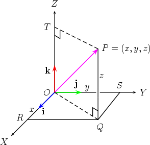
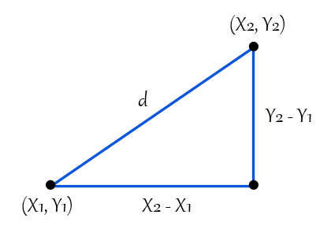
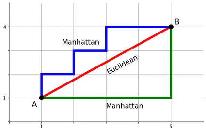
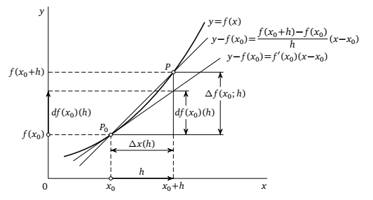

---
jupyter:
  jupytext:
    text_representation:
      extension: .md
      format_name: markdown
      format_version: '1.3'
      jupytext_version: 1.16.4
  kernelspec:
    display_name: Python 3 (ipykernel)
    language: python
    name: python3
---

<!-- #region editable=true slideshow={"slide_type": "slide"} -->
# Лекция 7: Математика в машинном обучении

Машинное обучение и анализ данных

МГТУ им. Н.Э. Баумана

Красников Александр Сергеевич

2024
<!-- #endregion -->

<!-- #region editable=true slideshow={"slide_type": "slide"} -->
Машинное обучение требует  знаний следующих разделов математической науки:

- аналитическая геометрия и линейная алгебра;

- математический анализ;

- теория вероятностей, комбинаторика и статистика.
<!-- #endregion -->

<!-- #region editable=true slideshow={"slide_type": "slide"} -->
## Линейная алгебра

Линейная алгебра &mdash; основа для многих алгоритмов машинного обучения.

Она включает в себя изучение векторов, матриц и операций над ними.
<!-- #endregion -->

<!-- #region editable=true slideshow={"slide_type": "slide"} raw_mimetype="" -->
### Векторы

Векторы &mdash; это одномерные массивы чисел, которые могут представлять различные данные, например, координаты в пространстве.

В машинном обучении векторы часто используются для представления признаков объектов. 

Например, если у вас есть данные об инценденте, вектор может содержать такие тип инцендента, признаки, как дата и время обнаружения, источник информации об инцеденте, подразделение, и т.д.
<!-- #endregion -->

<!-- #region editable=true slideshow={"slide_type": "slide"} raw_mimetype="" -->
### Координаты вектора

Если даны две точки $${A}(x_1;y_1;z_1)$$ $${B}(x_2;y_2;z_2)$$  то вектор будет иметь следующие координаты $$\overline{AB}(x_2-x_1;y_2-y_1;z_2-z_1)$$
<!-- #endregion -->

<!-- #region editable=true slideshow={"slide_type": "slide"} -->
### Длина вектора

Длина такого вектора определяется при помощи теоремы Пифагора $$|AB|=\sqrt{(x_1-x_2)^2 + (y_1-y_2)^2+(z_1-z_2)^2}$$ 
<!-- #endregion -->

<!-- #region editable=true slideshow={"slide_type": "slide"} -->
### Алтернативные метрики

Это один из возможных способов определения дистанции между объектами, есть ещё расстояние Манхеттена и расстояние Чебышёва которые применяются в различных ситуациях работы с данными.
<!-- #endregion -->

<!-- #region editable=true slideshow={"slide_type": "slide"} -->
Для того, чтобы сложить векторы, нужно сложить их соответствующие координаты:
$$\overline{a}(1;2;3) + \overline{b}(4;5;6) = \overline{(5;7;9)}$$
<!-- #endregion -->

<!-- #region editable=true slideshow={"slide_type": "slide"} -->
Для того чтобы вектор  умножить на число , нужно каждую координату данного вектора умножить на число $$\overline{(1;2;3) }*2 = \overline{(2;4;6)}$$
<!-- #endregion -->

<!-- #region editable=true slideshow={"slide_type": "slide"} -->
Скалярным произведением двух векторов называется число, равное произведению длин этих векторов на косинус угла между ними:
Формула скалярного произведения $$\overline{a}\cdot\overline{b} = |\overline{a}|\cdot|\overline{b}|\cdot cos\angle(\overline{a};\overline{b})$$
<!-- #endregion -->

<!-- #region editable=true slideshow={"slide_type": "slide"} -->
### Матрицы

Матрицы &mdash; это двумерные массивы чисел, которые используются для представления и обработки данных в машинном обучении.

Например, матрица может представлять набор данных, где каждая строка — это отдельный образец, а каждый столбец — это признак.

Матрицы позволяют эффективно выполнять операции над большими наборами данных, что делает их незаменимыми в машинном обучении.
<!-- #endregion -->

<!-- #region editable=true slideshow={"slide_type": "slide"} -->
### Операции над матрицами

Сложение и вычитание матриц позволяют комбинировать и модифицировать данные, а транспонирование матриц изменяет их ориентацию, что может быть полезно в различных вычислительных задачах. Понимание этих операций является ключевым для эффективного применения алгоритмов машинного обучения.
<!-- #endregion -->

<!-- #region editable=true slideshow={"slide_type": "slide"} -->
**Умножение** матрицы на число производится умножением каждого элемента матрицы на это число.

$-2*\begin{pmatrix}
  2& 3\\
 4& 5\\
  6& 7
\end{pmatrix}$  $ = \begin{pmatrix}
 -4& -6\\
 -8& -10\\
  -12& -14
\end{pmatrix}$ $ = -\begin{pmatrix}
 4& 6\\
 8& 10\\
  12& 14
\end{pmatrix}$
<!-- #endregion -->

<!-- #region editable=true slideshow={"slide_type": "slide"} -->
**Транспонирование** матрицы осуществляется таким образом, что строки записываются в столбцы.

$A = \begin{pmatrix}
  2& 3\\
 4& 5\\
  6& 7
\end{pmatrix}$ $A^{T} = \begin{pmatrix}
  2& 4&6\\
 3& 5& 7
\end{pmatrix}$
<!-- #endregion -->

<!-- #region editable=true slideshow={"slide_type": "slide"} -->
**Сумма** (разность) матриц возможна только если они одного размера.

$\begin{pmatrix}
  2& 3\\
 4& 5
\end{pmatrix}$ $ + \begin{pmatrix}
  2& 6\\
 4& 1
\end{pmatrix}$ $=\begin{pmatrix}
  4& 9\\
 8& 6
\end{pmatrix}$
<!-- #endregion -->

<!-- #region editable=true slideshow={"slide_type": "slide"} -->
**Умножение матриц А*В** возможно если количество столбцов матрицы А равнялось количеству строк матрицы В. Например мы можем умножить матрицу строку на матрицу столбец, а наоборот это невозможно:

$A = \begin{pmatrix}
  2& 4&6
\end{pmatrix}$ 

$B = \begin{pmatrix}
  1\\
 2\\
  3
\end{pmatrix}$

$AB = 2*1+4*2+6*3 = 28$

$BA = \begin{pmatrix}
  2 & 4 & 6 \\
  4 & 8 & 12 \\
  6 & 12 & 18
\end{pmatrix}$ 
<!-- #endregion -->

<!-- #region editable=true slideshow={"slide_type": "slide"} -->
### Системы линейных уравнений 

Матрицы эффективно применяются при решении систем линейных уравнений. Например систему уравнений:

$\begin{cases}a_{11}x_{1}+a_{12}x_{2}=b_{1}\\a_{21}x_{2}+a_{22}x_{2}=b_{2}\\a_{31}x_{3}+a_{32}x_{3}=b_{3}\end{cases}$

можно представить в виде: $Ax = b$, где:

$A = \begin{pmatrix}
  a_{11}& a_{12}\\
  a_{21}& a_{22}\\
  a_{31}& a_{32}
\end{pmatrix}$ $x = \begin{pmatrix}
  x_{1}\\
  x_{2}\\
  x_{3}
\end{pmatrix}$ $b = \begin{pmatrix}
  b_{1}\\
  b_{2}\\
  b_{3}
\end{pmatrix}$
<!-- #endregion -->

<!-- #region editable=true slideshow={"slide_type": "slide"} -->
### Собственные значения и собственные векторы

Собственные значения и собственные векторы в таких методах, как анализ главных компонент (PCA), который помогает уменьшить размерность данных и выявить основные компоненты. 

PCA позволяет выделить наиболее важные признаки в данных, что может значительно улучшить производительность моделей машинного обучения.

Также СЗ и СВ  применяются:
- спектральная кластеризация
- сингулярное разложение матриц (SVD)
<!-- #endregion -->

<!-- #region editable=true slideshow={"slide_type": "slide"} -->
## Математический анализ 

Математический анализ играет важную роль в  машинном обучении, особенно в оптимизации и обучении моделей. 
<!-- #endregion -->

<!-- #region editable=true slideshow={"slide_type": "slide"} -->
### Производная

Производная это характеристика изменения скорости функции в определённой заранее точке (мгновенная скорость). Мы можем описать изменение функции таким способом $f(x_0+h) = f(x_0) + Ah + o(h)$ где число $A$ и будет производной функции в окрестности точки $x_0$  $$f'(x) = \lim\limits_{x\to x_0} \frac{f(x)-f(x_0)}{x-x_0}=\lim\limits_{\Delta x\to 0} \frac{f(x_0 + \Delta x)-f(x_0)}{\Delta x}=\lim\limits_{\Delta x\to 0} \frac{\Delta f(x)}{\Delta x}$$
<!-- #endregion -->

<!-- #region editable=true slideshow={"slide_type": "slide"} -->
### Дифференциал

Дифференциалом $df$ в свою очередь называется линейная часть приращения функции $\Delta {f(x_0)}$

<!-- #endregion -->

<!-- #region editable=true slideshow={"slide_type": "slide"} -->
### Применение производных

Производные играют важную роль в анализе функций активации в нейронных сетях. 

Понимание производных позволяет лучше понять, как изменения входных данных влияют на выходные значения модели, что является ключевым для эффективного обучения моделей.
<!-- #endregion -->

<!-- #region editable=true slideshow={"slide_type": "slide"} -->
### Частные производные

Частные производные — это производные функций нескольких переменных по одной из переменных при фиксированных остальных. Они важны для понимания, как изменения отдельных признаков влияют на функцию потерь. В машинном обучении частные производные используются для вычисления градиентов в многомерных задачах оптимизации.

Частные производные также играют важную роль в методах, таких как обратное распространение ошибки (backpropagation) в нейронных сетях. Эти методы позволяют эффективно обучать модели, минимизируя функцию потерь и улучшая точность предсказаний.
<!-- #endregion -->

<!-- #region editable=true slideshow={"slide_type": "slide"} -->
### Градиент

**Градиент** - это вектор своим модулем равный скорости роста функции, а направлением указывающий направление наиболее быстрого её роста. 

**Антиградиент** в свою очередь указывает направление наиболее быстрого убывания функции.
<!-- #endregion -->

<!-- #region editable=true slideshow={"slide_type": "slide"} -->
В машинном обучении градиенты используются для обновления параметров моделей с целью минимизации функции потерь. 

Например, в алгоритме градиентного спуска градиенты помогают определить, как изменять параметры модели, чтобы уменьшить ошибку предсказаний.

<!-- #endregion -->

<!-- #region editable=true slideshow={"slide_type": "slide"} -->
### Интегралы

- нахождение площади под кривой функции
- вычисление ожидаемых значений и их вероятностей
- в Байесовских методах для вычисления апостериорных вероятностей
- вариационные автоэнкодеры (VAE)
- генеративные состязательные сети (GAN).
<!-- #endregion -->

<!-- #region editable=true slideshow={"slide_type": "slide"} -->
### Теория вероятностей и статистика

Теория вероятностей и статистика необходимы для понимания неопределенности и вариации в данных.
<!-- #endregion -->

<!-- #region editable=true slideshow={"slide_type": "slide"} -->
### Вероятность

Вероятность — численная характеристика возможности совершения события

- моделирования неопределенности и принятия решений на основе данных.
- вероятностные модели, такие как наивный байесовский классификатор
- метрики, ( точность, полнота и F-мера)
<!-- #endregion -->

<!-- #region editable=true slideshow={"slide_type": "slide"} -->
### Случайные величины

Случайные величины — это переменные, которые могут принимать различные значения в зависимости от случайных факторов.

Используются для моделирования данных и их распределений. 

Например, случайные величины могут представлять результаты экспериментов или измерений, которые подвержены случайным вариациям.
<!-- #endregion -->

<!-- #region editable=true slideshow={"slide_type": "slide"} -->
### Распределения вероятностей

Распределения вероятностей описывают, как значения случайной величины распределены. 

Например, нормальное распределение часто используется для моделирования данных в машинном обучении. 

Понимание распределений вероятностей позволяет лучше интерпретировать данные и делать обоснованные выводы.

- скрытые марковские модели (HMM)
- гауссовские процессы (GP)
- моделирование временных рядов и других сложных данных
<!-- #endregion -->

<!-- #region editable=true slideshow={"slide_type": "slide"} -->
### Статистические методы

Статистические методы, такие как регрессия, гипотезы и тестирование, используются для анализа данных и построения моделей. 

Например, линейная регрессия — это метод, который используется для предсказания значений на основе линейных отношений между признаками. 

Статистические методы позволяют выявить значимые зависимости в данных и строить точные модели.

- кластеризация,
- факторный анализ
- методы снижения размерности
<!-- #endregion -->

<!-- #region editable=true slideshow={"slide_type": "slide"} -->
## Оптимизация

Оптимизация — это процесс нахождения наилучших параметров модели для минимизации функции потерь. Вот несколько ключевых понятий:
Функция потерь

Функция потерь измеряет, насколько хорошо модель предсказывает данные. Цель оптимизации — минимизировать функцию потерь, чтобы улучшить точность модели. Например, в задачах классификации часто используется функция потерь кросс-энтропии, а в задачах регрессии — среднеквадратичная ошибка.

Понимание функции потерь позволяет лучше настроить модель и улучшить ее производительность. Выбор правильной функции потерь является ключевым для успешного обучения моделей машинного обучения.
<!-- #endregion -->

<!-- #region editable=true slideshow={"slide_type": "slide"} -->
### Градиентный спуск

Градиентный спуск — это алгоритм оптимизации, который использует градиенты для обновления параметров модели. Он итеративно уменьшает значение функции потерь, двигаясь в направлении наибольшего уменьшения. Градиентный спуск является основным методом оптимизации в машинном обучении и используется в большинстве алгоритмов.

Существует несколько вариантов градиентного спуска, включая стохастический градиентный спуск (SGD) и мини-батч градиентный спуск. 

Эти методы позволяют эффективно обучать модели на больших наборах данных и ускорять процесс оптимизации.
<!-- #endregion -->

<!-- #region editable=true slideshow={"slide_type": "slide"} -->
### Регуляризация

Регуляризация — это техника, которая добавляет штрафы к функции потерь для предотвращения переобучения модели. 

Примеры регуляризации включают L1 и L2 регуляризацию. 

Регуляризация помогает улучшить обобщающую способность модели и предотвратить переобучение на тренировочных данных.
<!-- #endregion -->

<!-- #region editable=true slideshow={"slide_type": "slide"} -->
### L1 регуляризация 
L1 регуляризация добавляет штраф за абсолютные значения параметров модели, что приводит к разреженным решениям. 

### L2 регуляризация 
L2 регуляризация добавляет штраф за квадраты параметров, что приводит к более гладким решениям.

Оба метода широко используются в машинном обучении для улучшения производительности моделей.
<!-- #endregion -->

<!-- #region editable=true slideshow={"slide_type": "slide"} -->
Понимание математических концепций поможет лучше понять и применять методы машинного обучения

<!-- #endregion -->
