---
jupyter:
  jupytext:
    text_representation:
      extension: .md
      format_name: markdown
      format_version: '1.3'
      jupytext_version: 1.16.4
  kernelspec:
    display_name: Python 3 (ipykernel)
    language: python
    name: python3
---

<!-- #region editable=true jupyterlab-deck={"layer": "deck"} slideshow={"slide_type": "slide"} -->
# Лекция 9: Линейные модели регрессии и классификации

Машинное обучение и анализ данных

МГТУ им. Н.Э. Баумана

Красников Александр Сергеевич

2024
<!-- #endregion -->

<!-- #region editable=true slideshow={"slide_type": "slide"} -->
## Задача регрессии

<table>
  <tr>
    <td>
      <ul>
    <li>Дан набор из $𝑛$ точек: $\{x_i, y_i\}_{i=1}^n$, где
        <ul>
  <li>$x_i = (x_{i1}, x_{i2}, \ldots, x_{id})^\top$ &mdash; вектор из $d$ признаков объекта;</li>
  <li>$y_i$ &mdash; скалярная величина, которую необходимо предсказать для объекта.</li>
        </ul></li>
    <li>Нужно предсказать некоторую
величину $y$</li>
    <li>Функция, которая описывает зависимость $y$ от $𝑋$ &mdash; <strong>модель
регрессии</strong></li>
  </ul>
    </td>
    <td>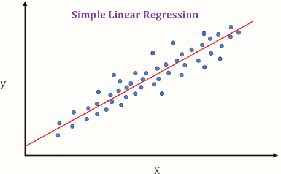</td>
  </tr>
</table>
<!-- #endregion -->

<!-- #region editable=true slideshow={"slide_type": "slide"} -->
## Линейная регрессия. Аналитическое решение.
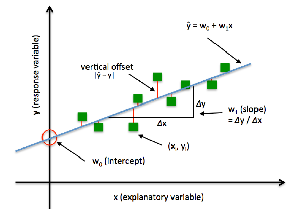

<!-- #endregion -->

<!-- #region editable=true slideshow={"slide_type": "subslide"} -->
### Векторная форма

- Модель **линейной регрессии**: $$\hat{y}_i = w_0 + \sum_{j=1}^d w_j x_{ij},$$ где
  - $w_j$ &mdash; вес $j$-того признака в моделе;
  - $\hat{y}_i$ &mdash; прогноз для $i$-того объекта.
- Квадрат ошибки прогноза модели для $i$-того объекта: $(\hat{y}_i - y_i)^2$.
<!-- #endregion -->

<!-- #region editable=true slideshow={"slide_type": "subslide"} -->
### Матричная форма

- Модель **линейной регрессии**: $$\hat{y} = X w,$$ где
  - $X =
  \begin{bmatrix}
    1 & x_{11} & \cdots & x_{1d}\\
    \vdots & \vdots  & \ddots  & \vdots \\
    1 & x_{n1} & \cdots & x_{nd}
  \end{bmatrix}$ &mdash; матрица признаков объектова;
  - $w = (w_0, w_1, w_2, \ldots, w_d)^\top$ &mdash; вектор $d+1$ весов модели; 
  - $\hat{y} = (\hat{y}_1, \hat{y}_2, \ldots, \hat{y}_n)^\top$ &mdash; вектор прогнозов для $n$ объектов.
- Квадрат ошибки прогноза модели для $i$-того объекта: $(\hat{y} - y)^2$.
<!-- #endregion -->

<!-- #region editable=true slideshow={"slide_type": "subslide"} -->
### Функция потерь

- **Функция потерь** (**Loss function**) для задачи линейной регрессии
$$
L(X, w) = 
\cfrac{1}{n} \sum\limits_{i=1}^n\left(\hat{y}_i - y_i\right)^2
= \cfrac{1}{n} (\hat{y} - y)^\top (\hat{y} - y),
$$ 
- Смысл $L(X, w)$ &mdash; среднеквадратичная ошибка (Mean Squared Error (MSE))
- Необходимо минимизировать $L(X, w)$:$$L(X, w) \rightarrow \min\limits_w$$
<!-- #endregion -->

<!-- #region editable=true slideshow={"slide_type": "subslide"} -->
### Обучение классификатора

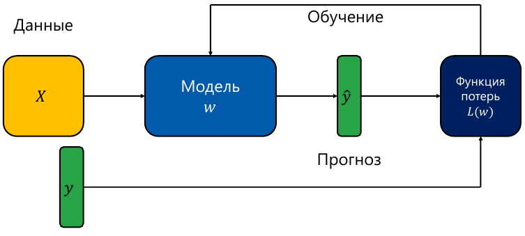
<!-- #endregion -->

<!-- #region editable=true slideshow={"slide_type": "subslide"} -->
### Аналитическое решение
<!-- #endregion -->

<!-- #region editable=true slideshow={"slide_type": ""} -->
$$L(X,w) = (\hat{y} - y)^\top (\hat{y} - y) = (Xw - y)^\top (Xw - y)$$

Для минимизации $L(X,w)$:
$$\cfrac{\partial L}{\partial w} = 0$$

Тогда 
$$\cfrac{\partial L}{\partial w} = 2X^\top(Xw-y) = 2X^\top Xw - 2X^\top y,$$
$$ 2X^\top Xw = 2X^\top y,$$
Следовательно, оптимальные веса $w$ линейной регрессии:

$$w = \left(X^\top X\right)^{-1}X^\top y$$
<!-- #endregion -->

<!-- #region editable=true slideshow={"slide_type": "slide"} -->
### Линейная регрессия. Градиентный спуск.

<table>
  <tr>
    <td>
      <ul>
    <li>Есть функция $𝐿(X, w)$</li>
    <li>Необходимо найти ее минимум: $$L(X, w) \rightarrow \min\limits_w$$</li>
    <li>Известен способ нахождения ее производной $\cfrac{\partial L}{\partial w}$</li>
    <li>Нет способа (или неэффективно) решить уравнение$\cfrac{\partial L}{\partial w} = 0$</li>
  </ul>
    </td>
    <td>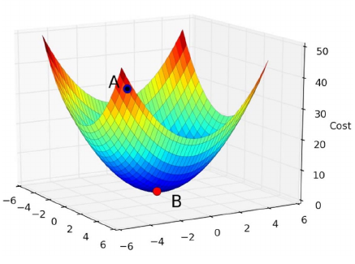</td>
  </tr>
</table>
<!-- #endregion -->

<!-- #region editable=true slideshow={"slide_type": "subslide"} -->
### Градиент функции

- Градиент функции $\nabla L$ &mdash; вектор первых частных производных функции:
$$ \cfrac{\partial L}{\partial w} 
=\nabla L(X, w_0, w_1, \ldots, w_d)  
= 
\left(
  \cfrac{\partial L}{\partial w_0}, 
  \cfrac{\partial L}{\partial w_1},
  \ldots,
  \cfrac{\partial L}{\partial w_d}
\right) , 
$$
<!-- #endregion -->

<!-- #region editable=true slideshow={"slide_type": "slide"} -->
### Градиентный спуск

- Есть функция $𝐿(X, w)$
- Необходимо найти ее минимум: $$L(X, w) \rightarrow \min\limits_w$$
-  Пусть $w^{(0)}$ &mdash; начальный вектор параметров. Например,  $w^{(0)} = 0$
- Тогда **градиентный спуск** состоит в повторении шагов:
$$w^{(k+1)} = w^{(k)} - \eta \nabla L(X, w^{(k)})$$
- $\eta$ &mdash; длина шага градиентного спуска (**learning rate**) (задаем исследователем)
- $k$ &mdash; номер итерации
- $\nabla L(X, w^{(k)})$ &mdash; градиент функции потерь на итерации $k$
<!-- #endregion -->

<!-- #region editable=true slideshow={"slide_type": "subslide"} -->
### Градиент для линейной модели

- Модель линейной регрессии:
$$\hat{y} = Xw$$
- Функция потерь MSE:
$$L(X, w) = 
 \cfrac{1}{n} (\hat{y} - y)^\top (\hat{y} - y)=
  \cfrac{1}{n} (Xw - y)^\top (Xw - y)$$
- Градиент:
$$\nabla L(X, w^{(k)}) = \cfrac{2}{n}X^\top (Xw-y)$$
- Градиентный спуск:
$$w^{(k+1)} = w^{(k)} - \eta \nabla L(X, w^{(k)}) = 
w^{(k)} - \eta \cfrac{2}{n}X^\top (Xw-y) $$
<!-- #endregion -->

<!-- #region editable=true slideshow={"slide_type": "subslide"} -->
### Свойства градиента

<table>
  <tr>
    <td>

Градиент функции в некоторой точке
ортогонален линии уровня,
проходящей через эту точку

  </ul>
    </td>
    <td>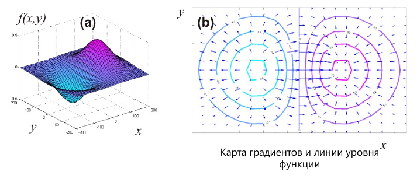</td>
  </tr>
  <tr>
    <td>

Градиент функции указывает
направление наискорейшего
возрастания функции в данной точке

Направление антиградиента указывает
направление наискорейшего убывания
функции в данной точке

  </ul>
    </td>
    <td>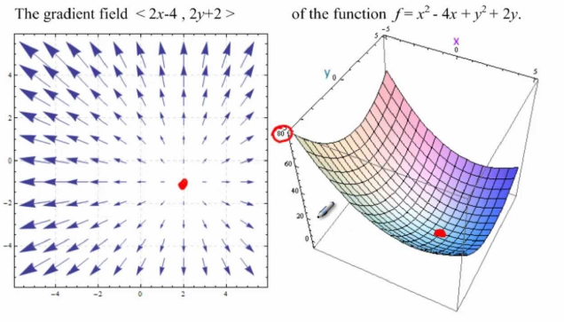</td>
  </tr>
</table>

<!-- #endregion -->

<!-- #region editable=true slideshow={"slide_type": "subslide"} -->
### Проблемы градиентного спуска

- Как выбрать длину градиентного спуска?
- Сколько итераций делать?
<!-- #endregion -->

<!-- #region editable=true slideshow={"slide_type": "subslide"} -->
#### Проблема выбора шага

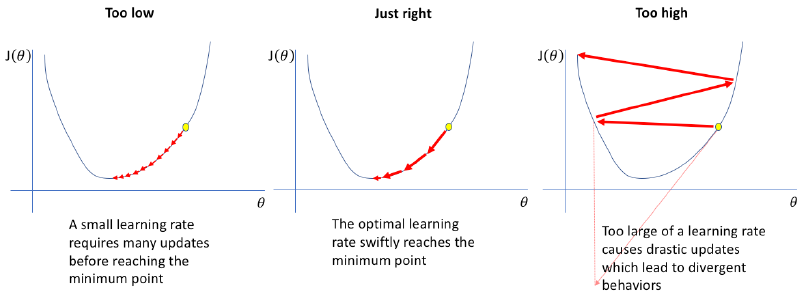
<!-- #endregion -->

<!-- #region editable=true slideshow={"slide_type": "subslide"} -->
#### Стратегии выбора шага

- Константа: $\eta = const$
- Уменьшение с каждой итерацией $k$: $\eta_k = \cfrac{1}{k}$
- Другие варианты:$\eta_k = \lambda \left(\cfrac{s_0}{s_0+k}\right)^p$, где
$\lambda$, $s_0$, $p$ - некоторые значения. Как правило $s_0=1$, $p=0.5$
<!-- #endregion -->

<!-- #region editable=true slideshow={"slide_type": "subslide"} -->
#### Критерии остановки

- Близость градиента к нулю: $\nabla 𝐿 \approx 0$
- Малое изменение вектора весов на $k$-том шаге: $\|w^{(k+1)}-w^{(k)}\|\approx 0$
<!-- #endregion -->

<!-- #region editable=true slideshow={"slide_type": "slide"} -->
## Стохастический градиентный спуск

<table>
  <tr>
    <td>

Полный градиентный спуск
$$L(X, w) = 
\cfrac{1}{n} \sum\limits_{i=1}^n\left(\hat{y}_i - y_i\right)^2,$$
$$w^{(k+1)} = w^{(k)} - \eta \nabla L(X, w^{(k)})$$

  </ul>
    </td>
    <td>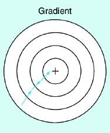</td>
  </tr>
  <tr>
    <td>

Стохастический градиентный спуск
$$L_i(X, w) = 
\left(\hat{y}_i - y_i\right)^2,$$
$$w^{(k+1)} = w^{(k)} - \eta \nabla L_i(X, w^{(k)})$$

  </ul>
    </td>
    <td>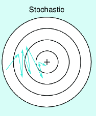</td>
  </tr>
</table>
<!-- #endregion -->

<!-- #region editable=true slideshow={"slide_type": "subslide"} -->
### Особенности стохастического градиентного спуска

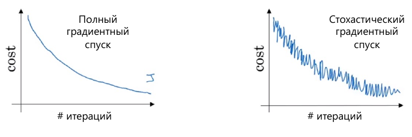

- Стохастический ГС требует меньше вычислительный операций
- В полном ГС обучение стабильнее
- Полный ГС требует меньше итераций, но больше вычислительных операций
<!-- #endregion -->

<!-- #region editable=true slideshow={"slide_type": "slide"} -->
## Нормализация данных

- Модель линейной регрессии:
$$\hat{y}_i = w_0 + w_1x_{i1} + w_2 x_{i2}$$
- Функция потерь MSE:
$$L(X, w) = 
\cfrac{1}{n} \sum\limits_{i=1}^n\left(\hat{y}_i - y_i\right)^2
\rightarrow \min\limits_w$$
- Пусть признаки разные по масштабу:
например $|x_1| \approx 1$, $|x_2|\approx 1000$
- Тогда
  - малые изменения $dw_1$ ( приводят к малым изменениям $L(X,w)$
  - малые изменения $dw_2$ ( приводят к большим изменениям $L(X,w)$)
<!-- #endregion -->

<!-- #region editable=true slideshow={"slide_type": "subslide"} -->
### Последствия нормализации

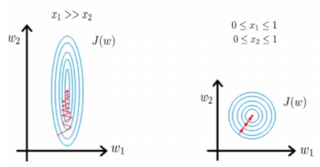

- Нормализация данных стабилизирует градиентный спуск
- Обучение происходит быстрее
<!-- #endregion -->

<!-- #region editable=true slideshow={"slide_type": "slide"} -->
## Нелинейные зависимости

<table>
  <tr>
    <td>
<ul>
    <li>Пусть дан вектор признаков $x_i$</li>
    <li>Выберем любые нелинейные функции от $x$: 
        $\phi_0(x)$, $\phi_1(x)$, $\ldots$, $\phi_M(x)$.
        Например, $x^2$, $sin(x)$, $e^{-x}$
    </li>
    <li>Тогда модель линейной регрессии:
    $$\hat{y}_i = \sum\limits_{j=0}^k w_j\phi_j(x_i)$$
    </li>
  </ul>
    </td>
    <td></td>
  </tr>
</table>

<!-- #endregion -->

<!-- #region editable=true slideshow={"slide_type": "slide"} -->
## Проблема переобучения

- Модель линейной регрессии:
$$\hat{y}_i = w_0 + \sum\limits_{j=0}^d w_j x_{ij}$$
- Ошибка прогноза модели для объекта:
$|\hat{y}_i - y_i|$
- Пусть значение некоторых весов очень большие по модулю,
например $|w_j| > 10^3$
- Тогда малые изменения $dx_{ij}$ приводят к очень большим
изменениям $d\hat{y}_i = |w_j dx_{ij}|$
- Модель перестает быть устойчивой
<!-- #endregion -->

<!-- #region editable=true slideshow={"slide_type": "slide"} -->
## Регуляризаци
- Добавим к функции потерь $L(X,w)$ штраф $R(w)$ на величину
весов модели:
$$L_\alpha(X,w) = L(X,w) + \alpha R(w),$$
где $\alpha$ &mdash; коэффициент регуляризации (подбирается исследователем)
- Регуляризация не позволяет весам модели принимать слишком
большие значения
<!-- #endregion -->

<!-- #region editable=true slideshow={"slide_type": "subslide"} -->
### Виды регуляризации

- $L_1$ регуляризация (Lasso):
$$R_1(w) = \sum\limits_{j=1}^d |w_j|$$
- $L_2$ регуляризация (Ridge):
$$R_2(w) = \sum\limits_{j=1}^d w_j^2$$
- $L_1 + L_2$ регуляризация (Elastic Net):
$$R_\alpha(w) = \alpha_1 R_1(w) + \alpha_2 R_2(w) $$
<!-- #endregion -->

<!-- #region editable=true slideshow={"slide_type": "subslide"} -->
### Свойства регуляризации

- $L_1$ позволяет проводить отбор признаков, обнуляя веса для наименее информативных признаков
- $L_2$ регуляризация стремится уменьшить веса модели
<!-- #endregion -->

<!-- #region editable=true slideshow={"slide_type": "slide"} -->
## Параметры и гиперпараметры

- Рассмотрим пример функции потерь с регуляризацией:
$$L_\alpha(X,w) = L(X,w) + \alpha R(w)$$
- $w$ &mdash; веса модели определяемые в процессе обучения (**параметры**).
- $\alpha$ &mdash;  коэффициент регуляризации задаваемый пользователем (**гиперпараметр**).
<!-- #endregion -->

<!-- #region editable=true slideshow={"slide_type": "slide"} -->
## Важность признаков (Feature importance)

<table>
  <tr>
    <td>
      <ul>
    <li>Не все признаки одинаково полезны для решения задачи</li>
    <li>Некоторые из них более информативны, чем другие</li>
    <li>Например, $X_1$ неинформативна для классификации</li>
    <li>Цель – определить важность каждого признака</li>
  </ul>
    </td>
    <td>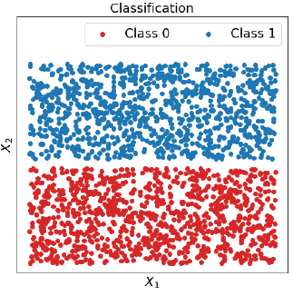</td>
  </tr>
</table>
<!-- #endregion -->

<!-- #region editable=true slideshow={"slide_type": "subslide"} -->
### Важность признаков для линейной модели
<table>
  <tr>
    <td>
      <ul>
    <li>Рассмотрим линейную модель с регуляризацией ($L_1$ или $L_2$): $$\hat{y} = w_0 + w_1 x_1 + w_2 x_2 + \ldots + w_d x_d$$</li>
    <li>Если признаки нормированы (значения одного масштаба), то
важность признака $x_j$ равна:$$\text{Imp}(x_j) = |w_j|$$</li>
  </ul>
    </td>
    <td>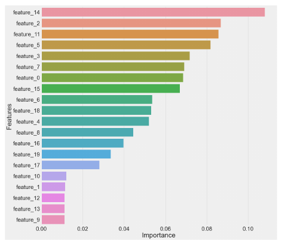</td>
  </tr>
</table>
<!-- #endregion -->

<!-- #region editable=true slideshow={"slide_type": "slide"} -->
## Линейная классификация

<table>
  <tr>
    <td>
      <ul>
    <li>Дан набор из $𝑛$ точек: $\{x_i, y_i\}_{i=1}^n$, где
        <ul>
  <li>$x_i = (x_{i1}, x_{i2}, \ldots, x_{id})^\top$ &mdash; вектор из $d$ признаков объекта;</li>
  <li>$y_i = \{-1, +1\}$, &mdash; метка класса объекта.</li>
        </ul></li>
    <li>Нужно разделить объекты по
классам некоторой
<strong>гиперплоскостью</strong></li>
    <li>Эту гиперплоскость будем
называть <strong>линейным
классификатором</strong></li>
  </ul>
    </td>
    <td>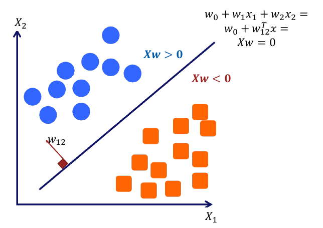</td>
  </tr>
</table>
<!-- #endregion -->

<!-- #region editable=true slideshow={"slide_type": "subslide"} -->
### Векторная форма

- Модель **линейной классификации**: $$\hat{y}_i = \text{sign} \left(w_0 + \sum_{j=1}^d w_j x_{ij}\right),$$ где
  - $w_j$ &mdash; вес $j$-того признака в моделе;
  - $\hat{y}_i$ &mdash; прогноз для $i$-того объекта.
- Ошибка прогноза модели для  $i$-того объекта: $\hat{y}_i \ne y_i$.
<!-- #endregion -->

<!-- #region editable=true slideshow={"slide_type": "subslide"} -->
### Матричная форма

- Модель **линейной классификации**: $$\hat{y} = \text{sign} \left(X w\right),$$ где
  - $X =
  \begin{bmatrix}
    1 & x_{11} & \cdots & x_{1d}\\
    \vdots & \vdots  & \ddots  & \vdots \\
    1 & x_{n1} & \cdots & x_{nd}
  \end{bmatrix}$ &mdash; матрица признаков объектова;
  - $w = (w_0, w_1, w_2, \ldots, w_d)^\top$ &mdash; вектор $d+1$ весов модели; 
  - $\hat{y} = (\hat{y}_1, \hat{y}_2, \ldots, \hat{y}_n)^\top$ &mdash; вектор прогнозов для $n$ объектов.
- Вектор ошибок прогнозов модели: $\hat{y}_i \ne y_i$
<!-- #endregion -->

<!-- #region editable=true slideshow={"slide_type": "subslide"} -->
### Функция потерь

- **Функция потерь** (**Loss function**) для классификации
$$
L(X, w) = 
\cfrac{1}{n} \sum\limits_{i=1}^n\left[\hat{y}_i \ne y_i\right]
= \cfrac{1}{n} \sum\limits_{i=1}^n\left[Xw \ne y\right],
$$ где
$\left[\hat{y}_i \ne y_i\right] = 
\begin{cases} 
0, & \text{если} \; \hat{y}_i = y_i, \\ 
1, & \text{если} \; \hat{y}_i \ne y_i.
\end{cases}
$ 
- Смысл $L(X, w)$ &mdash; доля неправильных ответов
- Необходимо минимизировать $L(X, w)$: $$L(X, w) \rightarrow \min\limits_w$$
<!-- #endregion -->

<!-- #region editable=true slideshow={"slide_type": "subslide"} -->
### Обучение классификатора

<!-- #endregion -->

<!-- #region editable=true slideshow={"slide_type": "subslide"} -->
### Проблемы минимизации функции потерь

- Дискретная относительно весов модели
- Нет производной (0, либо не определена)
- Не можем использовать градиентный спуск
- Много глобальных минимумов (несколько способов разделить объекты на классы)
<!-- #endregion -->

<!-- #region editable=true slideshow={"slide_type": "subslide"} -->
### Гиперплоскость

<!-- #endregion -->

<!-- #region editable=true slideshow={"slide_type": "subslide"} -->
### Отступ

<table>
  <tr>
    <td>
      <ul>
    <li>
        <strong>Отступ (margin)</strong> 𝑀: $$z = Xw,$$ $$M=yz = yXw$$
  <li>Знак отступа говорит о корректности прогноза
  <ul>
      <li>$M_i > 0$ &mdash; верный прогноз,</li>
      <li>$M_i < 0$ &mdash; неверный прогноз,</li>
      <li>$M_i = 0$ &mdash; отказ от классификации (точка лежит на гиперплоскости)</li>
  </ul>
  </li>
  <li>Абсолютная величина отступа &mdash; степень уверенности классификатора</li>
    <li>Чем ближе $𝑀$ к 0, тем ближе объект к границе классов</li>
  </ul>
    </td>
    <td></td>
  </tr>
</table>
<!-- #endregion -->

<!-- #region editable=true slideshow={"slide_type": "subslide"} -->
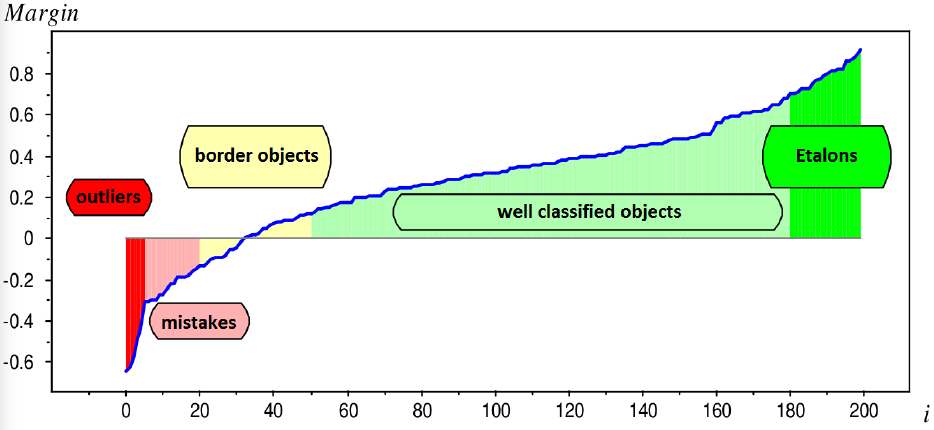
<!-- #endregion -->

<!-- #region editable=true slideshow={"slide_type": "subslide"} -->
### Новая функция потерь

- **Функция потерь** (**Loss function**) для классификации
$$
L(X, w) = 
\cfrac{1}{n} \sum\limits_{i=1}^n\left[M_i < 0\right]
= \cfrac{1}{n} \left[yXw < 0\right];$$
- Смысл $L(X, w)$ &mdash; доля неправильных ответов;
- Необходимо минимизировать $L(X, w)$:$$L(X, w) \rightarrow \min\limits_w$$.
<!-- #endregion -->

<!-- #region editable=true slideshow={"slide_type": "subslide"} -->
### Минимизация функции потерь

- Есть функция потерь для классификации:
$$
L(X, w) = 
\cfrac{1}{n} \sum\limits_{i=1}^n\left[M_i < 0\right];$$
- Нельзя использовать градиентный спуск;
- Хорошо бы заменить функцию потерь на гладкую функцию.
<!-- #endregion -->

<!-- #region editable=true slideshow={"slide_type": "subslide"} -->
### Верхние оценки функции потерь

- Есть функция потерь для одного произвольного объекта:
$$L(M_i) = \left[M_i < 0\right]$$
- Необходимо найти такую функцию $\tilde{L}(M_i)$, что
$$L(M_i) \leqslant \tilde{L}(M_i)$$
- Тогда верхняя оценка будет выглядеть так:
$$
L(X, w) = 
\cfrac{1}{n} \sum\limits_{i=1}^n\left[M_i < 0\right]
\leqslant 
\cfrac{1}{n} \sum\limits_{i=1}^n  \tilde{L}(M_i)
$$
<!-- #endregion -->

<!-- #region editable=true slideshow={"slide_type": "subslide"} -->
### Примеры верхних оценок функции потерь

<table>
  <tr>
    <td>
      <ul>
    <li>$\tilde{L}(M) = \log \left( 1 + e^{-M}\right)$ &mdash; логистическая функция потерь;</li>
    <li>$\tilde{L}(M) = \max(0; 1-M)$ &mdash; кусочно-линейная функция потерь;</li>
    <li>$\tilde{L}(M) = \max(0; -M)$ &mdash; кусочно-линейная функция потерь;</li>
    <li>$\tilde{L}(M) = e^{-M}$ &mdash; экспоненциальная функция потерь;</li>
    <li>$\tilde{L}(M) = 2 \left(1+e^M\right)^{-1}$ &mdash;  сигмоидная функция потерь;</li>
  </ul>
    </td>
    <td></td>
  </tr>
</table>
<!-- #endregion -->

<!-- #region editable=true slideshow={"slide_type": "slide"} -->
## Логистическая регрессия

<table>
  <tr>
    <td>
      <ul>
    <li>Дан набор из $𝑛$ точек: $\{x_i, y_i\}_{i=1}^n$, где
        <ul>
  <li>$x_i = (x_{i1}, x_{i2}, \ldots, x_{id})^\top$ &mdash; вектор из $d$ признаков объекта;</li>
  <li>$y_i = \{0, 1\}$, &mdash; метка класса объекта.</li>
        </ul></li>
    <li> Модель **логистической регрессии**:
$$\hat{y}_i = \sigma\left(Xw\right),$$ где $\sigma\left(z\right) = \cfrac{1}{1+e^{-z}}$</li>
    <li>$\hat{y}_i = \sigma \left(x_i^\top w\right) = p\left(y=1 | x_i\right)$ &mdash; <strong>вероятность класса 1</strong> для $i$-того класса.</li>
    <li>1 - $\hat{y}_i = 1 - \sigma \left(x_i^\top w\right) = p\left(y=0 | x_i\right)$ &mdash; <strong>вероятность класса 0</strong> для $i$-того класса.</li>
  </ul>
    </td>
    <td>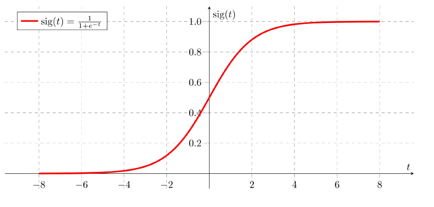</td>
  </tr>
</table>
<!-- #endregion -->

<!-- #region editable=true slideshow={"slide_type": "subslide"} -->
### Функция потерь для логистической регрессии (**log-loss**)

- Если $y_i = \{0, 1\}$: (далее будем рассматривать этот вариант)
$$L(X, w) = 
-\cfrac{1}{n} \sum\limits_{i=1}^n
\left(
  y_i \log(\hat{y}_i) + (1-y_i)\log(1-\hat{y}_i)
\right)
;$$
- Если $y_i = \{-1, +1\}$:
$$L(X, w) = 
\cfrac{1}{n} \sum\limits_{i=1}^n
  \log\left(1+e^{-M}\right)
;$$
- Необходимо минимизировать $L(X, w)$:$$L(X, w) \rightarrow \min\limits_w$$
- Для минимизации можно использовать градиентный спуск:
$$w^{(k+1)} = w^{(k)} - \eta \nabla L(X, w^{(k)}) $$
<!-- #endregion -->

<!-- #region editable=true slideshow={"slide_type": "subslide"} -->
### Правдоподобие

<table>
  <tr>
    <td>
      <ul>
    <li>Дан набор из $𝑛$ точек: $\{x_i, y_i\}_{i=1}^n$, где
        <ul>
  <li>$x_i = (x_{i1}, x_{i2}, \ldots, x_{id})^\top$ &mdash; вектор из $d$ признаков объекта;</li>
  <li>$y_i = \{0, 1\}$, &mdash; метка класса объекта.</li>
        </ul></li>
    <li> Правдоподобие:
$$\text{Likelihood} = \prod_{i=1}^n 
        p\left(y=1 | x_i\right)^{[y_i=1]}
        p\left(y=0 | x_i\right)^{[y_i=0]}
        \rightarrow \max\limits_w
$$</li>
    <li> Логарифм правдоподобия:
$$
    \text{Log Likelihood} = \sum_{i=1}^n 
        y_i \log(p(y=1 | x_i)) + 
        (1- y_i) \log(p(y=1 | x_0)) = 
$$
$$ 
= 
    \sum_{i=1}^n 
        y_i \log(\hat{y}_i) + 
        (1- y_i) \log(1- \hat{y}_i) 
        = - n L(X, w)
        $$
    </li>
  </ul>
    </td>
    <td></td>
  </tr>
</table>
<!-- #endregion -->
