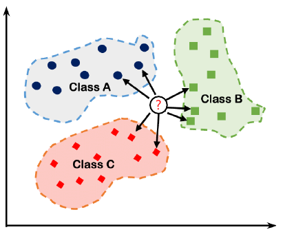
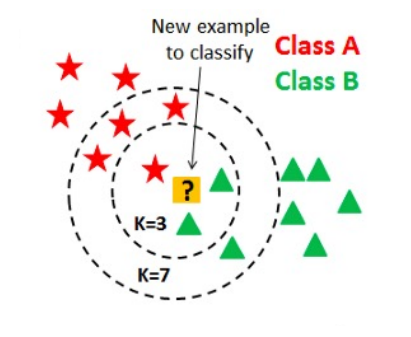
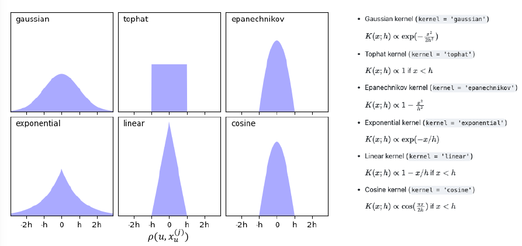
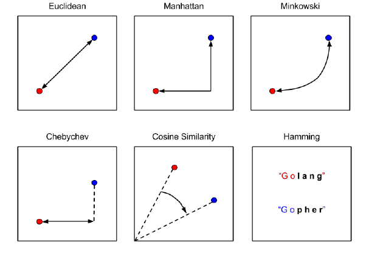

---
jupyter:
  jupytext:
    text_representation:
      extension: .md
      format_name: markdown
      format_version: '1.3'
      jupytext_version: 1.16.7
  kernelspec:
    display_name: Python 3 (ipykernel)
    language: python
    name: python3
---

<!-- #region editable=true jupyterlab-deck={"layer": "deck"} slideshow={"slide_type": "slide"} -->
# Лекция 10: Метрические модели регрессии и классификации

Машинное обучение и анализ данных

МГТУ им. Н.Э. Баумана

Красников Александр Сергеевич

2024
<!-- #endregion -->

```python editable=true slideshow={"slide_type": "subslide"}
import matplotlib.pyplot as plt
from matplotlib import gridspec
import seaborn as sns
import pandas as pd
from tqdm.notebook import tqdm

from scipy.special import softmax
from scipy.spatial.distance import cdist
import numpy as np
#import torch

from sklearn.neighbors import KNeighborsClassifier
from sklearn.metrics import classification_report
from sklearn.model_selection import KFold, ParameterGrid
from sklearn.datasets import make_classification
from sklearn.model_selection import train_test_split

from mlxtend.plotting import plot_decision_regions
```

```python editable=true slideshow={"slide_type": "slide"}
# Синтетические данные
X, Y = make_classification(
    n_samples=150,
    n_features=2,
    n_informative=2,
    n_classes=3,
    n_redundant=0,
    n_clusters_per_class=1,
    random_state=0
)

df = pd.DataFrame(X, columns=['Feature_1', 'Feature_2'])
df['target'] = pd.DataFrame(Y, columns=['target'])

sns.pairplot(df, hue='target', markers=["o", "s", "D"]);
```

```python editable=true slideshow={"slide_type": "slide"}
# Делим набор данных на обучающий и тестовый
X_train, X_test, Y_train, Y_test = train_test_split(
    X, Y,
    test_size=50,
    random_state=0
)
```

<!-- #region editable=true slideshow={"slide_type": "slide"} -->
## Метрические методы для классификации

<table>
  <tr>
    <td>
      <p>Метрические методы в машинном обучении – это методы, которые используют расстояния между объектами</p>
    </td>
    <td></td>
  </tr>
</table>
<!-- #endregion -->

<!-- #region editable=true slideshow={"slide_type": "slide"} -->
## Метод K ближайших соседей (K Nearest Neighbors)

<table>
  <tr>
    <td>
      <ul>
          <li>Есть объекты нескольких классов</li>
          <li>Для каждого нового объекта нужно определить его класс</li>
          <li>Будем сравнивать новые объекты с уже известными</li>
      </ul>
    </td>
    <td></td>
  </tr>
</table>
<!-- #endregion -->

<!-- #region editable=true slideshow={"slide_type": "subslide"} -->
### Принцип работы k-NN

- Алгоритм k-NN основывается на следующем принципе:
  - Для каждого объекта, который необходимо классифицировать, определяются `k` ближайших соседей из обучающей выборки.
  - Класс объекта определяется на основе классов его ближайших соседей.
  
- Основные шаги:
  1. Выбор значения `k`.
  2. Расчет расстояния между объектами (обычно используется евклидово расстояние).
  3. Определение `k` ближайших соседей.
  4. Присвоение объекта классу, наиболее распространенному среди его соседей.
<!-- #endregion -->

<!-- #region editable=true slideshow={"slide_type": "subslide"} -->
### Формальный алгоритм k-NN для классификации

- Пусть дан набор из $n$ точек: $\{x_i, y_i\}_{i=1}^n$, где
– $x_i$ – вектор из $d$ признаков объекта;
– $y_i = \{0, 1, 2, \ldots, m\}$ – метка класса объекта.
- Пусть дана функция расстояния между двумя объектами:
$$\rho(x_i, x_j)$$
  - симметричная и неотрицательная
  - является мерой (не обязательно)
- Запоминаем обучающую выборку $\{x_i, y_i\}_{i=1}^n$
-  Для каждого нового объекта $u$ сортируем объекты обучающей выборки по расстоянию:
$$\rho(u, x_u^{(1)}) \leqslant \rho(u, x_u^{(2)}) \leqslant \cdots \leqslant \rho(u, x_u^{(k)}), $$
где $x_u^{(i)}$ - $i$-й сосед объекта $u$.
- Алгоритм относит объект $u$ к тому классу, представителей которого окажется больше всего среди $k$ его ближайших соседей:
$$\hat{y}(u) = \arg \max\limits_c \sum\limits_{j=1}^k[y_u^{(j)} = c],$$
$$\hat{p}_c(u) = \cfrac{1}{k}\sum\limits_{j=1}^k[y_u^{(j)} = c],$$
где
  - $c = \{0,1,2,\ldots, m\} $ - метка класса;
  - $y_u^{(j)} $ - метка $j$-го соседа объекта $u$;
  - $\hat{y}(u)$ -  прогноз метки класса объекта $u$;
  - $\hat{p}_c(u)$ - прогноз вероятности класса для объекта $u$.
<!-- #endregion -->

<!-- #region editable=true slideshow={"slide_type": "subslide"} -->
### Применение k-NN

- Применяется в различных областях, таких как:
  - Распознавание образов
  - Медицинская диагностика
  - Рекомендательные системы
  - Классификация текстов
<!-- #endregion -->

<!-- #region editable=true slideshow={"slide_type": "subslide"} -->
### Плюсы и минусы метода

### Плюсы:

- Простота и легкость понимания.
- Не требует обучения (пользует все обучающие данные).
- Хорошо работает с малым количеством классов.

### Минусы:

- Чувствительность к выбору значения `k`.
- Высокая вычислительная сложность в случае больших данных.
- Плохо работает с высокоразмерными данными (проблема "проклятия размерности").

<!-- #endregion -->

<!-- #region editable=true slideshow={"slide_type": "subslide"} -->
### Пример использования
<!-- #endregion -->

<!-- #region editable=true slideshow={"slide_type": "subslide"} -->
#### Метод ближайшего соседа
<!-- #endregion -->

```python editable=true slideshow={"slide_type": "subslide"}
model = KNeighborsClassifier(n_neighbors=1)
_ = model.fit(X_train, Y_train)
```

```python editable=true slideshow={"slide_type": "subslide"}
fig, gs = plt.figure(figsize=(9,4)), gridspec.GridSpec(1, 2)

ax = []
for i in range(2):
    ax.append(fig.add_subplot(gs[i]))


plot_decision_regions(X_train, Y_train, model, ax=ax[0])
plot_decision_regions(X_test, Y_test, model, ax=ax[1])

plt.show()
```

<!-- #region editable=true slideshow={"slide_type": ""} -->
#### Метод k-ближайших соседей
<!-- #endregion -->

```python editable=true slideshow={"slide_type": "subslide"}
models = []
for n_neighbors in range(1, 50):
    model = KNeighborsClassifier(n_neighbors=n_neighbors)
    model.fit(X_train, Y_train)
    models.append(model)
```

```python editable=true slideshow={"slide_type": "subslide"}
fig, gs = plt.figure(figsize=(19,4)), gridspec.GridSpec(1, 4)

ax = []
for i in range(4):
    ax.append(fig.add_subplot(gs[i]))

for i in range(4):
    plot_decision_regions(X_test, Y_test, models[i], ax=ax[i])

plt.show()
```

```python editable=true slideshow={"slide_type": "subslide"}
fig, gs = plt.figure(figsize=(19,4)), gridspec.GridSpec(1, 4)

ax = []
for i in range(4):
    ax.append(fig.add_subplot(gs[i]))

for i in range(4):
    plot_decision_regions(X_test, Y_test, models[12*i], ax=ax[i])

plt.show()
```

<!-- #region editable=true slideshow={"slide_type": "slide"} -->
## Модификации метода

- Почему все соседи вносят одинаковый вклад в прогноз?
- Как сделать вклад более близких соседей весомее?

**Использование весов**: Алгоритм относит объект $u$ к тому классу, представителей которого окажется больше всего среди $k$ его ближайших соседей:

$$\hat{y}(u) = \arg \max\limits_c \sum\limits_{j=1}^kw_j[y_u^{(j)} = c],$$
$$\hat{p}_c(u) = \cfrac{1}{\sum\limits_{i=1}^k w_i}\sum\limits_{j=1}^kw_j[y_u^{(j)} = c],$$
где $w_j$ - некоторый вес соседа.
<!-- #endregion -->

<!-- #region editable=true slideshow={"slide_type": "subslide"} -->
### Примеры весов

- Линейно убывающие веса (чем ближе сосед, тем больше вклад):
$$w_j = \cfrac{1}{\rho(u, x_u^{(j)})}$$
- Метод парзеновского окна:
$$w_j = K\left(
\cfrac{\rho(u, x_u^{(j)})}{h}
\right),$$
где
  - $h$ -  ширина окна (гиперпараметр);
  - $𝐾$ - ядро (некоторая функция близости двух объектов).
<!-- #endregion -->

<!-- #region editable=true slideshow={"slide_type": "subslide"} -->
### Примеры ядер

<!-- #endregion -->

<!-- #region editable=true slideshow={"slide_type": "subslide"} -->
### Примеры использования
<!-- #endregion -->

<!-- #region editable=true slideshow={"slide_type": "subslide"} -->
#### Метод k-ближайших соседей с линейно убивающими весами
<!-- #endregion -->

```python editable=true slideshow={"slide_type": "subslide"}
def func(distance):
    ret = np.ones_like(distance)
    k = ret.shape[1]
    for i in range(k):
        ret[:, i] *= (k-i)/k
    return ret
```

```python editable=true slideshow={"slide_type": "subslide"}
models = []
for n_neighbors in range(1, 51):
    model = KNeighborsClassifier(n_neighbors=n_neighbors, 
                                 weights=func)
    model.fit(X_train, Y_train)
    models.append(model)
```

```python editable=true slideshow={"slide_type": "subslide"}
fig, gs = plt.figure(figsize=(19,4)), gridspec.GridSpec(1, 4)

ax = []
for i in range(4):
    ax.append(fig.add_subplot(gs[i]))

for i in range(4):
    plot_decision_regions(X_test, Y_test, models[i], ax=ax[i])

plt.show()
```

```python editable=true slideshow={"slide_type": "subslide"}
fig, gs = plt.figure(figsize=(19,4)), gridspec.GridSpec(1, 4)

ax = []
for i in range(4):
    ax.append(fig.add_subplot(gs[i]))

for i in range(4):
    plot_decision_regions(X_test, Y_test, models[12*i], ax=ax[i])

plt.show()
```

<!-- #region editable=true slideshow={"slide_type": "slide"} -->
##  Метрические методы для регрессии
<!-- #endregion -->

<!-- #region editable=true slideshow={"slide_type": "slide"} -->
## Метод K ближайших соседей

<table>
  <tr>
    <td>
      <ul>
          <li>Есть объекты ($X$)</li>
          <li> Нужно предсказать некоторую величину $t$</li>
          <li>Функция, которая описывает зависимость $𝑦$ от $X$ - модель регрессии</li>
      </ul>
    </td>
    <td></td>
  </tr>
</table>
<!-- #endregion -->

<!-- #region editable=true slideshow={"slide_type": "subslide"} -->
### Формальный алгоритм k-NN для регрессии

- Пусть дан набор из $n$ точек: $\{x_i, y_i\}_{i=1}^n$, где
– $x_i$ – вектор из $d$ признаков объекта;
– $y\}$ – некоторое вешественное значение.
- Пусть дана функция расстояния между двумя объектами:
$$\rho(x_i, x_j)$$
  - симметричная и неотрицательная
  - является мерой (не обязательно)
- Для нового объекта $u$ находим такое число $c$, что:
$$\hat{y}(u) = \arg \min\limits_c \sum\limits_{j=1}^k w_j \left(y_u^{(j)} - c\right)^2,$$
$$\hat{p}_c(u) = \cfrac{1}{\sum\limits_{i=1}^k w_j}\sum\limits_{j=1}^k w_j y_u^{(j)},$$
где
  - $c $ - &laquo;усредненное&raquo; значение целевой переменной по соседям;
  - $y_u^{(j)} $ - значение целевой переменной $j$-го соседа объекта $u$;
  - $w_j$ -  некоторый вес соседа,;
  - $\hat{y}_(u)$ - прогноз для объекта $u$.
<!-- #endregion -->

<!-- #region editable=true slideshow={"slide_type": "subslide"} -->
### Функции расстояния

- Метрика Минковского:
$$\rho(a, b) =
\left(
  \sum\limits_{i=1}^d |a_i - b_i|^p
 \right)^\frac{1}{p}$$
  - $p=2$ - Евклидова норма;
  - $p=1$ - Манхэттенское расстояние;
  - $p=\infty$ - метрика Чебышева (наибольшее покоординатное расстояние).
- Косинусное расстояние $$\rho(a, b) = \arccos\cfrac{a^\top b}{\|a\|\|b\|}$$
- Расстояние Левенштейна
<!-- #endregion -->

<!-- #region editable=true slideshow={"slide_type": "subslide"} -->

<!-- #endregion -->

<!-- #region editable=true slideshow={"slide_type": "slide"} -->
## Основные проблемы KNN

Все проблемы KNN из-за функций расстояния:

- Масштаб признаков сильно влияет на результат
  - Одинаковый масштаб – равный вклад в прогноз
  - Разный масштаб – разный вклад в прогноз
- Шумовые признаки снижают качество алгоритма
- Плохо работает на больших размерностях данных
- Проклятье размерности
  - Почти все точки становятся выбросами на краю пространства
  - Расстояния между любыми двумя точками станут почти одинаковыми
<!-- #endregion -->

```python editable=true slideshow={"slide_type": "subslide"}
# Почти все точки становятся выбросами на краю пространства
def get_points(dimension=2, count=100):
    '''Генератор набора точек'''
    return [[np.random.uniform(0., 1.) for i in range(dimension)] for _ in range(count)]

def one_percent_hull(points):
    '''Доля точек, попадающих в оболочку толщиной 1%'''
    return np.mean([any([(dim < .01 or dim > .99) for dim in point]) for point in points])

dimensions = range(1,201)
plt.figure(figsize=(8, 6))

plt.plot(dimensions, [one_percent_hull(get_points(dimension=dim, count=100)) for dim in dimensions])
plt.xlabel("Количество измерений")
plt.ylabel("Доля точек, попадающих в оболочку толщиной 1%");
```

```python editable=true slideshow={"slide_type": "subslide"}
# Расстояния между любыми двумя точками станут почти одинаковыми

import scipy.spatial

def get_points(dimension=2, count=100):
    '''Генератор набора точек'''
    return [[np.random.uniform(0., 1.) for i in range(dimension)] for _ in range(count)]

dimensions = range(1,20)

min_distance = []
mean_distance = []
max_distance = []


for dim in (dimensions := range(2, 200)):
    points = np.array(get_points(dim, count=100))
    distances = scipy.spatial.distance.cdist(points,points,'euclidean')

    min_distance.append(np.min(distances[np.nonzero(distances)]))
    mean_distance.append(np.mean(distances))
    max_distance.append(np.max(distances[np.nonzero(distances)]))
```

```python editable=true slideshow={"slide_type": "subslide"}
plt.figure(figsize=(8, 6))

plt.plot(dimensions, np.array(min_distance)/np.array(mean_distance), label='Отношение минимального расстояния к среднему')

plt.xlabel("Количество измерений")
plt.ylabel("Отношение расстояний");
plt.legend();
```

```python editable=true slideshow={"slide_type": "subslide"}
plt.figure(figsize=(8, 6))

plt.plot(dimensions, np.array(min_distance)/np.array(max_distance), label='Отношение минимального расстояния к максимальному')

plt.xlabel("Количество измерений")
plt.ylabel("Отношение расстояний");
plt.legend();
```

<!-- #region editable=true slideshow={"slide_type": "subslide"} -->
#### Практические следствия
- Для каждого добавляемого измерения (признака) необходимо экспоненциально больше данных, чтобы избежать разреженности
- Влияет на любой алгоритм, основанный на расстояниях (например, kNN, SVM, ядерные методы, методы на основе деревьев, ...)
- Благословение неоднородности: во многих приложениях данные находятся в очень маленьком подпространстве
- Можно значительно улучшить производительность, выбрав функции или используя представления данных с меньшим числом измерений (признаков)
<!-- #endregion -->
