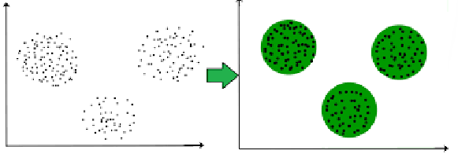
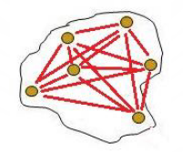
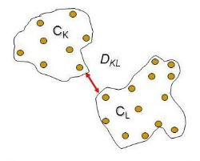
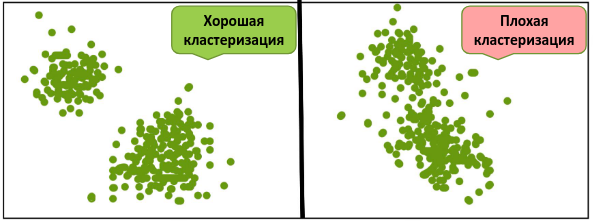
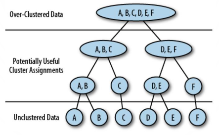
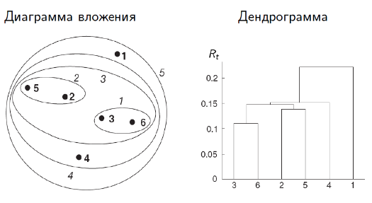

---
jupyter:
  jupytext:
    text_representation:
      extension: .md
      format_name: markdown
      format_version: '1.3'
      jupytext_version: 1.16.4
  kernelspec:
    display_name: Python 3 (ipykernel)
    language: python
    name: python3
---

<!-- #region editable=true jupyterlab-deck={"layer": "deck"} slideshow={"slide_type": "slide"} -->
# Лекция 11: Кластеризация

МГТУ им. Н.Э. Баумана

Красников Александр Сергеевич

https://github.com/askras/bmstu_machinelearning/

2024
<!-- #endregion -->

```python editable=true slideshow={"slide_type": "slide"}
import numpy as np
from matplotlib import pyplot as plt
%matplotlib inline
```

<!-- #region editable=true slideshow={"slide_type": "slide"} -->
## Постановка задачи

- Даны объекты $x_1, \ldots, x_l$, $x_i \in X$
- Требуется выявить в данных $K$ кластеров – таких областей, что объекты внутри одного кластера похожи друг на друга, а объекты из разных кластеров друг на друга не похожи.
- Формализация задачи: необходимо построить алгоритм
$$ a: X \rightarrow \{1, \ldots, K\},$$ сопоставляющий каждому объекту $x$
номер кластера


<!-- #endregion -->
<!-- #region editable=true slideshow={"slide_type": "slide"} -->
## Метрики качества кластеризации

- **Внешние метрики** – используют информацию об истинных метках объектов
- **Внутренние метрики** – оценивают качество кластеризации, основываясь только на наборе данных
<!-- #endregion -->
<!-- #region editable=true slideshow={"slide_type": "subslide"} -->
## Внешние метрики качества кластеризации
- Rand Index (RI)
- Adjusted Rand Index (ARI)
- Mutual Information (MI)
- Adjusted Mutual Information (AMI)
- Гомогенность
- Полнота
- V-мера
<!-- #endregion -->

<!-- #region editable=true slideshow={"slide_type": "subslide"} -->
### Rand Index (RI)

Предполагается, что известны истинные метки объектов.

Мера зависит не от самих значений меток, а от разбиения выборки на кластеры

Пусть $a$ – число пар объектов с одинаковыми метками и находящихся в одном кластере, $b$ – число пар объектов с различными метками и находящихся в разных кластерах, $N$ – число объектов в выборке
$RI = \cfrac{a+b}{C_N^2} = \cfrac{2(a+b)}{N(N-1)}$

$RI$ – доля объектов, для которых исходное и полученное разбиения согласованы. Выражает похожесть двух различных разбиений выборки.
<!-- #endregion -->

<!-- #region editable=true slideshow={"slide_type": "subslide"} -->
### Adjusted Rand Index (ARI)

Если $RI$ нормируется так, чтобы величина всегда принимала значения из отрезка $[−1; 1]$ независимо от числа объектов $N$ и числа кластеров, получается $ARI$:
$$
ARI = 
\cfrac{RI-E[RI]}{\max(RI) - E[RI]}
$$

- $ARI > 0$ – разбиения похожи ($ARI = 1$ – совпадают)
- $ARI \approx 0$ – случайные разбиения
-  $ARI < 0$ – непохожие разбиения
<!-- #endregion -->

<!-- #region editable=true slideshow={"slide_type": "subslide"} -->
### Mutual Information (AMI)

Метрика похожа на $ARI$.

Индекс $MI$ &mdash; это взаимная информация для двух разбиений выборки на кластеры:
$$
MI(U,V) = 
\sum\limits_{i=1}^{|U|}
  \sum\limits_{i=1}^{|V|}
    P_{UV}(i, j)
    \cfrac{\log P_{UV}(i,j)}{P_U(i)\cdot P_V(j)},
$$ где
- $P_{UV}(i, j)$ &mdash; вероятность того, что объект принадлежит кластеру $U_i \subset U$ и кластеру $V_j \subset V$
- $P_U(i)$ &mdash; вероятность, что объект принадлежит кластеру $U_i \subset U$ 
- $P_V(j)$ &mdash; вероятность, что объект принадлежит кластеру $V_i \subset V$

Взаимная информация измеряет долю информации, общей для обоих разбиений: насколько информация об одном из них уменьшает неопределенность относительно другого
<!-- #endregion -->

<!-- #region editable=true slideshow={"slide_type": "subslide"} -->
### Adjusted Mutual Information (AMI)

$AMI \in [0, 1]$ &mdash; нормировка $MI$; 
чем ближе к 1, тем более похожи разбиения.
<!-- #endregion -->

<!-- #region editable=true slideshow={"slide_type": "subslide"} -->
### Гомогенность, полнота и V-мера

Пусть $H = - \sum\limits_{i=1}^{|U|} P(i)\log P(i)$ &mdash; энтропия.

$K$ &mdash; результат кластеризации,
$C$ &mdash; истинное разбиение выборки на классы.

Тогда 
- $h = 1 - \cfrac{H(C|K)}{H(C)}$ &mdash; **гомогенность** измеряет, насколько каждый кластер
состоит из объектов одного класса
- $c = 1 - \cfrac{H(K|C)}{H(K)}$ &mdash; **полнота** измеряет, насколько объекты одного класса относятся к одному кластеру
- $v = \cfrac{2hc}{h+c}$  &mdash; **V-мера** (среднее гармоническое гомогенности и полноты) показывает, насколько два разбиения схожи между собой.

Свойства:
- Гомогенность и полнота принимают значения из отрезка $[0; 1]$.
- БОльшие значения соответствуют более точной кластеризации.
- Эти метрики не нормализованы (как $ARI$ и $AMI$), т.е. они зависят от числа кластеров!
- При большом числе кластеров и малом числе объектов лучше использовать $ARI$ и $AMI$
- При более 1000 объектов и числе кластеров меньше 10 проблема не так сильно выражена, поэтому её можно игнорировать
<!-- #endregion -->

<!-- #region editable=true slideshow={"slide_type": "subslide"} -->
## Внутренние метрики качества кластеризации

- Внутрикластерное расстояние
- Межкластерное расстояние
- Индекс Данна (Dunn Index)
- Силует (Silhouette)
<!-- #endregion -->

<!-- #region editable=true slideshow={"slide_type": "subslide"} -->
### Внутрикластерное расстояние
Пусть $c_k$ &mdash; центр $k$-го кластера.

Внутри кластера все объекты должны быть максимально &laquo;похожи&raquo; друг на друга, поэтому основная цель &mdash; **минимизировать внутрикластерное расстояние:**

$$
\sum\limits_{k=1}^K
  \sum\limits_{i=1}^l
    \left[
      a(x_i) = k
    \right]
    \rho(x_i, c_k)
\rightarrow \min\limits_a
$$
<div style="text-align:center">

</div>
<!-- #endregion -->

<!-- #region editable=true slideshow={"slide_type": "subslide"} -->
### Межкластерное расстояние
Пусть $c_k$ &mdash; центр $k$-го кластера.

Объекты из разных кластеров должны быть как можно менее &laquo;похожи&raquo; друг на друга, поэтому основная цель &mdash; **максимизировать межкластерное расстояние:**

$$
\sum\limits_{i=1}^l
  \sum\limits_{j=1}^l
    \left[
      a(x_i) \ne a(x_j)
    \right]
    \rho(x_i, x_j)
\rightarrow \max\limits_a
$$

<div style="text-align:center">

</div>
<!-- #endregion -->

<!-- #region editable=true slideshow={"slide_type": "subslide"} -->
### Индекс Данна (Dunn Index)

Основная цель &mdash; минимизировать внутрикластерное расстояние и
одновременно максимизировать межкластерное расстояние

$$
\cfrac
{\min\limits_{1\leqslant k < k' \leqslant K} d(k, k')}
{\max\limits_{1\leqslant k \leqslant K} d(k) }
\rightarrow \max\limits a,
$$
где

$d(k, k')$ &mdash; расстояние между кластерами $k$ и $k'$,

$d(k)$ &mdash; внутрикластерное расстояние для $k$-го кластера.

<div style="text-align:center">

</div>
<!-- #endregion -->

<!-- #region editable=true slideshow={"slide_type": "subslide"} -->
### Силует (Silhouette)

Пусть $a$ – среднее расстояние от объекта до всех объектов из того же кластера, $b$ – среднее расстояние от объекта до объектов из ближайшего (не содержащего объект) кластера.
Тогда силуэт данного объекта
$$ s = \cfrac{b-a}{\max(a,b)}$$

Силуэт выборки ($S$) – средняя величина силуэта по объектам.
$$S \in [-1, 1]$$

- Силуэт показывает, насколько среднее расстояние до объектов своего кластера отличается от среднего расстояния до объектов других кластеров.
  - $S \approx -1$  – плохие (разрозненные) кластеризации
  - $S \approx 0$ – кластеры накладывают- друг на друга
  - $S \approx 1$  – четко выраженные кластеры
- С помощью силуэта можно выбирать число кластеров $k$ (если оно заранее неизвестно) – выбирается $k$, для которого метрика максимальна.
- Силуэт зависит от формы кластеров и достигает больших значений на более выпуклых кластерах
<!-- #endregion -->

<!-- #region editable=true slideshow={"slide_type": "slide"} -->
## Методы кластеризации

- K-MEANS

- Иерархическая классификация

- DBSCAN
<!-- #endregion -->

<!-- #region editable=true slideshow={"slide_type": "slide"} -->
## K-MEANS

Идея метода &mdash; минимизация внутрикластерного расстояния
$$
\sum\limits_{k=1}^K
  \sum\limits_{i=1}^l
    \left[
      a(x_i) = k
    \right]
    \rho(x_i, c_k)
\rightarrow \min\limits_a
$$
с $\rho(a,b) = (a-b)^2$, т.е.
$$
\sum\limits_{k=1}^K
  \sum\limits_{i=1}^l
    \left[
      a(x_i) = k
    \right]
    (x_i -c_k)^2
\rightarrow \min\limits_a
$$

- Дано: выборка $x_1, \ldots, x_l$
- Параметр: число кластеров $K$
- Шаг 1. Случайно выбрать центры кластеров $c_1, \ldots, c_K$
- Шаг 2. Каждый объект отнести к ближайшему к нему центру кластера:
$$y_i = \arg\min\limits_{j=1,\ldots, K} \rho(x_i, c_j)$$
- Шаг 3. Пересчитать центры полученных кластеров
$$ 
c_j = 
\cfrac
{\sum\limits_{i=1}^lx_i[y_i = j]}
{\sum\limits_{i=1}^l[y_i = j]}
$$
- Шаг 4. Повторять шаги 2 и 3 до стабилизации кластеров
<!-- #endregion -->

<!-- #region editable=true slideshow={"slide_type": "subslide"} -->
### Пример K-MEANS кластеризации
<!-- #endregion -->

```python editable=true slideshow={"slide_type": "subslide"}
from sklearn.cluster import KMeans

X = np.zeros((150, 2))

np.random.seed(seed=42)
X[:50, 0] = np.random.normal(loc=0.0, scale=.3, size=50)
X[:50, 1] = np.random.normal(loc=0.0, scale=.3, size=50)

X[50:100, 0] = np.random.normal(loc=2.0, scale=.5, size=50)
X[50:100, 1] = np.random.normal(loc=-1.0, scale=.2, size=50)

X[100:150, 0] = np.random.normal(loc=-1.0, scale=.2, size=50)
X[100:150, 1] = np.random.normal(loc=2.0, scale=.5, size=50)

plt.figure(figsize=(12,8))
plt.scatter(X[...,0], X[...,1], s=50)
plt.xlabel('$x_1$')
plt.ylabel('$x_2$')
plt.title('Синтетические данные для кластеризации');
```

```python editable=true slideshow={"slide_type": "subslide"}
# Применение K-MEANS

K = 3
kmeans = KMeans(n_clusters=K, random_state=42)
kmeans.fit(X)
print(kmeans.labels_) #список из номеров кластеров для каждого объекта обучающей выборки

plt.figure(figsize=(12,8))
plt.scatter(X[:,0], X[:,1], c=kmeans.labels_, s=50, cmap='viridis')
plt.xlabel('x')
plt.ylabel('y')
plt.title('Результаты K-MEANS кластеризации');
```

```python editable=true slideshow={"slide_type": "subslide"}
# Что произойдет, если подобрать неверное число кластеров?

plt.figure(figsize= (15,8))
for n_c in range(2,8):
    kmeans = KMeans(n_clusters = n_c)
    kmeans = kmeans.fit(X)
    clusters = kmeans.predict(X)
    plt.subplot(2,3,n_c - 1)
    plt.scatter(X[:,0], X[:,1], c = clusters)
    plt.title(f'n_clusters = {n_c}')

plt.show()
```

<!-- #region editable=true slideshow={"slide_type": "subslide"} -->
Как мы видим, k-means обязательно пытается отдать каждому кластеру какие-то объекты и, как большинство алгоритмов кластеризации, зависит от заданного числа кластеров. 

Есть огромное количество вариаций, как выбирать количество кластеров автоматически — например, ввести вероятностный подход к выбору числа кластеров. 

Одним из главных недостатков k-means является случайная инициализация центров кластеров, что может привести к различным результатам кластеризации.

Главным же достоинством является скорость алгоритма. На каждой итерации требуется пересчет только расстояний до центров кластеров.

Также есть вариация k-medians, которая использует медиану вместо среднего. Это позволяет алгоритму стать более устойчивым к выбросам.
<!-- #endregion -->

```python editable=true slideshow={"slide_type": "subslide"}
from sklearn.metrics import silhouette_score

best_k, best_score = None, -1
for k in range(2,15):
    k_means = KMeans(n_clusters = k)
    k_means = k_means.fit(X)
    clusters = k_means.predict(X)
    score = np.round(silhouette_score(X=X,
                             labels=clusters), 2)
    if score > best_score:
      best_score = score
      best_k = k
print(f'Лучши вариант {best_score}, k = {best_k}')
```

<!-- #region editable=true slideshow={"slide_type": "subslide"} -->
### Замечание

Метод `sklearn.KMeans` содержит параметры `n_init` (число запусков из различных начальных приближений) и `init`. Есть три способа инициализации центроидов:

- `k-means++` – &laquo;умная&raquo; инициализация центроидов для ускорения сходимости.
- `random` – случайная инициализация центроидов.
- `ndarray` – заданная инициализация центроидов.
<!-- #endregion -->

<!-- #region editable=true slideshow={"slide_type": "slide"} -->
## Иерархическая кластеризация

Иерархия кластеров:
- на нижнем уровне – $l$ кластеров, каждый из которых состоит из одного объекта
- на верхнем уровне – один большой кластер

<div style="text-align:center">

</div>


Существует два варианта иерархической кластеризации:
- **аггломеративная**, в которой алгоритм на каждой итерации объединяет два меньших кластера в один
- **дивизивная**, в которой алгоритм на каждой итерации разбивает один кластер на два более мелких
<!-- #endregion -->

<!-- #region editable=true slideshow={"slide_type": "subslide"} -->
### Аггломеративный подход (Алгоритм Ланса-Уильямса)

Алгоритм аггломеративной иерархической кластеризации:

- Инициализируем множество кластеров, каждая точка считается своим кластером. То есть для выборки размера $N$ на первой итерации будет $N$ кластеров. Также в качестве входного параметра алгоритму подается метрика расстояния между двумя кластерами. Одной из популярных метрик является расстояние Уорда.

- На каждой итерации объединяем два кластера в один. Объединяющиеся кластера выбираются в соответствии с наименьшим расстоянием Уорда. То есть в соответствии с выбранным расстоянием эти два кластера будут наиболее похожи и поэтому объединяются.

- Предыдущий шаг повторяется вплоть до объединения всех точек один кластер.

Расстояние Уорда — между кластерами берётся прирост суммы квадратов расстояний объектов до центра кластера, получаемого в результате их объединения.

$$ 
\Delta = \sum_{x_i \in A \cup B}{(x_i-\bar{x})^2} - \sum_{x_i \in A}(x_i - \bar{a})^2 - \sum_{x_i \in B}(x_i - \bar{b})^2
$$
<!-- #endregion -->

<!-- #region editable=true slideshow={"slide_type": "subslide"} -->
В результате в данном подходе можно выбрать любое количество кластеров после завершения процедуры, просто остановив алгоритм на нужном нам шаге. К тому же данный алгоритм гораздо менее чувствителен к выбору метрики между точками, тогда как другие алгоритмы сильно зависят от этого.

Для визуализации иерархической кластеризации удобно строить дендрограммы, в которых разница между уровнями равна выбранному расстоянию объединяющихся на данном этапе кластеров.

<div style="text-align:center">

</div>
<!-- #endregion -->

```python editable=true slideshow={"slide_type": "subslide"}
# Применим иерархическую кластеризацию к синтетическим данным рассмотренным в примере выше

from scipy.cluster import hierarchy
from scipy.spatial.distance import pdist

distance_mat = pdist(X) # pdist посчитает нам верхний треугольник матрицы попарных расстояний

Z = hierarchy.linkage(distance_mat, 'single') # linkage — реализация агломеративного алгоритма
plt.figure(figsize=(10, 5))
dn = hierarchy.dendrogram(Z, color_threshold=0.2)
```

<!-- #region editable=true slideshow={"slide_type": "subslide"} -->
Если нет каких-то специализированных условий (например, известно, что кластеров должно быть не более $K$), то число кластеров можно выбирать по резкому скачку дендрограммы. Кроме того, в некоторых задачах важно понимать, для чего делается кластеризация и доменную область задачи — исходя из этого можно сильно сократить искомое количество кластеров.
<!-- #endregion -->

<!-- #region editable=true slideshow={"slide_type": "slide"} -->
## Кластеризация, основанная на плотности (Density-Based Clustering)
<!-- #endregion -->

<!-- #region editable=true slideshow={"slide_type": "subslide"} -->
### DBSCAN (Density-based spatial clustering of applications with noise)

Это алгоритм, основанный на плотности — если дан набор объектов в некотором пространстве, алгоритм группирует вместе объекты, которые расположены близко и помечает как выбросы объекты, которые находятся в областях с малой плотностью (ближайшие соседи которых лежат далеко).
<!-- #endregion -->

<!-- #region editable=true slideshow={"slide_type": "subslide"} -->
Алгоритм имеет два основных гиперпараметра:
1. `eps` &mdash; радиус рассматриваемой окрестности
2. `min_samples` &mdash; число соседей в окрестности

Для выполнения кластеризации DBSCAN точки делятся на основные точки, достижимые по плотности точки и выпадающие следующим образом:

- Точка $p$ является основной точкой, если по меньшей мере `min_samples` точек находятся на расстоянии, не превосходящем 
`eps` от неё. Говорят, что эти точки достижимы прямо из $p$.

-  Точка $q$ прямо достижима из $p$, если точка $q$ находится на расстоянии, не большем `eps`, от точки $p$, и $p$ — основная точка.
Точка $q$ достижима из $p$, если имеется путь 
$p_1,…,p_n$ где $p_1=p$ и $p_n=q$ , а каждая точка $p_{i+1}$ достижима прямо из $p_i$ (все точки на пути должны быть основными, за исключением $q$).

Все точки, не достижимые из основных точек, считаются выбросами.

Теперь, если $p$ является основной точкой, то она формирует кластер вместе со всеми точками (основными или неосновными), достижимыми из этой точки. Каждый кластер содержит по меньшей мере одну основную точку. Неосновные точки могут быть частью кластера, но они формируют его «край», поскольку не могут быть использованы для достижения других точек.
<!-- #endregion -->

<!-- #region editable=true slideshow={"slide_type": "subslide"} -->
### Алгоритм DBSCAN

Шаг 1. Выбрать точку без метки

Шаг 2. Если в окрестности меньше, чем `min_samples` точек, то пометить её как шумовую

Шаг 3. Создать кластер, поместить в него текущую точку (если это не шум, см. шаг 2)

Шаг 4. Для всех точек из окрестности S:
- если точка шумовая, то отнести к данному кластеру, но не использовать для расширения
- если точка основная, то отнести к данному кластеру, а её окрестность добавить к S

5. Перейти к шагу 1.
<!-- #endregion -->

<!-- #region editable=true slideshow={"slide_type": "subslide"} -->
Рассмотрим диаграмму, параметр `min_samples`=4.

Точка $A$ и другие красные точки являются основными точками, поскольку область с радиусом 
`eps` , окружающая эти точки, содержит по меньшей мере 4 точки (включая саму точку). Поскольку все они достижимы друг из друга, точки образуют один кластер. Точки $B$ и $C$ основными не являются, но достижимы из $A$ (через другие основные точки), и также принадлежат кластеру. Точка $N$ является точкой шума, она не является ни основной точкой, ни доступной прямо.

<div style="text-align:center">

</div>
<!-- #endregion -->

```python editable=true slideshow={"slide_type": "subslide"}
# Посмотрим на результаты кластеризации при разном выборе параметров eps и min_samples.

from sklearn.cluster import DBSCAN

plt.figure(figsize= (15,23))
i = 1
for samples in [2, 4, 8]:
    for e in [0.1, 0.2, 0.5, 1, 2]:
        dbscan = DBSCAN(eps=e, min_samples=samples)
        clusters = dbscan.fit_predict(X)
        plt.subplot(6, 3, i)
        plt.scatter(X[:,0], X[:,1], c = clusters)
        plt.title('eps = {}, min_samples = {}'.format(e, samples))
        i += 1
    i+=1

plt.show()
```

<!-- #region editable=true slideshow={"slide_type": "slide"} -->
## Сравнение алгоритмов кластеризации

Сгенерируем кластеры разной формы и посмотрим на результаты работы алгоритмов
<!-- #endregion -->

```python editable=true slideshow={"slide_type": "subslide"}
import time
import warnings

import numpy as np
import matplotlib.pyplot as plt

from sklearn import cluster, datasets, mixture
from sklearn.neighbors import kneighbors_graph
from sklearn.preprocessing import StandardScaler
from itertools import cycle, islice
warnings.simplefilter('ignore')

np.random.seed(0)

# ============
# Generate datasets. We choose the size big enough to see the scalability
# of the algorithms, but not too big to avoid too long running times
# ============
n_samples = 1500
noisy_circles = datasets.make_circles(n_samples=n_samples, factor=.5,
                                      noise=.05)
noisy_moons = datasets.make_moons(n_samples=n_samples, noise=.05)
blobs = datasets.make_blobs(n_samples=n_samples, random_state=8)
no_structure = np.random.rand(n_samples, 2), None

# Anisotropicly distributed data
random_state = 170
X, y = datasets.make_blobs(n_samples=n_samples, random_state=random_state)
transformation = [[0.6, -0.6], [-0.4, 0.8]]
X_aniso = np.dot(X, transformation)
aniso = (X_aniso, y)

# blobs with varied variances
varied = datasets.make_blobs(n_samples=n_samples,
                             cluster_std=[1.0, 2.5, 0.5],
                             random_state=random_state)

# ============
# Set up cluster parameters
# ============
plt.figure(figsize=(3 * 2 + 3, 10.5))
plt.subplots_adjust(left=.02, right=.98, bottom=.001, top=.96, wspace=.05,
                    hspace=.01)

plot_num = 1

default_base = {'quantile': .3,
                'eps': .3,
                'damping': .9,
                'preference': -200,
                'n_neighbors': 10,
                'n_clusters': 3,
                'min_samples': 20,
                'xi': 0.05,
                'min_cluster_size': 0.1}

datasets = [
    (noisy_circles, {'damping': .77, 'preference': -240,
                     'quantile': .2, 'n_clusters': 2,
                     'min_samples': 20, 'xi': 0.25}),
    (noisy_moons, {'damping': .75, 'preference': -220, 'n_clusters': 2}),
    (varied, {'eps': .18, 'n_neighbors': 2,
              'min_samples': 5, 'xi': 0.035, 'min_cluster_size': .2}),
    (aniso, {'eps': .15, 'n_neighbors': 2,
             'min_samples': 20, 'xi': 0.1, 'min_cluster_size': .2}),
    (blobs, {}),
    (no_structure, {})]

for i_dataset, (dataset, algo_params) in enumerate(datasets):
    # update parameters with dataset-specific values
    params = default_base.copy()
    params.update(algo_params)

    X, y = dataset

    # normalize dataset for easier parameter selection
    X = StandardScaler().fit_transform(X)
    connectivity = kneighbors_graph(
        X, n_neighbors=params['n_neighbors'], include_self=False)
    
    # make connectivity symmetric
    connectivity = 0.5 * (connectivity + connectivity.T)

    # ============
    # Create cluster objects
    # ============
    
    k_means = cluster.KMeans(n_clusters=params['n_clusters'])


    dbscan = cluster.DBSCAN(eps=params['eps'])
    
    average_linkage =  cluster.AgglomerativeClustering(
        linkage="average", #affinity="cityblock",
        n_clusters=params['n_clusters'], connectivity=connectivity)
    

    clustering_algorithms = (
        ('KMeans', k_means),
        ('AgglomerativeClustering', average_linkage),
        ('DBSCAN', dbscan),
    )

    for name, algorithm in clustering_algorithms:
        t0 = time.time()

        algorithm.fit(X)

        t1 = time.time()
        if hasattr(algorithm, 'labels_'):
            y_pred = algorithm.labels_.astype(int)
        else:
            y_pred = algorithm.predict(X)

        plt.subplot(len(datasets), len(clustering_algorithms), plot_num)
        if i_dataset == 0:
            plt.title(name, size=18)

        colors = np.array(list(islice(cycle(['#377eb8', '#ff7f00', '#4daf4a',
                                             '#f781bf', '#a65628', '#984ea3',
                                             '#999999', '#e41a1c', '#dede00']),
                                      int(max(y_pred) + 1))))
        # add black color for outliers (if any)
        colors = np.append(colors, ["#000000"])
        plt.scatter(X[:, 0], X[:, 1], s=10, color=colors[y_pred])

        plt.xlim(-2.5, 2.5)
        plt.ylim(-2.5, 2.5)
        plt.xticks(())
        plt.yticks(())
        plt.text(.99, .01, ('%.2fs' % (t1 - t0)).lstrip('0'),
                 transform=plt.gca().transAxes, size=15,
                 horizontalalignment='right')
        plot_num += 1

plt.show()
```

<!-- #region editable=true slideshow={"slide_type": "slide"} -->
## Примеры кластеризации
<!-- #endregion -->

<!-- #region editable=true slideshow={"slide_type": "subslide"} -->
### Сжатие изображений с K-MEANS


<!-- #endregion -->

```python editable=true slideshow={"slide_type": "subslide"}
import matplotlib.image as mpimg
import os

file_path = './img/bmstu.bmp'
img = mpimg.imread(file_path)

file_size_real = os.path.getsize(file_path)
print(f"Фактический размер исходного файла:  {file_size_real} байт")

print(f'Размер изображения {img.shape[0]} x {img.shape[1]} пикселей')
print(f'В изображении {img.shape[2]} цветовых канала')
file_size_pred = img.shape[0] * img.shape[1] * img.shape[2]
print(f"Рассчитанный размер исходного файла: {img.shape[0]} * {img.shape[1]} * {img.shape[2]} = {file_size_pred} байт")

print('\nДля простоты будем работать с одним цветовым каналом')
img = img[..., 1]
print(f"Каждая точка каждного цветового канала кодируется одним байтом")
print(f"Что дает {2**8} градаций каждого цвета")
print(f"\nРассчитанный размер памяти для хранения одного канала: {img.shape[0]} * {img.shape[1]} * 1 = {img.shape[0] * img.shape[1]} байт")

plt.figure(figsize = (15, 9))
plt.axis('off')
plt.imshow(img, cmap='gray');
```

```python editable=true slideshow={"slide_type": "subslide"}
from sklearn.cluster import MiniBatchKMeans
from scipy.stats import randint
from sklearn.cluster import KMeans

X = img.reshape((-1, 1)) #вытягиваем картинку в вектор
K = 32
k_means = MiniBatchKMeans(n_clusters=K)
k_means.fit(X)
values = k_means.cluster_centers_
labels = k_means.labels_

img_compressed = values[labels].reshape(img.shape) #возвращаем к размерности исходной картинки

print(f'Полученное изображение кодируется {K} цветами на канал')
num_bit = 1
while 2**num_bit < K: num_bit += 1

print(f'Для кодирования {K} цветов достаточно {num_bit} бит')
file_size_pred = round(img.shape[0] * img.shape[1] * num_bit / 8)
print(f'Для сохранения одного цветогого канала достаточно будет {img.shape[0]} * {img.shape[1]} * {num_bit} / 8 = {file_size_pred} байт')

plt.figure(figsize = (15, 9))
plt.axis('off')
plt.imshow(img_compressed, cmap = 'gray');
```

<!-- #region editable=true slideshow={"slide_type": "slide"} -->
### Кластеризация рукописных цифр
<!-- #endregion -->

```python editable=true slideshow={"slide_type": "subslide"}
from sklearn.datasets import load_digits
from sklearn import metrics
from sklearn.cluster import KMeans

# Загрузим набор данных MNIST
digits = load_digits()
X, y = digits.data, digits.target
Im = digits.images

# Выведем на экран первые 20 цифр (в цветовой схеме 'gray')
for i in range(20):
    plt.figure(figsize=(2,2))
    plt.imshow(Im[i], cmap='gray')
    plt.show()
```

```python editable=true slideshow={"slide_type": "subslide"}
# Обучим kmeans с десятью кластерами.
km = KMeans(n_clusters=10, init='k-means++', max_iter=100, n_init=1)
km.fit(X);
```

```python editable=true slideshow={"slide_type": "subslide"}
# Выведем на экран метрики качества кластеризации

labels = digits.target

print(f"Homogeneity: {metrics.homogeneity_score(labels, km.labels_):0.3f}" )
print(f"Completeness: {metrics.completeness_score(labels, km.labels_):0.3f}")
print(f"V-measure: {metrics.v_measure_score(labels, km.labels_):0.3f}")
print(f"Adjusted Rand-Index: {metrics.adjusted_rand_score(labels, km.labels_):.3f}")
print(f"Adjusted mutual info score: {metrics.adjusted_mutual_info_score(labels, km.labels_):.3f}")
print(f"Silhouette Coefficient: {metrics.silhouette_score(X, km.labels_, sample_size=1000):0.3f}")

order_centroids = km.cluster_centers_.argsort()[:, ::-1]
```

```python editable=true slideshow={"slide_type": "subslide"}
# Нарисуем центры получившихся кластеров.

_, axes = plt.subplots(2, 5)
for ax, center in zip(axes.ravel(), km.cluster_centers_):
    ax.matshow(center.reshape(8, 8), cmap=plt.cm.gray)
    ax.set_xticks(())
    ax.set_yticks(())
```

<!-- #region editable=true slideshow={"slide_type": "subslide"} -->
Кластеризация получилась довольно качественной.
Визуализируем объекты (изображения цифр) как точки на двумерной плоскости:
- объявим модель и обучим её (fit_transform)
- нарисуем результат, покрасив точки в цвета, соответствующие кластерам
<!-- #endregion -->

```python editable=true slideshow={"slide_type": "subslide"}
# Визуализируем данные с помощью t-SNE

from sklearn.manifold import TSNE

tsne = TSNE(random_state=17)
X_tsne = tsne.fit_transform(X) # две координаты

plt.figure(figsize=(12,10))
plt.scatter(X_tsne[:, 0], X_tsne[:, 1], c=y, 
            edgecolor='none', alpha=0.7, s=40,
            cmap=plt.get_cmap('nipy_spectral', 10))
plt.colorbar()
plt.title('MNIST. t-SNE проекция');
```
