---
jupyter:
  jupytext:
    text_representation:
      extension: .md
      format_name: markdown
      format_version: '1.3'
      jupytext_version: 1.16.4
  kernelspec:
    display_name: Python 3 (ipykernel)
    language: python
    name: python3
---

<!-- #region editable=true jupyterlab-deck={"layer": "deck"} slideshow={"slide_type": "slide"} -->
# Лекция 12: Деревья принятия решений

МГТУ им. Н.Э. Баумана

Красников Александр Сергеевич

https://github.com/askras/bmstu_machinelearning/

2024
<!-- #endregion -->

<!-- #region editable=true slideshow={"slide_type": "slide"} -->
## Интуитивное построение дерева принятия решения
<!-- #endregion -->
<!-- #region editable=true slideshow={"slide_type": "subslide"} -->
### Кредитный скоринг

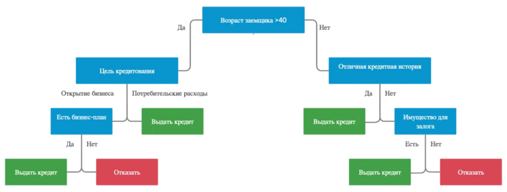
<!-- #endregion -->
<!-- #region editable=true slideshow={"slide_type": "subslide"} -->
### Игра в гольф


<!-- #endregion -->
<!-- #region editable=true slideshow={"slide_type": "slide"} -->
## Дерево принятия решений (Решающее дерево)

Решающее дерево – это бинарное дерево, в котором:
- каждой узловой вершине $v$ приписана функция (предикат) $\beta(v): X \rightarrow \{0, 1\}$
- каждой листовой вершине $v$ приписан прогноз $c_v \in Y$ (для классификации – класс или вероятность класса, для регрессии – действительное значение целевой переменной)
<!-- #endregion -->
<!-- #region editable=true slideshow={"slide_type": "slide"} -->
## Жадный алгоритм построения решающего дерева

**Шаг 1**: найдем наилучшее разбиение всей выборки $X$ на две
части: 
$$R_l(j ,t) = \{x | x_j > t\}$$
$$R_r(j ,t) = \{x | x_j \leqslant t\}$$
с точки зрения некоторого функционала $Q(X, j, t)$ 

- найдем наилучшие $j$ и $t$
- создадим корень дерева, поставив в него предикат $[x_j > t]$.

**Шаг 2**: Для каждой из полученных подвыборок $R_l$ и $R_r$ рекурсивно применим шаг 1. И т.д.

В каждой вершине на каждом шаге проверяем, не выполнилось ли условие останова.
Если выполнилось, то объявляем вершину листом и записываем в него
предсказание.
<!-- #endregion -->
<!-- #region editable=true slideshow={"slide_type": "subslide"} -->
### Пример построения решающего дерева для задачи классификации

- Критерий качества - количество ошибок классификации
- Критерий останова - отсутствие ошибок классификации

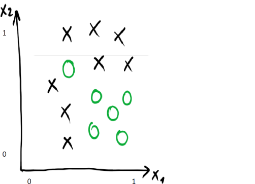
<!-- #endregion -->
<!-- #region editable=true slideshow={"slide_type": "subslide"} -->
#### Жадно найдем наилучший предикат

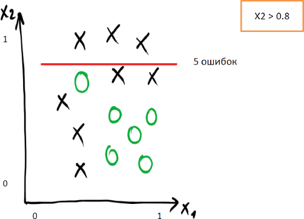
<!-- #endregion -->
<!-- #region editable=true slideshow={"slide_type": "subslide"} -->
#### Жадно найдем наилучший предикат

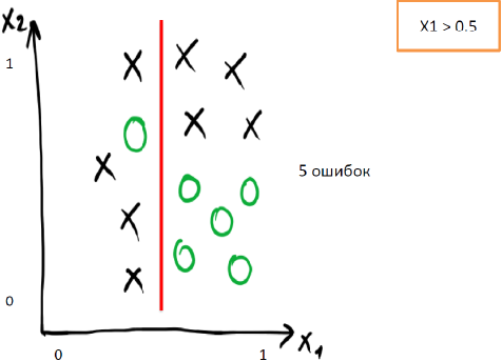
<!-- #endregion -->
<!-- #region editable=true slideshow={"slide_type": "subslide"} -->
#### Жадно найдем наилучший предикат

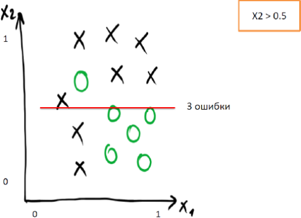
<!-- #endregion -->
<!-- #region editable=true slideshow={"slide_type": "subslide"} -->
#### Нашли лучшее первое ветвление

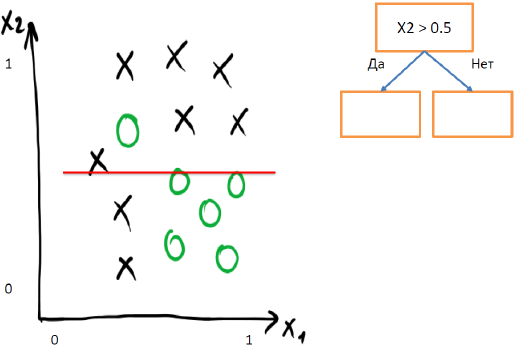
<!-- #endregion -->
<!-- #region editable=true slideshow={"slide_type": "subslide"} -->
#### Нашли лучшее первое ветвление

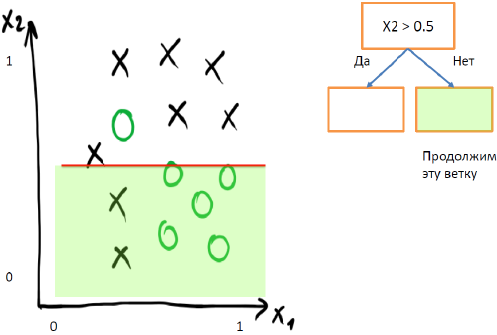
<!-- #endregion -->
<!-- #region editable=true slideshow={"slide_type": "subslide"} -->
#### Нашли лучшее второе ветвление

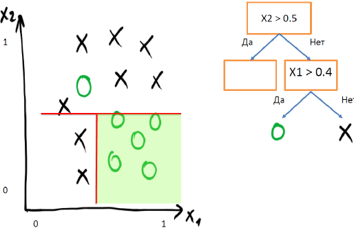
<!-- #endregion -->
<!-- #region editable=true slideshow={"slide_type": "subslide"} -->
#### Построим все дерево

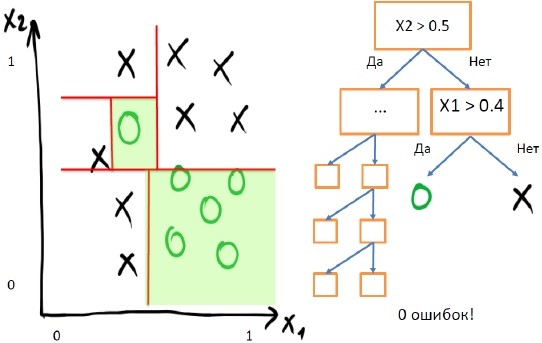
<!-- #endregion -->
<!-- #region editable=true slideshow={"slide_type": "subslide"} -->
### Пример построения решающего дерева для задачи регрессии

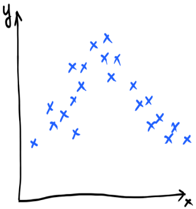
<!-- #endregion -->
<!-- #region editable=true slideshow={"slide_type": "subslide"} -->
#### Нашли первое ветвление

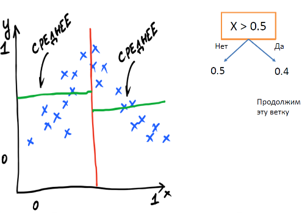
<!-- #endregion -->
<!-- #region editable=true slideshow={"slide_type": "subslide"} -->
#### Нашли второе ветвление

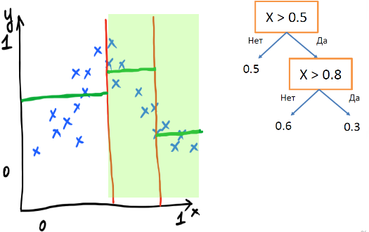
<!-- #endregion -->
<!-- #region editable=true slideshow={"slide_type": "slide"} -->
## Факторы, влияющие на построение решающего дерева

- Вид предикатов в вершинах
- Функционал качества $Q(X, j, t)$
- Метод обработки пропущенных значений
- Критерий останова
- Метод ограничения глубины дерева
<!-- #endregion -->
<!-- #region editable=true slideshow={"slide_type": "slide"} -->
## Критерий информативности

- Пусть $𝑅$ – множество объектов, попадающих в вершину на данном шаге, а $R_l$ и $R_r$ - объекты, попадающие в левую и правую ветки после разбиения.
- Цель: чтобы после разбиения объектов на две группы внутри каждой группы как можно больше объектов было одного класса.
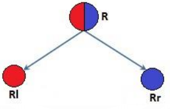
- $H(R)$ - **критерий информативности** - мера неоднородности целевых (разнообразие) переменных внутри группы 𝑅.
- Чем меньше разнообразие целевой переменной внутри группы, тем меньше значение $H(R)$. То есть необоходимо минимизировать $H(R):$
$$H(R_l) \rightarrow \min, \quad H(R_r) \rightarrow \min$$
<!-- #endregion -->

<!-- #region editable=true slideshow={"slide_type": "subslide"} -->
### Функционал качества предиката

 Для поиска лучшего предиката для узла дерева зададим его функционал качества:
$$Q(R, j, t) = H(R) -
\left(
     \cfrac{|R_l|}{|R|} \cdot H(R_l)
    +
    \cfrac{|R_r|}{|R|} \cdot H(R_r)
\right) \rightarrow \max\limits_{j, t},
$$ где
- $R$ - множество объектов, попавших в вершину, разбиваемую на данном шаге,
- $R_l$, $R_r$ - объекты, попадающие в левое и правое поддерево соответственно при заданном предикате
- $|R|$, $|R_l|$, $|R_r|$ - количество объектов в соответсвующих множествах (мощность)
- $H(R)$ - критерий информативности для вершины (impurity criterion), который оценивает качество распределения целевой переменной среди множества объектов
- $Q(R_m, j, t)$ - функционал качества
<!-- #endregion -->

<!-- #region editable=true slideshow={"slide_type": "subslide"} -->
### Вид критерия информативности

- В каждом листе дерево выдает константу $c$:
  - для задачи регрессии - вещественное число
  - для задачи классификации - класс (или вероятность класса)
- Чем лучше объекты в листе предсказываются этой константой, тем меньше средняя ошибка на объектах:
$$H(R) = \min\limits_{c \in \mathbb{R}} \cfrac{1}{|R|} \sum\limits_{(x_i, y_i) \in R} L(y_i, c),$$
где
где $ L(y_i, c)$ – некоторая функция потерь.
<!-- #endregion -->

<!-- #region editable=true slideshow={"slide_type": "slide"} -->
## Вид критерия информативности в задаче регрессии

Если в качестве функции потерь мы берём квадратичную ошибку, то

$$H(R) = \min\limits_{c \in \mathbb{R}}  \cfrac{1}{|R|} \sum\limits_{(x_i, y_i) \in R} (y_i - c)^2$$

Её минимум достигается при
$$c = \cfrac{1}{|R|} \sum\limits_{(x_i, y_i) \in R} y_i$$
то есть в листе предсказывается среднее значение целевой переменной на объектах, попавших в лист.

Значит, **информативность $H(R)$ в листе – это дисперсия** целевой переменной (для объектов, попавших в этот лист).
Чем меньше дисперсия, тем меньше разброс целевой переменной объектов, попавших в лист.
<!-- #endregion -->

<!-- #region editable=true slideshow={"slide_type": "subslide"} -->
### Пример: решающее дерево в задаче регрессии

Предположим, что в лист дерева попало несколько объектов. В каждом листе дерево предсказывает константу.

Какую константу выгоднее всего выдать в качестве ответа?

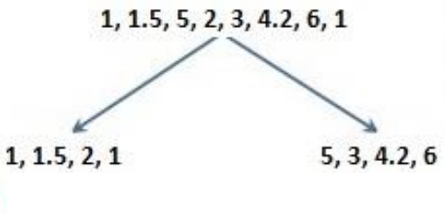
<!-- #endregion -->

<!-- #region editable=true slideshow={"slide_type": "subslide"} -->
### Пример: решающее дерево в задаче регрессии

Если в качестве функционала ошибки в листе использовать среднеквадратичную ошибку, то в качестве ответа надо выдавать среднее значение целевых переменных всех объектов, попавших в лист.

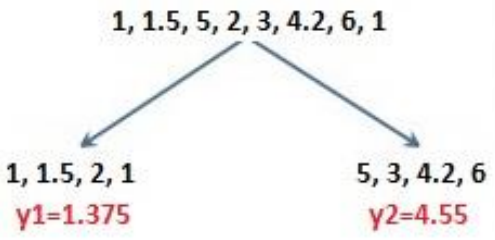
<!-- #endregion -->

<!-- #region editable=true slideshow={"slide_type": "slide"} -->
## Вид критерия информативности в задаче классификации

Пусть решается задача классификации с $K$ классами: $1, 2, \ldots, K$.

- $p_k$ доля объектов класса $k$, попавших в вершину:
$$p_k = \cfrac{1}{|R|} \sum\limits_{(x_i, y_i) \in R} [y_i = k]$$

<!-- #endregion -->

<!-- #region editable=true slideshow={"slide_type": "subslide"} -->
### Ошибка классификации (Missclassification errror)

Пусть $c$ - самый представительный класс в данной вершине:
$$c = \arg\max\limits_k p_k$$

Рассмотрим индикатор ошибки как функцию потерь

$$H(R) = \min\limits_{c \in Y} \cfrac{1}{|R|} \sum\limits_{(x_i, y_i) \in R}[y_i \ne c] $$

Оптимальным предсказанием будет наиболее популярный класс $k_*$ — значит, критерий будет равен следующей доле ошибок:

$$H(R) = \cfrac{1}{|R|} \sum\limits_{(x_i, y_i) \in R}[y_i \ne k_*] = 1 - p_{k_*}$$

Данный критерий является достаточно грубым, поскольку учитывает частоту $p_{k_*}$ лишь одного класса.
<!-- #endregion -->

<!-- #region editable=true slideshow={"slide_type": "subslide"} -->
#### Критерий Джини (Gini Index)

Будем в каждой вершине в качестве ответа выдавать не класс, а распределение вероятностей классов: $$c = (c_1, c_2, \ldots, K), \qquad \sum\limits_{k=1}^K c_k= 1$$

Качество распределения можно измерить с помощью критерия Бриера:

$$
  H(R) = 
  \min\limits_c 
  \cfrac{1}{|R|} 
  \sum\limits_{(x_i, y_i) \in R}
  \sum\limits_{k=1}^K 
  (c_k - [y_i = k])^2
$$

Минимальное значение функционала $H(R)$ достигается на векторе, состоящем из долей классов: $c_* = (p_1, p_2, \ldots, p_k)$.
Таким образом критерий будет равен
$$H(R) = \sum\limits_{k=1}^K p_k(1-p_k)$$
<!-- #endregion -->

<!-- #region editable=true slideshow={"slide_type": "subslide"} -->
#### Пример использования критерия Джини

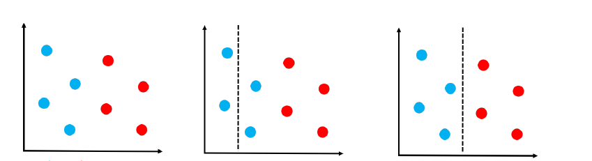
- До разбиения
$$
  H(R) = 
    \color{blue}
    p_1(1-p_1)
    \color{black} + 
    \color{red}
    p_2(1-p_2)
    \color{black} = 
    \color{blue}
    \cfrac{4}{8} \left(1- \cfrac{4}{8}\right) 
    \color{black} + 
    \color{red}
    \cfrac{4}{8} \left(1- \cfrac{4}{8}\right)
    \color{black}
  = \cfrac{1}{2}
$$
- Первая (неудачная) попытка разбиения
$$
  H(R_l) = 
    \color{blue}
    p_1(1-p_1)
    \color{black} + 
    \color{red}
    p_2(1-p_2)
    \color{black} = 
    \color{blue}
    \cfrac{2}{2} \left(1- \cfrac{2}{2}\right) 
    \color{black} + 
    \color{red}
    \cfrac{0}{2} \left(1- \cfrac{0}{2}\right)
    \color{black}
  = 0
$$
$$
  H(R_r) = 
    \color{blue}
    p_1(1-p_1)
    \color{black} + 
    \color{red}
    p_2(1-p_2)
    \color{black} = 
    \color{blue}
    \cfrac{2}{6} \left(1- \cfrac{2}{6}\right) 
    \color{black} + 
    \color{red}
    \cfrac{4}{6} \left(1- \cfrac{4}{6}\right)
    \color{black}
  = \cfrac{4}{9}
$$
$$Q(R,j,t) = H(R) - \cfrac{|R_l|}{|R|} H(R_l) - \cfrac{|R_r|}{|R|} H(R_r) =$$
$$= \cfrac{1}{2} - \cfrac{2}{8} \cdot 0 - \cfrac{6}{8} \cdot \cfrac{4}{9} = \cfrac{1}{6} $$
- Вторая (удачная) попытка разбиения
$$
  H(R_l) = 
    \color{blue}
    p_1(1-p_1)
    \color{black} + 
    \color{red}
    p_2(1-p_2)
    \color{black} = 
    \color{blue}
    \cfrac{4}{4} \left(1- \cfrac{4}{4}\right) 
    \color{black} + 
    \color{red}
    \cfrac{0}{4} \left(1- \cfrac{0}{4}\right)
    \color{black}
  = 0
$$
$$
  H(R_r) = 
    \color{blue}
    p_1(1-p_1)
    \color{black} + 
    \color{red}
    p_2(1-p_2)
    \color{black} = 
    \color{blue}
    \cfrac{0}{4} \left(1- \cfrac{0}{4}\right) 
    \color{black} + 
    \color{red}
    \cfrac{4}{4} \left(1- \cfrac{4}{4}\right)
    \color{black}
  = 0
$$
$$Q(R,j,t) = H(R) - \cfrac{|R_l|}{|R|} H(R_l) - \cfrac{|R_r|}{|R|} H(R_r) =$$
$$= \cfrac{1}{2} - \cfrac{4}{8} \cdot 0 - \cfrac{4}{8} \cdot 0 = \cfrac{1}{2} $$

<!-- #endregion -->

<!-- #region editable=true slideshow={"slide_type": "subslide"} -->
#### Энтропийный критерий (Entropy)

Запишем логарифм правдоподобия:

$$H(R) = - \min\limits_c 
\left(
  \cfrac{1}{|R|}
  \sum\limits_{(x_i, y_i) \in R}
  \sum\limits_{k=1}^K 
  [y_i = k] \log c_k
\right)
$$

Минимальное значение функционала $H(R)$ достигается на векторе, состоящем из долей классов: $c_* = (p_1, p_2, \ldots, p_k)$.
Таким образом критерий будет равен

$$H(R) = - \sum\limits_{k=1}^K p_k \log p_k$$

<!-- #endregion -->

<!-- #region editable=true slideshow={"slide_type": "subslide"} -->
- Энтропия $H(R) \geqslant 0$ (минимум на распределении $p_i=1$, $p_j = 0$, $i\ne j$)
- $\max H(R)$ достигается на равномерном распределении $p_1 = p_2 = \cdots = p_K = \cfrac{1}{K}$

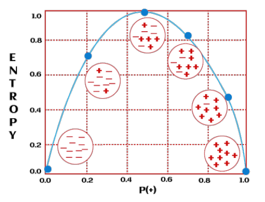
<!-- #endregion -->

<!-- #region editable=true slideshow={"slide_type": "subslide"} -->
#### Пример использования энтропийного критерия


- До разбиения
$$
  H(R) = 
    \color{blue}
    -p_1 \log p_1
    \color{red}
    -p_2 \log p_2
    \color{black} = 
    \color{blue}
    -\cfrac{4}{8} \log \left(\cfrac{4}{8}\right) 
    \color{red}
    -\cfrac{4}{8} \log \left(\cfrac{4}{8}\right)
    \color{black}
  = 1
$$
- Первая (неудачная) попытка разбиения
$$
  H(R_l) = 
    \color{blue}
    -p_1 \log p_1
    \color{red}
    -p_2 \log p_2
    \color{black} = 
    \color{blue}
    -\cfrac{2}{2} \log \left(\cfrac{2}{2}\right) 
    \color{red}
    -\cfrac{0}{2} \log \left(\cfrac{0}{2}\right) 
    \color{black}
  \rightarrow 0
$$
$$
  H(R_r) = 
    \color{blue}
    -p_1 \log p_1
    \color{red}
    -p_2 \log p_2
    \color{black} = 
    \color{blue}
    -\cfrac{2}{6} \log \left(\cfrac{2}{6}\right) 
    \color{red}
    -\cfrac{4}{6} \log \left(\cfrac{4}{6}\right) 
    \color{black}
  \approx 0.92
$$
$$Q(R,j,t) = H(R) - \cfrac{|R_l|}{|R|} H(R_l) - \cfrac{|R_r|}{|R|} H(R_r) =$$
$$= 1 - \cfrac{2}{8} \cdot 0 - \cfrac{6}{8} \cdot 0.92 \approx 0.32 $$
- Вторая (удачная) попытка разбиения
$$
  H(R_l) = 
    \color{blue}
    -p_1 \log p_1
    \color{red}
    -p_2 \log p_2
    \color{black} = 
    \color{blue}
    -\cfrac{4}{4} \log \left(\cfrac{4}{4}\right) 
    \color{red}
    -\cfrac{0}{4} \log \left(\cfrac{0}{4}\right) 
    \color{black}
  \rightarrow 0
$$
$$
  H(R_r) = 
    \color{blue}
    -p_1 \log p_1
    \color{red}
    -p_2 \log p_2
    \color{black} = 
    \color{blue}
    -\cfrac{0}{4} \log \left(\cfrac{0}{4}\right) 
    \color{red}
    -\cfrac{4}{4} \log \left(\cfrac{4}{4}\right) 
    \color{black}
  \rightarrow 0
$$
$$Q(R,j,t) = H(R) - \cfrac{|R_l|}{|R|} H(R_l) - \cfrac{|R_r|}{|R|} H(R_r) =$$
$$= 1 - \cfrac{4}{8} \cdot 0 - \cfrac{4}{8} \cdot 0 = 1 $$


<!-- #endregion -->

<!-- #region editable=true slideshow={"slide_type": "subslide"} -->
### Сравнение критериев информативности

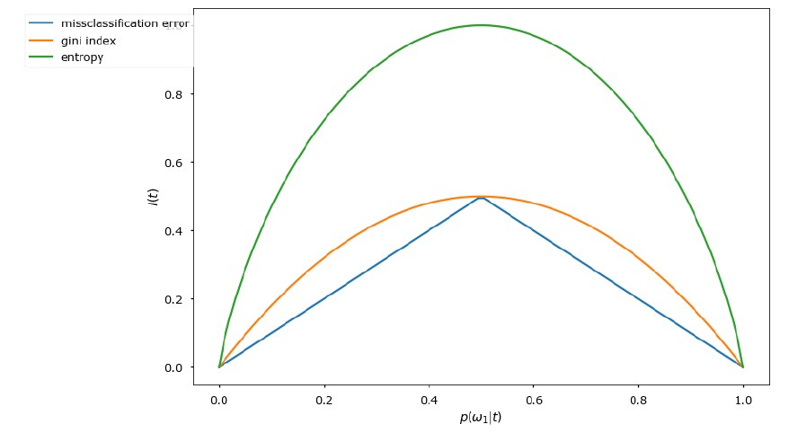
<!-- #endregion -->

<!-- #region editable=true slideshow={"slide_type": "slide"} -->
## Критерии останова

- Ограничение максимальной глубины дерева (max_depth)
- Ограничение минимального числа объектов в листьях (min_samples_leaf)
- Ограничение максимального числа листьев в дереве
- Останов в случае, если все объекты в листе относятся к одному классу
- Требование, что функционал качества при дроблении увеличивался как минимум на $s\%$
- Требование, что функционал качества достиг целевого значения $Q(R_m, j, t) > h$ 

<!-- #endregion -->

<!-- #region editable=true slideshow={"slide_type": "subslide"} -->
### Важность критерия останова

- Критерии останова влияют на качество прогнозов дерева
- Критерии останова влияют на глубину решающего дерева
- Очень глубокие деревья переобучаются
- Неглубокие деревья недообучаются

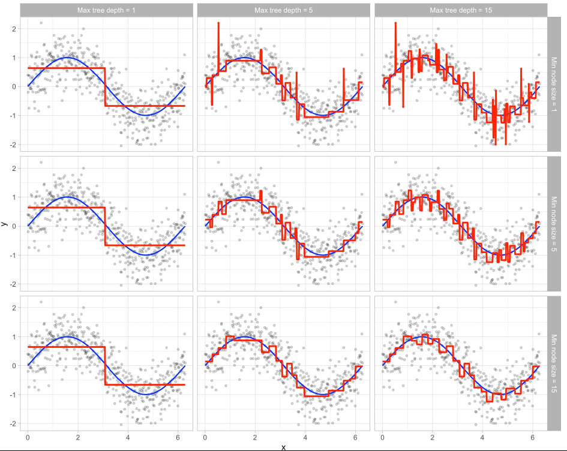
<!-- #endregion -->

<!-- #region editable=true slideshow={"slide_type": "subslide"} -->
### Стрижка (pruning) деревьев

После того, как дерево построено, можно удалить несколько его вершин, чтобы понизить сложность алгоритма и снизить переобучение (стрижка дерева или pruning).

- Есть несколько методов стрижки деревьев
- На практике применяется редко

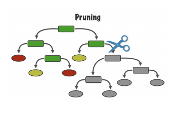
<!-- #endregion -->
<!-- #region editable=true slideshow={"slide_type": "subslide"} -->
#### Пример

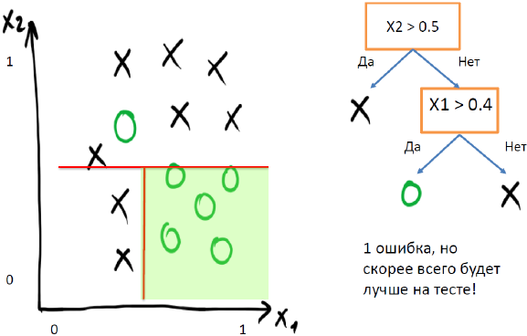
<!-- #endregion -->

<!-- #region editable=true slideshow={"slide_type": "slide"} -->
## Пропущенные значения

Можно модифицировать процедуру разбиения выборки в вершине дерева так, чтобы была возможность обрабатывать пропущенные значения

**Обучение** решающего дерева:
- Пусть для признака $j$ некоторые значения пропущены
- При поиске лучшего предиката $\{x_j > t\}$ не используем ропуски $x_j$.

**Применение** решающего дерева:
- Если пропущено значение $x_j$ для объекта, то идем и влево, и вправо.
- Делаем прогноз в обоих поддеревьях
- Итоговый прогноз $\hat{y}$ - для объекта усредняем:
$$\hat{y} = \cfrac{|R_l|}{|R|}\cdot \hat{y}_l + \cfrac{|R_r|}{|R|}\cdot \hat{y}_r$$
<!-- #endregion -->
<!-- #region editable=true slideshow={"slide_type": "slide"} -->
## Важность признаков

Решающее дерево позволяет оценить вклад каждого входного признака в прогноз

Важность признака $j$ (feature importance):
$$FIM_j = \sum\limits_{node \in T(j)} |R_m| Q(R_m, j, t)$$
где
$T(j)$ - все вершины дерева, где предикаты использовали признак $j: \{x_j > t\}$
<!-- #endregion -->

<!-- #region editable=true slideshow={"slide_type": "slide"} -->
## Методы построения деревьев
- ID3
  - Энтропийный критерий
  - Только категориальные признаки
- C4.5
  - Критерий Gain Ratio
  - Error-Based Prunning
  - Обработка пропусков как описали выше
- CART (sklearn)
  - Критерий Джини
  - Cost-Complexity Pruning
  - Метод суррогатный предикатов для обработки пропусков
<!-- #endregion -->

<!-- #region editable=true slideshow={"slide_type": "slide"} -->
## Плюсы решающих деревьев
- Четкие правила классификации (интерпретируемые предикаты, например, &laquo;возраст > 25&raquo;)
- Деревья решений легко визуализируются, то есть хорошо интерпретируются
- Быстро обучаются и выдают прогноз
- Малое число параметров
<!-- #endregion -->

<!-- #region editable=true slideshow={"slide_type": "slide"} -->
## Минусы решающих деревьев

- Очень чувствительны к шумам в данных, модель сильно меняется при небольшом изменении обучающей выборки
- Разделяющая граница имеет свои ограничения (состоит из гиперплоскостей)
- Необходимость борьбы с переобучением (стрижка или какой-либо из критериев останова)
- Проблема поиска оптимального дерева (NP-полная задача, поэтому на практике используется жадное построение дерева)
<!-- #endregion -->

<!-- #region editable=true slideshow={"slide_type": "slide"} -->
## Примеры использования
<!-- #endregion -->

```python editable=true slideshow={"slide_type": "fragment"}
import matplotlib.pyplot as plt
%matplotlib inline

from mlxtend.plotting import plot_decision_regions
import numpy as np
from sklearn.linear_model import LogisticRegression
from sklearn.metrics import accuracy_score, mean_squared_error
from sklearn.model_selection import train_test_split
from sklearn.tree import DecisionTreeClassifier, DecisionTreeRegressor, plot_tree
import pandas as pd

plt.rcParams["figure.figsize"] = (11, 6.5)
```

<!-- #region editable=true slideshow={"slide_type": "subslide"} -->
### Дерево решений

Давайте сгенерируем пример линейно разделимой выборки для задачи бинарной классификации:
<!-- #endregion -->

```python editable=true slideshow={"slide_type": "fragment"}
n = 400
np.random.seed(1)
X = np.zeros((n, 2))
X[:, 0] = np.linspace(-5, 5, n)
X[:, 1] = X[:, 0] + 0.5 * np.random.normal(size=n)
y = (X[:, 1] > X[:, 0]).astype(int)

plt.scatter(X[:, 0], X[:, 1], s=100, c=y, cmap='bwr')
plt.show()
```

<!-- #region editable=true slideshow={"slide_type": "subslide"} -->
Для удобства, напишем функцию для обучения классификатора и построения графика с разделяющей прямой.
<!-- #endregion -->

```python editable=true slideshow={"slide_type": "fragment"}
def train_model(model=LogisticRegression()):
    
    X_train, X_test, y_train, y_test = train_test_split(X, y, test_size=0.25, random_state=13)
    model.fit(X_train, y_train)
    y_pred = model.predict(X_test)
    plot_decision_regions(X_test, y_test, model)
    plt.show()

    print(f"Accuracy: {accuracy_score(y_pred, y_test):.2f}")

train_model(LogisticRegression())
```

<!-- #region editable=true slideshow={"slide_type": "subslide"} -->
Сравним качество, так ли хорошо получится решить эту задачу не логитической регрессией, а деревом решений на линейно разделимой выборке?
<!-- #endregion -->

```python editable=true slideshow={"slide_type": "fragment"}
train_model(DecisionTreeClassifier(random_state=13))
```

<!-- #region editable=true slideshow={"slide_type": "subslide"} -->
Давайте вспомним, что такое логическое исключающее ИЛИ, и сгенерируем пример выборки. 
<!-- #endregion -->

```python editable=true slideshow={"slide_type": "fragment"}
X = np.random.randn(n, 2)
y = np.logical_xor(X[:, 0] > 0, X[:, 1] > 0).astype(int)
plt.scatter(X[:, 0], X[:, 1], s=100, c=y, cmap="bwr")
plt.show()
```

```python editable=true slideshow={"slide_type": "subslide"}
train_model(LogisticRegression())
```

```python editable=true slideshow={"slide_type": "fragment"}
train_model(DecisionTreeClassifier())
```

<!-- #region editable=true slideshow={"slide_type": "subslide"} -->
### Переобучение <a name="overfitting"></a>


Решающие деревья могут переобучаться под любую выборку, если их не регуляризовать: при большом количестве листьев для каждого объекта может выделиться своя область в признаковом пространстве. Дерево просто выучивает обучающую выборку, но не выделяет закономерности в данных. Давайте убедимся в этом на практике.
<!-- #endregion -->

```python editable=true slideshow={"slide_type": "fragment"}
np.random.seed(13)
n = 100
X = np.random.normal(size=(n, 2))
X[:50, :] += 0.25
X[50:, :] -= 0.25
y = np.array([1] * 50 + [0] * 50)
plt.scatter(X[:, 0], X[:, 1], s=100, c=y, cmap="bwr")
plt.show()
```

<!-- #region editable=true slideshow={"slide_type": "subslide"} -->
Проверим, как разные значения гиперпараметров решающего дерева влияют на его структуру:

- `max_depth`: максимальная глубина дерева
- `min_samples_leaf`: минимальное число объектов в вершине дерева, необходимое для того, чтобы она стала листом
<!-- #endregion -->

```python editable=true slideshow={"slide_type": "fragment"}
fig, ax = plt.subplots(nrows=3, ncols=3, figsize=(15, 12))

for i, max_depth in enumerate([3, 5, None]):
    for j, min_samples_leaf in enumerate([1, 5, 15]):
        dt = DecisionTreeClassifier(max_depth=max_depth, min_samples_leaf=min_samples_leaf, random_state=13)
        dt.fit(X, y)
        ax[i][j].set_title("max_depth = {} | min_samples_leaf = {}".format(max_depth, min_samples_leaf))
        ax[i][j].axis("off")
        plot_decision_regions(X, y, dt, ax=ax[i][j])
        
plt.show()
```

<!-- #region editable=true slideshow={"slide_type": "subslide"} -->
На любой выборке (исключая те, где есть объекты с одинаковыми значениями признаков, но разными ответами) можно получить нулевую ошибку - с помощью максимально переобученного дерева:
<!-- #endregion -->

```python editable=true slideshow={"slide_type": "fragment"}
model = DecisionTreeClassifier(max_depth=None, min_samples_leaf=1, random_state=13)
model.fit(X, y)

print(f"Accuracy: {accuracy_score(y, dt.predict(X)):.2f}")

plot_decision_regions(X, y, model)
plt.show()
```

<!-- #region editable=true slideshow={"slide_type": "subslide"} -->
### Неустойчивость

Как будет меняться структура дерева, если брать для обучения разные 90%-ые подвыборки из исходной?
<!-- #endregion -->

```python editable=true slideshow={"slide_type": "fragment"}
fig, ax = plt.subplots(nrows=3, ncols=3, figsize=(15, 12))

for i in range(3):
    for j in range(3):
        seed_idx = 3 * i + j
        np.random.seed(seed_idx)
        dt = DecisionTreeClassifier(random_state=13)
        idx_part = np.random.choice(len(X), replace=False, size=int(0.9 * len(X)))
        X_part, y_part = X[idx_part, :], y[idx_part]
        dt.fit(X_part, y_part)
        ax[i][j].set_title("sample #{}".format(seed_idx))
        ax[i][j].axis("off")
        plot_decision_regions(X_part, y_part, dt, ax=ax[i][j])
        
plt.show()
```
