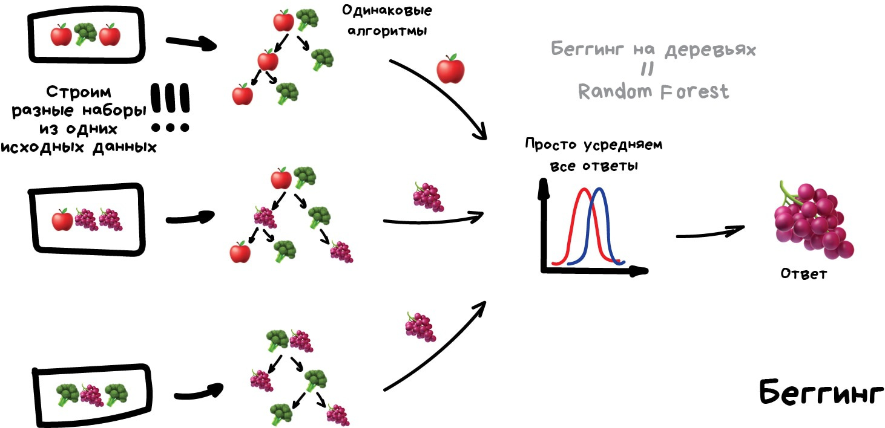
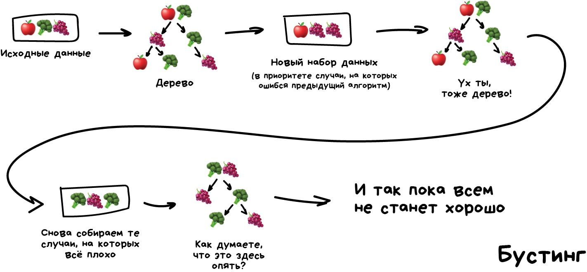
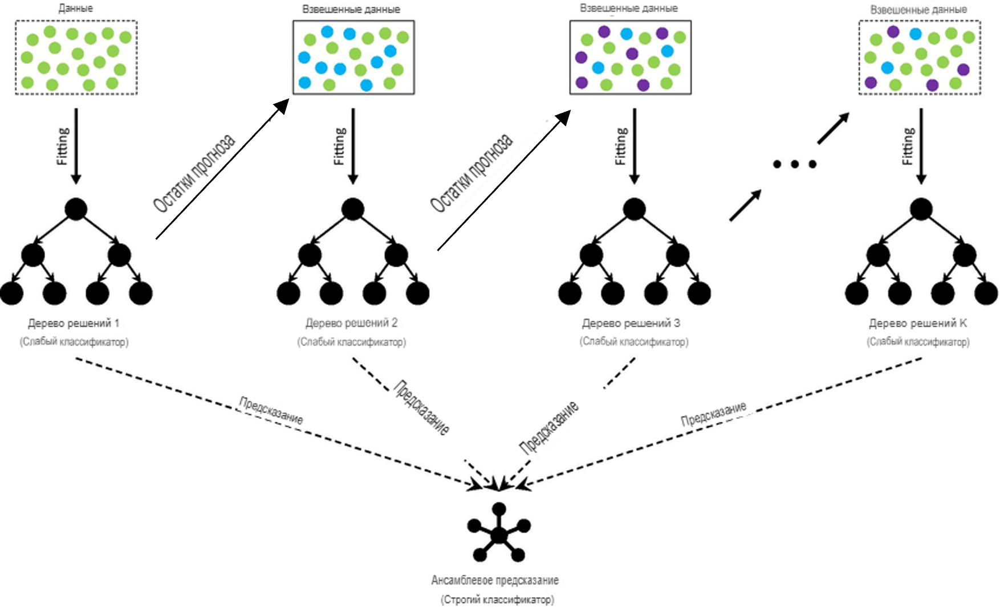

---
jupyter:
  jupytext:
    text_representation:
      extension: .md
      format_name: markdown
      format_version: '1.3'
      jupytext_version: 1.16.4
  kernelspec:
    display_name: Python 3 (ipykernel)
    language: python
    name: python3
---

<!-- #region id="view-in-github" colab_type="text" editable=true slideshow={"slide_type": "slide"} -->
# Лекция 12: Ансамблевые методы в машинном обучении

МГТУ им. Н.Э. Баумана

Красников Александр Сергеевич

https://github.com/askras/bmstu_machinelearning/

2024
<!-- #endregion -->

<!-- #region id="cfdfad14" editable=true slideshow={"slide_type": "slide"} -->
## Ансамблевые методы

**Ансамблевые методы** — это подход в машинном обучении, при котором несколько моделей используются совместно для улучшения общей производительности и устойчивости предсказаний. Основная идея заключается в том, что объединение нескольких моделей может компенсировать ошибки отдельных моделей и снизить риск переобучения.
<!-- #endregion -->

<!-- #region id="33fddc9a" editable=true slideshow={"slide_type": "slide"} -->
## Бэггинг (Bootstrap Aggregating)

**Бэггинг** — это метод ансамблевого обучения, направленный на снижение дисперсии модели и повышение устойчивости предсказаний. Он достигается путем обучения нескольких моделей на различных подвыборках данных и последующего объединения их предсказаний.
<!-- #endregion -->

<!-- #region id="f584326b" editable=true slideshow={"slide_type": "subslide"} -->
### Алгоритм бэггинга

1. **Создание бутстрап-выборок**:
   - Из исходного набора данных размером $ N $ создаются $ B $ подвыборок такого же размера.
   - Каждая подвыборка формируется методом бутстрапа: случайный выбор элементов из исходного набора с возвращением.
   - В результате каждая бутстрап-выборка содержит некоторые повторяющиеся наблюдения и, возможно, пропущенные из исходного набора.

2. **Обучение базовых моделей**:
   - На каждом бутстрап-наборе обучается отдельная базовая модель.
   - Модели могут быть одного типа (гомогенные) или разных типов (гетерогенные).

3. **Объединение предсказаний**:
   - Для новых данных предсказания базовых моделей объединяются.
   - В задачах классификации часто используется голосование большинством (*majority voting*).
   - В задачах регрессии предсказания усредняются.
<!-- #endregion -->

<!-- #region id="Zki3JIekGnxg" editable=true slideshow={"slide_type": "subslide"} -->

<!-- #endregion -->

<!-- #region id="6dbda6d4" editable=true slideshow={"slide_type": "subslide"} -->
#### **Преимущества бэггинга:**

- **Снижение дисперсии**: Усреднение предсказаний нескольких моделей уменьшает разброс и делает модель более устойчивой.
- **Устойчивость к переобучению**: За счет разнообразия базовых моделей снижается риск переобучения.
- **Простота параллелизации**: Обучение базовых моделей и генерация предсказаний могут выполняться параллельно.
<!-- #endregion -->

<!-- #region id="16d08475" editable=true slideshow={"slide_type": "subslide"} -->
## **Объединение различных моделей в один ансамбль**

Помимо использования одинаковых базовых моделей, бэггинг позволяет объединять различные алгоритмы в одном ансамбле. Это может привести к улучшению производительности, поскольку разные модели могут захватывать разные аспекты данных.
<!-- #endregion -->

<!-- #region id="We9DMyKyNPAN" editable=true slideshow={"slide_type": "slide"} -->
### **Пример 1 ансамбля из нейронной сети, SVM и дерева решений**

**VotingClassifier** из библиотеки scikit-learn - это метаклассификатор, который объединяет предсказания нескольких базовых классификаторов путем голосования Он позволяет строить ансамбли моделей классификации для повышения общей производительности и робастности.

Создадим ансамбль **VotingClassifier**, объединяющий:

- **Нейронную сеть**: Способна моделировать сложные нелинейные зависимости.
- **Метод опорных векторов (SVM)**: Эффективен в задачах с четкой разделимостью классов.
- **Дерево решений**: Строит модель классификации в виде древовидной структуры, разбивая пространство признаков на области, соответствующие классам. Легко интерпретируемо и может моделировать нелинейные зависимости.

И сравним его со всеми остальными бэггинговыми ансамблевыми алгоритмами из sklearn.

<!-- #endregion -->

<!-- #region id="65bd8161" editable=true slideshow={"slide_type": "subslide"} -->
#### **Шаг 1: Импорт необходимых библиотек**
<!-- #endregion -->

```python id="d49fab18" editable=true slideshow={"slide_type": "fragment"}
import numpy as np
import pandas as pd
from sklearn.datasets import load_breast_cancer
from sklearn.model_selection import train_test_split
from sklearn.preprocessing import StandardScaler

# Базовые модели
from sklearn.neural_network import MLPClassifier
from sklearn.svm import SVC
from sklearn.tree import DecisionTreeClassifier
from sklearn.linear_model import LogisticRegression
from sklearn.neighbors import KNeighborsClassifier
from sklearn.naive_bayes import GaussianNB

# Бэггинговые ансамблевые модели
from sklearn.ensemble import (
    VotingClassifier, RandomForestClassifier,
    BaggingClassifier, ExtraTreesClassifier, RandomTreesEmbedding
)

from sklearn.pipeline import make_pipeline
from sklearn.metrics import accuracy_score
import matplotlib.pyplot as plt
```

<!-- #region id="22198145" editable=true slideshow={"slide_type": "subslide"} -->
#### Шаг 2: Загрузка и подготовка данных

Будем использовать датасет рака молочной железы для задачи бинарной классификации.
<!-- #endregion -->

```python id="692e5043" editable=true slideshow={"slide_type": "fragment"}
# Загрузка данных
data = load_breast_cancer()
X = data.data
y = data.target

# Разделение данных на обучающую и тестовую выборки
X_train, X_test, y_train, y_test = train_test_split(X, y, test_size=0.2, random_state=42)

# Стандартизация признаков для моделей, чувствительных к масштабу
scaler = StandardScaler()
X_train_scaled = scaler.fit_transform(X_train)
X_test_scaled = scaler.transform(X_test)
```

<!-- #region id="c0b03503" editable=true slideshow={"slide_type": "subslide"} -->
#### Шаг 3: Определение базовых моделей
<!-- #endregion -->

```python id="881ad4a1" editable=true slideshow={"slide_type": "fragment"}
# Нейронная сеть
mlp = MLPClassifier(hidden_layer_sizes=(50,), max_iter=1000, random_state=42)

# Метод опорных векторов
svc = SVC(kernel='rbf', probability=True, random_state=42)

# Решающее дерево
dt = DecisionTreeClassifier(random_state=42)
```

<!-- #region id="50ffc2e2" editable=true slideshow={"slide_type": "subslide"} -->
#### Шаг 4: Определение бэггинговых ансамблевых моделей
<!-- #endregion -->

```python id="e789a051" editable=true slideshow={"slide_type": "fragment"}
rf = RandomForestClassifier(n_estimators=100, random_state=42)
bagging = BaggingClassifier(estimator=DecisionTreeClassifier(), n_estimators=100, random_state=42)
et = ExtraTreesClassifier(n_estimators=100, random_state=42)

# Использование RandomTreesEmbedding с логистической регрессией
rte = RandomTreesEmbedding(n_estimators=100, random_state=42)
lr = LogisticRegression(max_iter=1000, random_state=42)
pipeline = make_pipeline(rte, lr)

# Ансамбль с мягким голосованием (VotingClassifier)
voting = VotingClassifier(
    estimators=[('mlp', mlp), ('svc', svc), ('rf', rf)],
    voting='soft'  # Используем вероятности классов
)

# Словарь всех моделей
models = {
    'Нейронная сеть (MLP)': mlp,
    'SVM': svc,
    'Дерево решений': dt,
    'Случайный лес': rf,
    'Бэггинг': bagging,
    'Extra Trees': et,
    'Random Trees Embedding': pipeline,
    'Ансамбль (Voting)': voting
}
```

<!-- #region id="97c4cca0" editable=true slideshow={"slide_type": "subslide"} -->
#### Шаг 5: Обучение моделей
<!-- #endregion -->

```python colab={"base_uri": "https://localhost:8080/"} id="198ee43f" outputId="7302aaf5-8f1f-4e32-9275-1302fa9d7550" editable=true slideshow={"slide_type": "fragment"}
for name, model in models.items():
    print(f"Обучение модели {name}...")
    if name in ['Нейронная сеть (MLP)', 'SVM', 'Ансамбль (Voting)']:
      model.fit(X_train_scaled, y_train)
    elif name == 'Random Trees Embedding':
      model.fit(X_train, y_train)
    else:
      model.fit(X_train, y_train)
```

<!-- #region id="0b6fab62" editable=true slideshow={"slide_type": "subslide"} -->
#### Шаг 6: Предсказание и оценка моделей
<!-- #endregion -->

```python colab={"base_uri": "https://localhost:8080/"} id="8d4d59eb" outputId="221dcc45-a6d5-462e-fd06-1b1385f89a0b" editable=true slideshow={"slide_type": "fragment"}
# Оценка точности моделей
accuracies = {}
for name, model in models.items():
    if name in ['Нейронная сеть (MLP)', 'SVM', 'Ансамбль (Voting)']:
        y_pred = model.predict(X_test_scaled)
    else:
        y_pred = model.predict(X_test)
    accuracy = accuracy_score(y_test, y_pred)
    accuracies[name] = accuracy

# Вывод результатов
print("\nТочность моделей:")
for name, accuracy in accuracies.items():
    print(f"{name}: {accuracy:.4f}")
```

<!-- #region id="b93ffb0e" editable=true slideshow={"slide_type": "subslide"} -->
#### Шаг 7: Визуализация производительности моделей
<!-- #endregion -->

```python colab={"base_uri": "https://localhost:8080/", "height": 643} id="3f68ebf0" outputId="7cc0fd14-d0bc-4ed0-996e-28ec2b8dd98a" editable=true slideshow={"slide_type": "fragment"}
# Построение столбчатой диаграммы точности моделей
plt.figure(figsize=(12, 6))
bars = plt.bar(accuracies.keys(), accuracies.values(), color=plt.cm.Paired(range(len(accuracies))))
plt.title('Сравнение точности базовых и бэггинговых ансамблевых моделей')
plt.ylabel('Точность')
plt.ylim([0.8, 1.0])

# Отображение значений точности над столбцами
for bar, accuracy in zip(bars, accuracies.values()):
    yval = bar.get_height()
    plt.text(bar.get_x() + bar.get_width()/2.0, yval + 0.003, f'{accuracy:.4f}', ha='center', va='bottom')

plt.xticks(rotation=45)
plt.show()
```

<!-- #region id="HHGslph1RDWn" editable=true slideshow={"slide_type": "subslide"} -->
В нашем эксперименте точность ансамбля совпадает с точностью лучшей модели (SVM). Это может быть вызвано доминированием сильной модели, недостаточным разнообразием моделей, простым механизмом объединения, коррелированными ошибками или равными весами моделей.


<!-- #endregion -->

<!-- #region id="wvap67EDSg9Y" editable=true slideshow={"slide_type": "subslide"} -->
#### Что можно сделать:

1. Увеличить разнообразие моделей (разные алгоритмы, параметры, подвыборки данных, признаки).
2. Изменить веса моделей пропорционально их точности.
3. Использовать продвинутые методы ансамблирования, например такие как стекинг.
4. Проанализировать ошибки моделей и улучшить их.
5. Исключить слабые модели из ансамбля.
6. Настроить гиперпараметры базовых моделей.
7. Увеличить количество базовых моделей.
<!-- #endregion -->

<!-- #region id="A-7PFxyZT2MK" editable=true slideshow={"slide_type": "slide"} -->
### Пример 2 ансамбля 

Мы будем использовать датасет о диабетиках [**Pima Indians**](https://www.kaggle.com/datasets/uciml/pima-indians-diabetes-database).
<!-- #endregion -->

<!-- #region id="SHXm8xK8UayZ" editable=true slideshow={"slide_type": "subslide"} -->
##### Шаг 1: Загрузка и подготовка данных
<!-- #endregion -->

```python id="1WwcqnV7T4xN" editable=true slideshow={"slide_type": "fragment"}
# Загрузим датасет Pima Indians Diabetes
# Датасет доступен по ссылке: https://raw.githubusercontent.com/jbrownlee/Datasets/master/pima-indians-diabetes.data.csv
# Зададим имена столбцов для удобства
columns = ['Pregnancies', 'Glucose', 'BloodPressure', 'SkinThickness',
           'Insulin', 'BMI', 'DiabetesPedigreeFunction', 'Age', 'Outcome']

# Считываем данные
data = pd.read_csv('https://raw.githubusercontent.com/jbrownlee/Datasets/master/pima-indians-diabetes.data.csv',
                   names=columns)

# Разделение данных на признаки и целевую переменную
X = data.drop('Outcome', axis=1)
y = data['Outcome']

# Разделение данных на обучающую и тестовую выборки
X_train, X_test, y_train, y_test = train_test_split(X, y, test_size=0.2, stratify=y, random_state=42)

# Стандартизация признаков
scaler = StandardScaler()
X_train_scaled = scaler.fit_transform(X_train)
X_test_scaled = scaler.transform(X_test)
```

<!-- #region id="TjHoHoq1Ue2V" editable=true slideshow={"slide_type": "subslide"} -->
##### Шаг 2: Определение и обучение базовых моделей
<!-- #endregion -->

```python id="bBTA5xfKUPOW" editable=true slideshow={"slide_type": "fragment"}
# Создаем экземпляры моделей
lr = LogisticRegression(max_iter=1000, random_state=42)
knn = KNeighborsClassifier(n_neighbors=5)
dt = DecisionTreeClassifier(random_state=42)
svm = SVC(kernel='rbf', probability=True, random_state=42)
nb = GaussianNB()

# Обучение каждой модели
lr.fit(X_train_scaled, y_train)
knn.fit(X_train_scaled, y_train)
dt.fit(X_train, y_train)  # Дерево решений не чувствительно к масштабу
svm.fit(X_train_scaled, y_train)
nb.fit(X_train_scaled, y_train);
```

<!-- #region id="lRRokOVmVKmy" editable=true slideshow={"slide_type": "subslide"} -->
##### Шаг 3: Оценка точности базовых моделей
<!-- #endregion -->

```python colab={"base_uri": "https://localhost:8080/"} id="BRGjVzgdVLMd" outputId="655523d4-76b6-4f2a-8230-f1e4aa8fa7bc" editable=true slideshow={"slide_type": "fragment"}
# Логистическая регрессия
y_pred_lr = lr.predict(X_test_scaled)
acc_lr = accuracy_score(y_test, y_pred_lr)
print(f'Точность Логистической регрессии: {acc_lr:.4f}')

# KNN
y_pred_knn = knn.predict(X_test_scaled)
acc_knn = accuracy_score(y_test, y_pred_knn)
print(f'Точность KNN: {acc_knn:.4f}')

# Дерево решений
y_pred_dt = dt.predict(X_test)
acc_dt = accuracy_score(y_test, y_pred_dt)
print(f'Точность Дерева решений: {acc_dt:.4f}')

# SVM
y_pred_svm = svm.predict(X_test_scaled)
acc_svm = accuracy_score(y_test, y_pred_svm)
print(f'Точность SVM: {acc_svm:.4f}')

# Наивный Байес
y_pred_nb = nb.predict(X_test_scaled)
acc_nb = accuracy_score(y_test, y_pred_nb)
print(f'Точность Наивного Байеса: {acc_nb:.4f}')
```

<!-- #region id="laGhv9Z1VdgH" editable=true slideshow={"slide_type": "subslide"} -->
##### Шаг 4: Создание и обучение ансамбля VotingClassifier
<!-- #endregion -->

```python colab={"base_uri": "https://localhost:8080/", "height": 121} id="_4pmEG25VtbG" outputId="2d96c48e-faa8-46be-a0b2-6fba248a127b" editable=true slideshow={"slide_type": "fragment"}
# Создаем ансамбль с мягким голосованием
voting_clf = VotingClassifier(
    estimators=[('lr', lr), ('knn', knn), ('dt', dt), ('svm', svm), ('nb', nb)],
    voting='soft'  # Используем вероятности предсказаний
)

# Обучение ансамбля
voting_clf.fit(X_train_scaled, y_train)
```

<!-- #region id="LLMH-wI8Vv1-" editable=true slideshow={"slide_type": "subslide"} -->
##### Шаг 5: Оценка точности ансамбля
<!-- #endregion -->

```python colab={"base_uri": "https://localhost:8080/"} id="JWgnS_BDVwPd" outputId="7d4dcbbf-f742-4bec-9fbd-c8beb74395da" editable=true slideshow={"slide_type": "fragment"}
# Оценка ансамбля
y_pred_ensemble = voting_clf.predict(X_test_scaled)
acc_ensemble = accuracy_score(y_test, y_pred_ensemble)
print(f'Точность Ансамбля с голосованием: {acc_ensemble:.4f}')

# Сравнение точностей
models = ['Логистическая регрессия', 'KNN', 'Дерево решений', 'SVM', 'Наивный Байес', 'Ансамбль VotingClassifier']
accuracies = [acc_lr, acc_knn, acc_dt, acc_svm, acc_nb, acc_ensemble]
```

<!-- #region id="3WUM4MEcV7Zt" editable=true slideshow={"slide_type": "subslide"} -->
##### Шаг 6: Визуализация результатов
<!-- #endregion -->

```python colab={"base_uri": "https://localhost:8080/", "height": 653} id="lcSzXfl8SRes" outputId="776a122b-6093-40c2-f5b4-4931455f7666" editable=true slideshow={"slide_type": "fragment"}
# Построение столбчатой диаграммы точности моделей
plt.figure(figsize=(12, 6))
bars = plt.bar(range(len(models)), accuracies, color=plt.cm.Paired(range(len(models))))
plt.title('Сравнение точности моделей на датасете Pima Indians Diabetes')
plt.ylabel('Точность')
plt.ylim([0.60, 0.85])

# Отображение названий моделей на оси x
plt.xticks(range(len(models)), models, rotation=45)

# Отображение значений точности над столбцами
for bar, accuracy in zip(bars, accuracies):
    yval = bar.get_height()
    plt.text(bar.get_x() + bar.get_width()/2.0, yval + 0.005, f'{accuracy:.4f}', ha='center', va='bottom')

plt.show()
```

<!-- #region id="qcwzg8clXHtV" editable=true slideshow={"slide_type": "subslide"} -->
- Ансамбль с голосованием показал точность 0.7662, что выше, чем у каждой из базовых моделей.
- Из базовых моделей SVM показал лучшую точность 0.7532.
- Ансамбль смог объединить преимущества различных моделей и улучшить общую точность.
- KNN и Наивный Байес продемонстрировали самую низкую точность среди базовых моделей.
- Логистическая регрессия и Дерево решений показали средние результаты.
<!-- #endregion -->

<!-- #region id="ec404f69" editable=true slideshow={"slide_type": "subslide"} -->
## Выводы


- **Бэггинг** снижает дисперсию модели и повышает устойчивость предсказаний.
- **Объединение разнородных моделей** может улучшить общую производительность, поскольку разные алгоритмы могут улавливать различные аспекты данных.
- **Ансамбль** с мягким голосованием (soft voting) использует вероятности предсказаний, что часто приводит к более точным результатам, чем жесткое голосование (hard voting).
- **Комбинирование моделей** позволяет компенсировать слабости отдельных алгоритмов за счет сильных сторон других.

**Дополнительные методы:**

- **Стекинг (Stacking):** Более сложный ансамблевый метод, где предсказания базовых моделей используются в качестве признаков для мета-модели.
- **Багоутинг (Bagging Out):** Техника увеличения размера обучающей выборки путем включения дополнительно сгенерированных или синтетических данных.
<!-- #endregion -->

<!-- #region id="a478f2d2" editable=true slideshow={"slide_type": "subslide"} -->
## Градиентный бустинг (Gradient Boosted)

**Градиентный бустинг** **(Gradient Boosting)** - это эффективный метод машинного обучения, который объединяет ансамбль слабых предсказывающих моделей в одну сильную модель. Он широко применяется на практике и часто показывает превосходные результаты.

В основе градиентного бустинга лежит идея **бустинга** - итеративного процесса построения ансамбля моделей. На каждой итерации новая модель обучается так, чтобы исправлять ошибки предыдущих моделей Таким образом, каждая следующая модель фокусируется на более сложных примерах, которые не удалось правильно классифицировать ранее.
<!-- #endregion -->

<!-- #region id="bo72QTf4a75B" editable=true slideshow={"slide_type": "subslide"} -->

<!-- #endregion -->

<!-- #region id="DynYSuRHd21d" editable=true slideshow={"slide_type": "subslide"} -->
### Градиентный спуск

Ключевой особенностью градиентного бустинга является использование **градиентного спуска** для минимизации функции потерь. Вместо того, чтобы напрямую изменять веса сложных примеров, как в AdaBoost, градиентный бустинг обучает новые модели на остатках (ошибках) предыдущих На каждой итерации вычисляется антиградиент функции потерь, который указывает направление её наискорейшего убывания. Новая модель стремится предсказать этот антиградиент, тем самым компенсируя ошибки ансамбля.

Благодаря такому подходу градиентный бустинг эффективно обучает ансамбли деревьев решений, превосходя по качеству многие другие методы. Он позволяет строить высокоточные нелинейные модели для задач классификации, регрессии и ранжирования, находя сложные закономерности в данных
<!-- #endregion -->

<!-- #region id="RVKA6Cf9c9Bi" editable=true slideshow={"slide_type": ""} -->

<!-- #endregion -->

<!-- #region id="CtI7sbwkooNl" editable=true slideshow={"slide_type": "subslide"} -->
### **Постановка задачи**


Рассмотрим задачу регрессии, где дана обучающая выборка из $N$ примеров:

$\{(x_i, y_i)\}_{i=1}^N$,

где $x_i$ - вектор признаков, $y_i$ - целевая переменная для $i$-го примера.


Цель - построить модель $F(x)$, которая для заданного $x$ будет предсказывать значение $y$, минимизируя некоторую функцию потерь $L(y, F(x))$, усредненную по всей выборке.
<!-- #endregion -->

<!-- #region id="_geOG09qoDzS" editable=true slideshow={"slide_type": "subslide"} -->
### Алгоритм градиентного бустинга

Градиентный бустинг строит ансамблевую модель $F_M(x)$ в виде суммы $M$ базовых моделей (чаще всего - деревьев решений):

$F_M(x) = \sum_{m=1}^M f_m(x)$

Модели $f_m(x)$ обучаются последовательно, шаг за шагом приближая ансамбль к оптимуму.
<!-- #endregion -->

<!-- #region id="l-V_2D4oo_ST" editable=true slideshow={"slide_type": ""} -->
- **Шаг 1.** Инициализируем первое приближение модели константой, минимизирующей функцию потерь:

  $F_0(x) = \arg\min_\gamma \sum_{i=1}^N L(y_i, \gamma)$

- **Шаг 2.** Для каждой итерации $m$ от 1 до $M$:

  - a) Вычисляем *псевдо-остатки* - отрицательный градиент функции потерь для текущей модели $F_{m-1}(x)$:

  $r_{im} = -\left[\frac{\partial L(y_i, F(x_i))}{\partial F(x_i)}\right]_{F(x)=F_{m-1}(x)}$

  - б) Обучаем новую базовую модель $f_m(x)$ на выборке $\{(x_i, r_{im})\}_{i=1}^N$, минимизируя среднеквадратичную ошибку.

  - в) Находим оптимальный коэффициент $\gamma_m$ для $f_m(x)$:

   $\gamma_m = \arg\min_\gamma \sum_{i=1}^N L(y_i, F_{m-1}(x_i) + \gamma f_m(x_i))$

  - г) Обновляем ансамбль, добавляя новую модель с коэффициентом $\nu \gamma_m$:

   $F_m(x) = F_{m-1}(x) + \nu \gamma_m f_m(x)$,

   где $\nu$ - скорость обучения (learning rate), $0 < \nu \leq 1$.

- **Шаг 3.** Возвращаем итоговую модель $F_M(x)$.
<!-- #endregion -->

<!-- #region id="GTt3pw3Snw_X" editable=true slideshow={"slide_type": "subslide"} -->
### Ключевые принципы градиентного бустинга:
- Последовательное обучение базовых моделей, каждая из которых приближает ансамбль к оптимуму.
- Использование градиента функции потерь для направления обучения новых моделей.
- Контроль скорости обучения для предотвращения переобучения.

Такой подход позволяет эффективно комбинировать множество относительно простых моделей в единый мощный ансамбль, добиваясь высокого качества предсказаний.
<!-- #endregion -->

<!-- #region id="3b7909e8" editable=true slideshow={"slide_type": "subslide"} -->
#### Специфика для классификации

В классификации предсказание $ F(\mathbf{x}) $ обычно соответствует логарифму отношения шансов (log odds):

$
F(\mathbf{x}) = \log\left( \frac{P(y = 1 \mid \mathbf{x})}{P(y = 0 \mid \mathbf{x})} \right).
$

А вероятность принадлежности классу $ y = 1 $ вычисляется как:

$
P(y = 1 \mid \mathbf{x}) = \frac{1}{1 + e^{-F(\mathbf{x})}}.
$

**Градиент функции потерь** для логистической потери:

$
\frac{\partial L(y_i, F(\mathbf{x}_i))}{\partial F(\mathbf{x}_i)} = - y'_i \frac{2}{1 + e^{2 y'_i F(\mathbf{x}_i)}},
$

где $ y'_i = 2 y_i - 1 $.

**Негативный градиент**:

$
r_{im} = y'_i - \frac{2 y'_i}{1 + e^{2 y'_i F_{m-1}(\mathbf{x}_i)}} = y'_i - \tanh\left(y'_i F_{m-1}(\mathbf{x}_i)\right).
$

<!-- #endregion -->

<!-- #region id="ff250dc6" editable=true slideshow={"slide_type": "subslide"} -->
### **Реализация алгоритма**

#### **Псевдокод алгоритма**

```plaintext
Инициализировать модель F₀(x)

Для m от 1 до M:
    Вычислить псевдо-ответы r_i:
        r_i = -[∂L(y_i, F(x_i)) / ∂F(x_i)] при F(x) = F₍ₘ₋₁₎(x)
    Обучить базовую модель fₘ(x) на данных (x_i, r_i)
    Найти оптимальный шаг γₘ:
        γₘ = argmin_γ Σ L(y_i, F₍ₘ₋₁₎(x_i) + γ fₘ(x_i))
    Обновить модель:
        Fₘ(x) = F₍ₘ₋₁₎(x) + ν γₘ fₘ(x)
```
<!-- #endregion -->

<!-- #region id="b59f9c83" editable=true slideshow={"slide_type": "subslide"} -->
#### **Подробности реализации**

- **Выбор функции потерь $ L $:** Для задачи регрессии часто используется среднеквадратичная ошибка (MSE):

  $
  L(y, F(x)) = \frac{1}{2}(y - F(x))^2.
  $

- **Вычисление негативного градиента:**

  Для MSE:

  $
  r_{im} = y_i - F_{m-1}(x_i).
  $

- **Обучение базовой модели:** Обычно используются деревья решений с небольшой глубиной, чтобы избежать переобучения.

- **Шаг обучения $ \nu $:** Малые значения $ \nu $ (например, 0.1) делают обучение более стабильным, но требуют большего числа шагов $ M $.
<!-- #endregion -->

<!-- #region id="e77eb6ae" editable=true slideshow={"slide_type": "subslide"} -->
### **Пример реализации на Python**

Ниже представлен пример реализации градиентного бустинга для задачи регрессии с использованием деревьев решений.
<!-- #endregion -->

```python id="19aa3fb2" editable=true slideshow={"slide_type": "subslide"}
import numpy as np
from sklearn.tree import DecisionTreeRegressor

class GradientBoostingRegressor:
    def __init__(self, n_estimators=100, learning_rate=0.1,
                 max_depth=3, min_samples_split=2, min_samples_leaf=1):
        self.n_estimators = n_estimators        # Число базовых моделей
        self.learning_rate = learning_rate      # Коэффициент скорости обучения ν
        self.max_depth = max_depth              # Максимальная глубина дерева
        self.min_samples_split = min_samples_split  # Минимальное число образцов для разбиения
        self.min_samples_leaf = min_samples_leaf    # Минимальное число образцов в листе
        self.trees = []                         # Список базовых моделей

    def fit(self, X, y):
        # Инициализация начального предсказания средним значением целевой переменной
        self.F0 = np.mean(y)
        self.F = np.full(shape=y.shape, fill_value=self.F0, dtype=np.float64)

        for m in range(self.n_estimators):
            # Вычисление псевдо-ответов (негативный градиент)
            residuals = y - self.F

            # Обучение базового регрессора на псевдо-ответах
            tree = DecisionTreeRegressor(
                max_depth=self.max_depth,
                min_samples_split=self.min_samples_split,
                min_samples_leaf=self.min_samples_leaf
            )
            tree.fit(X, residuals)

            # Обновление предсказаний с учетом алгоритма
            update = self.learning_rate * tree.predict(X)
            self.F += update

            # Сохранение текущего дерева
            self.trees.append(tree)

    def predict(self, X):
        # Начальное предсказание
        y_pred = np.full(shape=(X.shape[0],), fill_value=self.F0, dtype=np.float64)

        # Суммирование предсказаний базовых моделей
        for tree in self.trees:
            y_pred += self.learning_rate * tree.predict(X)

        return y_pred
```

<!-- #region id="5c63bc1d" editable=true slideshow={"slide_type": "subslide"} -->
### **Пример использования**
<!-- #endregion -->

```python colab={"base_uri": "https://localhost:8080/", "height": 447} id="12afc23d" outputId="eb5454a9-a2f0-4485-d2eb-a5af75763502" editable=true slideshow={"slide_type": ""}
import numpy as np
from sklearn.model_selection import train_test_split
from sklearn.metrics import mean_squared_error
import matplotlib.pyplot as plt

# Генерация синтетических данных
def generate_data(n_samples=1000):
    X = np.linspace(0, 10, n_samples)
    y = np.sin(X) + np.random.normal(0, 0.5, n_samples)
    return X.reshape(-1, 1), y

# Генерируем данные
X, y = generate_data()

# Разбиваем на обучающую и тестовую выборки
X_train, X_test, y_train, y_test = train_test_split(X, y, test_size=0.2)

# Создаем и обучаем модель
model = GradientBoostingRegressor(n_estimators=200, learning_rate=0.1, max_depth=3)
model.fit(X_train, y_train)

# Предсказываем на тестовых данных
y_pred = model.predict(X_test)

# Оцениваем модель
mse = mean_squared_error(y_test, y_pred)
print(f"Mean Squared Error: {mse:.4f}")

# Визуализация результатов
plt.scatter(X_test, y_test, s=20, label='Истинные значения')
plt.scatter(X_test, y_pred, s=20, label='Предсказания')
plt.legend()
plt.show()
```

<!-- #region id="bc5e1b2c" editable=true slideshow={"slide_type": "subslide"} -->
### Дополнительные замечания:

Алгоритмы градиентного бустинга **не ограничены** использованием только деревьев решений в качестве базовых моделей. Тем не менее, на практике именно деревья решений являются наиболее распространенным выбором для базовых моделей в градиентном бустинге. Есть несколько причин, почему деревья решений особенно подходящи для этой задачи:

1. **Универсальность и гибкость**: Деревья решений способны моделировать сложные нелинейные зависимости между признаками и целевой переменной. Они автоматически учитывают взаимодействия между признаками без необходимости их явного задания.

2. **Устойчивость к типам данных**: Деревья решений могут работать с разными типами данных, включая числовые и категориальные признаки. Это делает их универсальным инструментом для работы с разнообразными наборами данных.

3. **Не требуются предварительная обработка данных**: В отличие от многих других моделей, деревья решений не требуют нормализации или стандартизации признаков. Они также могут справляться с пропущенными значениями в данных.

4. **Локальность и интерпретируемость**: Каждое разделение в дереве основано на простых правилах принятия решений (например, $ x_j < c $), что делает модель более интерпретируемой и понятной.

5. **Вычислительная эффективность**: Обучение неглубоких деревьев (столпов) относительно быстро и эффективно по сравнению с более сложными моделями. Это особенно важно в контексте градиентного бустинга, где требуется обучить множество базовых моделей.

6. **Стабильность и способность к обобщению**: Неглубокие деревья с ограниченной глубиной хорошо обобщают данные и менее склонны к переобучению по сравнению с глубокими деревьями.
<!-- #endregion -->

<!-- #region id="deb3b189" editable=true slideshow={"slide_type": "subslide"} -->
### Почему не используются другие модели?

Хотя теоретически градиентный бустинг может быть применен с любыми дифференцируемыми базовыми моделями, на практике использование других моделей может быть менее эффективным по следующим причинам:

- **Линейные модели**: Они не способны захватывать сложные нелинейные зависимости в данных, что ограничивает их способность улучшать предсказания на каждом шаге бустинга.

- **Нейронные сети**: Хотя они мощные и гибкие, обучение нейронных сетей требует много ресурсов и времени. В контексте градиентного бустинга, где нужно обучать множество базовых моделей, это становится неэффективным.

- **k-ближайших соседей и другие алгоритмы**: Некоторые алгоритмы не подходят для использования в качестве базовых моделей в бустинге из-за их характеристик (например, ненадежность к шуму, высокая вычислительная сложность).
<!-- #endregion -->

<!-- #region id="a474c39e" editable=true slideshow={"slide_type": "subslide"} -->
### Математическое обоснование

В процессе градиентного бустинга мы стремимся минимизировать функцию потерь путем приближения негативного градиента ошибки на каждом шаге. Деревья решений, особенно **деревья решений с небольшой глубиной** (так называемые "столпы" или "пни"), являются идеальными функциями для приближения произвольных функций, включая негативные градиенты.

Деревья решений разбивают пространство признаков на регионы и присваивают каждому региону постоянное значение. Это позволяет эффективно аппроксимировать сложные функции путем последовательного добавления таких регионов.
<!-- #endregion -->

<!-- #region id="c0c0a34d" editable=true slideshow={"slide_type": "subslide"} -->
### Преимущества деревьев решений в градиентном бустинге

- **Способность к точному приближению градиентов**: Деревья решений могут точно моделировать структуру негативного градиента функции потерь, что ускоряет сходимость алгоритма.

- **Обработка выбросов и шума**: Деревья менее чувствительны к выбросам, что повышает устойчивость модели.

- **Сочетание с градиентным бустингом**: При объединении деревьев решений с градиентным бустингом мы получаем мощный ансамбль, который комбинирует слабые, но разнообразные базовые модели для достижения высокой точности.
<!-- #endregion -->

<!-- #region id="3dd37f45" editable=true slideshow={"slide_type": "subslide"} -->
### Выводы
<!-- #endregion -->

<!-- #region id="3e6b61f2" editable=true slideshow={"slide_type": ""} -->
Хотя градиентный бустинг теоретически может использовать любые дифференцируемые базовые модели, на практике деревья решений являются наиболее подходящим выбором из-за их гибкости, эффективности и способности приближать сложные функции. Их особенности идеально сочетаются с идеей градиентного бустинга, позволяя эффективно минимизировать функцию потерь и строить мощные предиктивные модели.
<!-- #endregion -->

<!-- #region id="4f947969" editable=true slideshow={"slide_type": "slide"} -->
## Пример бустинга других моделей не на основе деревьев

Градиентный бустинг обычно ассоциируется с использованием деревьев решений в качестве базовых моделей (weak learners). Однако, в теории, **градиентный бустинг может использовать любые дифференцируемые модели** в качестве базовых алгоритмов. 
<!-- #endregion -->

<!-- #region editable=true slideshow={"slide_type": "subslide"} -->
### Градиентный бустинг с моделью линейной регрессии

Мы реализуем градиентный бустинг для задачи регрессии, используя **линейную регрессию** в качестве базового алгоритма. Для демонстрации создадим синтетические данные с нелинейной зависимостью.

<!-- #endregion -->

<!-- #region id="5b637552" editable=true slideshow={"slide_type": "subslide"} -->
#### Шаг 1: Импорт необходимых библиотек
<!-- #endregion -->

```python id="076a73f1" editable=true slideshow={"slide_type": "fragment"}
import numpy as np
import matplotlib.pyplot as plt
from sklearn.datasets import fetch_california_housing
from sklearn.linear_model import LinearRegression
from sklearn.neighbors import KNeighborsRegressor
from sklearn.metrics import mean_squared_error
from sklearn.model_selection import train_test_split
```

<!-- #region id="ac0163e8" editable=true slideshow={"slide_type": "subslide"} -->
#### Шаг 2: Загрузка данных и формирование обучающей выборки
<!-- #endregion -->

```python id="c694d3ce" editable=true slideshow={"slide_type": "fragment"}
# Загрузка данных
housing = fetch_california_housing()
X = housing.data
y = housing.target

# Разделение данных на обучающую и тестовую выборки
X_train, X_test, y_train, y_test = train_test_split(
    X, y, test_size=0.2, random_state=42)

# Стандартизация признаков
from sklearn.preprocessing import StandardScaler

scaler = StandardScaler()
X_train_scaled = scaler.fit_transform(X_train)
X_test_scaled = scaler.transform(X_test)
```

<!-- #region id="a1460ef6" editable=true slideshow={"slide_type": "subslide"} -->
#### Шаг 3: Реализация градиентного бустинга с линейной регрессией
<!-- #endregion -->

```python id="0c700753" editable=true slideshow={"slide_type": "fragment"}
class GradientBoostingLinearRegressor:
    def __init__(self, n_estimators=100, learning_rate=0.1):
        self.n_estimators = n_estimators          # Число базовых моделей
        self.learning_rate = learning_rate        # Скорость обучения
        self.models = []                          # Список базовых моделей
        self.initial_prediction = None            # Начальное предсказание

    def fit(self, X, y):
        # Инициализация
        self.initial_prediction = np.mean(y)
        residual = y - self.initial_prediction    # Начальные остатки

        # Обучение базовых моделей
        for i in range(self.n_estimators):
            model = LinearRegression()
            model.fit(X, residual)
            prediction = model.predict(X)
            residual -= self.learning_rate * prediction  # Обновление остатков
            self.models.append(model)

    def predict(self, X):
        # Начальное предсказание
        y_pred = np.full(shape=X.shape[0], fill_value=self.initial_prediction)

        # Суммирование предсказаний базовых моделей
        for model in self.models:
            y_pred += self.learning_rate * model.predict(X)

        return y_pred
```

<!-- #region id="8b892e99" editable=true slideshow={"slide_type": "subslide"} -->
#### Шаг 4: Обучение модели и оценка качества
<!-- #endregion -->

```python colab={"base_uri": "https://localhost:8080/"} id="a7963c18" outputId="7d615754-a51b-4fd7-952e-e37236a55248" editable=true slideshow={"slide_type": "fragment"}
# Создание и обучение модели
gb_lr = GradientBoostingLinearRegressor(n_estimators=200, learning_rate=0.025)
gb_lr.fit(X_train, y_train)

# Предсказания
y_pred_gb_lr = gb_lr.predict(X_test)

# Оценка качества
mse_gb_lr = mean_squared_error(y_test, y_pred_gb_lr)
print(f"Mean Squared Error (GB Linear Regression): {mse_gb_lr:.4f}")
```

<!-- #region id="86894b3b" editable=true slideshow={"slide_type": "subslide"} -->
#### Шаг 5: Сравнение с линейной регрессией

Для сравнения обучим обычную линейную регрессию на тех же данных.
<!-- #endregion -->

```python colab={"base_uri": "https://localhost:8080/"} id="0fa67bdd" outputId="72a4ba61-ec68-402b-d3a6-71b99e457f94" editable=true slideshow={"slide_type": "fragment"}
# Обучение обычной линейной регрессии
lr = LinearRegression()
lr.fit(X_train, y_train)
y_pred_lr = lr.predict(X_test)

# Оценка качества
mse_lr = mean_squared_error(y_test, y_pred_lr)
print(f"Mean Squared Error (Linear Regression): {mse_lr:.4f}")
```

<!-- #region id="a89bdefe" editable=true slideshow={"slide_type": "subslide"} -->
#### Шаг 6: Визуализация результатов
<!-- #endregion -->

```python colab={"base_uri": "https://localhost:8080/", "height": 554} id="793da4ef" outputId="4bdc9098-4aa0-4d5e-9a17-9e70c28c856b" editable=true slideshow={"slide_type": "fragment"}
# Выбор подмножества данных для наглядности
sample_indices = range(0, len(y_test), 50)  # Каждый 50-й образец
y_test_sample = y_test[sample_indices]
y_pred_gb_lr_sample = y_pred_gb_lr[sample_indices]
y_pred_lr_sample = y_pred_lr[sample_indices]
indices = list(sample_indices)

# Построение графика
plt.figure(figsize=(14, 7))

# Отображение истинных значений
plt.scatter(indices, y_test_sample, color='blue', alpha=0.8, label='Истинные значения')

# Отображение предсказанных значений ГБ линейной регрессией
plt.scatter(indices, y_pred_gb_lr_sample, color='orange', alpha=0.8, label='Предсказания (GB Linear Regression)')

# Отображение предсказанных значений обычной линейной регрессии
plt.scatter(indices, y_pred_lr_sample, color='green', alpha=0.8, label='Предсказания (Linear Regression)')

# Линии ошибок для ГБ линейной регрессии
for i in range(len(indices)):
    plt.plot([indices[i], indices[i]], [y_test_sample[i], y_pred_gb_lr_sample[i]], color='gray', linewidth=1, alpha=0.6)

# Линии ошибок для обычной линейной регрессии
for i in range(len(indices)):
    plt.plot([indices[i], indices[i]], [y_test_sample[i], y_pred_lr_sample[i]], color='lightgreen', linewidth=1, alpha=0.6)

plt.xlabel('Индекс образца (каждый 50-й образец из тестовой выборки)')
plt.ylabel('Целевое значение')
plt.title('Сравнение истинных и предсказанных значений (GB и обычная линейная регрессия)')
plt.legend()
plt.grid(True)
plt.tight_layout()
plt.show()
```

<!-- #region id="476ad7b5" editable=true slideshow={"slide_type": "subslide"} -->
### Градиентный бустинг с моделью  kNN

Для демонстрации универсальности бустинга, рассмотрим также пример с использованием алгоритма **k-ближайших соседей (kNN)** в качестве базовых моделей.
<!-- #endregion -->

```python id="b811017f" editable=true slideshow={"slide_type": "fragment"}
from sklearn.neighbors import KNeighborsRegressor

class GradientBoostingKNNRegressor:
    def __init__(self, n_estimators=50, learning_rate=0.1, n_neighbors=5):
        self.n_estimators = n_estimators
        self.learning_rate = learning_rate
        self.n_neighbors = n_neighbors
        self.models = []
        self.initial_prediction = None

    def fit(self, X, y):
        self.initial_prediction = np.mean(y)
        residual = y - self.initial_prediction

        for i in range(self.n_estimators):
            model = KNeighborsRegressor(n_neighbors=self.n_neighbors)
            model.fit(X, residual)
            prediction = model.predict(X)
            residual -= self.learning_rate * prediction
            self.models.append(model)

    def predict(self, X):
        y_pred = np.full(shape=X.shape[0], fill_value=self.initial_prediction)

        for model in self.models:
            y_pred += self.learning_rate * model.predict(X)

        return y_pred
```

<!-- #region id="b9a48162" editable=true slideshow={"slide_type": "subslide"} -->
#### Шаг 1: Обучение и оценка модели
<!-- #endregion -->

```python id="0c252b77" outputId="b2df6ff4-8dcb-462e-d49c-44ff449c98ef" editable=true slideshow={"slide_type": "fragment"}
# Создание и обучение модели
gb_knn = GradientBoostingKNNRegressor(n_estimators=100, learning_rate=0.1, n_neighbors=5)
gb_knn.fit(X_train_scaled, y_train)

# Предсказания
y_pred_gb_knn = gb_knn.predict(X_test_scaled)

# Оценка качества
mse_gb_knn = mean_squared_error(y_test, y_pred_gb_knn)
print(f"Mean Squared Error (GB KNN): {mse_gb_knn:.4f}")
```

<!-- #region id="oOS3B577G-eI" editable=true slideshow={"slide_type": "subslide"} -->
#### Шаг 2: Сравнение с обычной моделью KNN
<!-- #endregion -->

```python colab={"base_uri": "https://localhost:8080/"} id="Uhsy2vPBHEff" outputId="276c8a77-829d-47ec-9092-0e533720433c" editable=true slideshow={"slide_type": "fragment"}
# Обучение обычного KNeighborsRegressor
knn = KNeighborsRegressor(n_neighbors=5)
knn.fit(X_train_scaled, y_train)
y_pred_knn = knn.predict(X_test_scaled)

# Оценка качества
mse_knn = mean_squared_error(y_test, y_pred_knn)
print(f"Mean Squared Error (Simple KNN): {mse_knn:.4f}")
```

<!-- #region id="08e9ba14" editable=true slideshow={"slide_type": "subslide"} -->
#### Шаг 3: Визуализация результатов
<!-- #endregion -->

```python id="6f4aee6f" outputId="f868f4dc-7f46-4779-a6a1-96f6f2ac2b01" editable=true slideshow={"slide_type": "fragment"}
# Выбор подмножества данных для наглядности
sample_indices = range(0, len(y_test), 50)  # Каждый 50-й образец
y_test_sample = y_test[sample_indices]
y_pred_gb_knn_sample = y_pred_gb_knn[sample_indices]
y_pred_knn_sample = y_pred_knn[sample_indices]
indices = list(sample_indices)

# Построение графика
plt.figure(figsize=(14, 7))

# Отображение истинных значений
plt.scatter(indices, y_test_sample, color='blue', alpha=0.8, label='Истинные значения')

# Отображение предсказанных значений GB KNN
plt.scatter(indices, y_pred_gb_knn_sample, color='orange', alpha=0.8, label='Предсказания (GB KNN)')

# Отображение предсказанных значений простой KNN
plt.scatter(indices, y_pred_knn_sample, color='green', alpha=0.8, label='Предсказания (Simple KNN)')

# Линии ошибок для GB KNN
for i in range(len(indices)):
    plt.plot([indices[i], indices[i]], [y_test_sample[i], y_pred_gb_knn_sample[i]], color='gray', linewidth=1, alpha=0.6)

# Линии ошибок для простой KNN
for i in range(len(indices)):
    plt.plot([indices[i], indices[i]], [y_test_sample[i], y_pred_knn_sample[i]], color='lightgreen', linewidth=1, alpha=0.6)

plt.xlabel('Индекс образца (каждый 50-й образец из тестовой выборки)')
plt.ylabel('Целевое значение')
plt.title('Сравнение истинных и предсказанных значений (GB KNN и простая KNN)')
plt.legend()
plt.grid(True)
plt.tight_layout()
plt.show()

# Гистограммы ошибок
errors_knn = y_test - y_pred_knn
errors_gb_knn = y_test - y_pred_gb_knn

plt.figure(figsize=(12, 4))
plt.hist(errors_knn, bins=20, alpha=0.5, label='Ошибки Simple KNN', color='green')
plt.hist(errors_gb_knn, bins=20, alpha=0.5, label='Ошибки GB KNN', color='orange')
plt.title('Распределение ошибок')
plt.xlabel('Ошибка')
plt.ylabel('Частота')
plt.legend()
plt.show()
```

<!-- #region id="80b1ed5a" editable=true slideshow={"slide_type": "subslide"} -->
### **Выводы**

На примерах выше мы убедились, что градиентный бустинг может быть реализован с использованием различных базовых моделей, не ограничиваясь деревьями решений. В примерах были использованы линейная регрессия и метод k-ближайших соседей в качестве базовых алгоритмов.

**Основные выводы:**

- **Универсальность бустинга:** Бустинг является универсальным способом улучшения качества моделей путем комбинирования многих базовых алгоритмов.
- **Приближение нелинейных зависимостей:** Даже линейные модели в составе бустинга могут приближать сложные нелинейные зависимости.
- **Выбор базовых моделей:** Тип базовых моделей влияет на эффективность и сходимость алгоритма. Деревья решений часто предпочтительнее из-за их гибкости, но использование других моделей может быть оправдано в определенных случаях.

**Примечание:** Использование других моделей в качестве базовых алгоритмов в градиентном бустинге может быть оправдано в определенных ситуациях, однако деревья решений остаются наиболее популярным выбором из-за их эффективности и возможности приближать сложные зависимости с относительно небольшим числом базовых моделей.
<!-- #endregion -->

<!-- #region id="c1dd7f26" editable=true slideshow={"slide_type": "slide"} -->
## Сравнительный анализ алгоритмов градиентного бустинга: GradientBoostingClassifier, XGBoost, LightGBM
<!-- #endregion -->

```python id="93814758" outputId="b5db26f7-f576-48d9-941d-4163265477ed" editable=true slideshow={"slide_type": "subslide"}
import time
import numpy as np
import matplotlib.pyplot as plt
from sklearn.datasets import load_breast_cancer
from sklearn.model_selection import train_test_split
from sklearn.metrics import accuracy_score
from sklearn.ensemble import GradientBoostingClassifier
import xgboost as xgb
import lightgbm as lgb

# Загрузка данных
data = pd.read_csv('https://raw.githubusercontent.com/akmand/datasets/refs/heads/main/adult.csv')
display(data)

# Предобработка данных
data = data.replace({'?': np.nan}).dropna()
data['income_status'] = (data['income_status'] == '>50K').astype(int)

X = data.drop(['income_status'], axis=1)
y = data['income_status']

# Преобразование категориальных признаков
categorical_features = ['workclass', 'marital_status', 'occupation', 'relationship', 'race', 'gender', 'native_country']
X = pd.get_dummies(X, columns=categorical_features, drop_first=True)

# Разделение на обучающую и тестовую выборки
X_train, X_test, y_train, y_test = train_test_split(X, y, test_size=0.2, random_state=42)

# Словарь для хранения результатов
results = {}

# GradientBoostingClassifier
start_time = time.time()
gbc = GradientBoostingClassifier(n_estimators=100, learning_rate=0.1, max_depth=3, random_state=42)
gbc.fit(X_train, y_train)
training_time_gbc = time.time() - start_time
y_pred_gbc = gbc.predict(X_test)
accuracy_gbc = accuracy_score(y_test, y_pred_gbc)
results['GradientBoostingClassifier'] = {'accuracy': accuracy_gbc, 'training_time': training_time_gbc}

# XGBoost
start_time = time.time()
dtrain = xgb.DMatrix(X_train.values, label=y_train)
dtest = xgb.DMatrix(X_test.values, label=y_test)
params = {'objective': 'binary:logistic', 'eval_metric': 'logloss', 'eta': 0.1, 'max_depth': 3}
num_rounds = 100
bst_xgb = xgb.train(params, dtrain, num_rounds)
training_time_xgb = time.time() - start_time
y_pred_xgb = (bst_xgb.predict(dtest) > 0.5).astype(int)
accuracy_xgb = accuracy_score(y_test, y_pred_xgb)
results['XGBoost'] = {'accuracy': accuracy_xgb, 'training_time': training_time_xgb}

# LightGBM
start_time = time.time()
train_data = lgb.Dataset(X_train, label=y_train)
test_data = lgb.Dataset(X_test, label=y_test, reference=train_data)
params = {'objective': 'binary', 'metric': 'binary_logloss', 'learning_rate': 0.1, 'num_leaves': 31, 'verbose': -1}
num_round = 100
bst_lgb = lgb.train(params, train_data, num_round, valid_sets=[test_data])
training_time_lgb = time.time() - start_time
y_pred_lgb = (bst_lgb.predict(X_test, num_iteration=bst_lgb.best_iteration) > 0.5).astype(int)
accuracy_lgb = accuracy_score(y_test, y_pred_lgb)
results['LightGBM'] = {'accuracy': accuracy_lgb, 'training_time': training_time_lgb}

# Построение графиков
models = list(results.keys())
accuracies = [results[model]['accuracy'] for model in models]
training_times = [results[model]['training_time'] for model in models]

colors = ['#1f77b4', '#ff7f0e', '#2ca02c', '#d62728']  # Цвета для столбиков

plt.figure(figsize=(10, 5))
bars = plt.bar(models, accuracies, color=colors)
for i, bar in enumerate(bars):
    plt.text(bar.get_x() + bar.get_width() / 2, bar.get_height(), f'{accuracies[i]:.4f}', ha='center', va='bottom')
plt.title('Точность моделей')
plt.xlabel('Модель')
plt.ylabel('Точность')
plt.ylim(0.8, 0.9)
plt.xticks(rotation=45)
plt.tight_layout()
plt.show()

plt.figure(figsize=(10, 5))
bars = plt.bar(models, training_times, color=colors)
for i, bar in enumerate(bars):
    plt.text(bar.get_x() + bar.get_width() / 2, bar.get_height(), f'{training_times[i]:.2f}', ha='center', va='bottom')
plt.title('Время обучения моделей')
plt.xlabel('Модель')
plt.ylabel('Время (с)')
plt.ylim(0, 10) # Диапазон шкалы по оси y
plt.xticks(rotation=45)
plt.tight_layout()
plt.show()
```

<!-- #region id="47e9f21c" editable=true slideshow={"slide_type": "subslide"} -->
Анализируя результаты обучения моделей градиентного бустинга на представленных графиках, можно сделать следующие выводы:

1. Точность моделей:
   - Все модели показывают достаточно высокую точность, превышающую 0.86.
   - Наибольшую точность демонстрирует модель LightGBM (0.8744), за ней следует GBoost (0.8627).
   - Модель GradientBoostingClassifier имеет несколько меньшую точность (0.8645) по сравнению с другими моделями.

2. Время обучения моделей:
   - Наблюдается значительная разница во времени обучения между моделями.
   - GradientBoostingClassifier обучается за 3.36 секунды, что относительно долго по сравнению с XGBoost и LightGBM.
   - Модели XGBoost и LightGBM демонстрируют очень быстрое обучение, занимая всего 0.23 и 0.21 секунды соответственно.

3. Соотношение точности и времени обучения:
   - Модель LightGBM показывает наилучший баланс между точностью и временем обучения. Она достигает наивысшей точности (0.8744) за очень короткое время (0.21 секунды).
   - XGBoost также демонстрирует хорошее соотношение точности и скорости обучения, уступая LightGBM лишь незначительно.
   - GradientBoostingClassifier уступает другим моделям как по точности, так и по времени обучения.

По результатам этого эксперимента, можно рекомендовать использование модели LightGBM, если приоритетом является достижение высокой точности при минимальном времени обучения. XGBoost также является хорошим выбором, обеспечивая баланс точности и скорости.

Если время обучения не является критичным фактором, а наибольшее значение имеет максимальная точность, то модель CatBoost может быть рассмотрена как альтернатива, но с учетом существенно большего времени обучения по сравнению с LightGBM и XGBoost.
<!-- #endregion -->

<!-- #region id="46899841" editable=true slideshow={"slide_type": "subslide"} -->
### **Сравнительная таблица наиболее эффективных алгоритмов градиентного бустинга**

| Характеристика          | GradientBoostingClassifier | XGBoost                 | LightGBM                 |
|-------------------------|----------------------------|-------------------------|--------------------------|
| **Библиотека**          | scikit-learn               | xgboost                 | lightgbm                 |
| **Основная идея**       | Базовый градиентный бустинг| Оптимизированный GBDT   | Быстрый и масштабируемый GBDT | 
| **Базовые модели**      | Деревья решений            | Деревья решений с регуляризацией | Деревья с Leaf-wise ростом |
| **Регуляризация**       | Да                         | Да                      | Да                       | 
| **Использование Гессиана** | Нет                       | Да                      | Да                       | 
| **Обработка категориальных признаков** | Нет (требуется кодирование) | Нет (требуется кодирование) | Частично (встроенная поддержка) | 
| **Защита от переобучения** | Стандартная              | Регуляризация           | Регуляризация            | 
| **Скорость обучения**   | Низкая                     | Высокая                 | Очень высокая            | 
| **Потребление памяти**  | Среднее                    | Выше среднего           | Низкое                   | 
| **Масштабируемость**    | Ограниченная               | Хорошая                 | Отличная                 | 
| **Поддержка параллелизма** | Ограниченная             | Да                      | Да                       |
| **Особенности**         | Простота использования     | Регуляризация, параллелизм | GOSS, EFB, Leaf-wise рост |
| **Лучшие случаи применения** | Небольшие данные, прототипирование | Различные задачи, где важна точность | Большие данные, высокая скорость | 
<!-- #endregion -->

<!-- #region id="bd925786" editable=true slideshow={"slide_type": "subslide"} -->
### GradientBoostingClassifier (scikit-learn)

#### Общая характеристика

- **Реализация**: Базовая реализация градиентного бустинга в библиотеке `scikit-learn`.
- **Базовые модели**: Использует деревья решений с поддержкой различных функций потерь.
- **Функция потерь**: Поддерживает различные функции потерь для регрессии и классификации.

#### Математическое обоснование

- **Модель** строится в виде суммы базовых моделей:

  $
  F_M(\mathbf{x}) = F_0(\mathbf{x}) + \sum_{m=1}^M h_m(\mathbf{x}),
  $

  где $ h_m(\mathbf{x}) $ — очередная базовая модель.

- **Обучение** происходит путем последовательного добавления базовых моделей, каждая из которых минимизирует функцию потерь на текущих остатках.

#### Преимущества

- **Простота использования**: Интегрирован в `scikit-learn`, что обеспечивает единый интерфейс.
- **Гибкость**: Поддерживает различные функции потерь и параметры базовых моделей.
- **Подходит для небольших данных**: Эффективен на небольших и средних наборах данных.

#### Недостатки

- **Скорость обучения**: Медленнее по сравнению с другими реализациями на больших данных.
- **Отсутствие оптимизаций**: Нет специальных оптимизаций для категориальных признаков или масштабируемости.

<!-- #endregion -->

<!-- #region id="5de02100" editable=true slideshow={"slide_type": "subslide"} -->
### XGBoost (eXtreme Gradient Boosting)

#### Общая характеристика

- **Реализация**: Оптимизированная и регуляризованная версия градиентного бустинга.
- **Базовые модели**: Деревья решений с регуляризацией.
- **Особенности**: Использует вторые производные (Гессиан) для более точной оптимизации; поддерживает параллельное и распределенное обучение.

#### Математическое обоснование

- **Целевая функция** с регуляризацией:

  $
  \text{Obj} = \sum_{i=1}^N L(y_i, \hat{y}_i^{(t)}) + \sum_{m=1}^t \Omega(f_m),
  $

  где

  $
  \Omega(f) = \gamma T + \frac{1}{2} \lambda \| \mathbf{w} \|^2,
  $

  $ T $ — число листьев, $ \lambda $ и $ \gamma $ — параметры регуляризации.

- **Использование вторых производных** позволяет более точно аппроксимировать функцию потерь и ускорять сходимость.

#### Преимущества

- **Высокая производительность**: Быстрое обучение благодаря оптимизациям и параллелизации.
- **Регуляризация**: Помогает избежать переобучения.
- **Гибкость**: Поддержка различных функций потерь и кастомизации.

#### Недостатки

- **Обработка категориальных признаков**: Необходимо предварительное кодирование (One-Hot Encoding), что может быть неэффективно.
- **Потребление памяти**: Может потреблять больше памяти на больших наборах данных.
<!-- #endregion -->

<!-- #region id="35e5625b" editable=true slideshow={"slide_type": "subslide"} -->
### LightGBM (Light Gradient Boosting Machine)

#### Общая характеристика

- **Реализация**: Быстрая и масштабируемая реализация градиентного бустинга от Microsoft.
- **Базовые модели**: Деревья решений с особым способом роста (Leaf-wise).
- **Особенности**: Использует техники **Gradient-based One-Side Sampling (GOSS)** и **Exclusive Feature Bundling (EFB)** для ускорения обучения.

#### Математическое обоснование

- **Leaf-wise Growth**: Деревья растут, разделяя листья с наибольшим приростом информации, что делает их более глубокими и эффективными.
- **GOSS**: Отбирает объекты с большими градиентами для обучения, сохраняя информацию об ошибках.
- **EFB**: Объединяет взаимно исключающие признаки для уменьшения размерности.

#### Преимущества

- **Высокая скорость обучения**: Эффективен на больших данных.
- **Низкое потребление памяти**: Оптимизации позволяют экономить память.
- **Гибкость**: Поддержка различных функций потерь и параметров модели.

### Недостатки

- **Переобучение**: из-за Leaf-wise роста деревьев возможно переобучение на некоторых данных.
- **Обработка категориальных признаков**: Требует предварительного кодирования, хотя имеет встроенную поддержку.

<!-- #endregion -->

<!-- #region id="b00b882c" editable=true slideshow={"slide_type": "subslide"} -->
## Дополнительный ансамблевый метод: Стекинг + увеличение данных (Data Augmentation)

В машинном обучении ансамблевые методы широко используются для улучшения производительности моделей за счёт объединения нескольких алгоритмов. Ранее мы рассмотрели **бэггинг** как один из таких методов. Теперь углубимся в два других подхода:

1. **Стекинг (Stacking)**: Более сложный ансамблевый метод, где предсказания базовых моделей используются в качестве признаков для **мета-модели**.
2. **Увеличение данных (Data Augmentation)**: Техника увеличения размера обучающей выборки посредством создания новых синтетических данных или трансформации существующих.
<!-- #endregion -->

<!-- #region id="53b8cbc0" editable=true slideshow={"slide_type": "slide"} -->
## Стекинг (Stacking)
<!-- #endregion -->

<!-- #region id="21d7956a" editable=true slideshow={"slide_type": "subslide"} -->
### Основная идея

**Стекинг** — это ансамблевый метод, при котором несколько базовых моделей обучаются на одном и том же наборе данных, а их предсказания используются для обучения дополнительной, более сложной модели — **мета-модели**. Мета-модель учится комбинировать предсказания базовых моделей, чтобы улучшить общую производительность.
<!-- #endregion -->

<!-- #region id="b38805dd" editable=true slideshow={"slide_type": "subslide"} -->
### Что такое мета-модель?

**Мета-модель** — это модель верхнего уровня, которая обучается на выходах базовых моделей. Она рассматривает предсказания базовых моделей как входные признаки и учится делать окончательное предсказание. Мета-модель играет роль "модели моделей", комбинируя их выводы и корректируя ошибки.
<!-- #endregion -->

<!-- #region id="c3f2027e" editable=true slideshow={"slide_type": "subslide"} -->
### Как конкретно происходит процесс стекинга?

Процесс стекинга можно разбить на следующие шаги:

1. **Обучение базовых моделей** на обучающей выборке $ (X_{\text{train}}, y_{\text{train}}) $.

2. **Получение предсказаний базовых моделей**:
   - Используется техника k-fold кросс-валидации для получения предсказаний базовых моделей на обучающих данных без переобучения.
   - Предсказания базовых моделей на обучающих данных собираются и используются в качестве новых признаков.

3. **Обучение мета-модели** на новых признаках (предсказаниях базовых моделей) и истинных целевых значениях $ y_{\text{train}} $.

4. **Предсказание на тестовой выборке**:
   - Получаем предсказания базовых моделей на тестовых данных.
   - Используем мета-модель для окончательного предсказания, принимая эти предсказания в качестве входных данных.
<!-- #endregion -->

<!-- #region id="face519e" editable=true slideshow={"slide_type": "subslide"} -->
### Почему важно использовать кросс-валидацию?

Использование кросс-валидации при получении предсказаний базовых моделей на обучающих данных позволяет избежать переобучения мета-модели. Она получает предсказания на данных, на которых базовые модели не обучались, что обеспечивает более реальное представление их способности к обобщению.
<!-- #endregion -->

<!-- #region id="a9878ff9" editable=true slideshow={"slide_type": "subslide"} -->
### Пример стекинга с использованием разных моделей

Рассмотрим задачу регрессии на основе датасета о цене жилья в Бостоне.
<!-- #endregion -->

<!-- #region id="4ac0df1e" editable=true slideshow={"slide_type": "subslide"} -->
#### Шаг 1: Импорт библиотек и данных
<!-- #endregion -->

```python id="7aea42f1" editable=true slideshow={"slide_type": "fragment"}
import numpy as np
import pandas as pd
from sklearn.datasets import fetch_california_housing
from sklearn.model_selection import train_test_split, KFold
from sklearn.metrics import mean_squared_error
from sklearn.linear_model import LinearRegression
from sklearn.tree import DecisionTreeRegressor
from sklearn.ensemble import RandomForestRegressor, StackingRegressor
```

<!-- #region id="6075c2aa" editable=true slideshow={"slide_type": "subslide"} -->
#### Шаг 2: Загрузка и подготовка данных
<!-- #endregion -->

```python id="80fa48fa" editable=true slideshow={"slide_type": "fragment"}
# Загрузка данных
boston = fetch_california_housing()
X = boston.data
y = boston.target

# Разделение на обучающую и тестовую выборки
X_train_full, X_test, y_train_full, y_test = train_test_split(
    X, y, test_size=0.2, random_state=42)
```

<!-- #region id="992b18b8" editable=true slideshow={"slide_type": "subslide"} -->
#### Шаг 3: Определение базовых моделей и мета-модели
<!-- #endregion -->

```python id="dfe08347" editable=true slideshow={"slide_type": "fragment"}
# Базовые модели
base_models = [
    ('lr', LinearRegression()),
    ('dt', DecisionTreeRegressor(random_state=42)),
    ('rf', RandomForestRegressor(n_estimators=10, random_state=42))
]

# Мета-модель
meta_model = LinearRegression()

# Создание регрессора стекинга
stacking_regressor = StackingRegressor(
    estimators=base_models,
    final_estimator=meta_model,
    cv=KFold(n_splits=5, shuffle=True, random_state=42)
)
```

<!-- #region id="45869556" editable=true slideshow={"slide_type": "subslide"} -->
#### Шаг 4: Получение предсказаний базовых моделей на обучающей выборке
<!-- #endregion -->

```python colab={"base_uri": "https://localhost:8080/", "height": 180} id="2447be74" outputId="097d77b6-f8f7-4eeb-c3a2-50575df2d6cd" editable=true slideshow={"slide_type": "fragment"}
# Обучение классификатора стекинга
stacking_regressor.fit(X_train_full, y_train_full)
```

<!-- #region id="c8b8bc06" editable=true slideshow={"slide_type": "fragment"} -->
**Комментарии:**

- **train_meta_features**: Матрица размером $ (n_{\text{train}}, n_{\text{models}}) $, где хранятся предсказания базовых моделей на обучающих данных.
- **test_meta_features**: Матрица предсказаний базовых моделей на тестовых данных.
<!-- #endregion -->

<!-- #region id="ab1d8cd6" editable=true slideshow={"slide_type": "subslide"} -->
#### Шаг 5: Предсказания регрессора стекинга на тестовых данных
<!-- #endregion -->

```python id="61b52799" editable=true slideshow={"slide_type": "fragment"}
stacking_pred = stacking_regressor.predict(X_test)
```

<!-- #region id="a244ad7f" editable=true slideshow={"slide_type": "subslide"} -->
#### Шаг 6: Оценка производительности регрессора стекинга
<!-- #endregion -->

```python colab={"base_uri": "https://localhost:8080/"} id="28ebccd9" outputId="4c6cae4f-d17b-4a7f-a868-f9bb7030eee9" editable=true slideshow={"slide_type": "fragment"}
# Оценка производительности классификатора стекинга
mse_stacking = mean_squared_error(y_test, stacking_pred)
print(f"Mean Squared Error (Stacking): {mse_stacking:.4f}")
```

<!-- #region id="14ba4985" editable=true slideshow={"slide_type": "subslide"} -->
#### Шаг 7: Сравнение с отдельными базовыми моделями
<!-- #endregion -->

```python colab={"base_uri": "https://localhost:8080/"} id="401d8145" outputId="6121da4f-ea64-4537-eedc-02ac272da443" editable=true slideshow={"slide_type": "fragment"}
# Оценка производительности базовых моделей
for name, model in base_models:
    # Обучение на всей обучающей выборке
    model.fit(X_train_full, y_train_full)
    # Предсказания на тестовых данных
    y_pred = model.predict(X_test)
    mse = mean_squared_error(y_test, y_pred)
    print(f"Mean Squared Error ({name}): {mse:.4f}")
```

<!-- #region id="fe7dc47d" editable=true slideshow={"slide_type": "subslide"} -->
#### Выводы:

Вы можете обнаружить, что стекинг (с использованием мета-модели) показывает лучшую производительность по сравнению с каждой из базовых моделей. Это происходит потому, что мета-модель учится уменьшать ошибки базовых моделей, комбинируя их предсказания наиболее эффективным образом.
<!-- #endregion -->

<!-- #region id="9d333ff5" editable=true slideshow={"slide_type": "subslide"} -->
## Увеличение данных (Data Augmentation)
<!-- #endregion -->

<!-- #region id="5a5cdb56" editable=true slideshow={"slide_type": "subslide"} -->
### Основная идея

**Увеличение данных** — это набор техник, позволяющих увеличить объём обучающих данных за счёт создания новых, синтетических образцов. Это особенно полезно, когда данных недостаточно или они несбалансированы.
<!-- #endregion -->

<!-- #region id="ea753d78" editable=true slideshow={"slide_type": "subslide"} -->
### Методы увеличения данных

1. **SMOTE (Synthetic Minority Over-sampling Technique)**: Генерация новых образцов для класса меньшинства.
   
2. **Аугментация изображений**: Применение трансформаций к изображениям (повороты, сдвиги, отражения и т.д.).
   
3. **Генеративные модели**: Использование моделей, таких как GAN или VAE, для генерации новых данных.
<!-- #endregion -->

<!-- #region id="095d8a41" editable=true slideshow={"slide_type": "subslide"} -->
### Пример использования SMOTE

**SMOTE (Synthetic Minority Over-sampling Technique)** — это алгоритм, используемый в машинном обучении для решения проблемы дисбаланса классов в наборах данных. Дисбаланс классов возникает, когда в наборе данных один класс представлен значительно большим количеством примеров, чем другой.
<!-- #endregion -->

<!-- #region id="8c28ab3a" editable=true slideshow={"slide_type": "subslide"} -->
#### **Как работает SMOTE?**

SMOTE создает новые синтетические образцы для класса меньшинства, чтобы сбалансировать распределение классов. Это достигается путем интерполяции между существующими образцами класса меньшинства. Вот как это происходит:

1. **Выбор образцов:** Для каждого образца из класса меньшинства выбирается несколько ближайших соседей (обычно 5) из того же класса.

2. **Генерация новых образцов:** Для каждого выбранного образца и его соседей создаются новые синтетические образцы. Это делается путем линейной интерполяции между образцом и его соседями. Например, если у вас есть два образца, $x_1$ и $x_2$, новый образец может быть сгенерирован как

   $$ x_{\text{new}} = x_1 + \text{rand}(0, 1) \times (x_2 - x_1), $$

   где $\text{rand}(0, 1)$ — случайное число от 0 до 1.

3. **Повторение процесса:** Этот процесс повторяется для всех образцов класса меньшинства, пока не будет достигнуто желаемое количество новых образцов.
<!-- #endregion -->

<!-- #region id="da292f81" editable=true slideshow={"slide_type": "subslide"} -->
#### **Преимущества SMOTE:**

- **Улучшение качества модели:** За счет балансировки классов модели машинного обучения могут лучше обучаться и давать более точные предсказания.
- **Избежание переобучения:** В отличие от простого дублирования образцов класса меньшинства, SMOTE создает новые, уникальные образцы, что помогает избежать переобучения модели на повторяющихся данных.

<!-- #endregion -->

<!-- #region id="761f0838" editable=true slideshow={"slide_type": "subslide"} -->

#### **Недостатки SMOTE:**

- **Создание шумных данных:** Поскольку SMOTE создает новые данные путем интерполяции, существует риск создания шумных или нерепрезентативных данных, особенно если данные изначально содержат выбросы.
- **Не подходит для всех типов данных:** SMOTE лучше всего работает с числовыми данными и может быть менее эффективен для категориальных данных без предварительной обработки.
<!-- #endregion -->

<!-- #region id="5f2f152a" editable=true slideshow={"slide_type": "subslide"} -->
### Рассмотрим задачу классификации на несбалансированных данных.
<!-- #endregion -->

<!-- #region id="1dc1d56b" editable=true slideshow={"slide_type": "subslide"} -->
#### Шаг 1: Импорт необходимых библиотек
<!-- #endregion -->

```python id="65a8cee1" editable=true slideshow={"slide_type": "fragment"}
import pandas as pd
from collections import Counter
from imblearn.over_sampling import SMOTE
from sklearn.model_selection import train_test_split, StratifiedKFold
from sklearn.ensemble import RandomForestClassifier
from sklearn import svm
from sklearn.metrics import classification_report, confusion_matrix
```

<!-- #region id="f68b2c5d" editable=true slideshow={"slide_type": "subslide"} -->
#### Шаг 2: Загрузка несбалансированного набора данных [Credit Card Fraud Detection](https://www.kaggle.com/datasets/mlg-ulb/creditcardfraud) и формирование обучающей выборки
<!-- #endregion -->

```python id="9e73b16e" outputId="02d80dbc-15df-457d-e84b-2a433b8ec811" editable=true slideshow={"slide_type": "fragment"}
# Загрузка данных
data = pd.read_csv('https://raw.githubusercontent.com/shalakasaraogi/credit-card-fraud-detection/refs/heads/main/csv%20files/creditcard.csv')

# Разделение на признаки и целевую переменную
X = data.drop('Class', axis=1)
y = data['Class']

print(f"Распределение классов до увеличения: {Counter(y)}")

# Стратифицированное разделение данных на обучающую и тестовую выборки
X_train_orig, X_test_orig, y_train_orig, y_test_orig = train_test_split(
    X, y, test_size=0.2, random_state=42, stratify=y)
```

<!-- #region id="59e869f3" editable=true slideshow={"slide_type": "subslide"} -->
#### Шаг 3: Применение SMOTE
<!-- #endregion -->

```python id="dd881893" outputId="375238de-dd22-448c-bbf5-1b8d50d44142" editable=true slideshow={"slide_type": "fragment"}
# Применение SMOTE только к обучающей выборке
smote = SMOTE(random_state=42)
X_train_res, y_train_res = smote.fit_resample(X_train_orig, y_train_orig)

print(f"Распределение классов после увеличения: {Counter(y_train_res)}")
```

<!-- #region id="a9be04ea" editable=true slideshow={"slide_type": "subslide"} -->
#### Шаг 4: Обучение модели на исходных и увеличенных данных
<!-- #endregion -->

```python id="17f7a58c" outputId="91078741-8b12-41af-abea-afba1e8f36b3" editable=true slideshow={"slide_type": "fragment"}
# Модель
model = RandomForestClassifier(
    n_estimators=100,
    random_state=42,
    n_jobs=-1  # Используем все доступные ядра
)
# Кросс-валидация
skf = StratifiedKFold(n_splits=5, shuffle=True, random_state=42)

orig_scores = []
res_scores = []

for train_index, test_index in skf.split(X_train_orig, y_train_orig):
    X_train, X_test = X_train_orig.iloc[train_index], X_train_orig.iloc[test_index]
    y_train, y_test = y_train_orig.iloc[train_index], y_train_orig.iloc[test_index]

    model.fit(X_train, y_train)
    y_pred = model.predict(X_test)
    orig_scores.append(model.score(X_test, y_test))

    X_train_res, y_train_res = smote.fit_resample(X_train, y_train)
    model.fit(X_train_res, y_train_res)
    y_pred_res = model.predict(X_test)
    res_scores.append(model.score(X_test, y_test))

print(f"Средняя точность на исходных данных: {np.mean(orig_scores):.4f}")
print(f"Средняя точность на увеличенных данных: {np.mean(res_scores):.4f}")

# Обучение на всей обучающей выборке с увеличением
model.fit(X_train_res, y_train_res)
y_pred_res = model.predict(X_test_orig)
```

<!-- #region id="a9d45b87" editable=true slideshow={"slide_type": "subslide"} -->
#### Шаг 5: Оценка моделей
<!-- #endregion -->

```python id="226d0cff" outputId="bdd2c5c1-3198-41bd-9153-da4e0bed8b98" editable=true slideshow={"slide_type": "fragment"}
print("Отчет классификации на тестовой выборке:")
print(classification_report(y_test_orig, y_pred_res))

print("Матрица ошибок на тестовой выборке:")
print(confusion_matrix(y_test_orig, y_pred_res))
```

<!-- #region id="0c72c998" editable=true slideshow={"slide_type": "subslide"} -->
- **На исходных данных**: Модель может игнорировать класс меньшинства, показывая низкую полноту (recall) для него.
- **На увеличенных данных**: Модель должна лучше распознавать класс меньшинства благодаря сбалансированному набору данных.
<!-- #endregion -->

<!-- #region id="6fc385e9" editable=true slideshow={"slide_type": "subslide"} -->
### Выводы

**Стекинг** и **аугментация** — эффективные методы, способные значительно улучшить производительность моделей машинного обучения.

- **Стекинг**: Позволяет комбинировать предсказания различных моделей, обучить мета-модель, которая эффективно агрегирует эти предсказания, улучшая итоговую метрику. Важной частью процесса является предотвращение переобучения мета-модели через использование кросс-валидации при сборе предсказаний базовых моделей.

- **Аугментация данных**: Критически важно в ситуациях с недостаточным количеством данных или их несбалансированностью. Правильно применённые техники, такие как SMOTE, могут улучшить способности модели к обобщению и повысить точность на классах меньшинства.

**Рекомендации:**

- При использовании стекинга экспериментируйте с разными базовыми моделями и мета-моделями. Возможно, нелинейная мета-модель (например, градиентный бустинг) приведёт к ещё лучшим результатам.
  
- В случае увеличения данных контролируйте качество синтетических образцов и воздействие на модель. Не всегда увеличение данных приводит к улучшению; важно оценивать результаты на валидационной выборке.

**Резюмируя:**

- **Мета-модель** в стекинге играет решающую роль. Она обучается на скрытых паттернах в предсказаниях базовых моделей и может исправлять их ошибки, что ведёт к более точным предсказаниям.

- **Процесс обучения** в стекинге двухэтапный: сначала обучаются базовые модели, затем на их предсказаниях обучается мета-модель.

- **Важность кросс-валидации**: Без неё мета-модель может переобучиться на предсказаниях базовых моделей, которые уже видели эти данные, что снизит способность обобщения на новых данных.
<!-- #endregion -->

<!-- #region editable=true slideshow={"slide_type": ""} -->

<!-- #endregion -->
