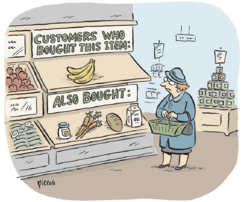
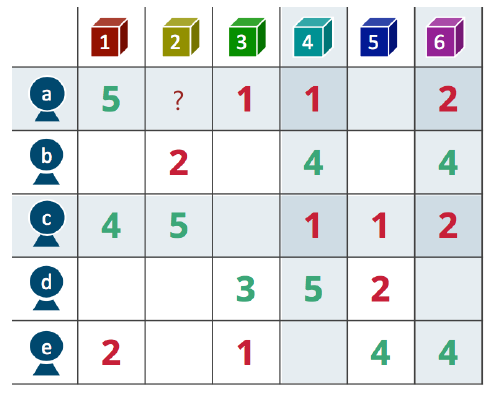
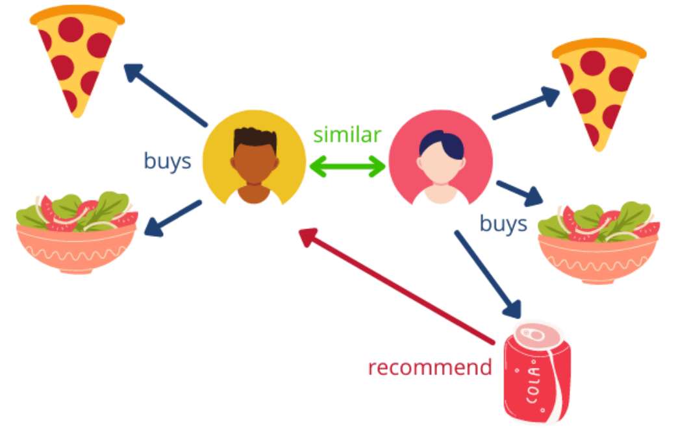
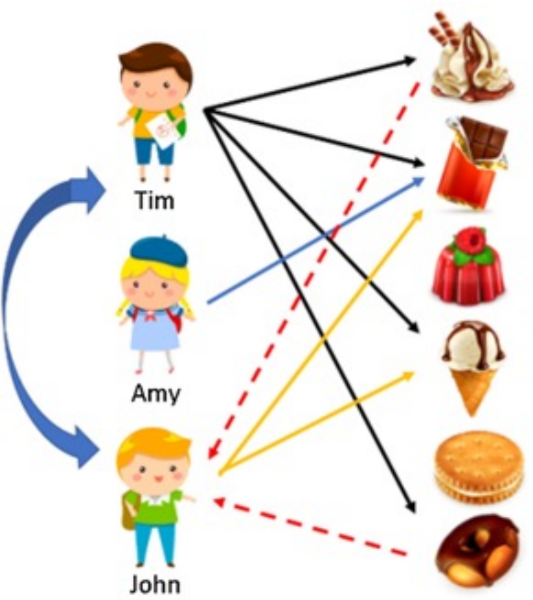
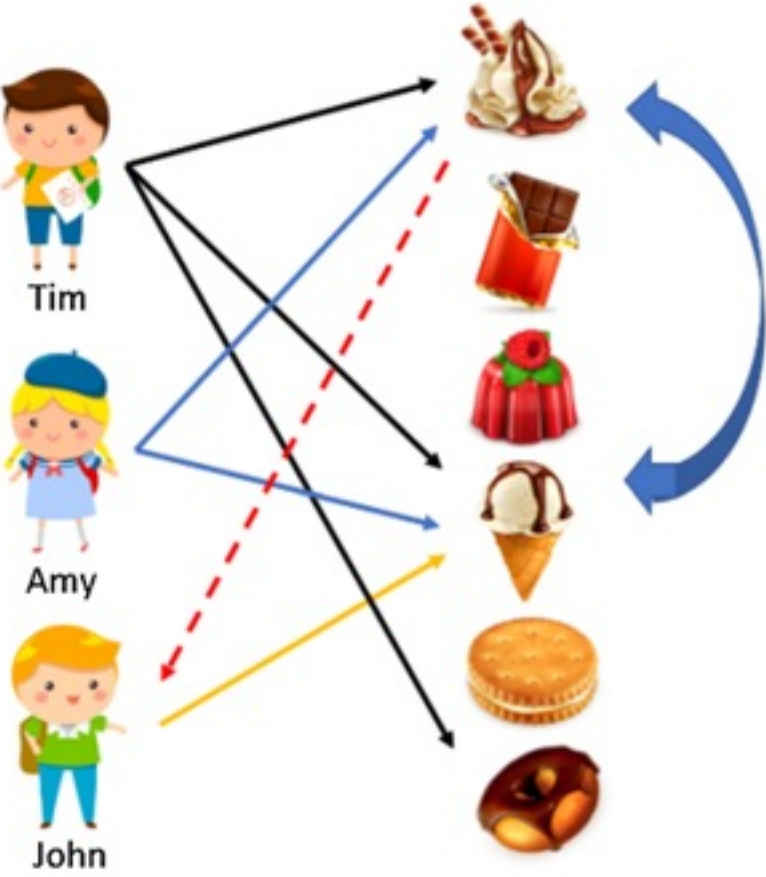
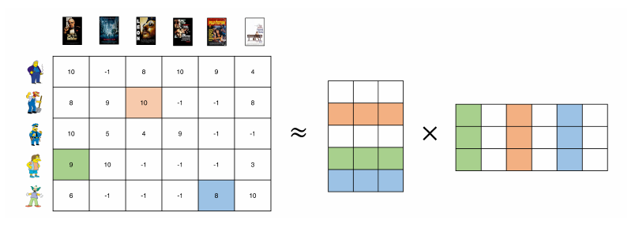
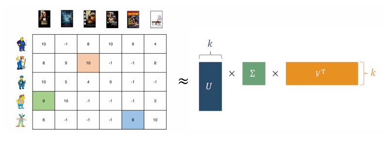
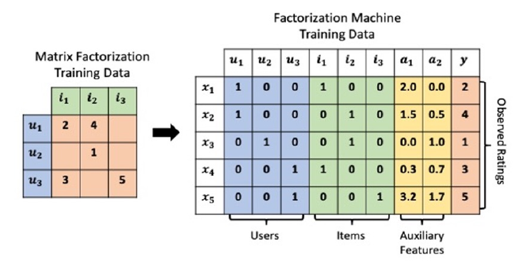

---
jupyter:
  jupytext:
    text_representation:
      extension: .md
      format_name: markdown
      format_version: '1.3'
      jupytext_version: 1.16.4
  kernelspec:
    display_name: Python 3 (ipykernel)
    language: python
    name: python3
---

<!-- #region executionInfo={"elapsed": 4, "status": "ok", "timestamp": 1702453591048, "user": {"displayName": "Sergey Korpachev", "userId": "09181340988160569540"}, "user_tz": -180} id="Ksn9azeZa-Zr" editable=true slideshow={"slide_type": "slide"} -->
# Лекция 16: Рекомендательные системы

МГТУ им. Н.Э. Баумана

Красников Александр Сергеевич

https://github.com/askras/bmstu_machinelearning/

2024
<!-- #endregion -->

<!-- #region id="zvxMDFiSa-aU" editable=true slideshow={"slide_type": "slide"} -->
## Примеры рекомендательных систем
С рекомендательными системами можно столкнуться там, где есть большое множество товаров и пользователей, которые хотят найти нужные для себя товары. Рекомендательные системы помогают отобрать наиболее релевантные для пользователя объекты, тем самым экономя его время.
<!-- #endregion -->

<!-- #region id="zvxMDFiSa-aU" editable=true slideshow={"slide_type": "subslide"} -->
### Какой фильм смотреть?

<!-- #endregion -->

<!-- #region id="zvxMDFiSa-aU" editable=true slideshow={"slide_type": "slide"} -->
### Какую музыку слушать?

<!-- #endregion -->

<!-- #region id="zvxMDFiSa-aU" editable=true slideshow={"slide_type": "slide"} -->
### И даже на какую лекцию идти? :)

<!-- #endregion -->

<!-- #region id="zvxMDFiSa-aU" editable=true slideshow={"slide_type": "slide"} -->
### За нас уже все решили

- Какую музыку слушать?
- Какой фильм смотреть?
- Какую книгу читать?
- Какую еду есть?
- Какую одежду надеть?
- В какую игру играть?
- На какую лекцию идти? 

<!-- #endregion -->

<!-- #region id="zvxMDFiSa-aU" editable=true slideshow={"slide_type": "slide"} -->
## Поиск vs рекомендации

- В задаче поиска есть сформулированный запрос от пользователя
- В задаче рекомендаций явного запроса нет, есть только история взаимодействий пользователя с объектами и надежда на то, что можно верно распознать его скрытые желания.
<!-- #endregion -->

<!-- #region id="zvxMDFiSa-aU" editable=true slideshow={"slide_type": "slide"} -->
## Формализация задачи

- Пусть у нас есть множество **пользователей** $U$ (Users)и множество **объектов** $I$ (Items). 
- Для каждого пользователя $u \in U$ есть множество объектов $i \in I$, с которыми он взаимодействовал и которым поставил **оценки** (рейтинги) $R_u=(r_{ui})_{i\in I_u}$.
- **Рейтинг** (или **фидбеком**) – это некоторая характеристика взаимодействия пользователя с объектом; можно считать его целевой переменной, которую выбрали для оптимизации рекомендательной системы.

Таким образом, **задачу рекомендательных систем** можно переформулировать в следующем виде: для каждого пользователя $u \in U$ необходимо оценить значение $r_{ui}$ для $i\in I /\ I_{u}$ и выбрать несколько товаров с наибольшим $\hat{r}_{ui}$.

Иными словами, надо научиться среди непоказанных пользователю товаров находить те, которые заинтересовали бы его больше всего.
<!-- #endregion -->

<!-- #region id="zvxMDFiSa-aU" editable=true slideshow={"slide_type": "slide"} -->
## Примеры фидбека

- Для товара – факт добавления в корзину;
- Для музыки – дослушали ли трек до конца;
- Для статьи – лайк/дизлайк;
- Для видео – время его просмотра или факт просмотра, например, наполовину.

Фидбек разделяют на два типа – **explicit** и **implicit**
<!-- #endregion -->

<!-- #region id="zvxMDFiSa-aU" editable=true slideshow={"slide_type": "slide"} -->
### Explicit (явный фидбек)

Explicit, или явный фидбек – это такие действия пользователя, по которым точно можно понять, понравился ли ему объект. Это может быть оценка, поставленная, фильму, лайк/дизлайк к видео или рецензия на купленный товар. Такого фидбека очень мало, но он наиболее точно характеризует отношение пользователя к товару.
<!-- #endregion -->

<!-- #region id="zvxMDFiSa-aU" editable=true slideshow={"slide_type": "slide"} -->
### Implicit (неявный фидбек)
Implicit, или неявный фидбек – это любая другая информация о действиях пользователя на сайте. 
Обычно такого сигнала в разы больше, чем явного, однако он более шумный, и не стоит доверять ему так же, как явному. 

Факт того, что пользователь досмотрел видео до конца, не говорит о том, понравилось ли оно ему, однако можно сделать предположение, что большинству досмотревших видео до конца оно понравилось. 

Оптимизации кликов на статью может получиться так, что рекомендательная система научится находить кликбейт, а не интересные пользователю статьи – это может плохо отразиться на сервисе в долгосрочной перспективе.

Примеры неявного фидбека: 
- клик на статью
- время просмотра видео
- покупка товара.

<!-- #endregion -->

<!-- #region id="zvxMDFiSa-aU" editable=true slideshow={"slide_type": "slide"} -->
## Ранжирующая модель

Задачу построения рекомендательной системы можно формулировать в качестве задачи классификации (клик/не клик) или регрессию (сколько звёзд пользователь поставит объекту), но это не самые распространённые стратегии.

Обратим внимание, что нам на самом деле не обязательно уметь точно оценивать рейтинги $r_{ui}$. Достаточно уметь для пользователя и набора объектов генерировать перестановку этих объектов в порядке убывания рейтинга.
<!-- #endregion -->

<!-- #region id="zvxMDFiSa-aU" editable=true slideshow={"slide_type": "slide"} -->
## Задача коллаборативной фильтрации

- $U$ – множество всех пользователей (Users)
- $I$ – множество всех товаров (Items)
- $u$, $v$ – некоторые пользователи
- $i$, $j$ – некоторые товары
- $U_i$ – все пользователи, которые оценили товар $i$
- $I_u$ – все товары, которые оценил пользователь $u$
- $R_{ui}$ – истинный рейтинг (Rating) пользователя $u$ для товара $i$
- $\hat{R}_{ui}$ – предсказанный рейтинг пользователя 𝒖 для товара $i$
<!-- #endregion -->

<!-- #region id="zvxMDFiSa-aU" editable=true slideshow={"slide_type": "slide"} -->
### Варианты коллаборативной фильтрации

- User-based
  - Определяем «похожесть» пользователей по их оценкам
- Item-based
  - Определяем «похожесть» товаров по их оценкам
<!-- #endregion -->

<!-- #region id="zvxMDFiSa-aU" editable=true slideshow={"slide_type": "slide"} -->
### User-based filtering
Сходство двух пользователей $u$, $v$ вычисляем через корреляцию Пирсона:

$$w_{u v}=\frac{\sum_{i\in I_{u v}}(R_{u i}-\bar{R}_{u})(R_{v i}-\bar{R}_{v})}{\sqrt{\sum_{i\in I_{u v}}(R_{u i}-\bar{R}_{u})^{2}}\sqrt{\sum_{i\in I_{u v}}(R_{v i}-\bar{R}_{v})^{2}}}$$

- $I_{uv}$ -  множество товаров, которые оценили пользователи $u$, $v$;
- $ \overline{R}_u$ -  среднее оценок пользователя $u$.

<!-- #endregion -->

<!-- #region id="zvxMDFiSa-aU" editable=true slideshow={"slide_type": "slide"} -->
## Шаги User-based filtering

- Находим множество пользователей $U(u)$, похожих на данного:
$$U(u)=\{v\in U|w_{u v}>\alpha\}$$

- Считаем как часто товар покупался пользователями из $U(u)$ :
$$p_{i}=\frac{|\{u{\in}U(u)|\exists R_{u i}\}|}{|U(u)|}$$

- Прогнозируем оценки для товара от пользователя :
$$\hat{R}_{u i}=\bar{R}_{u}+\frac{\sum_{v\in U(u)}w_{u v}(R_{v i}-\bar{R}_{v})}{\sum_{v\in U(u)}|w_{u v}|}$$

- Рекомендуем пользователю $k$ товаров с наибольшими $p_i$, либо $\hat{R}_{u i}$
<!-- #endregion -->

<!-- #region id="zvxMDFiSa-aU" editable=true slideshow={"slide_type": "slide"} -->

<!-- #endregion -->

<!-- #region id="zvxMDFiSa-aU" editable=true slideshow={"slide_type": "slide"} -->
### Преимущества и недостатки User-Based filtering
- Преимущества:
  - Достаточно неплохие рекомендации при большом количестве явных оценок.
- Недостатки:
  - У большинства пользователей не так много оценок, что приводит к неуверенной оценке похожести пользователей.
  - Оценки конкретного пользователя меняются во времени, поэтому при добавлении хотя бы одной новой оценки его похожесть на других пользователей может сильно измениться.
<!-- #endregion -->

<!-- #region id="zvxMDFiSa-aU" editable=true slideshow={"slide_type": "slide"} -->
## Item-based filtering

Сходство двух товаров , вычисляем через корреляцию Пирсона:

$$w_{i j}=
\frac{\sum_{u\in U_{i j}}(R_{u i}-\bar{R}_{i})(R_{u j}-\bar{R}_{j})}
{
\sqrt{\sum_{u\in U_{i j}}\left(R_{u i}-\bar{R}_{i}\right)^{2}}
\,
\sqrt{\sum_{u\in U_{i j}}\left(R_{u j}-\bar{R}_{j}\right)^{2}}}$$

- $U_{ij}$ - множество пользователей, которые оценили товары $i$, $j$;
- $\overline{R}_i$ - среднее оценок товара $i$.
<!-- #endregion -->

<!-- #region id="zvxMDFiSa-aU" editable=true slideshow={"slide_type": "slide"} -->
## Шаги Item-based filtering

- Находим множество товаров , похожих на данный:
$$I(i)=\{j\in I|w_{i j}>\alpha\}$$

- Находим максимально схожий товар, который уже покупался:
$$p_{i}=\max\limits_j w_{i j}$$

Прогнозируем оценки для товара от пользователя:
$$\hat{R}_{u i}=\frac{\sum_{j\in I(i)}w_{i j}R_{u j}}{\sum_{j\in I(i)}|w_{u v}|}$$

- Пользователю $u$ рекомендуем $k$ товаров с наибольшими $p_i$, либо $\hat{R}_{u i}$
<!-- #endregion -->

<!-- #region id="zvxMDFiSa-aU" editable=true slideshow={"slide_type": "slide"} -->

<!-- #endregion -->

<!-- #region id="zvxMDFiSa-aU" editable=true slideshow={"slide_type": "slide"} -->
### Преимущества и недостатки Item-Based filtering
- Преимущества:
  - Достаточно неплохие рекомендации при большом количестве явных оценок.
- Недостатки:
  - Два пользователя должны оценивать одинаковые товары, оценка очень похожих товаров не учитывается в их близости.
- Проблема холодного старта: не знаем, что делать с новым товаром или
пользователем.
<!-- #endregion -->

<!-- #region id="zvxMDFiSa-aU" editable=true slideshow={"slide_type": "slide"} -->
### Особенности коллаборативной фильтрации

- Методы не опираются ни на какую дополнительную информацию кроме матрицы оценок $R_{ui}$, предполагая, что этого должно быть достаточно для улавливания качественного сигнала о схожести пользователей и товаров;
- Предложенные методы не применимы для новых объектов и пользователей – для них просто нет истории или она недостаточно информативна для того, чтобы методы могли давать более-менее точные оценки;
- Так как методы коллаборативной фильтрации основаны только на истории прошлых взаимодействий, рекомендательная система, построенная исключительно на их основе будет постепенно вгонять пользователя в информационный пузырь: эти методы не предполагают открытия новых интересов у пользователя, они способны только эксплуатировать уже имеющиеся.
<!-- #endregion -->

<!-- #region id="zvxMDFiSa-aU" editable=true slideshow={"slide_type": "slide"} -->
## Content-based рекомендации

- Основываются на измерении похожести между объектами на основе их содержания. Например, две статьи про то, как построить рекомендательные системы  можно считать похожими с точки зрения содержания. 
- Вход: разные контентные признаки и характеристики товара (текст статьи, время публикации, картинки)\
- Выход: некоторое числовое представление объекта (эмбеддинг). 
- Никакая коллаборативная информацию в таких моделях не используется.
Модели ничего не знают про других пользователей и про их взаимодействие с объектами.
<!-- #endregion -->

<!-- #region id="zvxMDFiSa-aU" editable=true slideshow={"slide_type": "slide"} -->
- Пусть есть некоторый контентные эмбеддинги $e_i \in \mathbb{R}^n$ для каждого товара (например, векторные представлений статей). 
- Посчитаем скалярное произведение (или косинусное расстояние) до оценённых пользователем объектов и оценим рейтинги, как:
$$\hat{r}_{ui} = \max\limits_{j\in I_u, r_{uj}> \alpha} \rho(e_i, e_j)r_{uj},$$
где
- $\rho$ -  скалярное произведение или косинусное расстояние между двумя векторами,
- $I_u$ – множество оценённых пользователем объектов,
- $\alpha$ – гиперпараметр
<!-- #endregion -->

<!-- #region id="zvxMDFiSa-aU" editable=true slideshow={"slide_type": "slide"} -->
### Преимущества и недостатки контентного подхода
- Преимущества
  - одинаково хорошо работает на новых и старых объектах, так как контентные модели основаны только на статичной контентной информации, которая всегда доступна.
- Недостатки
  - похожесть по контенту может ещё больше загонять пользователя в информационный пузырь: например, контентная модель вряд ли сможет к кофемашине порекомендовать кофейные зерна, в то время как коллаборативный подход получит сигнал о том, что товары являются дополняющими напрямую из действий других пользователей.
 
Cуществуют гибридные модели, совмещающие в себе коллаборативный и контентный сигналы. 
<!-- #endregion -->

<!-- #region id="zvxMDFiSa-aU" editable=true slideshow={"slide_type": "slide"} -->
## Рекомендации на основе матричных разложений
<!-- #endregion -->

<!-- #region id="zvxMDFiSa-aU" editable=true slideshow={"slide_type": "slide"} -->
### Векторы интересов

Будем представлять матрицу оценок через произведение двух матриц:
$$R=PQ^{T}$$

- $P$ - матрица из  векторы интересов пользователей;
- $Q$ - матрица из векторов товаров;

Например при рекомнедации фильмов можно описать пользователя и фильм векторами интересов:
- для пользователя – насколько он интересуется каждым жанром
- для фильма – насколько он относится к каждому жанру
<!-- #endregion -->

<!-- #region id="zvxMDFiSa-aU" editable=true slideshow={"slide_type": "slide"} -->
#### Модель со скрытыми переменными

Значения матриц $P$ и $Q$  находим минимизируя ошибку прогноза:

$$\sum_{u,i}(R_{u i}-\bar{R}_{u}-\bar{R}_{i}-p_{u}^{T}q_{i})^{2}\rightarrow\operatorname*{min}_{P,Q}$$
<!-- #endregion -->

<!-- #region id="zvxMDFiSa-aU" editable=true slideshow={"slide_type": "slide"} -->
#### Latent Factor Model (LFM)

Значения матриц $P$ и $Q$  находим минимизируя ошибку прогноза:
$$\sum_{u,i}(R_{u i}-\bar{R}_{u}-\bar{R}_{i}-p_{u}^{T}q_{i})^{2}+ 
\color{red}\lambda\sum_{u\in U}\vert\vert p_{u}\vert\vert^{2}+\mu\sum_{i\in I}\vert\vert q_{i}\vert\vert^{2}
\color{black}\rightarrow \min_{P,Q}$$

<!-- #endregion -->

<!-- #region id="zvxMDFiSa-aU" editable=true slideshow={"slide_type": "slide"} -->
#### Оптимизация SGD

Значения матриц $P$ и $Q$  находим с помощью стохастического градиентного спуска:

$$p_{u k}=p_{u k}+\eta q_{i k}(R_{u i}-\bar{R}_{u}-\bar{R}_{i}-p_{u}^{T}q_{i})$$

$$q_{i k}=q_{i k}+\eta p_{u k}(R_{u i}-\bar{R}_{u}-\bar{R}_{i}-p_{u}^{T}q_{i})$$

<!-- #endregion -->

<!-- #region id="zvxMDFiSa-aU" editable=true slideshow={"slide_type": "slide"} -->
### Alternating Least Squares

- Альтернативный способ оптимизации.
- Зафиксируем матрицу $Q$. Тогда оптимальная $P$:
$$p_{u}=\left(\sum_{i}q_{i}q_{i}^{T}\right)^{-1}\sum_{i}r_{u i}q_{i}$$
- Затем, фиксируем матрицу $P$. Тогда оптимальная $Q$:
$$q_{i}=\left(\sum_{u}p_{u}p_{u}^{T}\right)^{-1}\sum_{u}r_{u i}p_{u}$$
- Повторяем шаги оптимизации.
<!-- #endregion -->

<!-- #region id="zvxMDFiSa-aU" editable=true slideshow={"slide_type": "slide"} -->
### Сингулярное разложение (Singular Value Decomposition, SVD)

Известно, что любая матрица размера $m \times n$ (ранга $k$) представима в виде $$X = =U\Sigma V^T,$$, 

где
- $\Sigma$ — матрица размера $m \times n$ с неотрицательными элементами, у которой элементы, лежащие на главной диагонали — это сингулярные числа, а все элементы, не лежащие на главной диагонали, нулевые,
- матрицы $U$ (размера $m\times m$) и $V$ (размера $n\times n$ — это две унитарные матрицы, состоящие из левых и правых сингулярных векторов соответственно. 
<!-- #endregion -->

<!-- #region id="zvxMDFiSa-aU" editable=true slideshow={"slide_type": "slide"} -->
#### SVD для построения рекомендаций

Матрица товарных предпочтений (матрица, где строки это пользователи, а
столбцы это продукты, с которыми пользователи взаимодействовали)
представляется произведением трех матриц:

 

- $U$ – описание характеристик пользователя
- $V$ – описание характеристик продукта

- После восстановления исходной матрицы, клетки, где у пользователя были нули, а появились числа, показывают степень латентного
интереса к товару. Упорядочим эти цифры, и получим список товаров,
релевантных для пользователя.
- При этой операции у пользователя и товара появляются «латентные»
признаки. Это признаки, показывающие «скрытое» состояние пользователя
и товара.
- Как правило вычисление таких разложений
весьма трудоемко, поэтому на практике часто прибегают к их
приближенным итеративным вариантам.
<!-- #endregion -->

<!-- #region id="zvxMDFiSa-aU" editable=true slideshow={"slide_type": "slide"} -->
## Factorization Machines

- Можно ли использовать дополнительную информацию о пользователях и товарах?
- Как это сделать?

<!-- #endregion -->

<!-- #region id="zvxMDFiSa-aU" editable=true slideshow={"slide_type": "slide"} -->
### Модель

- Прогноз оценки пользователя H() для товара :
$${\hat{y}}(x)=w_{0}+\sum_{i=1}^{n}w_{i}x_{i}+\sum_{i=1}^{n}\sum_{j=i+1}^{n}{\big(}v_{i}^{T}v_{j}{\big)}x_{i}x_{j}$$
  - $w_i$, $v_i$ -  веса модели;
  - $n$-  число пар оценок в данных.
- Обучаем модель минимизируя ошибку прогноза оценок.

<!-- #endregion -->

<!-- #region id="zvxMDFiSa-aU" editable=true slideshow={"slide_type": "slide"} -->
## Свойства (метрики) рекомендательных систем
<!-- #endregion -->

<!-- #region id="zvxMDFiSa-aU" editable=true slideshow={"slide_type": "slide"} -->
### Полнота (Coverage)

Под полнотой в данном понимается доля рекомендованных объектов $I_{\text{recommended}}$ среди всех объектов $I$.
$$\text{Coverage} = \cfrac{|I_{\text{recommended}}|}{|I|}$$
<!-- #endregion -->

<!-- #region id="zvxMDFiSa-aU" editable=true slideshow={"slide_type": "slide"} -->
### Новизна (Novelty)

Для каждого рекомендованного объекта $i$ считаем вероятность, с которой его порекомендуют случайному пользователю: $P_{i} = \frac{m_{i}}{N}$, где $ m_{i} $ – количество пользователей, которым был показан $i$-й объект, а $N$ – общее число пользователей. 
Для заданного пользователя усредняем значение собственной информации по списку его рекомендаций $R$ и получаем итоговое значение метрики:
$$\text{Novelty}_u = \cfrac{1}{|R|}\sum\limits_{i\in R} {-\log (p(i))}$$
<!-- #endregion -->

<!-- #region id="zvxMDFiSa-aU" editable=true slideshow={"slide_type": "slide"} -->
### Разнообразие (Diversity)

Разнообразие – это способность модели рекомендовать разные по содержанию объекты. Такое свойство очень важно для долгосрочного успеха сервисов, основанных на рекомендательных системах. Действительно, если модель постоянно рекомендует похожие друг на друга объекты, то рано или поздно пользователю наскучат такие рекомендации.

Одна из метрик новизны **Intra List Similarity (ILS)**. Для ее расчёта для одного пользователя нужно усреднить попарную схожесть $\text{sim}$ между рекомендованными объектами:
$$ILS_u= \cfrac{1}{|R|}
\sum\limits_{i\in R} \sum\limits_{j\in R} \text{sim}(i,j),$$

где $R$ – это набор рекомендованных пользователю объектов.
<!-- #endregion -->

<!-- #region id="zvxMDFiSa-aU" editable=true slideshow={"slide_type": "slide"} -->
### Serendipity ($\approx$ «интуитивная прозорливость»)

Serendipity – это способность рекомендовать такие объекты, которые не только релевантны для пользователя, но ещё и существенно отличаются от того, с какими объектами пользователь взаимодействовал в прошлом.

Serendipity – довольно субъективное свойство и его сложно формализовать.
Один из вариантов:

$$\text{Serendipity}_u = \sum\limits_{i\in R}\max (Pr_u(i) - Prim_u(i), 0) \cdot rel_u(i)
$$

- $R_u$ – список рекомендаций для пользователя,
- $Pr_u(i)$) – предсказание модели, для каждого объекта из списка,
- $Prim_u(i)$ – предсказание примитивной модели (в качестве примитивной можно брать модель на основе эвристик без машинного обучения или простую неперсональную модель),
- $rel$ – известная релевантность объекта для пользователя. 

<!-- #endregion -->

<!-- #region id="zvxMDFiSa-aU" editable=true slideshow={"slide_type": "slide"} -->

<!-- #endregion -->

<!-- #region id="zvxMDFiSa-aU" editable=true slideshow={"slide_type": "slide"} -->
## Классический пайплайн рекомендательной системы
<!-- #endregion -->

<!-- #region id="zvxMDFiSa-aU" editable=true slideshow={"slide_type": "slide"} -->

<!-- #endregion -->

<!-- #region id="zvxMDFiSa-aU" editable=true slideshow={"slide_type": "slide"} -->
## Требования к рекомендательной системе

- При ранжировании товаров в порядке убывания $\hat{r}_{ui}$ нам хотелось бы учитывать как можно больше сигналов/фичей (как пользователя, так и объекта);
- Рекомендательная система должна работать достаточно быстро;
- Должен быть несложный механизм, позволяющий понятно учитывать «бизнес-логику» (например, если при прочих равных мы больше хотим показывать свежие статьи).

<!-- #endregion -->
