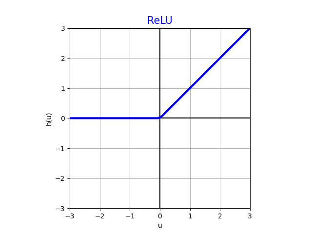
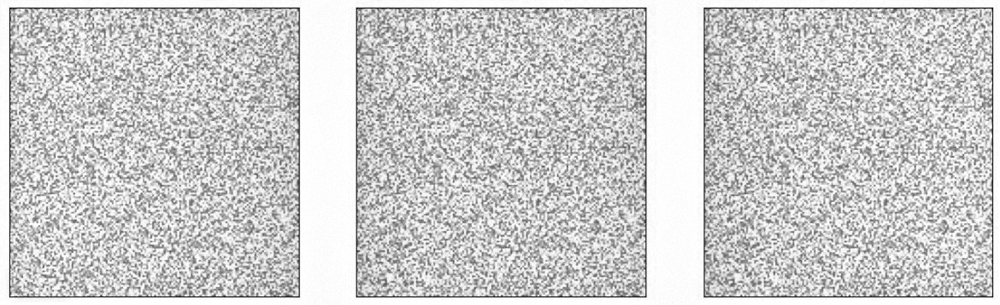
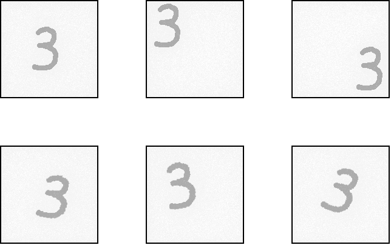
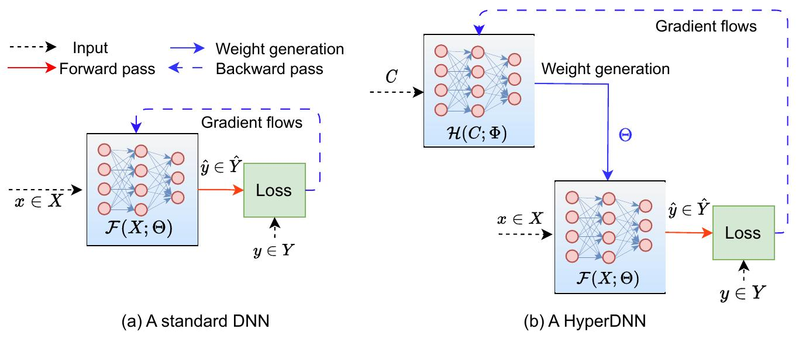

---
jupyter:
  jupytext:
    text_representation:
      extension: .md
      format_name: markdown
      format_version: '1.3'
      jupytext_version: 1.16.7
  kernelspec:
    display_name: Python 3 (ipykernel)
    language: python
    name: python3
---

<!-- #region slideshow={"slide_type": "slide"} toc=true editable=true -->
# Лекция 18: Архитектура нейронных сетей

МГТУ им. Н.Э. Баумана

Красников Александр Сергеевич

https://github.com/askras/bmstu_machinelearning/

2024-2025
<!-- #endregion -->

<!-- #region slideshow={"slide_type": "slide"} editable=true -->
## Биологическая модель нейрона

Нейронные сети (neural networks) изначально появились как попытка
моделировать работу человеческого мозга, который состоит из нейронов,
связанные друг с другом аксонами - вытянутыми отростками нервных клеток.
Каждый нейрон может перейти в возбуждённое состояние, в этом случае он
передаёт по аксонам сигнал другим нейронам посредством
электро-химического взаимодействия.

*В простейшем виде* биологический нейрон моделируется преобразованием:

$$a = h\left( \sum\limits_{k = 0}^{K}w_{k}a_{k} \right),$$

где

-   $a$ - выход нейрона (что он посылает по аксонам другим нейронам);

-   $a_{0} \equiv 1$ - нейрон, всегда выдающий константу 1;

-   $a_{1},...a_{K}$ - нейроны, имеющие входящую связь с рассматриваемым
    нейроном;

-   $w_{0},w_{1},...w_{K}$ - веса связей, которые показывают, во сколько раз изменяется сигнал, передаваемый нейронами $a_{0},a_{1},...a_{K}$ текущему нейрону $a$;

-   $h( \cdot )$ - некоторая фиксированная **функция активации**
    (activation function).
<!-- #endregion -->

<!-- #region slideshow={"slide_type": "slide"} editable=true -->
## Геометрическая модель нейрона

<!-- #endregion -->

<!-- #region slideshow={"slide_type": "slide"} editable=true -->
## Модель нейрона в машинном обучении

В машинном обучении нейрон можно применять как в задаче регрессии, так и в задаче классификации к $D$-мерному вектору признаков $\mathbf{x} = \lbrack x^{1},x^{2},...x^{D}\rbrack$.

В обоих случаях входящими нейронами будут признаки входного вектора $x$
и константa $1$, $K = D$:

$$a_{0} \equiv 1,\, a_{1} = x^{1},\, a_{2} = x^{2}\,...a_{K} = x^{D};$$

Таким образом, одиночный нейрон моделирует закономерность

$$y(\mathbf{x}) = h\left( w_{0} + \sum\limits_{d = 1}^{D}w_{d}x^{d} \right),$$

> Параметр $w_{0}$ определяет **смещение** (bias).

Веса $w_{0},w_{1},...w_{D}$ представляют собой настраиваемые параметры
по данным. В зависимости от того, как выбрать функцию активации, мы
сможем решать как задачу регрессии, так и задачу бинарной классификации.

**Примечание:** 
- $x^{i}$ - $i$-й признак вектора признаков,
- $\mathbf{x}_{n}$ - $n$-й объект обучающей выборки.
<!-- #endregion -->

<!-- #region slideshow={"slide_type": "subslide"} editable=true -->
### Регрессия

Регрессия получается при выборе $h(u) = u$. Тогда

$$y(\mathbf{x}) = w_{0} + \sum\limits_{d = 1}^{D}w_{d}x^{d}$$
<!-- #endregion -->

<!-- #region slideshow={"slide_type": "subslide"} editable=true -->
### Бинарная классификация

Классификация получается при выборе
$h(u) = \sigma(u) = 1/(1 + e^{- u})$. Сигмоидная функция
$\sigma(u) \in (0,1)$, поэтому её можно трактовать как вероятность
положительного класса:

$$p(y = + 1\mid\mathbf{x}) = \sigma\left( w_{0} + \sum\limits_{d = 1}^{D}w_{d}x^{d} \right)$$

Тогда вероятность отрицательного класса можно посчитать как

$$p(y = - 1\mid\mathbf{x}) = 1 - p(y = + 1\mid\mathbf{x})$$

Это даёт нам нейросетевую реализацию бинарной логистической
регрессии.
<!-- #endregion -->

<!-- #region editable=true slideshow={"slide_type": "slide"} -->
## Многослойный персептрон 

### Архитектура многослойного перцептрона
Отдельный нейрон способен моделировать линейную регрессию и линейную
классификацию. Однако нейросети способны моделировать и более сложные
*нелинейные зависимости*, если слои из нейронов накладывать друг на
друга, создавая суперпозиции нелинейных преобразований, как показано
ниже:

Это пример **многослойного персептрона** (multilayer perceptron, MLP),
т.е. нейросети, у которой **входной слой** (input layer) состоит из
признаков обрабатываемого объекта $x$, далее следует один или более
**скрытых слоёв** (hidden layers), после чего идет **выходной слой**
(output layer), состоящий из одного и более нейронов, в зависимости от
решаемой задачи.

> На рисунке выше приведён пример 3-х слойного персептрона с 2-мя
> скрытыми слоями, поскольку нулевой слой, состоящий из входных
> признаков при расчёте числа слоёв не учитывается. Можно создавать
> архитектуры и с большим числом слоёв.
<!-- #endregion -->

<!-- #region editable=true slideshow={"slide_type": "subslide"} -->
### Матеметическое описание многослойного перцептрона 

Действие представленной сети на вектор признаков $\mathbf{x}$ может быть записано аналитически:

$$\hat{\mathbf{y}} = f(\mathbf{x}) = g(W_{3}h(W_{2}h(W_{1}\mathbf{x} + \mathbf{b}_{1}) + \mathbf{b}_{2}) + \mathbf{b}_{3}),$$

где

-   $W_{1} \in \mathbb{R}^{K \times D},\,\mathbf{b}_{1} \in \mathbb{R}^{K}$ -
    матрица весов и вектор смещений 1-го слоя;
-   $W_{2} \in \mathbb{R}^{M \times K},\,\mathbf{b}_{2} \in \mathbb{R}^{M}$ -
    матрица весов и вектор смещений 2-го слоя;
-   $W_{3} \in \mathbb{R}^{P \times M},\,\mathbf{b}_{3} \in \mathbb{R}^{P}$ -
    матрица весов и вектор смещений 3-го (выходного) слоя;
-   $h( \cdot )$ - функция нелинейности скрытых слоёв (для разных слоёв
    может различаться)
-   $g( \cdot )$ - функция нелинейности для выходного слоя (зависит от
    решаемой задачи).

При этом связи строятся только между нейронами соседних слоёв, каждый с
каждым, т.е. используются **полносвязные слои** (fully connected layers,
FC).

Также на каждом слое используется нейрон, выдающий
константную единицу (отмечены жёлтым цветом), чтобы моделировать
смещение при расчёте взвешенной суммы активаций входных нейронов.

Каждой связи сопоставляется свой настраиваемый вес.
<!-- #endregion -->

<!-- #region editable=true slideshow={"slide_type": "subslide"} -->
### Промежуточное признаковое представление

По сути, нейроны скрытых слоёв строят **промежуточное признаковое представление** (intermediate feature representation) обрабатываемого  объекта, а итоговый прогноз строится по извлечённым признакам последнего скрытого слоя, т.е. работает принцип глубокого обучения, когда модель сама подбирает наиболее информативные признаки, составляя их из входных.

При этом промежуточные признаки строятся автоматически, поскольку внутри сети настраиваются все веса - и для извлечения промежуточных признаков на скрытых слоях, и для построения итогового прогноза на выходном слое.

> Если данных достаточно много, то настроенные промежуточные признаки окажутся более информативными и полезными, чем если бы аналитик строил признаки самостоятельно, а потом к ним применял бы линейную модель.

Если активациями выступают сигмоиды $h(u) = 1/(1 + e^{- u})$, то каждый нейрон представляет собой логистическую регрессию (со своими параметрами). 
Нейроны первого слоя реализуют логистические регресии относительно исходных признаков, нейроны следующих слоёв - логистические регрессии относительно прогнозов предыдущих логистических регрессий.
<!-- #endregion -->

<!-- #region editable=true slideshow={"slide_type": "slide"} -->
## Обобщение архитектуры

Из физической природы задачи и для упрощения настройки нейронные сети можно строить не только в виде многослойного персептрона, но и с произвольной топологией (расположением связей), например, такой:

<!-- #endregion -->

<!-- #region editable=true slideshow={"slide_type": "slide"} -->
## Гиперпараметры нейронной сети

**Гиперпараметры нейронной сети** — это параметры, которые задаются до начала обучения модели и не изменяются в процессе обучения. Настройка гиперпараметров имеет важное значение для оптимизации производительности модели.

К основным гиперпараметрам нейронных сетей относятся:

1. **Архитектура сети**:
   - Количество скрытых слоёв.
   - Количество нейронов в каждом скрытом слое.
   - Типы слоёв (например, полносвязные, свёрточные, рекуррентные).

2. **Скорость обучения (Learning rate)**: Определяет размер шага при обновлении весов во время обучения.

3. **Инициализация весов**: Метод, используемый для начального задания весов (например, случайная инициализация).

4. **Количество батчей (Batch size)**: Количество обучающих примеров, используемых за одну итерацию обучения.

5. **Количество эпох обучения**: Количество полных проходов через обучающий набор данных.

6. **Функция активации**: Функция, используемая для добавления нелинейности в модель (например, ReLU, Sigmoid, Tanh).

7. **Функция потерь**: Функция, используемая для оценки разницы между предсказаниями модели и реальными значениями (например, кросс-энтропия, MSE).

8. **Оптимизатор**: Алгоритм, используемый для обновления весов в процессе обучения (например, SGD, Adam, RMSprop).

> Это не исчерпывающий список всех возможных гиперпараметров, так как они могут варьироваться в зависимости от типа и сложности нейронной сети, а также от специфики задачи, которую она решает. Ключ к успешному обучению нейронной сети часто заключается в тщательном подборе и настройке этих гиперпараметров.
<!-- #endregion -->

<!-- #region editable=true slideshow={"slide_type": "slide"} -->
## Функции активации

Рассмотрим еще раз популярные функции активации $h(u)$, использующиеся в нейросетях.

<!-- #endregion -->

<!-- #region editable=true slideshow={"slide_type": "subslide"} -->
### Тождественная функция активации (identity)

$$h(u) = u$$

Эта активация используется в выходном слое, чтобы моделировать
регрессионный выход. В скрытых слоях почти не используется, т.к.
суперпозиция линейных функций приводит к линейной функции.
<!-- #endregion -->

<!-- #region editable=true slideshow={"slide_type": "subslide"} -->
### Сигмоидная функция активации (sigmoid)

$$h(u) = \sigma(u) = \frac{1}{1 + e^{- u}}$$

Принимает значения $h(u) \in (0,1)$ и используется в выходном слое
нейронной сети для решения задачи бинарной классификации, предсказывая
вероятность положительного класса $p(y = + 1\mid\mathbf{x})$.

В скрытых слоях почти не используется, поскольку за пределами интервала
$( - 3,3)$ выходит на горизонтальные асимптоты -1 и +1, почти не
меняясь, в результате чего её градиент близок к нулю. Поскольку
нейросети оптимизируются численными методами, используя градиент, это
приводит к медленной настройке сети и даже застреванию сигмоидных
активаций в районе значений $\pm 1$.
<!-- #endregion -->

<!-- #region editable=true slideshow={"slide_type": "subslide"} -->
## Гиперболический тангенс (tangh)

$$h(u) = \text{tangh}(u) = \frac{e^{u} - e^{- u}}{e^{u} + e^{- u}} = 2\sigma(2u) - 1$$

С точностью до линейного сжатия и сдвига совпадает с сигмоидной функцией
активации, но, в отличие от неё, является нечётной функцией:

$$\text{tangh}( - u) = - \text{tangh}(u),$$

что даёт преимущество при инициализации и настройке нейросети за счёт
того, что если признаки - случайные величины, центрированные вокруг
нуля, то образованные от них активации также будут центрированными
вокруг нуля, а также активации от активаций и так далее по всем слоям
нейросети, т.е. по ходу вычислений не будет происходить систематического
смещения в ту или иную сторону.

Тем не менее, гиперболический тангенс используется в основном только в
выходных регрессионных слоях, где есть ограничение на выход и снизу, и
сверху, например, где нужно генерировать степень поворота руля
$\lbrack - 1,1\rbrack$, чтобы оптимально объехать препятствие.

В скрытых слоях он практически не используется, поскольку обладает тем
же недостатком, что и сигмоида: за пределами интервала $( - 3,3)$
выходит на горизонтальные асимптоты -1 и +1 и почти не изменяется, из-за
чего градиент по активации становится близким к нулю, и сеть начинает
слишком медленно настраиваться.
<!-- #endregion -->

<!-- #region editable=true slideshow={"slide_type": "subslide"} -->
## Плавная функция знака (SoftSign)

$$h(u) = \frac{u}{1 + \mid u\mid}$$

Soft-sign активация идейно повторяет tangh-активацию, но имеет характер
приближения к асимптотам +1 и -1 полиномиальный, а не экспоненциальный.
Т.е. на константные значения $\pm 1$ функция выходит медленнее, что
улучшает сходимость при настройке сети. Также soft-sign активация
вычисляется быстрее, чем tangh. Тем не менее, из-за наличия
горизонтальных асимптот в скрытых слоях используется редко.
<!-- #endregion -->

<!-- #region editable=true slideshow={"slide_type": "subslide"} -->
## Жёсткий гиперболический тангенс (hard tangh)

$$h(u) = \max\{ - 1;\min\{ u, + 1\}\}$$

Используется так же, как и обычный гиперболический тангенс, но гораздо
быстрее вычисляется за счёт ещё более простых операций. Вычисление
получается более точным и устойчивым, что актуально при использовании
низкобитных представлений чисел (float16, int8) при построении
компактных нейросетей для мобильных устройств.
<!-- #endregion -->

<!-- #region editable=true slideshow={"slide_type": "subslide"} -->
## SoftPlus

$$h(u) = \ln(1 + e^{u})$$

Имеет нетривиальный градиент уже на полуоси $u \geq - 3$, за счёт чего
используется в скрытых слоях. Также используется и в выходных слоях, где
нужно предсказывать регрессионный отклик, который должен быть
неотрицательным (например, когда предсказываем время до наступления
некоторого события, зная, что оно ещё не наступило).
<!-- #endregion -->

<!-- #region editable=true slideshow={"slide_type": "subslide"} -->
## Rectified linear unit (ReLU)

$$h(u) = \max\{ 0;u\}$$

Имеет нетривиальный градиент +1 на полуоси $u > 0$ , за счёт чего
используется как в скрытых слоях, так и в выходных слоях, где нужно
предсказывать неотрицательный регрессионный отклик.

Идейно повторяя SoftPlus-активацию, вычисляется гораздо быстрее и
устойчивее при низкобитных представлениях чисел в облегчённых
нейросетевых моделях. **Одна из самых популярных функций активации.**

ReLU обладает тем недостатком, что зануляет отрицательные значения, в
результате чего, если нейрону приходят только отрицательные значения, то
он расходует вычисления, но выдаёт тождественный ноль (dead neuron).

Формально, в нуле градиент этой функции активации не определён. Однако
это не приводит к проблемам на практике, т.к. при случайной
инициализации весов и случайных значениях признаков значение в точности
равное нулю в общем случае не реализуется.
<!-- #endregion -->

<!-- #region editable=true slideshow={"slide_type": "subslide"} -->
## Leaky rectified linear unit (Leaky ReLU)

$$h(u) = \max\{\alpha u;u\},\text{\:\,}\alpha \in (0,1) - \text{гиперпараметр.}$$

Обладает всеми достоинствами ReLU активации, но помимо этого имеет
нетривиальный градиент $\alpha \in (0,1)$ и в отрицательной области, за
счёт чего нейрон всегда выдаёт нетривиальные значения, а не вырождается
в константу. **Рекомендуется к использованию как наилучший вариант**.

В классическом LeakyReLU $\alpha = 0.01$, хотя можно использовать и
другие значения и даже настраивать его как параметр вместе с остальными
весами нейросети.
<!-- #endregion -->

<!-- #region editable=true slideshow={"slide_type": "subslide"} -->
### Выбор функции активации 

Выбор функции активации зависит от типа задачи и архитектуры сети. Вот несколько рекомендаций:

- Для последнего слоя в задачах регрессии обычно используют линейную активацию.
- В задачах бинарной классификации на последнем слое часто используют сигмоид.
- Для многоклассовой классификации на последнем слое предпочтительнее использовать softmax.
- В скрытых слоях глубоких сетей ReLU
<!-- #endregion -->

<!-- #region editable=true slideshow={"slide_type": "slide"} -->
## Выходы нейросети и функции потерь при разных постановках задач

Рассмотрим что будет представлять собой **выходной слой**
(output layer) нейросети для задач регрессии и
классификации.

Истинный отклик будем обозначать $y$, который по вектору признаков $x$
предсказывается нейросетевым преобразованием $f(x)$, зависящим от
вектора весов $w$.
<!-- #endregion -->

<!-- #region editable=true slideshow={"slide_type": "slide"} -->
### Одномерная регрессия

В одномерной регрессии требуется предсказать одно число (скаляр) $y$.
Соответственно, у нейросети будет один нейрон на выходном слое.

-   Если значение прогноза может быть любым, то *на выходном слое*
    используется тождественная активация.
-   Если предсказывается неотрицательное значение, то к выходу
    применяется активация ReLU.
-   Если предсказывается положительное значение, то используется
    активация SoftPlus.

При прогнозе, который должен принимать значения внутри отрезка
$\lbrack - 1, + 1\rbrack$, используется активация tangh или hard-tangh.

Если целевая величина 
$y \in \lbrack a,b\rbrack$
Нужно перемасштабировать выход нейросети из отрезка $[−1,1]$ в отрезок $[a,b]$:
$$f(x) = a + (b-a) \cdot \cfrac{f(x)+1}{2}$$
<!-- #endregion -->

<!-- #region editable=true slideshow={"slide_type": "subslide"} -->
#### Функция потерь
В качестве функции потерь, по которой будем настраивать веса, можно
использовать любую **дифференцируемую** функцию, поскольку нейросети
настраиваются градиентными методами оптимизациями, вычисляющими градиент этой функции по весам $\nabla_{w}\mathcal{L}(f_{w}(x),y)$.

Например, можно взять квадрат ошибки:

$$\mathcal{L}(f(\mathbf{x}),y) = (f(\mathbf{x}) - y)^{2}$$

или модуль ошибки:

$$\mathcal{L}(f(\mathbf{x}),y) = \mid f(\mathbf{x}) - y\mid.$$

> Последняя функция не дифференцируема в нуле, однако это не будет
> являться проблемой в общем случае, когда $f(\mathbf{x}) \neq y$.

Для набора объектов минимизируется среднее значение этих функций потерь
по объектам. Среднее по квадратам отклонений называется **mean squared
error** или MSE-оценкой. Среднее по модулям отклонений называется
**mean absolute error** или MAE-оценкой.
<!-- #endregion -->

<!-- #region editable=true slideshow={"slide_type": "slide"} -->
### Векторная регрессия
Если требуется решить задачу **векторной регрессии**, т.е. предсказывать не одно вещественное число, а сразу вектор
$\mathbf{y} \in \mathbb{R}^{K}$, то нужно задать архитектуру сети так,
чтобы у неё было $K$ выходов.

Это лучше, чем делать K независимых прогнозов различными нейросетями
для вектора из K откликов.

Например, если прогнозируемые величины связаны, например, когда предсказываем цены набора акций на следующий день (которые зависят от общих макроэкономических показателей), то эффективнее прогнозировать их одной нейросетью с K выходами:
- на этапе обучения это приведёт к переиспользованию промежуточных признаков (активаций внутренних слоёв), настроенных для одного отклика другими откликами, в результате чего промежуточные признаки настроятся лучше, и модель будет работать точнее;
- кроме того, это вычислительно эффективнее, поскольку не придётся перевычислять всю последовательность промежуточных признаков много раз для каждой отдельной модели.
<!-- #endregion -->

<!-- #region editable=true slideshow={"slide_type": "subslide"} -->
#### Функция потерь
Аналогично одномерной регрессии, для настройки весов можно использовать
любую дифференцируемую функцию, например, квадрат $L_{2}$ нормы
расхождения:

$$\mathcal{L}(f(\mathbf{x}),\mathbf{y}) = \mid\mid f(\mathbf{x}) - \mathbf{y}\mid\mid_{2}^{2}$$

либо $L_{1}$ норму расхождения между прогнозом и фактическим значением:

$$\mathcal{L}(f(\mathbf{x}),\mathbf{y}) = \mid\mid f(\mathbf{x}) - \mathbf{y}\mid\mid_{1}$$

Для набора объектов также минимизируется среднее значение этих функций
потерь по объектам.
<!-- #endregion -->

<!-- #region editable=true slideshow={"slide_type": "slide"} -->
### Бинарная классификация

Для бинарной классификации $y \in \{ + 1, - 1\}$ выходной слой содержит
один выход с сигмоидной функцией активации, которая принимает значения
на интервале $(0,1)$, а её выход интерпретируется как вероятность
положительного класса:

$$f(\mathbf{x}) = p(y = + 1\mid\mathbf{x}).$$

Вероятность отрицательного класса считается как

$$p(y = - 1\mid\mathbf{x}) = 1 - p(y = + 1\mid\mathbf{x}) = 1 - f(\mathbf{x}).$$
<!-- #endregion -->

<!-- #region editable=true slideshow={"slide_type": "subslide"} -->
#### Настройка архитектуры 
Настройка архитектуры производится **методом максимального
правдоподобия** (максимизация вероятности пронаблюдать фактические отклики в обучающей выборке):

$$\begin{matrix}
 & \left. P(y_{1},...y_{N}\mid\mathbf{x}_{1},...\mathbf{x}_{N}) = \prod\limits_{n = 1}^{N}p(y_{n}\mid\mathbf{x}_{n})\rightarrow\underset{\mathbf{w}}{\max}, \right. & & \text{(1)}
\end{matrix}$$

где $N$ - число объектов выборки, а вероятность всех откликов
факторизуется (представляется в виде произведения вероятностей) при
предположении, что наблюдения отдельных объектов независимы.

Максимизация (1) численно неудобна (приходится перемножать много малых
чисел, за счёт чего быстро сходимся к машинному нулю), поэтому на
практике максимизируют логарифм правдоподобия:

$$\begin{matrix}
 & \left. \ln P(y_{1},...y_{N}\mid\mathbf{x}_{1},...\mathbf{x}_{N}) = \sum\limits_{n = 1}^{N}\ln p(y_{n}\mid\mathbf{x}_{n})\rightarrow\underset{\mathbf{w}}{\max}, \right. & & \text{(2)}
\end{matrix}$$

Поскольку в машинном и глубоком обучении принято минимизировать функцию
потерь, то в терминах функции потерь (2) записывается как

$$\begin{matrix}
 & \left. - \ln P(y_{1},...y_{N}\mid\mathbf{x}_{1},...\mathbf{x}_{N}) = - \sum\limits_{n = 1}^{N}\ln p(y_{n}\mid\mathbf{x}_{n})\rightarrow\underset{\mathbf{w}}{\min}, \right. & & \text{(3)}
\end{matrix}$$

при этом чаще минимизируют не *сумму*, а *среднее* минус логарифмов
вероятностей.
<!-- #endregion -->

<!-- #region editable=true slideshow={"slide_type": "subslide"} -->
#### Кросс-энтропийные потери (бинарный случай)

Функция потерь (3) для одного объекта в случае бинарной классификации
(на 2 класса) называется **кросс-энтропийной функцией потерь**
(cross-entropy loss) и запишется как

$$\begin{matrix}
{\mathcal{L}(f(\mathbf{x}),y)} & {= - \ln p(y\mid\mathbf{x})} \\
 & {= - \mathbb{I}\{ y = + 1\}\ln f(\mathbf{x}) - \mathbb{I}\{ y = - 1\}\ln(1 - f(\mathbf{x})),}
\end{matrix}$$

где $\mathbb{I}\{ \cdot \}$ - индикатор условия:

$$\mathbb{I}\{\text{условие}\} = \left\{ \begin{matrix}
{1,\text{~если~условие~выполнено,}} \\
{0,\text{~если~условие~не~выполнено.}}
\end{matrix} \right.$$
<!-- #endregion -->

<!-- #region editable=true slideshow={"slide_type": "subslide"} -->
#### Потери для ненормированных рейтингов
Можно настраивать веса нейросети, используя предсказанный
ненормированный рейтинг класса, а не его вероятность. В этом случае на
выходном слое действует тождественная активация, а сама нейросеть
настраивается, используя одну из функций потерь, штрафующих
неправильный
рейтинг, например:

$$\mathcal{L}(f(\mathbf{x}),y) = \max\{ 0,\alpha - yf(\mathbf{x})\},$$

где $\alpha > 0$ - гиперпараметр, обычно равный 1.
<!-- #endregion -->

<!-- #region editable=true slideshow={"slide_type": "slide"} -->
### Многоклассовая классификация

В многоклассовой
классификации отклик принимает одно из $C$ дискретных значений: $y \in \{ 1,2,...C\}$.

В этом случае на выходном слое нейросети создают $C$ выходов
$f_{1}(\mathbf{x}),....f_{C}(\mathbf{x})$, вычисляющими рейтинги
классов. 
К этим выходам применяют SoftMax
преобразование,
для того, чтобы получить вероятности классов.
<!-- #endregion -->

<!-- #region editable=true slideshow={"slide_type": "subslide"} -->
#### SoftMax преобразование

**SoftMax преобразование** преобразует $C$ ненормированных рейтингов
классов в $C$ вероятностей соответствующих классов по формулам:

$$\begin{matrix}
 & {p(y = 1\mid\mathbf{x}) = \frac{e^{f_{1}(\mathbf{x})/\tau}}{\sum\limits_{c = 1}^{C}e^{f_{c}(\mathbf{x})/\tau}},} \\
 & {p(y = 2\mid\mathbf{x}) = \frac{e^{f_{2}(\mathbf{x})/\tau}}{\sum\limits_{c = 1}^{C}e^{f_{c}(\mathbf{x})/\tau}},} \\
 & {\cdots\text{\:\,}\cdots\text{\:\,}\cdots} \\
 & {p(y = C\mid\mathbf{x}) = \frac{e^{f_{C}(\mathbf{x})/\tau}}{\sum\limits_{c = 1}^{C}e^{f_{c}(\mathbf{x})/\tau}},}
\end{matrix}$$

где **гиперпараметр температуры** $\tau > 0$ управляет контрастностью
вероятностей (чем он выше, тем вероятности будут ближе к равномерному
распределению). 

Параметр $\tau$ отвечает за общий масштаб аргументов экспонент, которые и так автоматически настраиваются, причём независимо для каждого рейтинга за счёт настройки весов последнего слоя нейросети.
Поэтому его обычно полагают равным единице.
<!-- #endregion -->

<!-- #region editable=true slideshow={"slide_type": "subslide"} -->
#### Кросс-энтропийные потери (многоклассовые)

Как только получены вероятности классов, производить настройку нейросети можно тем же методом максимального
правдоподобия,
как и в случае бинарной классификации. 

Функция потерь для отдельного
объекта также называется **кросс-энтропийной функцией потерь** и будет
вычисляться по формуле:

$$\begin{matrix}
{\mathcal{L}(f(\mathbf{x}),y)} & {= - \ln p(y\mid\mathbf{x})} \\
 & {= - \sum\limits_{c = 1}^{C}\mathbb{I}\{ y = c\}\ln f_{c}(\mathbf{x})}
\end{matrix}$$
<!-- #endregion -->

<!-- #region editable=true slideshow={"slide_type": "subslide"} -->
#### Потери для ненормированных рейтингов

Как и в бинарном случае, допускается настраивать веса нейросети,
используя предсказанные рейтинги классов, а не их вероятности (после
SoftMax). В этом случае на выходном слое действуют тождественные
активации, но необходимо придумать обобщение функции потерь от рейтингов на многоклассовый случай.
<!-- #endregion -->

<!-- #region editable=true slideshow={"slide_type": "slide"} -->
## Метрики качества в нейросетях

Метрики в обучении нейронных сетей — это функции, используемые для оценки качества работы модели. Они помогают понять, насколько хорошо модель выполняет поставленную задачу. Важно отметить, что метрики используются для оценки модели и не влияют непосредственно на обучение, в отличие от функции потерь (loss function), которая напрямую оптимизируется в процессе обучения.
<!-- #endregion -->

<!-- #region editable=true slideshow={"slide_type": "subslide"} -->
### Точность (Accuracy)
   
   Точность — это одна из самых простых и широко используемых метрик для задач классификации. Она вычисляется как отношение числа правильно классифицированных примеров к общему числу примеров.
   
   $$Accuracy = \frac{TP + TN}{TP + TN + FP + FN}$$
   
   Здесь $TP$ — истинно положительные результаты, $TN$ — истинно отрицательные, $FP$ — ложноположительные, $FN$ — ложноотрицательные.
   
   Используется для задач бинарной и многоклассовой классификации.
<!-- #endregion -->

<!-- #region editable=true slideshow={"slide_type": "subslide"} -->
### Точность (Precision) и Полнота (Recall)
   
   Точность и полнота — это метрики, которые дают более детальное представление о качестве классификации, чем общая точность.
   
   $$Precision = \frac{TP}{TP + FP}$$
   $$Recall = \frac{TP}{TP + FN}$$
   
   Используются в задачах классификации, особенно когда классы несбалансированы, чтобы оценить, насколько хорошо модель идентифицирует положительные случаи и минимизирует ложные срабатывания.
<!-- #endregion -->

<!-- #region editable=true slideshow={"slide_type": "subslide"} -->
### F1-мера
   
   F1-мера сочетает в себе точность и полноту в одной метрике, вычисляя их гармоническое среднее. Это помогает сбалансировать вклад точности и полноты в итоговую оценку.
   
   $$F1 = 2 \times \frac{Precision \times Recall}{Precision + Recall}$$
   
   Часто используется в задачах классификации для оценки общего качества модели, особенно когда присутствует дисбаланс классов.
<!-- #endregion -->

<!-- #region editable=true slideshow={"slide_type": "subslide"} -->
### Mean Squared Error (MSE) — Среднеквадратичная ошибка
   
   MSE является популярной метрикой для задач регрессии. Она вычисляет среднее квадратов ошибок между предсказанными и истинными значениями.
   
   $MSE = \frac{1}{n}\sum_{i=1}^{n}(Y_i - \hat{Y_i})^2$
   
   Здесь $Y_i$ — истинное значение, $\hat{Y_i}$ — предсказанное значение, $n$ — количество примеров.
   
   Используется для задач регрессии для оценки величины ошибки модели.

### Cross-Entropy — Перекрестная энтропия
   
   Перекрестная энтропия — это метрика (и часто используемая как функция потерь) для задач классификации, особенно в задачах мнногоклассовой классификации. Она измеряет разницу между двумя вероятностными распределениями: распределением, предсказанным моделью, и истинным распределением меток.

Формула для бинарной классификации:
$$CrossEntropy = -\frac{1}{N} \sum_{i=1}^{N} [y_i \log(\hat{y}_i) + (1 - y_i) \log(1 - \hat{y}_i)]$$

Здесь $y_i$ — истинная метка для i-го примера (0 или 1), $\hat{y}_i$ — предсказанная вероятность того, что i-й пример принадлежит классу 1, $N$ — количество примеров.

Для многоклассовой классификации формула будет выглядеть немного иначе, учитывая вероятности для всех классов.
<!-- #endregion -->

<!-- #region editable=true slideshow={"slide_type": "subslide"} -->
### ROC AUC (Area Under the Receiver Operating Characteristic Curve)

ROC AUC — это мера, используемая для оценки качества бинарных классификаторов, независимо от порога классификации. Она измеряет способность модели различать два класса. AUC (Area Under the Curve) — это площадь под ROC-кривой, которая графически представляет отношение между долей истинно положительных результатов (TPR) и долей ложноположительных результатов (FPR) при различных порогах классификации.

$$TPR = \frac{TP}{TP + FN}$$
$$FPR = \frac{FP}{FP + TN}$$

Высокое значение AUC указывает на то, что модель хорошо различает положительные и отрицательные примеры.

### Mean Absolute Error (MAE) — Средняя абсолютная ошибка

MAE — ещё одна популярная метрика для задач регрессии, которая измеряет среднее абсолютное различие между предсказанными и истинными значениями.

$$MAE = \frac{1}{n}\sum_{i=1}^{n}|Y_i - \hat{Y_i}|$$

Здесь $Y_i$ — истинное значение, $\hat{Y_i}$ — предсказанное значение, $n$ — количество примеров.

MAE дает представление о величине ошибки в предсказаниях, но, в отличие от MSE, меньше взвешивает большие ошибки, делая метрику более устойчивой к выбросам.
<!-- #endregion -->

<!-- #region editable=true slideshow={"slide_type": "slide"} -->
## Оптимизаторы
Оптимизаторы в искусственных нейронных сетях играют ключевую роль в процессе обучения, поскольку они определяют, как именно модель будет обновлять свои веса на основе вычисленных градиентов функции потерь. Правильный выбор оптимизатора может значительно ускорить процесс обучения и повысить качество модели.

Оптимизаторы тесно связаны с алгоритмом градиентного спуска, так как градиентный спуск является основой большинства методов оптимизации, используемых для обучения нейронных сетей.
<!-- #endregion -->

<!-- #region editable=true slideshow={"slide_type": "subslide"} -->
### Градиентный спуск
Алгоритм градиентного спуска используется для минимизации функции потерь (или ошибки) модели путем последовательного обновления ее весов в направлении, противоположном градиенту функции потерь. Это направление указывает на наискорейший путь к локальному минимуму функции потерь. В его основе лежит идея о том, что если мы знаем направление увеличения функции, мы можем двигаться в противоположном направлении для ее уменьшения.
<!-- #endregion -->

<!-- #region editable=true slideshow={"slide_type": "subslide"} -->
### Связь оптимизаторов с градиентным спуском

Оптимизаторы модифицируют и расширяют базовый алгоритм градиентного спуска для повышения эффективности и стабильности обучения.

<!-- #endregion -->

<!-- #region editable=true slideshow={"slide_type": "subslide"} -->
### SGD (Stochastic Gradient Descent)
   $$w_{t+1} = w_t - \eta \nabla L(w_t),$$ где $w$ - веса, $\eta$ - скорость обучения, $\nabla L(w_t)$ - градиент функции потерь.

Лучше использовать для простых задач, где не требуется сложная оптимизация. Однако часто требует тщательной настройки скорости обучения
<!-- #endregion -->

<!-- #region editable=true slideshow={"slide_type": "subslide"} -->
### Momentum
$$v_{t+1} = \gamma v_t + \eta \nabla L(w_t)$, $w_{t+1} = w_t - v_{t+1},$$ где $v$ - скорость изменения весов, $\gamma$ - коэффициент инерции.

Позволяет ускорить сходимость за счет добавления инерции в обновление весов, что эффективно для выхода из локальных минимумов.
<!-- #endregion -->

<!-- #region editable=true slideshow={"slide_type": "subslide"} -->
### Adagrad
$w_{t+1} = w_t - \frac{\eta}{\sqrt{G_t + \epsilon}} \odot \nabla L(w_t),$$ где $G_t$ - диагональная матрица, где каждый элемент - сумма квадратов градиентов для $w$, $\epsilon$ - малое число, предотвращающее деление на ноль.

Подходит для работы с разреженными данными, автоматически корректирует скорость обучения.
<!-- #endregion -->

<!-- #region editable=true slideshow={"slide_type": "subslide"} -->
### RMSprop
$$w_{t+1} = w_t - \frac{\eta}{\sqrt{E[g^2]_t + \epsilon}} \odot \nabla L(w_t),$$ где $E[g^2]_t$ - скользящее среднее квадратов градиентов.

Преодолевает некоторые недостатки Adagrad, подходит для работы с нестационарными данными.
<!-- #endregion -->

<!-- #region editable=true slideshow={"slide_type": "subslide"} -->
### Adam (Adaptive Moment Estimation)
$$m_t = \beta_1 m_{t-1} + (1 - \beta_1) \nabla L(w_t),$$ 
$$v_t = \beta_2 v_{t-1} + (1 - \beta_2) (\nabla L(w_t))^2,$$ 
$$w_{t+1} = w_t - \frac{\eta}{\sqrt{\hat{v}_t} + \epsilon} \hat{m}_t,$$ 
где $m_t$ и $v_t$ - оценки первого и второго моментов градиентов соответственно, $\hat{m}_t$ и $\hat{v}_t$ - скорректированные моменты.

Эффективен в большинстве случаев благодаря адаптации скорости обучения для каждого параметра.
<!-- #endregion -->

<!-- #region editable=true slideshow={"slide_type": "subslide"} -->

Выбор оптимизатора зависит от конкретной задачи, типа данных и архитектуры сети. В общем случае, Adam часто работает хорошо в широком спектре задач и считается хорошим первым выбором. Однако в некоторых случаях другие оптимизаторы могут показать лучший результат, особенно если требуется более тонкая настройка или если данные имеют определённые особенности.

- **SGD** может быть предпочтительнее в случаях, когда необходима простота и большая контролируемость процесса обучения. Благодаря своей простоте, SGD может лучше работать на некоторых типах задач, особенно когда данные линейно разделимы.

- **Momentum** и **RMSprop** эффективны в ситуациях, когда важно быстро выйти из областей с высокой кривизной или локальных минимумов. Эти оптимизаторы добавляют элементы, которые помогают ускорить сходимость в сложных ландшафтах функции потерь.

- **Adagrad** хорош для работы с разреженными данными (например, в задачах обработки естественного языка и рекомендательных системах), поскольку он адаптирует скорость обучения для каждой характеристики индивидуально, что может быть очень полезно при наличии разреженных данных.

- **Adam** сочетает в себе преимущества RMSprop и Momentum, обеспечивая адаптивную скорость обучения. Он часто рекомендуется как универсальный оптимизатор, особенно в новых или сложных для оптимизации задачах, где другие методы могут не справляться.

> Помимо этих, существуют и другие, менее распространённые оптимизаторы, такие как **Nadam** (комбинация Adam и Nesterov momentum), **AdaMax** (вариант Adam, предназначенный для более стабильной работы в задачах с очень большими градиентами) и другие. Выбор оптимизатора зачастую зависит от конкретных особенностей задачи и от опыта специалиста.
<!-- #endregion -->

<!-- #region editable=true slideshow={"slide_type": "slide"} -->
## Симметрия в пространстве весов

Рассмотрим пример многослойного
персептрона:

Нетрудно заметить, что если синхронно переставить веса для всех входящих и исходящих связей для любой пары нейронов некоторого скрытого слоя (например, веса, отвечающие красным и зелёным связям, отвечающие нейронам $a_{1}^{2}$ и $a_{2}^{2}$ соответственно), то мы получим нейросеть, моделирующую в точности ту же самую закономерность.
<!-- #endregion -->

<!-- #region editable=true slideshow={"slide_type": "subslide"} -->
### Количесвто эквивалентных перестановок

Если в слое $M$ нейронов, то можно произвести
$$M! = M \cdot (M - 1) \cdot (M - 2) \cdot ... \cdot 2 \cdot 1$$
эквивалентных перестановок.

Если всего есть K скрытых слоёв с числом нейронов $M_{1},M_{2},...M_{K}$, то можно переставлять нейроны в рамках каждого слоя независимо,
тогда будет $M_{1}! \cdot M_{2}! \cdot ... \cdot M_{K - 1}! \cdot M_{K}!$
перестановок.

Если используются нечётные функции активации (т.е. для которых
$h( - u) = - h(u)$), то, выбрав какой-то нейрон, можно синхронно
изменять знак входящих и исходящих связей - это также не окажет влияния
на итоговую зависимость.

К нечетным функциям активации относятся, например, Тождественная, гиперболический тангенс, SoftSign и жёсткий
гиперболический тангенс.
<!-- #endregion -->

<!-- #region editable=true slideshow={"slide_type": "subslide"} -->
### Невыпуклость функции потерь
Указанные симметрии в пространстве весов показывают, что функция потерь
в пространстве весов будет обладать не одним, а сразу большим
количеством эквивалентных минимумов, за счёт чего, в частности, она
является невыпуклой.

> На практике это не имеет большого значения, поскольку из всего
> многообразия эквивалентных минимумов функции потерь достаточно
> найти хотя бы один.
<!-- #endregion -->

<!-- #region editable=true slideshow={"slide_type": "slide"} -->
## Проблема исчезающих градиентов
Проблема исчезающих градиентов становится серьёзным препятствием при обучении глубоких нейронных сетей. Эта проблема возникает в процессе обратного распространения ошибки, когда градиенты ошибки, передаваемые от выходного слоя к входному, становятся настолько малы, что веса в начальных слоях сети практически не обновляются. В результате, обучение становится крайне неэффективным или даже останавливается, поскольку начальные слои сети не могут адекватно обучиться на предоставленных данных.

### Причины Проблемы

1. **Глубокие архитектуры**: Чем глубже сеть, тем сложнее корректно обновлять веса в начальных слоях из-за уменьшения градиента в процессе обратного распространения.

2. **Функции активации**: Некоторые функции активации, такие как сигмоид или гиперболический тангенс, имеют насыщение на участках с большими положительными или отрицательными значениями. В этих областях производные функций активации стремятся к нулю, что затрудняет передачу эффективного градиента.

### Решения Проблемы

1. **Использование функций активации ReLU и её вариантов**: ReLU (Rectified Linear Unit) и её модификации, такие как Leaky ReLU и Parametric ReLU, помогают смягчить проблему исчезающих градиентов, поскольку их производные не стремятся к нулю при положительных значениях.

2. **Инициализация весов**: Корректная инициализация весов может помочь уменьшить риск исчезновения градиентов. Например, инициализация Хе (He initialization) или Глорота (Glorot/Xavier initialization) учитывает размеры предыдущего и следующего слоёв для установления начального масштаба весов.

3. **Нормализация по батчам (Batch Normalization)**: Этот метод нормализует вывод каждого слоя так, чтобы иметь определённое среднее и дисперсию. Это помогает уменьшить проблему исчезающих градиентов, обеспечивая стабильность и ускорение обучения.

4. **Скорректированные архитектуры сетей**: Использование архитектур с пропускными соединениями, как в ResNet, позволяет градиентам переходить напрямую через сеть, минуя часть слоёв, что облегчает обучение глубоких сетей.

5. **Градиентный клиппинг**: Ограничение (клиппинг) градиентов до определённого порога может предотвратить их исчезновение или **взрыв\***, обеспечивая более стабильное обучение.
<!-- #endregion -->

<!-- #region editable=true slideshow={"slide_type": "slide"} -->
## Взрыв градиентов

**Взрыв градиентов** в нейронных сетях — это проблема, при которой величина градиентов увеличивается экспоненциально в процессе обратного распространения ошибки. Это может привести к тому, что значения весов обновляются слишком сильно, в результате чего алгоритм обучения становится нестабильным и обучаемая модель не сможет сходиться к оптимальному решению. Взрыв градиентов особенно актуален в глубоких нейронных сетях и сетях с длинными зависимостями, таких как рекуррентные нейронные сети (RNN).
<!-- #endregion -->

<!-- #region editable=true slideshow={"slide_type": "slide"} -->
## Моделирующие способности нейросети

Теоретические результаты показывают, что 2-х слойная нейросеть является универсальным
аппроксиматором, т.е. способной приблизить любую регулярную зависимость
для широкого класса функций активации
кроме тождественной.

> **Теорема (Цыбенко, 1989):** Для любой непрерывной функции
> $\left. f(\mathbf{x}):\mathbb{R}^{m}\rightarrow\mathbb{R} \right.$ и
> для любого $\varepsilon > 0$ найдётся число $N$, вектора
> $\mathbf{w}_{1},....\mathbf{w}_{N}$ и числа $b_{1},...b_{N}$,
> $\alpha_{1},...\alpha_{N}$, для которых
>
> $${\mid f(\mathbf{x}) - \sum\limits_{i = 1}^{N}\alpha_{i}\sigma(\mathbf{x}^{T}w_{i} + b_{i})\mid} < \varepsilon$$
>
> для любых объектов $\mathbf{x}$ из единичного куба:
> $0 \leq x^{1} \leq 1,0 \leq x^{2} \leq 1,...0 \leq x^{D} \leq 1$.

Таким образом, двухслойной сети с сигмоидными функциями активации
достаточно, чтобы с любой заданной точностью моделировать любую
непрерывную функцию в ограниченной (компактной) области.

Аналогичные
утверждения справедливы и для других нелинейных функций
активации.
<!-- #endregion -->

<!-- #region editable=true slideshow={"slide_type": "slide"} -->
## Обучение представлений

### Понятие представлений

Извлечение сложных высокоуровневых признаков, позволяющих компактно
описать сложные зависимости в данных, называется **обучением
представлений** (representation learning) и представляет собой ключ к
успешному применению моделей глубокого обучения. Много исследований
посвящено подбору нейросетевых архитектур и методов их настройки,
извлекающих более качественные промежуточные представления
рассматриваемых объектов для решения связанных с ними задач.

Моделирование представлений мотивируется тем, что реальные объекты
заполняют не всё признаковое пространство, а сосредоточены на некотором
**маломерном многообразии** (low dimensional manifold) в этом пространстве.
<!-- #endregion -->

<!-- #region editable=true slideshow={"slide_type": "subslide"} -->
### Пример

Рассмотрим пример чёрно-белых рукописных изображений 150x150. Эти
изображения представляются в виде матрицы интенсивностей, поэтому
размерность признакового пространства $D = 150^{2} = 22500$, т.е.
достаточно велика. Ниже показаны случайные объекты из этого
пространства:

Как видим, случайные изображения совсем не похожи на рукописные цифры,
как и на другие объекты природы, для которых интенсивность пикселей
меняется плавно и постепенно.
<!-- #endregion -->

<!-- #region editable=true slideshow={"slide_type": "subslide"} -->
Сканы рукописных цифр занимают лишь малую часть описанного выше
пространства признаков и лежат на маломерном многообразии (нелинейной
поверхности небольшой размерности). На примере цифры 3 ниже можно
предположить, что размерность этого многообразия невелика, а координаты
в нём отвечают изменению расположения цифры и угла поворота. Также могут
быть дополнительные степени свободы, отвечающие крупности цифры,
жирности шрифта и манере написания.

В любом случае, размерность многообразия рукописных цифр невелика, и
нейросети достигают отличных результатов в их распознавании **за счёт
явного моделирования этого многообразия промежуточными слоями**.
<!-- #endregion -->

<!-- #region editable=true slideshow={"slide_type": "subslide"} -->
### Извлекаемые признаки

Рассмотрим задачу классификации объектов на изображениях. Исследования
по визуализации нейронов показывают что первые слои свёрточной
нейросети детектируют изменения цветов в определённом направлении, а последующие
слои извлекают всё более и более сложные паттерны:

<!-- #endregion -->

<!-- #region editable=true slideshow={"slide_type": "slide"} -->
## Гиперсеть

Обычно нейросети используются, чтобы предсказывать значение, отвечающее
какой-либо характеристике реального мира. Однако можно настроить
нейросеть, называемую **гиперсетью** таким образом, чтобы она предсказывала веса
другой **целевой нейросети** (target network).

> Во время обучения настраиваются не веса целевой сети, генерирующей
> итоговые прогнозы, а *веса гиперсети*, потому что именно гиперсеть
> генерирует веса основной сети и ответственна за её ошибки.
<!-- #endregion -->

<!-- #region editable=true slideshow={"slide_type": "subslide"} -->
### Преимущства гиперсети
Использование гиперсети даёт следующие преимущества:

- Если на вход гиперсети подавать объект для прогноза, то она может
    подстроить основную сеть таким образом, чтобы она лучше всего
    обработала именно такой объект. Например, при распознавании лиц
    человек может быть сфотографирован в фас или в профиль.
    Соответственно, гиперсеть оценит положение головы и сгенерирует
    обработчик именно для нужного ракурса.

-   Основная сеть, генерируемая гиперсетью, может содержать разное число
    слоёв. Это даёт возможность по-простому обрабатывать легкие объекты
    и более детально - сложные объекты, где сложность обработки
    контролируется числом слоёв основной сети. Таким образом, гиперсеть
    позволяет более эффективно распоряжаться вычислительными ресурсами.

-   Если решается несколько похожих по смыслу задач, например, детекция
    легковых машин, грузовиков и мотоциклов, то вместо того, чтобы настраивать
    под каждый вид транспортного средства свою сеть, можно настроить
    гиперсеть, которой дополнительно будем передавать тип задачи (что
    именно хотим распознать). Получим более экономичную архитектуру
    (всего одна сеть), которая, скорее всего, окажется и более точной,
    поскольку будет настраиваться по данным не одной отдельно взятой
    задачи, а по всем сразу. Поскольку задачи семантически связаны, то
    они будут переиспользовать схожие признаки, которые и сгенерирует
    гиперсеть. Гиперсеть реализует принцип мягкой общности весов (soft
    weight sharing), связывая их параметры гиперсети.

-   Если целевая сеть содержит много слоёв, то хранить все параметры для
    них может быть очень расточительным, особенно на слабых
    вычислителях, таких как мобильный телефон. Поэтому эффективнее
    хранить более компактную гиперсеть, которая уже будет генерировать
    веса для большой целевой сети только тогда, когда это необходимо. По
    сути, гиперсеть реализует алгоритм сжатия весов (weights
    compression).

-   Гиперсеть можно настроить таким образом, чтобы она выдавала
    рандомизированный выход, т.е. выход с элементами случайности). Этого
    можно добиться, если добавлять случайный шум к промежуточному слою
    гиперсети. Перезапуская гиперсеть несколько раз будем получать
    различные основные сети, решающие одну и ту же задачу. С помощью
    этого набора сетей мы сможем сгенерировать набор прогнозов, в
    результате чего сможем оценить не только значение окончательного
    прогноза (среднее от всех прогнозов), но и неопределённость прогноза
    (стандартное отклонение прогнозов). Это важно, чтобы понимать,
    насколько прогнозу можно доверять по тому, согласуются ли прогнозы
    отдельных целевых сетей между собой или нет.
<!-- #endregion -->
