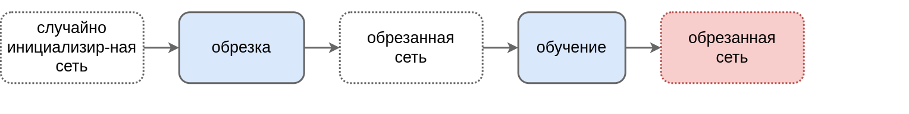
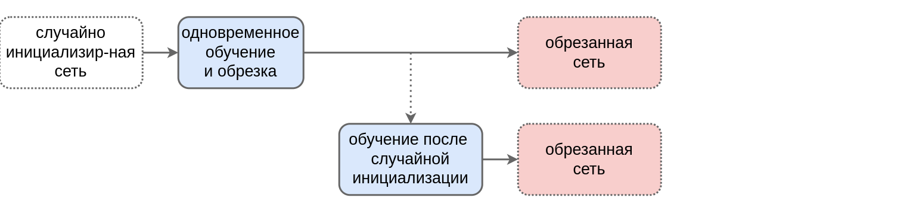
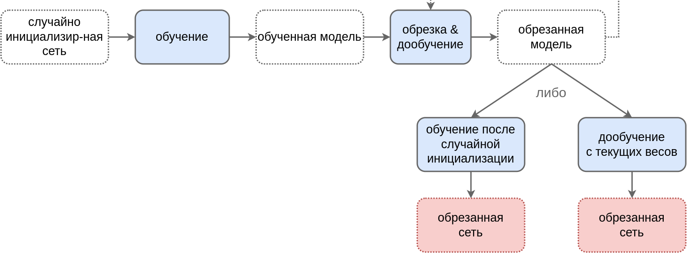

---
jupyter:
  jupytext:
    text_representation:
      extension: .md
      format_name: markdown
      format_version: '1.3'
      jupytext_version: 1.16.7
  kernelspec:
    display_name: Python 3 (ipykernel)
    language: python
    name: python3
---

<!-- #region editable=true slideshow={"slide_type": "slide"} toc=true -->
# Лекция 19: Борьба со сложностью и переобучением нейронных сетей

МГТУ им. Н.Э. Баумана

Красников Александр Сергеевич

https://github.com/askras/bmstu_machinelearning/

2024-2025
<!-- #endregion -->

<!-- #region editable=true slideshow={"slide_type": "slide"} -->
## Регуляризация

### Задача обобщения

В машинном и, в частности, глубоком обучении с учителем решается задача обобщения зависимости между входом и выходом для конечной обучающей выборки:

$$
\{(\mathbf{x}_1,y_1),(\mathbf{x}_2,y_2), ... (\mathbf{x}_N,y_N)\},
$$

чтобы уметь предсказывать значение выхода $y$ для произвольного входа $x$, используя прогноз:

$$
\hat{y}=f_\mathbf{w}(\mathbf{x})
$$
<!-- #endregion -->

<!-- #region editable=true slideshow={"slide_type": "slide"} -->
### Эмпирический риск

Параметры $\mathbf{w}$ прогнозной функции подбираются, минимизируя **эмпирический риск** на обучающей выборке.

### Недоопределённая задача

Задача является **недоопределённой** (ill-posed), поскольку существует бесконечно много функций, принимающих заданные значения $y_1,y_2,...y_N$ на конечном наборе наблюдений $\mathbf{x}_1,\mathbf{x}_2,...\mathbf{x}_N$.

Если рассматривать всё многообразие реальных зависимостей $y(\mathbf{x})$, то никакая прогнозная функция $f(\mathbf{x})$ не обладает преимуществом, так как значения целевой переменной на тестовой выборке $y(\mathbf{x}_{N+1}),y(\mathbf{x}_{N+2}),...$ теоретически *могут быть любыми*.
<!-- #endregion -->

<!-- #region editable=true slideshow={"slide_type": "slide"} -->
### Гибкость модели

Увеличение гибкости модели не всегда улучшает её полезность. Сложная функция может хорошо описывать обучающую выборку, но иметь низкую обобщающую способность из-за **переобучения**.
<!-- #endregion -->

<!-- #region editable=true slideshow={"slide_type": "slide"} -->
### Свойства регулярности

К счастью, реальные зависимости обладают **свойствами регулярности**:
- **Непрерывность**: малые изменения входов → малые изменения выходов.
- **Условие Липшица**: разница между выходами ограничена пропорционально разнице входов.
<!-- #endregion -->

<!-- #region editable=true slideshow={"slide_type": "slide"} -->
### Регуляризация

**Регуляризация** (regularization) — ограничение перебора моделей с использованием априорных предположений о данных (inductive bias).

Регуляризация улучшает обобщаемость, если соответствует реальным зависимостям. Неверные предположения (например, линейность при нелинейной зависимости) могут ухудшить результат.

### Регуляризация может навредить

- Пример: предположение о линейности для нелинейных данных.
<!-- #endregion -->

<!-- #region editable=true slideshow={"slide_type": "slide"} -->
## Способы регуляризации
- Ограничение архитектуры
- Регуляризация весов нейросети
- Трансферное обучение
- Ранняя остановка
- Зашумление входов
- Аугментация данных
- Дропаут
- Прореживание сети
<!-- #endregion -->

<!-- #region editable=true slideshow={"slide_type": "slide"} -->
## Ограничение архитектуры

Самым простым способом сузить пространство поиска нейронных сетей является упрощение этого пространства:

1. использовать меньше слоёв
2. использовать меньше нейронов
3. использовать меньше входных признаков
4. уменьшить число связей
5. наложить ограничения на веса
<!-- #endregion -->

<!-- #region editable=true slideshow={"slide_type": "slide"} -->
### Последствия ограничения архитектуры

- **Уменьшение числа слоёв** противоречит идеологии глубокого обучения по автоматической настройке информативных признаков за счёт увеличения числа слоёв нейросети.
Однако в случае, когда реальная зависимость проста (например, линейна), а обучающих данных мало, это улучшает качество.

- **Уменьшение числа нейронов** способно сильно упростить модель, особенно для многословных персептронов, где связи между нейронами соседних слоёв устанавливаются по принципу каждый-с-каждым.

- **Уменьшение числа признаков** - частный случай предыдущего подхода, когда уменьшается число нейронов входного слоя.
  - Если просто сокращать объём известной информации, то качество может сильно ухудшиться. Поэтому, если необходимо использовать мало признаков, то имеет смысл сгенерировать вручную максимально информативную "выжимку" из всех исходных признаков (feature engineering).
> Например, если стоит задача определения времени суток по фотографии, то вместо всего изображения можно подавать интеллектуальные признаки, имеющие связь с ответом, такие как положение солнца на фото и средняя яркость пикселей.
  - Добавление нестандартных признаков, сгенерированных вручную, способны повысить качество и сложной модели тоже.

- **Уменьшение числа связей**. Поскольку сложность модели зависит от числа настраиваемых параметров, отвечающих связям между нейронами, то можно упросить модель не за счёт сокращения числа нейронов, а **за счёт сокращения числа связей между ними**, сделав эти связи более разреженными (sparse connections).
<!-- #endregion -->

<!-- #region editable=true slideshow={"slide_type": "slide"} -->
### Пример
Рассмотрим следующий многослойный персептрон, где для простоты опущены единичные нейроны.

<!-- #endregion -->

<!-- #region editable=true slideshow={"slide_type": "slide"} -->
#### Прореживание весов (Weights Sparse)
Сделав предположение, что каждый нейрон на первом и втором скрытом слое зависит только от двух своих соседей, получим существенное уменьшение числа связей (и, соответственно, настраиваемых весов):

<!-- #endregion -->

<!-- #region editable=true slideshow={"slide_type": "slide"} -->
#### Связка весов (Weight Sharing)
Можно пойти дальше, и **наложить ограничения на значения весов**, например предполагать их неотрицательность или связать веса друг с другом (weight sharing), чтобы они принимали одинаковые значения. Пример такого ограничения приведён на рисунке ниже, где на первом и втором слое связи с одинаковыми весами помечены одинаковым цветом:

Подобное прореживание связей и привязка весов друг к другу используется в популярной операции свёртки (convolution) для обработки последовательностей.
<!-- #endregion -->

<!-- #region editable=true slideshow={"slide_type": "slide"} -->
#### Мягкая связка весов (Soft Weight Sharing)

Если точное приравнивание весов друг к другу слишком сильно снижает выразительную способность модели, то веса можно привязать друг к другу мягко (soft weight sharing) за счёт того, что мы позволим им принимать разные значения, но не сильно отличающиеся друг от друга. Это достигается ручной разбивкой весов на группы $G_1,G_2,...G_K$ и добавлением регуляризатора

$$
\lambda \sum_{k=1}^K \sum_{i\in G_k}\sum_{j\in G_k, j>i}||w_i-w_j||^2
$$

в функцию потерь, по которым будем настраивать модель. Чем выше гиперпараметр $\lambda>0$, тем более похожие значения будут принимать веса, находящиеся в одной группе.
<!-- #endregion -->

<!-- #region editable=true slideshow={"slide_type": "slide"} -->
## Регуляризация весов нейросети

### Идея регуляризации весов нейросети

- Альтернатива жёсткому упрощению архитектуры сети
- Добавление штрафа за большие значения весов:
  - **L₂ регуляризация (Weight Decay):** Штраф за квадраты весов
    $$L(X,Y) \rightarrow
    L(X,Y) \textcolor{red}{+ \lambda||𝐰||_2^2}
    = L(X,Y) \textcolor{red}{+ \lambda \sum\limits_{i=1}^{I}w_i^2}$$
    
  - **L₁ регуляризация:** Штраф за абсолютные значения весов
    $$L(X,Y) \rightarrow
    L(X,Y) \textcolor{red}{+ \lambda||𝐰||_1}
    = L(X,Y) \textcolor{red}{+ \lambda \sum\limits_{i=1}^{I}|w_i|}$$
    
<!-- #endregion -->

<!-- #region editable=true slideshow={"slide_type": "slide"} -->
## Эффекты регуляризации

- Веса становятся **меньше по величине**
- Прогнозная функция изменяется **более плавно**
- Соответствует реальным зависимостям данных
- Предотвращает переобучение
<!-- #endregion -->

<!-- #region editable=true slideshow={"slide_type": "slide"} -->
## Контроль силы регуляризации

- Гиперпараметр $\lambda > 0$:
  - Чем больше $\lambda$ тем сильнее сжатие весов
  - Чем больше $\lambda$ темслабее регуляризация
- Подбор $\lambda$:
  - По валидационной выборке
  - Логарифмическая сетка значений ($10^{-6}, 10^{-5}, \ldots, 10^{5}, 10^{6}$)
<!-- #endregion -->

<!-- #region editable=true slideshow={"slide_type": "slide"} -->
## Различия L₁ и L₂ регуляризации

| Особенность               | L₂                          | L₁                          |
|---------------------------|-----------------------------|-----------------------------|
| Сила сжатия               | Пропорциональна весу        | Постоянная                  |
| Нулевые веса              | Редко                       | Часто (при больших λ)       |
| Геометрия                 | Сфера (мягкие границы)      | Ромб (острые углы)          |

<!-- #endregion -->

<!-- #region editable=true slideshow={"slide_type": "slide"} -->
## Особый учёт смещений

Веса смещений (bias) **не регуляризуются**:
 - Предотвращают смещение прогнозов к нулю
 - Незначительно влияют на сложность модели
 - Сохраняют информацию о базовом уровне активаций
<!-- #endregion -->

<!-- #region editable=true slideshow={"slide_type": "slide"} -->
## Стратегия регуляризации слоёв

**Разная сила регуляризации** для разных слоев:
- Слабый штраф: начальные слои  (сохраняют информацию о входах)
- Сильный штраф: конечные слои (упрощают сложные комбинации признаков)
- Типичный подход:  
  $\lambda_{первый\ слой} < \lambda_{скрытые} < \lambda_{выходной}$
<!-- #endregion -->

<!-- #region editable=true slideshow={"slide_type": "slide"} -->
## Трансферное обучение (transfer learning)

- Трансферное обучение — это метод, позволяющий использовать знания, полученные при решении одной задачи, для решения другой, связанной задачи.

- Особенно полезно в ситуациях, когда данных для целевой задачи недостаточно.
<!-- #endregion -->

<!-- #region editable=true slideshow={"slide_type": "slide"} -->
### Жесткий перенос весов (Hard Weight Sharing)

- **Пример задачи A**: Распознавание модели машины по фотографии.

- **Проблема**: Недостаток размеченных данных для узкоспециализированной задачи.

- **Решение**: Использование данных из похожей задачи B (например, классификация объектов на  [ImageNet](https://www.image-net.org/)).
<!-- #endregion -->

<!-- #region editable=true slideshow={"slide_type": "slide"} -->
#### Применение ImageNet

- Датасет ImageNet содержит более 14 миллионов размеченных изображений.

- Существуют уже настроенные модели для классификации объектов.

- Задача A и B используют схожие признаки (углы, цвет, графические паттерны).
<!-- #endregion -->

<!-- #region editable=true slideshow={"slide_type": "slide"} -->
#### Процесс переноса весов

- Веса первых слоёв модели, решающей задачу B, переносятся на модель задачи A.

- Настраиваются только последние слои модели A.

- Это позволяет сэкономить время и ресурсы на обучение.

<!-- #endregion -->

<!-- #region editable=true slideshow={"slide_type": "slide"} -->
### Мягкий перенос весов (Soft Weight Sharing)

Если задача A отличается от задачи B, низкоуровневые признаки могут требовать донастройки.

- Способы донастройки:
  - Донастройка всех весов с малым шагом обучения.
  - Настройка с обычным шагом, но с регуляризацией, препятствующей сильному отклонению весов.
<!-- #endregion -->

<!-- #region editable=true slideshow={"slide_type": "slide"} -->
## Ранняя остановка (Early Stopping)

- Ранняя остановка — это метод, используемый для предотвращения переобучения нейросетей.

- Позволяет остановить обучение, когда модель начинает показывать ухудшение на валидационной выборке.
<!-- #endregion -->

<!-- #region editable=true slideshow={"slide_type": "slide"} -->
### Проблема переобучения

- Переобучение происходит, когда модель начинает запоминать особенности обучающей выборки, вместо того чтобы обобщать.

- Это приводит к плохой производительности на новых данных.

- В начале обучения модель учится выявлять общие закономерности в данных.

- После определенного момента модель начинает переобучаться на частные особенности обучающей выборки.
<!-- #endregion -->

<!-- #region editable=true slideshow={"slide_type": "slide"} -->
### Принцип работы ранней остановки

- Отслеживание потерь модели на валидационной выборке в процессе обучения.

- Остановка обучения, когда потери на валидации начинают расти.

<!-- #endregion -->

<!-- #region editable=true slideshow={"slide_type": "slide"} -->
### Слайд 7: Преимущества ранней остановки

- Позволяет получить более простую и менее переобученную модель.

- Снижает время и ресурсы, затрачиваемые на обучение.

### Слайд 8: Заключение

- Ранняя остановка — важный инструмент в обучении нейросетей.

- Эффективно помогает предотвратить переобучение и улучшить обобщающую способность модели.

<!-- #endregion -->

<!-- #region editable=true slideshow={"slide_type": "slide"} -->
## Зашумление данных

Зашумление данных является эффективным методом для улучшения обобщающей способности модели и предотвращения переобучения, что делает его важным инструментом в обучении нейросетей.
<!-- #endregion -->

<!-- #region editable=true slideshow={"slide_type": "slide"} -->
### Принцип зашумления

Обучение модели происходит на данных, которые представляют собой комбинацию исходных данных и случайного шума:
$$(\mathbf{x},y) \to (\mathbf{x}+\mathbf{\varepsilon},y)$$

где $\mathbf{\varepsilon}$ - $D$-мерный вектор случайных чисел (случайный шум), обладающий свойствами:

$$\mathbb{E}\mathbf{\varepsilon} = 0, \quad  \text{cov}\{\mathbf{\varepsilon}\}=\lambda I,$$

где $I\in\mathbb{R}^{D\times D}$ - единичная матрица. При этом **применение модели** осуществляется на исходных данных **без зашумления**.
<!-- #endregion -->

<!-- #region editable=true slideshow={"slide_type": "slide"} -->
### Регуляризация через зашумление

Обучение регрессии $f(\mathbf{x})$, минимизируя MSE на зашумлённых данных, эквивалентно обучению на незашумлённых данных с добавлением регуляризации:
$$\frac{1}{N}\sum_{n=1}^N (f(\mathbf{x}_n)-y_n)^2 + \textcolor{red}{\lambda \| \nabla_\mathbf{x} f(\mathbf{x}) \|^2} \to \min_\mathbf{w}$$
<!-- #endregion -->

<!-- #region editable=true slideshow={"slide_type": "slide"} -->
### Эффект зашумления

Зашумление признаков требует от модели, чтобы изменения её прогнозов были менее резкими при небольших изменениях вектора признаков $x$. Это соответствует реальным зависимостям в данных.
<!-- #endregion -->

<!-- #region editable=true slideshow={"slide_type": "slide"} -->
### Применение в линейной регрессии

В случае, когда $f(\mathbf{x})$ — линейная регрессия, зашумление эквивалентно $L_2$ регуляризации весов, что помогает предотвратить переобучение.
<!-- #endregion -->

<!-- #region editable=true slideshow={"slide_type": "slide"} -->
## Аугментация данных

Дополнительным требованием на модель может быть инвариантность к определённому виду преобразования $g_\mathbf{\theta}(\mathbf{x})$, где $\mathbf{\theta}$ - параметр этого преобразования.

Иными словами, если $f(\mathbf{x})$ - прогноз нейросети для объекта $\mathbf{x}$, то мы хотим, чтобы этот прогноз не изменялся при преобразовании объекта, т.е. требуем, чтобы

$$ f(\mathbf{x}) \approx f(g_\theta(\mathbf{x})) $$

Это свойство называется **инвариантностью** (invariance) прогнозов модели к преобразованию.

Может быть много разных преобразований $g^1_{\theta_1}(\mathbf{x}), g^2_{\theta_2}(\mathbf{x}), ... g^K_{\theta_K}(\mathbf{x})$, относительно которых мы хотим достичь инвариантности.
<!-- #endregion -->

<!-- #region editable=true slideshow={"slide_type": "slide"} -->
### Примеры инвариантных преобразований
 - повернуть на небольшой угол $\theta$;
- изменить яркость цветов на $\theta$;
- обрезать края на $\theta$ пикселей
- и т.д.

### Расширенин обучающей выборки
Самый простой способ сделать нейросеть инвариантной к определённым преобразованиям - это **расширить обучающую выборку**, применяя **аугментацию данных** (data augmentation) преобразуя объекты случайными преобразованиями, относительно которых мы хотим достичь инвариантных прогнозов.

При этом преобразованные версии объектов помечаются той же самой целевой меткой, что и исходные объекты.

Таким образом, одно наблюдение $\{\mathbf{x},\mathbf{y}\}$ преобразуется в целый набор обучающих примеров вида

$$ \{g^1_{\theta_1}(g^2_{\theta2}...(g^K_{\theta_K}(\mathbf{x})..))\}_{\theta_1,...\theta_K}, \mathbf{y} \} $$

с одним и тем же откликом $y$ для всевозможных параметров инвариантных преобразований $\theta_1, ..., \theta_K$, на которых мы обучаем модель.

Эта техника позволяет не только сделать прогнозы сети **более инвариантными** к преобразованиям, но и **существенно увеличить размер обучающей выборки** и повысить разнообразие обучающих примеров, что улучшит качество настройки модели.
<!-- #endregion -->

<!-- #region editable=true slideshow={"slide_type": "slide"} -->
### Примеры инвариантных преобразований для классификации изображений

<!-- #endregion -->

<!-- #region editable=true slideshow={"slide_type": "slide"} -->

<!-- #endregion -->

<!-- #region editable=true slideshow={"slide_type": "slide"} -->

<!-- #endregion -->

<!-- #region editable=true slideshow={"slide_type": "slide"} -->

<!-- #endregion -->

<!-- #region editable=true slideshow={"slide_type": "slide"} -->

<!-- #endregion -->

<!-- #region editable=true slideshow={"slide_type": "slide"} -->

<!-- #endregion -->

<!-- #region editable=true slideshow={"slide_type": "slide"} -->

<!-- #endregion -->

<!-- #region editable=true slideshow={"slide_type": "slide"} -->

<!-- #endregion -->

<!-- #region editable=true slideshow={"slide_type": "slide"} -->

<!-- #endregion -->

<!-- #region editable=true slideshow={"slide_type": "slide"} -->

<!-- #endregion -->

<!-- #region editable=true slideshow={"slide_type": "slide"} -->
### Аугментация данных для текстов

Рассмотрим классификацию текстов.
<!-- #endregion -->

<!-- #region editable=true slideshow={"slide_type": "slide"} -->
#### Замена текста его переформулировкой

Можно сгенерировать автоматически, переводя текст на другой язык, а потом обратно:

<!-- #endregion -->

<!-- #region editable=true slideshow={"slide_type": "slide"} -->
### Замена случайных слов их синонимами или близкими по смыслу словами

<!-- #endregion -->

<!-- #region editable=true slideshow={"slide_type": "slide"} -->
##### Исключение случайных слов или предложений 

<!-- #endregion -->

<!-- #region editable=true slideshow={"slide_type": "slide"} -->
#### Изменение порядка предложений

<!-- #endregion -->

<!-- #region editable=true slideshow={"slide_type": "slide"} -->
### Аугментация данных при анализе речи

При анализе звуковых данных, главным образом, человеческой речи, применяются следующие виды расширения обучающей выборки:

- Обрезка звука. Причём обрезка может осуществляться как с начала и конца, так и в середине.
- Менять среднюю высоту всех частот звука либо случайно варьировать каждую частоту в отдельности.
- Изменение частоты можно производить не глобально для всего звука, а изменять её локально с разной силой.
- Ускорять/замедлять отдельные временные фрагменты, сохраняя частоты.
- Добавление небольшого шума к звуку. Шум можно генерировать случайным либо накладывать реальные звуки (вырезанные, например, из youtube-роликов) с небольшой громкостью.
<!-- #endregion -->

<!-- #region editable=true slideshow={"slide_type": "slide"} -->
### Последствия аугментации

- Расширение обучающей выборки аугментацией - мощный инструмент по увеличению числа обучающих примеров и по обучению модели быть устойчивой к тем или иным трансформациям. 

- **Аугментация данных способна существенно повысить качество прогнозов** и активно используется в прикладных задачах и соревнованиях по анализу данных.

- Аугментация данных широко используется не только для нейросетей, но и для обычных моделей машинного обучения.

- Поскольку расширение генерирует синтетические объекты, которые не совсем укладываются в их типичное распределение, **слишком сильная аугментация может и ухудшить качество**.
<!-- #endregion -->

<!-- #region editable=true slideshow={"slide_type": "slide"} -->
### Рекомендации по применению аугментации

- Валидируйте модель только по исходным (нетрансформированным) объектам. Это обеспечит адекватный контроль качества на реальных объектах, а не на их синтетических преобразованиях.
- Если валидируете качество модели по объекту, то его трансформированная версия не должна оказываться в обучающей выборке, иначе модель может переобучиться на этот объект и показать завышенное качество.
- Контролируйте степень трансформации, чтобы она не слишком портила обучающие данные. Например в задаче распознавания цифр, если девятку повернуть на 180 градусов, то получим шестёрку! Если к изображению применить слишком сильные нелинейные искажения, то потратим ценный ресурс обучения нейросети на классификацию изображений, которые в тестовой выборке никогда не встретятся.
- Степень расширения и долю расширенных объектов необходимо подбирать по валидационной выборке.
<!-- #endregion -->

<!-- #region editable=true slideshow={"slide_type": "slide"} -->
### Синхронное изменение прогноза

####  Эквивариантность (equivariance)

Вместо того, чтобы требовать неизменности прогноза при некоторой трансформации признаков, можно требовать синхронного изменения прогноза, т.е.

$$ f(g(\mathbf{x}))\approx g(\mathbf{y}), $$

где $f(\cdot)$ - прогностическая модель, а $g(\cdot)$ - некоторая трансформация входа и выхода.
<!-- #endregion -->

<!-- #region editable=true slideshow={"slide_type": "slide"} -->
#### Применение

**Задача сегментации изображения**, в которой каждый пиксель необходимо отнести к некоторому классу. 

Если $g(\cdot)$ - операция сдвига, то логично ожидать при сдвиге входного изображения синхронный сдвиг и выходной сегментационной маски:

Эквивариантность может быть обобщено, когда преобразованию входа $g_1(\mathbf{x})$ соответствует преобразованию выхода с _другой функцией трансформации_ $g_2(\mathbf{y})$:

$$ f(g_1(\mathbf{x})) \approx g_2(\mathbf{y}) $$
<!-- #endregion -->

<!-- #region editable=true slideshow={"slide_type": "slide"} -->
## Дропаут (DropOut) 

### Усредняющий ансамбль
Частым способом упрощения набора переобученных моделей $f_1(\mathbf{x}),...f_M(\mathbf{x})$ является построение усредняющего ансамбля:

$$
\hat{y}=\frac{1}{M}\sum_{m=1}^M f_m(\mathbf{x})
$$

Поскольку нейросети в большинстве случаев содержат большое число параметров и являются переобученными, то их усреднение существенно повышает качество прогнозов. Однако применение усредняющего ансамбля напрямую несёт в себе вычислительные издержки - в $M$ раз увеличиваются расходы на настройку моделей, их хранение и применение, что особенно чувствительно, когда моделями выступают большие и глубокие нейросети.
<!-- #endregion -->

<!-- #region editable=true slideshow={"slide_type": "slide"} -->
### Дропаут
Эффективным способом моделирования усредняющего ансамбля без сопутствующих издержек является **дропаут** (dropout).
<!-- #endregion -->

<!-- #region editable=true slideshow={"slide_type": "slide"} -->
#### Обучение сети
На каждом шаге оптимизации методом обратного распространения ошибки проход осуществляется **по прореженной версии сети**:

- Каждый нейрон оставляется с вероятностью $p=0.5$ (по умолчанию)
- Обновление весов только по активным связям
- Фактически обучается ансамбль из $2^M$ моделей
<!-- #endregion -->

<!-- #region editable=true slideshow={"slide_type": "slide"} -->
#### Применение настроенной сети
##### Дропаут Монте-Карло

Теоретически верным построением прогноза для настроенного ансамбля моделей будет усреднение по всевозможным вариантам прореживания $R$:

$$
\hat{y}(\mathbf{x})=\frac{1}{2^M}\sum_{R}\hat{y}(\mathbf{x}|R),
$$
где $\hat{y}(\mathbf{x}|R)$ -  прогноз при прореживании $R$, а $y^(x)$ - итоговый прогноз. 

На практике усреднение уже по 10-20 случайным маскам $R$ даёт хороший результат. 

##### Классическое применение

Поскольку усреднение по всевозможным прореживаниям замедляет построение прогнозов, чаще всего применяется классический дропаут, при котором на этапе применения (inference) используются все нейроны (без прореживания), но их активации домножаются на вероятность того, что нейрон был оставлен во время обучения.
<!-- #endregion -->

<!-- #region editable=true slideshow={"slide_type": "slide"} -->
### Особенности применения DropOut
- Параметр $p$ подбирается отдельно для каждого слоя
- Рекомендуется уменьшать $p$ в глубоких слоях
- Применяется к скрытым/входным слоям, но не к выходным
<!-- #endregion -->

<!-- #region editable=true slideshow={"slide_type": "slide"} -->
### Обоснование метода
- Предотвращает сонастройку нейронов (co-adaptation)
- Форсирует использование разнообразных признаков
- Пример: классификация автомобилей по комплексу признаков
<!-- #endregion -->

<!-- #region editable=true slideshow={"slide_type": "slide"} -->
### DropConnect - aльтернатива дропауту

Альтернативным к дропауту методом регуляризации сети является метод **DropConnect**, в котором с вероятностью $p$ отбрасываются не нейроны, а отдельные связи на выбранном слое. 

<!-- #endregion -->

<!-- #region editable=true slideshow={"slide_type": "slide"} -->
## Прореживание сети

Эффективным подходом является **автоматическое прореживание сети** (automatic network pruning), т.е. автоматическое отбрасывание малозначимых фрагментов сети (связей, нейронов, наборов нейронов или целых слоёв). Это проще чем ручное построение архитектуры и позволяет лучше подстроить прореживание под специфику изучаемых данных.
<!-- #endregion -->

<!-- #region editable=true slideshow={"slide_type": "slide"} -->
### Преимущества

- упростить нейросеть, чтобы бороться с переобучением и повысить обобщающую способность сети;
- сократить число параметров, чтобы сеть занимала меньше памяти;
- уменьшить энергопотребление ресурсоёмких вычислений;
- использовать нейросеть на менее мощных процессорах (в телефоне, автономном роботе);
- быстрее обрабатывать большие объемы информации (например, видеопоток);
- увеличить масштабируемость сети, обрабатывать большее число запросов.
<!-- #endregion -->

<!-- #region editable=true slideshow={"slide_type": "slide"} -->
### Виды прореживания

- по характеру прореживаемых блоков
- по времени прореживания относительно настройки
<!-- #endregion -->

<!-- #region editable=true slideshow={"slide_type": "slide"} -->
#### Прореживание по характеру прореживаемых блоков

- **неструктурированные** (unstructured), при котором исключаются отдельные связи за счёт зануления соответствующих весов;
  - приводят к уменьшению числа вычислений, *только если библиотека и оборудование поддерживают работу с разреженными данными*.
  - в противном случае будет производиться тот же объём вычислений, только с данными, содержащими много нулей, поскольку размеры перемножаемых тензоров от неструктурированного прореживания не изменятся.
- **структурированные** (structured), при котором исключаются целые блоки нейросети, такие как нейроны (со всеми входящими и исходящими связями), а в случае свёрточных сетей - свёрточные каналы.
  - приводят к уменьшению числа вычислений, поскольку меняют размеры перемножаемых тензоров.

Оба вида прореживания упрощают модель, уменьшая её степень переобученности. При хранении весов в **разреженном формате** (sparse format) прореженная сеть будет занимать меньше памяти.
<!-- #endregion -->

<!-- #region editable=true slideshow={"slide_type": "slide"} -->
#### По времени прореживания относительно настройки модели они делятся на:

- **прореживание до обучения** (pruning before training)
- **прореживание во время обучения** (pruning during training)
- **прореживание после обучения** (pruning after training)

<!-- #endregion -->

<!-- #region editable=true slideshow={"slide_type": "slide"} -->
##### Прореживание до обучения

**Прореживание до обучения** (pruning before training) применяет алгоритм прореживания к случайно инициализированной большой сети. За счёт того, что обучение производится на прореженной сети, получаем эффективность как на этапе применения прореженной модели, *так и на этапе обучения*.

Вариант применения подхода - всё-таки произвести небольшое число итераций обучения сети до прореживания, а основной объём вычислений производить уже после прореживания (pruning in early training), когда станет яснее, какие фрагменты сети важны, а какие - нет.
<!-- #endregion -->

<!-- #region editable=true slideshow={"slide_type": "slide"} -->
##### Прореживание во время обучения

**Прореживание во время обучения сети** (pruning during training) обладает тем достоинством, что позволяет донастроить веса с учётом прореженных связей, т.е. из сети не просто исключаются элементы, но сеть активно приспосабливается к этому прореживанию.

Для этого при настройке сети используется $L_1$ регуляризация по весам или по множителям $\gamma$ при блоках нейросети, которая известна тем, что зануляет отдельные элементы вектора, приводя к прореживанию:

$$
L(X,Y) \to L(X,Y) + \lambda \sum_{i=1}^I |w_i|,
$$

$$
L(X,Y) \to L(X,Y) + \lambda \sum_{i=1}^I |\gamma_i|,
$$

где $L(X,Y)$ - исходная функция потерь на обучающей выборке.

<!-- #endregion -->

<!-- #region editable=true slideshow={"slide_type": "slide"} -->
##### Прореживание после обучения

**При прореживании после обучения** (pruning after training) прореживание применяется к уже настроенной полной модели.

Если вычислительных ресурсов недостаточно, то результат прореживания представляет собой конечную модель, иначе можно улучшить результат, дообучив обрезанную модель либо с текущими весами, либо после их случайной реинициализации.

<!-- #endregion -->

<!-- #region editable=true slideshow={"slide_type": "slide"} -->
## Литература

1. Wolpert D. H., Macready W. G. No free lunch theorems for optimization //IEEE transactions on evolutionary computation. – 1997. – Т. 1. – №. 1. – С. 67-82.
2. [Nowlan S. J., Hinton G. E. Simplifying neural networks by soft weight sharing //The mathematics of generalization. – CRC Press, 2018. – С. 373-394.](https://www.cs.utoronto.ca/~hinton/absps/sunspots.pdf)
3. [No Free Lunch Theorem](https://en.wikipedia.org/wiki/No_free_lunch_theorem)
4. [Bishop C. M. Regularization and complexity control in feed-forward networks. – 1995.](https://publications.aston.ac.uk/id/eprint/524/)
5. [Srivastava N. et al. Dropout (JMLR 2014)](https://www.jmlr.org/papers/volume15/srivastava14a/srivastava14a.pdf)
6. [Cheng H., Zhang M., Shi J. Q. A survey on deep neural network pruning: Taxonomy, comparison, analysis, and recommendations //IEEE Transactions on Pattern Analysis and Machine Intelligence. – 2024.](https://arxiv.org/abs/2308.06767)
7. [Gholami A. et al. A survey of quantization methods for efficient neural network inference //Low-Power Computer Vision. – Chapman and Hall/CRC, 2022. – С. 291-326.](https://arxiv.org/abs/2103.13630)
<!-- #endregion -->
