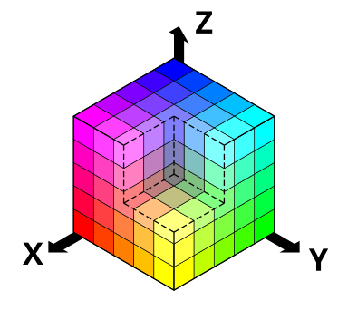

---
jupyter:
  jupytext:
    text_representation:
      extension: .md
      format_name: markdown
      format_version: '1.3'
      jupytext_version: 1.16.7
  kernelspec:
    display_name: Python 3 (ipykernel)
    language: python
    name: python3
---

<!-- #region editable=true slideshow={"slide_type": "slide"} toc=true -->
# Лекция 20: Обработка изображений и последовательностей

МГТУ им. Н.Э. Баумана

Красников Александр Сергеевич

https://github.com/askras/bmstu_machinelearning/

2024-2025
<!-- #endregion -->

<!-- #region editable=true slideshow={"slide_type": "slide"} -->
## Обработка последовательностей
<!-- #endregion -->

<!-- #region editable=true slideshow={"slide_type": "slide"} -->
### Обработка структурированных данных

- Ранее работали с вектором признаков $$\mathbf{x}=[x_1,x_2...x_D]$$

- Предположение о **неструктурированности признаков**

- На практике часто обрабатываем **структурированные данные**
<!-- #endregion -->

<!-- #region editable=true slideshow={"slide_type": "slide"} -->
#### Что такое структурированные данные?

- **Структурированные данные**: Позиция признаков имеет значение.

- Примеры:

- 1D: Временной ряд (цены на акцию)

- 1D: Последовательность (слова в предложении)

- 2D/3D: Матрица/Тензор (интенсивность пикселей)

- 3D: Воксели (МРТ снимки)

- 4D: Видео-данные (последовательность кадров)
<!-- #endregion -->

<!-- #region editable=true slideshow={"slide_type": "slide"} -->
#### Влияние позиции признаков

- Временной ряд: Время наблюдения задаёт структуру и влияет на результат.

- Изображение: Позиция пикселя соответствует его пространственному расположению.

- Хорошо коррелированные соседние пиксели.
<!-- #endregion -->

<!-- #region editable=true slideshow={"slide_type": "slide"} -->
#### Высокая размерность структурированных данных 

- Пример: Чёрно-белое изображение 1000x1000 = 1.000.000 признаков

- Использование многослойного перцептрона нецелесообразно.

- Риск переобучения и большие выборки для оценки модели.
<!-- #endregion -->

<!-- #region editable=true slideshow={"slide_type": "slide"} -->
#### Свойства обработки данных

- **Эквивариантность**: Сдвиг всех пикселей приводит к такой же сдвинутой функции.

- **Инвариантность**: Сдвиг пикселей не меняет изображаемый объект.
<!-- #endregion -->

<!-- #region editable=true slideshow={"slide_type": "slide"} -->
#### Иерархические локальные представления

- Структура объекта состоит из маленьких участков.

- Аналогичные принципы применимы к временным рядам и последовательностям.
<!-- #endregion -->

<!-- #region editable=true slideshow={"slide_type": "slide"} -->
#### Моделирование свойств структурированных данных

- **Свёртка**: Локально извлекает признаки инвариантно к расположению.

- **Пулинг**: Обеспечивает инвариантность к небольшим сдвигам.

- Комбинация свёрток и пулингов моделирует иерархичность.
<!-- #endregion -->

<!-- #region editable=true slideshow={"slide_type": "slide"} -->
### Операция свёртки

Пусть $\mathbf{x} = \lbrack x_{1},x_{2},...x_{D}\rbrack$ - обрабатываемая последовательность значений из чисел. Например, это может быть последовательность температур прибора, снимаемая каждые 10 секунд.

**Свёртка** (convolution) обладает параметрами:

- $K = \lbrack K( - n),K( - n + 1),...K(n - 1),K(n)\rbrack \in \mathbb{R}^{2n + 1}$ (ядро свёртки, convolution kernel, обычно нечётное по размеру, но может быть и чётным),
- смещение $b \in \mathbb{R}$.

Выходом операции свёртки будет последовательность $y$ с элементами, считаемыми по формуле

$$y_{j} = \sum\limits_{i = - n}^{n}K(i)x_{j + i} + b,\quad j = n + 1,...D - n.$$

Таким образом, свёртка генерирует последовательность, каждый элемент которой получается за счёт одного и того же линейного преобразования с $2n + 2$ параметрами.
<!-- #endregion -->

<!-- #region editable=true slideshow={"slide_type": "slide"} -->
### Пример вычисление свёртки
Рассмотрим пример вычисления свёртки для следующих данных:

Тогда выходной ряд будет строится следующим образом:
<!-- #endregion -->

<!-- #region editable=true slideshow={"slide_type": "slide"} -->

<!-- #endregion -->

<!-- #region editable=true slideshow={"slide_type": "slide"} -->

<!-- #endregion -->

<!-- #region editable=true slideshow={"slide_type": "slide"} -->

<!-- #endregion -->

<!-- #region editable=true slideshow={"slide_type": "slide"} -->

<!-- #endregion -->

<!-- #region editable=true slideshow={"slide_type": "slide"} -->

<!-- #endregion -->

<!-- #region editable=true slideshow={"slide_type": "slide"} -->
### Примеры свёрток

Рассмотрим частные виды свёрток. У всех смещение $b$ будет браться равным нулю.

- $K = \lbrack\frac{1}{5},\frac{1}{5},\frac{1}{5},\frac{1}{5},\frac{1}{5}\rbrack$: отвечает равномерному усреднению, сглаживает временной ряд.
- $K = \lbrack 0.1,0.2,0.4,0.2,0.1\rbrack$: неравномерное усреднение, сглаживает временной ряд, когда у центральных элементов вклад больше.
- $K = \lbrack - 1,0, + 1\rbrack$: вычисляет разностную производную $\Delta x_{j} = x_{j + 1} - x_{j - 1}$, т.е. скорость изменения наблюдаемой величины.
- $K = \lbrack + 1, - 2, + 1\rbrack$: вычисляет разностную вторую производную $\Delta x_{j} = (x_{j + 1} - x_{j}) - (x_{j} - x_{j - 1})$, т.е. скорость изменения скорости наблюдаемой величины.

Если есть обучающая выборка, то **эффективнее будет работать свёртка с автоматически настраиваемыми параметрами** ядра и смещения - так операция будет лучше соответствовать данным и решаемой задаче.
<!-- #endregion -->

<!-- #region editable=true slideshow={"slide_type": "slide"} jp-MarkdownHeadingCollapsed=true -->
### Свойства свёртки

Свёртка извлекает один и тот же **линейный признак** в каждой позиции **локально относительно позиции**. Таким образом, свёртка обеспечивает свойство эквивариантности к сдвигу (translation equivariance).
Это проиллюстрировано ниже, где слева показан линейный слой обычного многослойного персептрона, а справа - операция свёртки:

**Свёртка предполагает существенно меньшее количество связей** (sparse connections), что обеспечивает более быстрое вычисление и требует меньшее число параметров. **Дополнительное уменьшение параметров обеспечивается общностью весов** (parameter sharing). На рисунке справа одинаковые веса обозначены одним цветом.

**Свёртку можно применять к входным данным разной длины**, причем число оцениваемых параметров будет одним и тем же - $2n + 2$.

На многопроцессорных вычислительных устройствах, таких как видеокарта, вычисления производятся не последовательно один за другим, а параллельно, поэтому свёртка, вычисляемая независимо для разных позиций **считается очень быстро за счёт параллелизации**.

Также можно обратить внимание, что выходная последовательность получается короче на $2n$, чем входная, поскольку ядро свёртки упирается в начало и конец входной временной последовательности.
<!-- #endregion -->

<!-- #region editable=true slideshow={"slide_type": "slide"} jp-MarkdownHeadingCollapsed=true -->
### Обработка динамического временного ряда

Обработка **динамического временного ряда** специфична тем, что наблюдения $x_{1},x_{2},...x_{t}$ поступают последовательно, а будущие наблюдения еще неизвестны, когда нужно формировать выход $y_{t}$. Для такого рода данных свёртке разрешается смотреть только на последние располагаемые $n$ наблюдений:

$$y_{t} = \sum\limits_{i = 0}^{n - 1}K(i)x_{t - i} + b,$$

а у самой свёртки остаются только $n + 1$ параметров $K = \lbrack K(0),...K(n - 1)\rbrack$ и $b$. Пример действия такой свёртки показан ниже:

Такая свёртка может применяться для прогнозирования следующего элемента ряда:

$$y_{t} = {\hat{x}}_{t + 1}$$
<!-- #endregion -->

<!-- #region editable=true slideshow={"slide_type": "slide"} -->
## Извлечение сложных нелинейных признаков

Наслаивая свёртки друг на друга, можем извлекать более сложные признаки с расширенной **областью видимости** (receptive field), т.е. зависящими от более широкой окрестности значений (выделены красным цветом). 

На каждом слое действует свёртка со своими индивидуальными параметрами.

<!-- #endregion -->

<!-- #region editable=true slideshow={"slide_type": "slide"} -->

<!-- #endregion -->

<!-- #region editable=true slideshow={"slide_type": "slide"} -->

<!-- #endregion -->

<!-- #region editable=true slideshow={"slide_type": "slide"} -->

<!-- #endregion -->

<!-- #region editable=true slideshow={"slide_type": "slide"} -->

<!-- #endregion -->

<!-- #region editable=true slideshow={"slide_type": "slide"} -->
### Нелинейные признаки

Чтобы извлекаемые признаки получались *нелинейными*, после каждой свёртки применяют нелинейную функцию активации (иначе суперпозиция линейных операций снова даст линейную операцию).

Суперпозиция свёрток с операциями нелинейности приводит к **иерархичности признаковых представлений** входной последовательности - более высокие слои будут извлекать более сложные признаки, зависящие от более широкой окрестности в данных.
<!-- #endregion -->

<!-- #region editable=true slideshow={"slide_type": "slide"} -->
### Сложные признаки
Чтобы извлечь более разнообразные признаки, на каждом слое применяют не одну, а сразу несколько свёрток (каждая - со своими параметрами):

$$\begin{matrix}
y_{j}^{1} & {= \sum\limits_{i = - n}^{n}K^{1}(i)x_{j + i} + b^{1}} \\
y_{j}^{2} & {= \sum\limits_{i = - n}^{n}K^{2}(i)x_{j + i} + b^{2}} \\
\cdots & \\
y_{j}^{M} & {= \sum\limits_{i = - n}^{n}K^{M}(i)x_{j + i} + b^{M}}
\end{matrix}$$

Тогда каждая свёртка следующего (более высокого) слоя будет определяться как локальная линейная комбинация результатов *всех свёрток* предыдущего слоя, выполняя уже двумерную операцию:

$$z_{j} = \sum\limits_{s = 1}^{M}\sum\limits_{i = - n}^{n}K(s,i)y_{j + i}^{s} + b$$

<!-- #endregion -->

<!-- #region editable=true slideshow={"slide_type": "slide"} -->
###  Параметры и гиперпараметры  свёртки

Одномерная свёртка на последовательностях задаётся **параметрами** (настраиваемыми градиентной оптимизацией) и **гиперпараметрами** (задаваемыми пользователем).

Параметрами свёртки являются элементы вектора ядра свёртки $$K\in\mathbb{R}^{2n+1}$$ и смещение $$b\in\mathbb{R}.$$

Гиперпараметром свёртки является размер ядра $$2n+1.$$ Обычно он нечётный, но может браться и чётным. Далее рассмотрим другие гиперпараметры свёртки.
<!-- #endregion -->

<!-- #region editable=true slideshow={"slide_type": "slide"} -->
#### Паддинг

Свёртка приводит к уменьшению длины выходной последовательности, поскольку нельзя прижать ядро свёртки к самым краям. Если требуется на выходе получить такую же длину, как и на входе (например, для реализации ResNet блоков), то используется **паддинг** (padding) - предварительное расширение входной последовательности перед применением свёртки. Существуют разные виды паддинга - valid, zero, same и mirror. Логика их работы показана на рисунке:

<!-- #endregion -->

<!-- #region editable=true slideshow={"slide_type": "slide"} -->
#### Шаг свёртки

Иногда необходимо **уменьшить число выходных элементов свёртки**. Обычно это делается, чтобы уменьшить число связей (и, соответственно, параметров модели) на последующих слоях, чтобы сеть меньше [переобучалась](https://deepmachinelearning.ru/docs/Machine-learning/Base-concepts/Generalization-ability).

Для этого используется больший **шаг свёртки** (stride). Стандартная свёртка применяет ядро к определённой позиции, чтобы получить преактивацию (итоговая активация - действие [функции нелинейности](https://deepmachinelearning.ru/docs/Neural-networks/MLP/Activation-functions), такой как ReLU, на преактивацию). Следующая преактивация получается прикладыванием ядра свёртки к соседней позиции, что отвечает единичному шагу. Но для получения следующей преакивации ядро свёртки можно сдвигать не на одну позицию, а сразу на несколько. **Величина сдвига и называется шагом свёртки**.

#### Пример
Например, если сдвигать ядро свёртки для получения каждой следующей преактивации на 2, то длина выходного ряда будет примерно в 2 раза меньше, как показано на рисунках:
<!-- #endregion -->

<!-- #region editable=true slideshow={"slide_type": "slide"} -->
 

<!-- #endregion -->

<!-- #region editable=true slideshow={"slide_type": "slide"} -->

<!-- #endregion -->

<!-- #region editable=true slideshow={"slide_type": "slide"} -->

<!-- #endregion -->

<!-- #region editable=true slideshow={"slide_type": "slide"} -->

<!-- #endregion -->

<!-- #region editable=true slideshow={"slide_type": "slide"} -->
#### Сдвиг свёртки

Если обрабатываемая последовательность слишком длинная, то свёртки теряют эффективность, поскольку действуют локально и своей областью видимости захватывают лишь малый её фрагмент. **Область видимости свёртки** (receptive field) можно увеличить, если при перемножении элементов последовательности на элементы ядра свёртки идти не со сдвигом 1, а с большим **сдвигом** (dilation), как показано на рисунке:

На рисунке показан процесс извлечения лишь одного элемента выходной последовательности. Вся выходная последовательность извлекается аналогично обычной свёртке, когда свертка применяется многократно ко всем валидным позициям входной последовательности.
<!-- #endregion -->

<!-- #region editable=true slideshow={"slide_type": "slide"} -->
### Пулинг

**Пулинг** - это операция агрегации соседних значений последовательности или активаций свёртки, используемая для уменьшения длины промежуточного представления последовательности. Наиболее популярными видами пулинга являются максимизирующий и усредняющий.

#### Максимизирующий пулинг
Максимизирующий пулинг возвращает максимальный элемент в области. Например, для области из 3 соседних элементов:

<!-- #endregion -->

<!-- #region editable=true slideshow={"slide_type": "slide"} -->
#### Усредняющий пулинг
Усредняющий пулинг возвращает среднее значение элементов в области. Например, для области из 3 соседних элементов:

<!-- #endregion -->

<!-- #region editable=true slideshow={"slide_type": "slide"} -->
Если пулинг применяется к нескольким каналам, он выполняется независимо для каждого канала:

<!-- #endregion -->

<!-- #region editable=true slideshow={"slide_type": "slide"} -->
#### Гиперпараметры пулинга

У пулинга нет настраиваемых параметров, но есть два гиперпараметра:

- **Размер области (kernel size)**: Размер области, по которой производится агрегация. В примерах выше размер ядра был 3.
- **Шаг (stride)**: Шаг смещения агрегируемой области для получения следующего выходного значения. Обычно шаг выбирают равным размеру ядра.
<!-- #endregion -->

<!-- #region editable=true slideshow={"slide_type": "slide"} -->
#### Интуиция и преимущества пулинга

Пулинг помогает снизить размерность данных, что особенно полезно при обработке последовательностей с высокой размерностью. Например, пулинг с размером ядра 4 и шагом 4 уменьшит размерность выхода в 4 раза.
<!-- #endregion -->

<!-- #region editable=true slideshow={"slide_type": "slide"} -->
#### Максимизирующий пулинг
Максимизирующий пулинг извлекает наличие интересуемого признака где-либо в агрегируемой области.
<!-- #endregion -->

<!-- #region editable=true slideshow={"slide_type": "slide"} -->
#### Усредняющий пулинг
Усредняющий пулинг извлекает среднюю представленность интересуемого признака в агрегируемой области.

Пулинг также обеспечивает приближённую инвариантность к небольшим сдвигам входной последовательности:

<!-- #endregion -->

<!-- #region editable=true slideshow={"slide_type": "slide"} -->
#### Глобальный пулинг

Глобальный пулинг применяет агрегирующую операцию (усреднение или взятие максимума) ко всем значениям для каждого канала. Это позволяет перевести последовательность произвольной длины в вектор фиксированного размера, называемый **эмбеддингом последовательности**.

<!-- #endregion -->

<!-- #region editable=true slideshow={"slide_type": "slide"} -->
#### Пирамидальный пулинг

Пирамидальный пулинг позволяет сохранить информацию о том, в каких участках последовательности достигались максимальные значения. Последовательность делится на блоки, и агрегация производится как глобальная, так и в рамках каждого блока.

<!-- #endregion -->

<!-- #region editable=true slideshow={"slide_type": "slide"} -->
## Обработка изображений
<!-- #endregion -->

<!-- #region editable=true slideshow={"slide_type": "slide"} -->
### Цифровое представление изображений
<!-- #endregion -->

<!-- #region editable=true slideshow={"slide_type": "slide"} -->
#### Черно-белые изображения

Черно-белые изображения представляют собой матрицу интенсивностей пикселей размера $H \times W$, где $H$ — высота, а $W$ — ширина изображения. Каждый пиксель кодируется значением яркости, обычно в градациях серого.

<!-- #endregion -->

<!-- #region editable=true slideshow={"slide_type": "slide"} -->
#### Представление цветных изображений

Цветное изображение представляется тензором размера $3 \times H \times W$, где каждая из трех матриц соответствует интенсивности одного из цветовых каналов (например, RGB).

<!-- #endregion -->

<!-- #region editable=true slideshow={"slide_type": "slide"} -->
##### RGB

Цветные изображения часто представляются в формате **RGB**, где каждый цвет кодируется комбинацией трех базовых цветов: красного (Red), зеленого (Green) и синего (Blue). Каждый пиксель изображения состоит из трех компонент, соответствующих этим цветам.

<!-- #endregion -->

<!-- #region editable=true slideshow={"slide_type": "slide"} -->
##### CIELab

В формате **CIELab** цвет кодируется тремя компонентами:
- **L** — яркость (luminance),
- **a** и **b** — цветовые координаты.

Это представление позволяет разделять яркость и цвет, что полезно для задач, где важно учитывать только один из этих аспектов. Например, классификация объектов может быть инвариантна к освещению, если использовать только цветовые компоненты (a, b).

<!-- #endregion -->

<!-- #region editable=true slideshow={"slide_type": "slide"} -->
##### HCL

Формат **HCL** кодирует цвет тремя компонентами:
- **H** — цветовой тон (hue),
- **C** — насыщенность (chroma),
- **L** — яркость (lightness).

Это представление позволяет работать с изображениями, инвариантными к цвету, яркости и насыщенности.

<!-- #endregion -->

<!-- #region editable=true slideshow={"slide_type": "slide"} -->
### Свёртка для изображений

Свёртка для изображений — это линейная операция, применяемая к локальной области изображения. Она используется для извлечения признаков и применяется в задачах машинного и глубокого обучения.
<!-- #endregion -->

<!-- #region editable=true slideshow={"slide_type": "slide"} -->
#### Основные понятия
- **Изображение**: Представляется как трёхмерный тензор \( \mathbf{x} \in \mathbb{R}^{C \times H \times W} \), где \( C \) — количество каналов (например, 3 для RGB), \( H \) — высота, \( W \) — ширина.
- **Ядро свёртки**: \( K \in \mathbb{R}^{C \times (2n+1) \times (2n+1)} \) — матрица весов, применяемая к локальной области изображения.
- **Смещение**: \( b \in \mathbb{R} \) — параметр, добавляемый к результату свёртки.
<!-- #endregion -->

<!-- #region editable=true slideshow={"slide_type": "slide"} -->
#### Формула свёртки
Результат свёртки в позиции $ (u, v) $ вычисляется по формуле:
$$
y(u,v) = \sum_{c=1}^C \sum_{i=-n}^n \sum_{j=-n}^n K(c,i,j) \mathbf{x}(c,u+i,v+j) + b
$$

при этом свёртка применяется ко всем позициям $(u,v)$, к которым мы можем приложить ядро свёртки, генерируя тем самым двумерную карту активаций свёртки или карту признаков (feature map), как показано на рисунках.

После прохода по ряду мы сдвигаемся на следующий ряд в начало и проходим по нему. Так проходим по всем рядам, пока не дойдём до финальной позиции.
<!-- #endregion -->

<!-- #region editable=true slideshow={"slide_type": "slide"} -->

<!-- #endregion -->

<!-- #region editable=true slideshow={"slide_type": "slide"} -->

<!-- #endregion -->

<!-- #region editable=true slideshow={"slide_type": "slide"} -->

<!-- #endregion -->

<!-- #region editable=true slideshow={"slide_type": "slide"} -->

<!-- #endregion -->

<!-- #region editable=true slideshow={"slide_type": "slide"} -->
#### Примеры свёрток
- **Сглаживание**: Используется для уменьшения шума на изображении.
- **Повышение резкости**: Увеличивает контрастность границ.
- **Выделение границ**: Например, фильтр Собеля для выделения вертикальных и горизонтальных границ.
<!-- #endregion -->

<!-- #region editable=true slideshow={"slide_type": "slide"} -->
**Сглаживание**

<!-- #endregion -->

<!-- #region editable=true slideshow={"slide_type": "slide"} -->
**Фильтр Собеля**

<!-- #endregion -->

<!-- #region editable=true slideshow={"slide_type": "slide"} -->
#### Свёрточный слой
В нейросетях применяется не одна, а сразу несколько свёрток к изображению, извлекающих различные признаки. Совокупность одновременно применяемых свёрток образует **свёрточный слой** (convolutional layer).

Свёрточные слои можно наслаивать друг на друга, применяя последующие свёртки к картам активаций предыдущих свёрток:

<!-- #endregion -->

<!-- #region editable=true slideshow={"slide_type": "slide"} -->
### Область видимости сверток

При последовательном применении сверток область видимости (receptive field, область пикселей исходного изображения, от которых зависит результат) более поздних свёрток больше, чем у более ранних. Например, если последовательно применить две свертки 3×33×3, то у первой свёртки будет область видимости 3×33×3, а у второй - уже 5×55×5. 

<!-- #endregion -->

<!-- #region editable=true slideshow={"slide_type": "slide"} -->
#### Добавление нелинейностей
После каждого свёрточного слоя применяется функция активации (например, ReLU), чтобы добавить нелинейность в модель.
<!-- #endregion -->

<!-- #region editable=true slideshow={"slide_type": "slide"} -->
### Параметры и гиперпараметры свёрток

Свёртка для изображений имеет как параметры, настраиваемые в процессе обучения, так и гиперпараметры, задаваемые извне. Эти параметры влияют на то, как свёртка обрабатывает изображения и извлекает признаки.
<!-- #endregion -->

<!-- #region editable=true slideshow={"slide_type": "slide"} -->
#### Параметры свёртки
- **Ядро свёртки (convolution kernel)**: Матрица весов, применяемая к локальной области изображения.
- **Смещение (bias)**: Параметр, добавляемый к результату свёртки.
<!-- #endregion -->

<!-- #region editable=true slideshow={"slide_type": "slide"} -->
#### Гиперпараметры свёртки
- **Размер ядра свёртки (convolution size)**: Определяет размер области, к которой применяется свёртка.
- **Паддинг (padding)**: Расширение карты входных признаков для увеличения размера выходной карты активаций.
- **Шаг (stride)**: Определяет, на сколько пикселей сдвигается ядро свёртки при переходе к следующему элементу.
- **Сдвиг (dilation)**: Определяет, насколько сдвигается элемент карты активаций при переходе к следующему элементу ядра свёртки.
<!-- #endregion -->

<!-- #region editable=true slideshow={"slide_type": "slide"} -->
#### Паддинг
Паддинг применяется для увеличения размера выходной карты активаций. Основные виды паддинга:
- **Valid**: Без паддинга.
- **Zero**: Добавление нулей вокруг изображения.
- **Same**: Паддинг, который сохраняет размер выходной карты.
- **Mirror**: Отражающий паддинг, который отражает значения активаций относительно границ.
<!-- #endregion -->

<!-- #region editable=true slideshow={"slide_type": "slide"} -->

<!-- #endregion -->

<!-- #region editable=true slideshow={"slide_type": "slide"} -->

<!-- #endregion -->

<!-- #region editable=true slideshow={"slide_type": "slide"} -->

<!-- #endregion -->

<!-- #region editable=true slideshow={"slide_type": "slide"} -->

<!-- #endregion -->

<!-- #region editable=true slideshow={"slide_type": "slide"} -->
#### Шаг (Stride)
Шаг свёртки определяет, на сколько пикселей сдвигается ядро свёртки при переходе к следующему элементу. 
<!-- #endregion -->

<!-- #region editable=true slideshow={"slide_type": "slide"} -->
**Шаг 1**: Ядро сдвигается на один пиксель.

<!-- #endregion -->

<!-- #region editable=true slideshow={"slide_type": "slide"} -->
**Шаг 1**: Ядро сдвигается на один пиксель.

<!-- #endregion -->

<!-- #region editable=true slideshow={"slide_type": "slide"} -->
**Шаг 1**: Ядро сдвигается на один пиксель.

<!-- #endregion -->

<!-- #region editable=true slideshow={"slide_type": "slide"} -->
**Шаг 1**: Ядро сдвигается на один пиксель.

<!-- #endregion -->

<!-- #region editable=true slideshow={"slide_type": "slide"} -->
**Шаг 2**: Ядро сдвигается на два пикселя.

<!-- #endregion -->

<!-- #region editable=true slideshow={"slide_type": "slide"} -->
**Шаг 2**: Ядро сдвигается на два пикселя.

<!-- #endregion -->

<!-- #region editable=true slideshow={"slide_type": "slide"} -->
**Шаг 2**: Ядро сдвигается на два пикселя.

<!-- #endregion -->

<!-- #region editable=true slideshow={"slide_type": "slide"} -->
**Шаг 2**: Ядро сдвигается на два пикселя.

<!-- #endregion -->

<!-- #region editable=true slideshow={"slide_type": "slide"} -->
#### Сдвиг (Dilation)
Сдвиг свёртки определяет, насколько сдвигается элемент карты активаций при переходе к следующему элементу ядра свёртки.

Сдвиг больше единицы увеличивает область видимости свёртки, что полезно для обработки изображений высокого разрешения.
<!-- #endregion -->

<!-- #region editable=true slideshow={"slide_type": "slide"} -->
**Сдвиг 2**

<!-- #endregion -->

<!-- #region editable=true slideshow={"slide_type": "slide"} -->
**Сдвиг 2**

<!-- #endregion -->

<!-- #region editable=true slideshow={"slide_type": "slide"} -->
**Сдвиг 2**

<!-- #endregion -->

<!-- #region editable=true slideshow={"slide_type": "slide"} -->
**Сдвиг 2**

<!-- #endregion -->

<!-- #region editable=true slideshow={"slide_type": "slide"} -->
### Пулинг для изображений

Пулинг (pooling) — это операция, применяемая для уменьшения пространственной размерности карты признаков (feature map) путём агрегации значений в определённых областях. Она широко используется в свёрточных нейронных сетях для уменьшения размерности данных и повышения инвариантности к небольшим сдвигам.
<!-- #endregion -->

<!-- #region editable=true slideshow={"slide_type": "slide"} -->
#### Локальный пулинг
Локальный пулинг применяется к фрагментам карты признаков. Основные виды пулинга:
- **Максимизирующий пулинг (max pooling)**: Берётся максимальное значение в области.
- **Усредняющий пулинг (average pooling)**: Берётся среднее значение в области.

Пример применения пулинга 2x2 для одного канала:

Пулинг применяется независимо к каждому каналу изображения. У стандартных пулингов нет настраиваемых параметров, но есть гиперпараметры:
- **Размер агрегируемой области (kernel size)**
- **Шаг (stride)**

Максимизирующий пулинг извлекает признак присутствия в области, а усредняющий — среднюю представленность признака.
<!-- #endregion -->

<!-- #region editable=true slideshow={"slide_type": "slide"} -->
#### Глобальный пулинг
Глобальный пулинг агрегирует значения по всем пространственным координатам, преобразуя изображение в вектор фиксированной размерности. Это полезно для классификации изображений.

Пример глобального пулинга:

Глобальный пулинг переводит изображение произвольного размера в вектор фиксированной размерности, что удобно для обработки многослойным персептроном.
<!-- #endregion -->

<!-- #region editable=true slideshow={"slide_type": "slide"} -->
#### Пирамидальный пулинг
Пирамидальный пулинг (spatial pyramid pooling) сохраняет часть пространственной информации, разбивая карту признаков на области с помощью сеток разного размера (например, 1x1 и 4x4). К каждой области применяется глобальный пулинг, а результаты объединяются.

Пример пирамидального пулинга:

Пирамидальный пулинг позволяет сохранить пространственную информацию, что полезно для задач, где важно учитывать расположение объектов на изображении.
<!-- #endregion -->

<!-- #region editable=true slideshow={"slide_type": "slide"} -->
### Специальные виды свёрток
<!-- #endregion -->

<!-- #region editable=true slideshow={"slide_type": "slide"} -->
#### Поточечная свёртка (Pointwise Convolution)
Поточечная свёртка представляет собой обычную свёртку с размером ядра $ K \in \mathbb{R}^{C \times 1 \times 1} $, где $ C $ — число входных каналов. Она генерирует признаки, зависящие только от входных признаков в той же пространственной позиции.

- **Преимущества**:
  - Управление числом выходных каналов.
  - Снижение размерности каналов и объёма вычислений перед применением обычных свёрток большого размера.

<!-- #endregion -->

<!-- #region editable=true slideshow={"slide_type": "slide"} -->
## Групповая свёртка (Grouped Convolution)
Групповая свёртка разбивает входные каналы на группы и применяет независимые свёртки к каждой группе. Это позволяет уменьшить число вычислений.

- **Формула**:
  Для $ S $ групп:
  $$
  y_{gm}(u,v) = \sum_{c \in G_g} \sum_{i=-n}^n \sum_{j=-n}^n K_{gm}(c,i,j) x(c,u+i,v+j) + b_{gm},
  $$
  где $ G_g $ — множество каналов в группе $ g $.

- **Преимущества**:
  - Сокращение числа вычислений в $ S $ раз.
  - Возможность сохранить почти то же количество параметров.
- **Ограничения**:
  - Признаки становятся менее выразительными, так как каждая группа зависит только от своей части входных данных.

<!-- #endregion -->

<!-- #region editable=true slideshow={"slide_type": "slide"} -->
## Поканальная свёртка (Depthwise Convolution)
Поканальная свёртка является частным случаем групповой свёртки, когда каждому каналу соответствует своя группа. Каждый канал обрабатывается независимо с помощью плоского ядра $ K_i \in \mathbb{R}^{(2n+1) \times (2n+1)} $.

- **Преимущества**:
  - Максимальное сокращение вычислений ($ C $-кратное).
- **Недостатки**:
  - Каждый выходной признак зависит только от своего канала.

Чтобы увеличить взаимосвязь между каналами, после поканальной свёртки рекомендуется применять поточечную свёртку. Такая комбинация называется **поканальной сепарабельной свёрткой**.

- **Сравнение сложности**:
  - Обычная свёртка: $ C^2 (2n+1)^2 $.
  - Поканальная сепарабельная свёртка: $ C (2n+1)^2 + C $.
<!-- #endregion -->

<!-- #region editable=true slideshow={"slide_type": "slide"} -->
## Динамическая свёртка (Dynamic Convolution)
Динамическая свёртка позволяет менять параметры свёртки в зависимости от задачи. Например:
- В задачах стилизации изображений можно использовать разные свёртки для разных стилей.
- Можно обучить дополнительную сеть для генерации параметров свёртки на основе входных данных.

<!-- #endregion -->

<!-- #region editable=true slideshow={"slide_type": "slide"} -->
## Литература

1. Wolpert D. H., Macready W. G. No free lunch theorems for optimization //IEEE transactions on evolutionary computation. – 1997. – Т. 1. – №. 1. – С. 67-82.
2. [Nowlan S. J., Hinton G. E. Simplifying neural networks by soft weight sharing //The mathematics of generalization. – CRC Press, 2018. – С. 373-394.](https://www.cs.utoronto.ca/~hinton/absps/sunspots.pdf)
3. [No Free Lunch Theorem](https://en.wikipedia.org/wiki/No_free_lunch_theorem)
4. [Bishop C. M. Regularization and complexity control in feed-forward networks. – 1995.](https://publications.aston.ac.uk/id/eprint/524/)
5. [Srivastava N. et al. Dropout (JMLR 2014)](https://www.jmlr.org/papers/volume15/srivastava14a/srivastava14a.pdf)
6. [Cheng H., Zhang M., Shi J. Q. A survey on deep neural network pruning: Taxonomy, comparison, analysis, and recommendations //IEEE Transactions on Pattern Analysis and Machine Intelligence. – 2024.](https://arxiv.org/abs/2308.06767)
7. [Gholami A. et al. A survey of quantization methods for efficient neural network inference //Low-Power Computer Vision. – Chapman and Hall/CRC, 2022. – С. 291-326.](https://arxiv.org/abs/2103.13630)
8. [Цветовое пространство LAB](https://ru.wikipedia.org/wiki/LAB)
9. [Цветовая система Манселла](https://www.freepng.ru/download/цветовая-система-манселла.html)
10. [Image Convolution](https://web.pdx.edu/~jduh/courses/Archive/geog481w07/Students/Ludwig_ImageConvolution.pdf)
11. [Sobel Edge Detection](https://www.projectrhea.org/rhea/index.php/An_Implementation_of_Sobel_Edge_Detection)
12.  [He K. et al. Spatial pyramid pooling in deep convolutional networks for visual recognition](https://arxiv.org/abs/1406.4729)
13. [Обзор свёрток для изображений](https://web.pdx.edu/~jduh/courses/Archive/geog481w07/Students/Ludwig_ImageConvolution.pdf)
14. [StyleBank: Neural Image Style Transfer](https://youtu.be/vVaRhZXovbw)
15. [Dynamic Filter Networks](https://papers.nips.cc/paper/2016/file/251fd9d1f8b9a0efb4e0af65e959a36e-Paper.pdf)
<!-- #endregion -->

<!-- #region editable=true slideshow={"slide_type": ""} -->

<!-- #endregion -->
