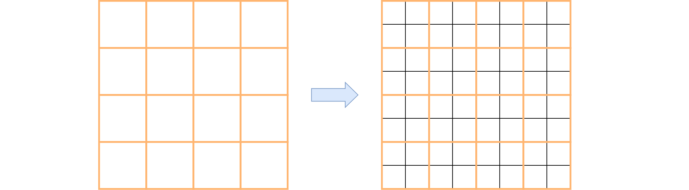

---
jupyter:
  jupytext:
    text_representation:
      extension: .md
      format_name: markdown
      format_version: '1.3'
      jupytext_version: 1.16.7
  kernelspec:
    display_name: Python 3 (ipykernel)
    language: python
    name: python3
---

<!-- #region editable=true slideshow={"slide_type": "slide"} toc=true -->
# Лекция 23: Сегментация изображений

МГТУ им. Н.Э. Баумана

Красников Александр Сергеевич

https://github.com/askras/bmstu_machinelearning/

2024-2025
<!-- #endregion -->

<!-- #region editable=true slideshow={"slide_type": "slide"} -->
## Задачи обработки изображений

При распознавании объектов на изображениях можно решать четыре основных типа задач:

1. **Классификация** (classification, recognition)
2. **Семантическая сегментация** (semantic segmentation)
3. **Детекция объектов** (object detection)
4. **Сегментация объектов** или **инстанс-сегментация** (instance segmentation)

Результат решения каждой задачи показан ниже:

<!-- #endregion -->

<!-- #region editable=true slideshow={"slide_type": "slide"} -->
## Типы задач

### 1. Классификация
При **классификации изображений** выходом являются вероятности присутствия объектов разных классов на изображении в целом.

### 2. Детекция объектов
В задаче **детекции объектов** каждый объект интересующих классов выделяется прямоугольной рамкой с меткой класса, которому объект принадлежит.

### 3. Семантическая сегментация
В задаче **семантической сегментации** каждый пиксель помечается тем или иным классом в зависимости от того, объект какого типа он покрывает. Если присутствует несколько представителей одного класса, то их метки пикселей не различаются. Например, на иллюстрации выше присутствует несколько овец, но все содержащие их пиксели помечены одним цветом.

### 4. Сегментация объектов (инстанс-сегментация)
В задаче **сегментации объектов** (instance segmentation), как и в семантической сегментации, каждый пиксель изображения помечается своим классом, при этом различаются выделения различных представителей одного класса. На иллюстрации каждая овца помечена своим цветом.

> **Сегментация объектов** представляет собой усложнённый вариант детекции объектов, когда каждый объект выделяется не рамкой, а маской произвольной формы.
<!-- #endregion -->

<!-- #region editable=true slideshow={"slide_type": "slide"} -->
## Реализация сегментации объектов

Технически сегментация объектов решается надстройкой над архитектурой детекции объектов, в которой помимо выделения рамки присутствует блок, прогнозирующий маску, попиксельно выделяющую каждый объект в рамке.
<!-- #endregion -->

<!-- #region editable=true slideshow={"slide_type": "slide"} -->
### Типы моделей сегментации объектов

1. **Одностадийные модели** (one-stage instance segmentation):
   - Сразу предсказывают результат.

2. **Двухстадийные модели** (two-stage instance segmentation):
   - На первом этапе предсказываются регионы интереса (region proposals, regions of interest, ROI).
   - На втором этапе производится:
     - Классификация типа объекта.
     - Уточнение координат рамки.
     - Выделение маски объекта.
<!-- #endregion -->

<!-- #region editable=true slideshow={"slide_type": "slide"} -->
## Популярные архитектуры

### 1. Mask R-CNN
Mask R-CNN — это популярная архитектура для двухстадийной сегментации объектов.

### 2. YOLACT
YOLACT — это архитектура для одностадийной сегментации объектов.
<!-- #endregion -->

<!-- #region editable=true slideshow={"slide_type": "slide"} -->
## Mask R-CNN | Машинное и глубокое обучение

### Архитектура

Модель **Mask R-CNN** [1](https://example.com) представляет собой популярный двухстадийный метод **сегментации объектов** (instance segmentation). Она основана на архитектуре детектора **Faster R-CNN** [2](https://example.com) и относится к классу двухстадийных методов:

1. **На первом шаге** генерируются регионы-кандидаты (regions of interest, ROI), в которых могут находиться интересующие объекты.
2. **На втором шаге** каждый регион-кандидат классифицируется по классу, уточняется местоположение рамки (bounding box), и предсказывается маска, выделяющая объект.

Общая схема метода показана ниже:

<!-- #endregion -->

<!-- #region editable=true slideshow={"slide_type": "slide"} -->
### Выделение маски
Выделение маски осуществляется отдельной ветвью вычислений, независимой от классификации объекта и уточнения позиции рамки (class и box на схеме). Это выполняется серией **свёрток** и **транспонированных свёрток**. В результате формируется $C$ карт признаков (feature maps), каждая из которых соответствует выделению одного из классов. Функция потерь для выделения маски штрафует несоответствие только той карты признаков, которая соответствует классу, предсказанному классификатором.

Функция потерь состоит из трёх компонент:
1. Точность классификации.
2. Точность выделения рамки.
3. Точность выделения маски на рамке.

Выделение регионов-кандидатов производится на основе карты признаков, извлекаемых **свёрточным кодировщиком** (backbone).

Варианты ветви вычислений, выделяющей маску объектов, показаны ниже для случаев, когда кодировщиком выступают **ResNet** и **FPN**:

Наилучший результат был достигнут при использовании сети **FPN**.
<!-- #endregion -->

<!-- #region editable=true slideshow={"slide_type": "slide"} -->
### RoIAlign

Для повышения точности в Mask R-CNN вместо операции **RoIPool** из Faster R-CNN (использующего один слой **пирамидального пулинга**) применяется операция **RoIAlign**, которая работает с **билинейно интерполированными значениями** признаков, учитывая произвольное расположение рамки региона интереса относительно карты признаков. Это проиллюстрировано ниже:

<!-- #endregion -->

<!-- #region editable=true slideshow={"slide_type": "slide"} -->
### Примеры работы

<!-- #endregion -->

<!-- #region editable=true slideshow={"slide_type": "slide"} -->
## Оценка позы

В работе также рассматривается применение модели Mask R-CNN для задачи **оценки поз** (pose estimation). Примеры решения этой задачи показаны ниже:

Для этого вместо $C$ выделяющих масок для каждого класса предсказывалось $K$ пространственных карт рейтингов присутствия для каждого опорного узла тела, по которым восстанавливалась поза человека.
<!-- #endregion -->

<!-- #region editable=true slideshow={"slide_type": "slide"} -->
## YOLACT 

Модель **YOLACT** представляет собой популярный одностадийный метод **сегментации объектов** (instance segmentation). Она работает менее точно, чем **Mask R-CNN**, но значительно быстрее, так как не требует предварительного этапа генерации **регионов интереса** (regions of interest, RoI).
<!-- #endregion -->

<!-- #region editable=true slideshow={"slide_type": "slide"} -->
### Архитектура сети

Общая архитектура сети показана ниже:

<!-- #endregion -->

<!-- #region editable=true slideshow={"slide_type": "slide"} -->
### Основные этапы работы:
1. **Извлечение признаков**:
   - Используется архитектура **Feature Pyramid Network (FPN)**, которая позволяет получать семантически сложные признаки в высоком разрешении.

2. **Детекция объектов**:
   - Аналогично модели **RetinaNet**, на каждом уровне декодировщика FPN (и для каждой пространственной позиции) работает одинаковый детектор.
   - Поскольку каждый уровень имеет своё разрешение, это позволяет детектировать как большие, так и малые объекты.

3. **Выходы детектора**:
   - Для каждого из $a$ шаблонов выделяющих рамок детектор выдаёт:
     - 4 регрессионных ответа (коррекции координат выделяющей рамки);
     - $C$ вероятностей классов;
     - $k$ **смешивающих коэффициентов** (mask coefficients).
<!-- #endregion -->

<!-- #region editable=true slideshow={"slide_type": "slide"} -->
### Сравнение детектора YOLACT с RetinaNet:

<!-- #endregion -->

<!-- #region editable=true slideshow={"slide_type": "slide"} -->
## Маски-прототипы

К самому нижнему ярусу FPN декодировщика (обладающему максимальным пространственным разрешением) применяется сеть, определяющая $k$ **масок-прототипов** (prototypes). Примеры масок-прототипов приведены ниже:

<!-- #endregion -->

<!-- #region editable=true slideshow={"slide_type": "slide"} -->
### Вычислительная ветка
Вычислительная ветка для их выделения состоит из операций **повышения разрешения** и **свёрток**:

<!-- #endregion -->

<!-- #region editable=true slideshow={"slide_type": "slide"} -->
## Формирование итоговых масок

1. Каждому прогнозу детектора на каждой пространственной позиции ставится в соответствие маска, получаемая как линейная комбинация масок-прототипов, взвешенных с полученными ранее смешивающими коэффициентами:
   $$
   M = \sum_{i=1}^{k} c_i \cdot P_i
   $$
   где:
   - $M$ — итоговая маска;
   - $c_i$ — смешивающие коэффициенты;
   - $P_i$ — маски-прототипы.

2. Полученная маска обрезается выделяющей рамкой, полученной из задачи регрессии детектора (шаг **crop**).
<!-- #endregion -->

<!-- #region editable=true slideshow={"slide_type": "slide"} -->
## Примеры работы

Примеры итоговых результатов работы YOLACT приведены ниже:

<!-- #endregion -->

<!-- #region editable=true slideshow={"slide_type": "slide"} -->
## Семантическая сегментация

## Что такое семантическая сегментация?
- **Задача**: Классификация каждого пикселя изображения по принадлежности к классу объекта
- **Особенность**: 
  - Объекты одного класса не различаются между собой
  - Отличие от instance segmentation (сегментации отдельных экземпляров)

  
<!-- #endregion -->

<!-- #region editable=true slideshow={"slide_type": "slide"} -->
## Ключевые отличия
| Семантическая сегментация         | Сегментация объектов         |
|-----------------------------------|------------------------------|
| Группировка по классам            | Разделение отдельных объектов|
| Одинаковая метка для всех экземпляров| Уникальные метки для каждого |
<!-- #endregion -->

<!-- #region editable=true slideshow={"slide_type": "slide"} -->
## Применения технологии
1. **Городское планирование**:  
   Анализ аэрофотоснимков (здания, дороги, зелёные зоны)
2. **Медицина**:  
   Выявление патологий на рентгеновских снимках
3. **Автономные автомобили**:  
   Распознавание пешеходов, машин, дорожных знаков
4. **Ретейл**:  
   Виртуальные примерочные (сегментация одежды)

<!-- #endregion -->

<!-- #region editable=true slideshow={"slide_type": "slide"} -->
## Техническая реализация
**Выход модели**:  
Тензор размером `C×H×W` (C - классы, H×W - размер изображения)

**Процесс обработки**:
1. Нейросеть генерирует карту вероятностей
2. Применение SoftMax для каждой пространственной позиции
3. Выбор класса с максимальной вероятностью

<!-- #endregion -->

<!-- #region editable=true slideshow={"slide_type": "slide"} -->
## Пример работы модели
$$
\text{Выходной тензор} = \begin{bmatrix}
P_{класс1}(x_{11}) & ... & P_{класс1}(x_{1W}) \\
... & ... & ... \\
P_{класс1}(x_{H1}) & ... & P_{класс1}(x_{HW}) \\
\end{bmatrix}, ...,
\begin{bmatrix}
P_{классC}(x_{11}) & ... & P_{классC}(x_{1W}) \\
... & ... & ... \\
P_{классC}(x_{H1}) & ... & P_{классC}(x_{HW}) \\
\end{bmatrix}
$$
<!-- #endregion -->

<!-- #region editable=true slideshow={"slide_type": "slide"} -->
## Преимущества и ограничения

✅ **Преимущества**:
- Высокая детализация анализа
- Широкий спектр применений
- Возможность работы в реальном времени

⚠️ **Ограничения**:
- Требует больших вычислительных ресурсов
- Сложность различения перекрывающихся объектов
- Зависимость от качества обучающих данных
<!-- #endregion -->

<!-- #region editable=true slideshow={"slide_type": "slide"} -->
## Будущее развития
- Интеграция с 3D-реконструкцией
- Улучшение работы с видео-потоками
- Применение в метавселенных
- Автоматическая генерация обучающих данных
<!-- #endregion -->

<!-- #region editable=true slideshow={"slide_type": "slide"} -->
# Подходы к решению 

Рассмотрим простые методы решения задачи семантической сегментации изображений и их ограничения.
<!-- #endregion -->

<!-- #region editable=true slideshow={"slide_type": "slide"} -->
### Скользящее окно

Поскольку мы уже умеем решать задачу классификации изображений, то могли бы сопоставить каждому пикселю тот класс, который назначает классификационная сеть при применении к квадратной области изображения с центром в интересуемом пикселе.

**Ограничения:**
- Неэффективность: требует производить классификацию столько раз, сколько пикселей на изображении
- Повторное выделение одних и тех же признаков для пересекающихся фрагментов
<!-- #endregion -->

<!-- #region editable=true slideshow={"slide_type": "slide"} -->
### Сеть из свёрток

Мы могли бы применить к изображению серию свёрток:

**Характеристики свёрток:**
- Шаг (stride): 1
- Использование дополнения (padding) вокруг границ

**Преимущества:**
- Эффективнее первого подхода
- Признаки для соседних пикселей вычисляются однократно и переиспользуются

**Ограничения:**
- Высокие требования к памяти и вычислительным ресурсам
- Обработка тензоров высокого пространственного разрешения
<!-- #endregion -->

<!-- #region editable=true slideshow={"slide_type": "slide"} -->
### Кодировщик-декодировщик

Третий подход также использует свёрточную архитектуру, но предполагает постепенное изменение пространственного разрешения:

**Основные компоненты:**
- **Кодировщик (Encoder):** постепенное уменьшение пространственного разрешения
- **Декодировщик (Decoder):** восстановление исходного разрешения через специальные свёрточные блоки повышения разрешения (upsampling)

**Преимущества:**
- Эффективное вычисление сложных признаков благодаря снижению пространственного разрешения

**Ограничения:**
- Потеря пространственной информации при восстановлении сегментационной карты в высоком разрешении
- Неточности при восстановлении границ между классами
<!-- #endregion -->

<!-- #region editable=true slideshow={"slide_type": "slide"} -->
## Меры качества прогнозов

Рассмотрим основные меры качества прогнозов для задачи семантической сегментации на два класса: целевой объект и фон.
<!-- #endregion -->

<!-- #region editable=true slideshow={"slide_type": "slide"} -->
### Попиксельная точность

**Определение:**
- Самая простая мера качества сегментации
- Доля верно классифицированных пикселей

**Недостатки:**
- Завышает качество при доминировании фона над целевым классом
- Может показывать высокие значения даже при полном игнорировании целевого класса
<!-- #endregion -->

<!-- #region editable=true slideshow={"slide_type": "slide"} -->
### IoU и Dice

#### Intersection-over-Union (IoU)

Пусть:
- $ Y $ - множество реальных пикселей целевого класса
- $ \hat{Y} $ - множество предсказанных пикселей целевого класса

Тогда:

$$
\text{IoU} = \frac{\mid\hat{Y} \cap Y\mid}{\mid\hat{Y} \cup Y\mid}
$$

<!-- #endregion -->

<!-- #region editable=true slideshow={"slide_type": "slide"} -->
#### Dice coefficient

$$
\text{Dice} = \frac{2\mid\hat{Y} \cap Y\mid}{\mid\hat{Y}\mid + \mid Y\mid}
$$

<!-- #endregion -->

<!-- #region editable=true slideshow={"slide_type": "slide"} -->
**Свойства:**
- Принимают значения из отрезка [0,1]
- 1 соответствует наилучшей сегментации
- 0 соответствует наихудшей сегментации

В терминах TP, TN, FP, FN:

$$
\text{IoU} = \frac{TP}{TP + FP + FN}
$$

$$
\text{Dice} = \frac{2TP}{2TP + FP + FN} = \frac{1}{\frac{1}{2}\frac{\hat{P}}{TP} + \frac{1}{2}\frac{P}{TP}} = \text{F-мера}
$$

Связь между мерами:

$$
\text{Dice} = \frac{2\text{IoU}}{\text{IoU} + 1}
$$
<!-- #endregion -->

<!-- #region editable=true slideshow={"slide_type": "slide"} -->
### Сглаженные варианты IoU и Dice

Пусть:
- $ Y \in \mathbb{R}^{H,W} $ - матрица истинной разметки
- $ P \in \mathbb{R}^{H \times W} $ - матрица предсказанных вероятностей

Тогда:

$$
\text{IoU}_{soft}^{1} = \frac{\langle Y,P\rangle}{\mid\mid Y\mid\mid_{1} + \mid\mid P\mid\mid_{1} - \langle Y,P\rangle}
$$

$$
\text{IoU}_{soft}^{2} = \frac{\langle Y,P\rangle}{\mid\mid Y\mid\mid_{2}^{2} + \mid\mid P\mid\mid_{2}^{2} - \langle Y,P\rangle}
$$

$$
\text{Dice}_{soft}^{1} = \frac{2\langle Y,P\rangle}{\mid\mid Y\mid\mid_{1} + \mid\mid P\mid\mid_{1}}
$$

$$
\text{Dice}_{soft}^{2} = \frac{2\langle Y,P\rangle}{\mid\mid Y\mid\mid_{2}^{2} + \mid\mid P\mid\mid_{2}^{2}}
$$

**Преимущества:**
- Дифференцируемы по вероятностям
- Пригодны для использования в оптимизации параметров модели
<!-- #endregion -->

<!-- #region editable=true slideshow={"slide_type": "slide"} -->
### Пограничная IoU

Пусть:
- $ B_{r}(Y) $ - полоса ширины $ r $ вокруг границы реальной маски
- $ B_{r}(\hat{Y}) $ - полоса ширины $ r $ вокруг границы предсказанной маски

Тогда:

$$
\text{Trimap~IoU} = \frac{\mid{B_{r}(Y) \cap}\hat{Y} \cap Y\mid}{\mid\left( {B_{r}(Y) \cap}\hat{Y} \right) \cup \left( {B_{r}(Y) \cap}Y \right)\mid}
$$

$$
\text{Boundary~IoU} = \frac{\mid\left( {B_{r}(\hat{Y}) \cap}\hat{Y} \right) \cap \left( {B_{r}(Y) \cap}Y \right)\mid}{\mid\left( {B_{r}(\hat{Y}) \cap}\hat{Y} \right) \cup \left( {B_{r}(Y) \cap}Y \right)\mid}
$$
<!-- #endregion -->

<!-- #region editable=true slideshow={"slide_type": "slide"} -->
###  Average Precision

Агрегированная мера качества:
- Кривая зависимости Precision(Recall) при различных порогах вероятности
- Average Precision (AP) - площадь под кривой точности-полноты

<!-- #endregion -->

<!-- #region editable=true slideshow={"slide_type": "slide"} -->
### 6. Случай многих классов

При сегментации на C классов:
- Оценивают качество выделения каждого класса
- Усредняют меры по всем классам
- Mean Average Precision (mAP) - усреднённое значение AP по всем классам
<!-- #endregion -->

<!-- #region editable=true slideshow={"slide_type": "slide"} -->
## Повышение разрешения

Как мы видели, базовая архитектура сегментационной сети представляет собой кодировщик, постепенно снижающий пространственное разрешение, и декодировщик, возвращающий разрешение к исходному:

Для **уменьшения разрешения (downsampling)** в кодировщике можно использовать свёртки с шагом (stride) больше единицы, а также операции пулинга.

<!-- #endregion -->

<!-- #region editable=true slideshow={"slide_type": "slide"} -->
### Задача повышения разрешения
Рассмотрим методы повышения пространственного разрешения (upsampling, unpooling, upscaling) в декодировщике.

Задачей повышения разрешения является перевод внутреннего представления изображения из низкого разрешения в высокое. То есть, зная значения активаций на грубой сетке значений, нужно восстановить недостающие значения на более мелкой сетке:

Интерполяция выполняется для каждого канала независимо. Поскольку интерполяция будет неточной, часто после неё ставят обучаемую свёртку для уточнения результатов.
<!-- #endregion -->

<!-- #region editable=true slideshow={"slide_type": "slide"} -->
### 1Bed of nails

Метод bed of nails заполняет детальную сетку значений нулями, подставляя значения грубой сетки в соответствующие позиции:

$$
\begin{pmatrix} 
\mathbf{a} & \mathbf{b} \\ 
\mathbf{c} & \mathbf{d} 
\end{pmatrix}
\longrightarrow
\begin{pmatrix} 
0 & 0 & 0 & 0 & 0 \\ 
0 & \mathbf{a} & 0 & \mathbf{b} & 0 \\ 
0 & 0 & 0 & 0 & 0 \\ 
0 & \mathbf{c} & 0 & \mathbf{d} & 0 \\ 
0 & 0 & 0 & 0 & 0 
\end{pmatrix}
$$

При несоответствии координат применяется округление.
<!-- #endregion -->

<!-- #region editable=true slideshow={"slide_type": "slide"} -->
### Интерполяция ближайшим соседом

В интерполяции ближайшим соседом (nearest neighbor interpolation) элементы мелкой сетки заполняются значениями ближайших элементов грубой сетки:

$$
\begin{pmatrix} 
\mathbf{a} & \mathbf{b} \\ 
\mathbf{c} & \mathbf{d} 
\end{pmatrix}
\longrightarrow
\begin{pmatrix} 
\mathbf{a} & \mathbf{a} & \mathbf{b} & \mathbf{b} \\ 
\mathbf{a} & \mathbf{a} & \mathbf{b} & \mathbf{b} \\ 
\mathbf{c} & \mathbf{c} & \mathbf{d} & \mathbf{d} \\ 
\mathbf{c} & \mathbf{c} & \mathbf{d} & \mathbf{d} 
\end{pmatrix}
$$
<!-- #endregion -->

<!-- #region editable=true slideshow={"slide_type": "slide"} -->
### Билинейная интерполяция

Билинейная интерполяция (bilinear interpolation) обеспечивает более плавные переходы между значениями:

1. Целевая точка проецируется на грубую сетку вверх и вниз по оси Y
2. Линейной интерполяцией находятся значения для обеих проекций
3. Значение целевой точки находится линейной интерполяцией между значениями проекций

<!-- #endregion -->

<!-- #region editable=true slideshow={"slide_type": "slide"} -->
### 4. Бикубическая интерполяция

Бикубическая интерполяция (bicubic interpolation) использует локальную полиномиальную аппроксимацию с условиями непрерывности поверхности и производных на краях.

Сравнение методов интерполяции:

<!-- #endregion -->

<!-- #region editable=true slideshow={"slide_type": "slide"} -->
### Транспонированная свёртка

#### Базовый вариант

Транспонированная свёртка (transposed convolution) - параметрический метод повышения разрешения с настраиваемыми параметрами (смещение и ядро свёртки).

Принцип работы:
- Ядро свёртки ставится на каждую позицию выходной карты признаков
- Домножается на входную активацию в центре постановки ядра
- В пересекающихся позициях результаты суммируются

#### Многоканальный вариант

Для нескольких каналов транспонированная свёртка использует трехмерные "штампы", результаты которых суммируются для каждого входного канала.
<!-- #endregion -->

<!-- #region editable=true slideshow={"slide_type": "slide"} -->
#### Влияние гиперпараметров

- **Шаг (stride):** управляет смещением ядра
- **Сдвиг (dilation):** распыляет значения ядра, заполняя пропуски нулями

<!-- #endregion -->

<!-- #region editable=true slideshow={"slide_type": "slide"} -->
### Недостатки транспонированной свёртки

- Артефакты шахматной доски (checkerboard artifacts):

Способы решения:
- Использование других методов повышения разрешения
- Установка stride=kernel size
- Нормирование выходов
- Применение обычной свёртки после транспонированной для разглаживания результатов
<!-- #endregion -->

<!-- #region editable=true slideshow={"slide_type": "slide"} -->
## Fully Convolutional Network (FCN)

Одной из первых нейросетевых архитектур для решения задачи семантической сегментации была модель **Fully Convolutional Network** или **FCN** [1], использующая полносвёрточную архитектуру.

### Основные характеристики:

- Состоит только из:
  - Свёрток
  - Пулингов
  - Нелинейностей
  - Операций повышения разрешения (upsampling)

- Может работать со входным изображением _произвольных размеров_
- Увеличение входа пропорционально увеличивает размер выхода

Простейшая версия архитектуры:

<!-- #endregion -->

<!-- #region editable=true slideshow={"slide_type": "slide"} -->
### Проблемы простой архитектуры:

- _Низкоразмерные_ промежуточные представления после резкого повышения разрешения не способны качественно выделять границы объектов _в высоком разрешении_

### Решение проблемы:

Для улучшения качества сегментации FCN предлагает комбинировать прогнозы разных уровней сети:

1. **FCN-32s:** Использует только последнее промежуточное представление
2. **FCN-16s:** Комбинирует прогнозы последнего и предпоследнего слоёв
   - Пространственные размеры приводятся в соответствие через билинейную интерполяцию
   - Прогнозы складываются
3. **FCN-8s:** Добавляет ещё более ранние промежуточные представления
<!-- #endregion -->

<!-- #region editable=true slideshow={"slide_type": "slide"} -->
### Графическое представление архитектуры:

<!-- #endregion -->

<!-- #region editable=true slideshow={"slide_type": "slide"} -->
### Сравнение точности различных вариантов:

Чем больше используется комбинирование прогнозов разных уровней, тем выше точность сегментации.
<!-- #endregion -->

<!-- #region editable=true slideshow={"slide_type": "slide"} -->
## Учёт контекста 

Классические архитектуры для задачи **семантической сегментации** сталкиваются с проблемой ограниченной области видимости (receptive field) из-за использования свёрток. Это приводит к тому, что сегментация производится локально, без учёта более глобального контекста.

### Пример проблемы:
Например, катер на реке может быть ошибочно классифицирован как "машина" из-за схожести внешнего вида (капот, стёкла). Однако, если бы сеть могла учитывать более широкий контекст (например, окружающую воду), то такая ошибка была бы исключена.
<!-- #endregion -->

<!-- #region editable=true slideshow={"slide_type": "slide"} -->
## Методы учёта контекста

### 1. Увеличение числа свёрточных слоёв
Увеличение числа свёрток расширяет область видимости, но приводит к росту вычислительной сложности и усложняет настройку сетей.

### 2. Использование свёрток со сдвигом (dilation)
Свёртки со сдвигом больше единицы позволяют эффективно увеличивать область видимости без значительного роста вычислений.

### 3. Пирамидальный пулинг
Пирамидальный пулинг позволяет учитывать контекст на разных уровнях абстракции, что помогает модели лучше понимать глобальную структуру изображения.
<!-- #endregion -->

<!-- #region editable=true slideshow={"slide_type": "slide"} -->
## PSPNet

### Описание модели
Модель **PSPNet**  решает проблему ограниченного контекста за счёт использования более глобальной информации. 

### Архитектура:
1. **Промежуточное представление** строится на основе:
   - Выходов сети ResNet101 с использованием свёрток со сдвигом.
   - Результатов пирамидального пулинга, которые масштабируются до пространственных размеров промежуточного представления.

2. **Пирамидальный пулинг**:
   - Используются 4 слоя пирамидального пулинга с сетками $1 \times 1$, $2 \times 2$, $3 \times 3$, $6 \times 6$.
   - Для уменьшения числа каналов применяются свёртки $1 \times 1$, снижающие число каналов в 4 раза.

3. **Deep Supervision**:
   - ResNet101 обучается с использованием потерь классификации как в конце сети, так и в середине, что улучшает процесс настройки.

<!-- #endregion -->

<!-- #region editable=true slideshow={"slide_type": "slide"} -->
## DeepLab

### DeepLab v3+
**DeepLab v3+** представляет собой улучшенную версию серии моделей DeepLab. Она использует следующие ключевые идеи:

1. **Извлечение признаков**:
   - Основана на архитектуре Xception с использованием поканальных сепарабельных свёрток (depthwise separable convolutions).
   - Свёртки выполняются со сдвигом (dilation > 1), называемые Atrous Convolutions.

2. **Atrous Spatial Pyramid Pooling (ASPP)**:
   - Параллельно используются свёртки с разным сдвигом: $dilation = 6, 12, 18$.
   - Результаты дополняются признаками из глобального пулинга.

3. **Снижение числа каналов**:
   - Для уменьшения числа каналов применяются свёртки $1 \times 1$.

4. **Сохранение границ объектов**:
   - Низкоуровневые признаки с промежуточного слоя кодировщика конкатенируются с промежуточным представлением декодировщика.

<!-- #endregion -->

<!-- #region editable=true slideshow={"slide_type": "slide"} -->
## Литература

1. Болиа Д. и др. Yolact: Real-time instance segmentation //Proceedings of the IEEE/CVF international conference on computer vision. -- 2019. -- С. 9157-9166.

2. Ван З., Нинг Х., Блашко М. Jaccard metric losses: Optimizing the jaccard index with soft labels //Advances in Neural Information Processing Systems. -- 2024. -- Т. 36.

3. Чен Л. К. и др. Deeplab: Semantic image segmentation with deep convolutional nets, atrous convolution, and fully connected crfs //IEEE transactions on pattern analysis and machine intelligence. -- 2017. -- Т. 40. -- №. 4. -- С. 834-848.

4. Чен Л. К. и др. Encoder-decoder with atrous separable convolution for semantic image segmentation //Proceedings of the European conference on computer vision (ECCV). -- 2018. -- С. 801-818.

5. Ченг Б. и др. Boundary IoU: Improving object-centric image segmentation evaluation //Proceedings of the IEEE/CVF conference on computer vision and pattern recognition. -- 2021. -- С. 15334-15342.

6. Хе К. и др. Mask R-CNN //Proceedings of the IEEE international conference on computer vision. -- 2017. -- С. 2961-2969.

7. Лонг Дж., Шелхамер Э., Даррелл Т. Fully convolutional networks for semantic segmentation //Proceedings of the IEEE conference on computer vision and pattern recognition. -- 2015. -- С. 3431-3440.

8. Лю Х. Indoor Scene Understanding for the Visually Impaired Based on Semantic Segmentation. -- 2022.

9. Рен С. и др. Faster R-CNN: Towards real-time object detection with region proposal networks //IEEE transactions on pattern analysis and machine intelligence. -- 2016. -- Т. 39. -- №. 6. -- С. 1137-1149.

10. Чао З. и др. Pyramid Scene Parsing Network //Proceedings of the IEEE conference on computer vision and pattern recognition. -- 2017. -- С. 2881-2890.

<!-- #endregion -->
