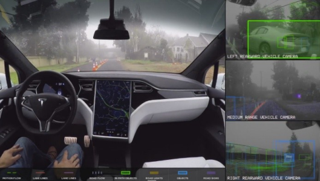
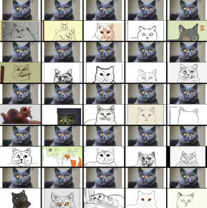
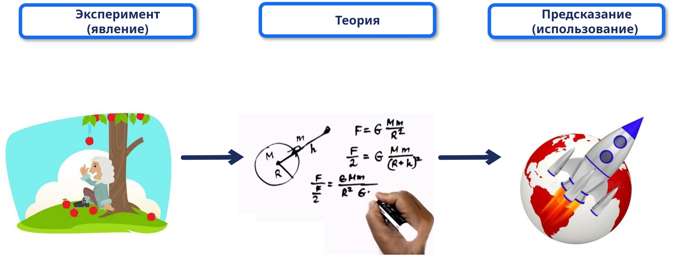
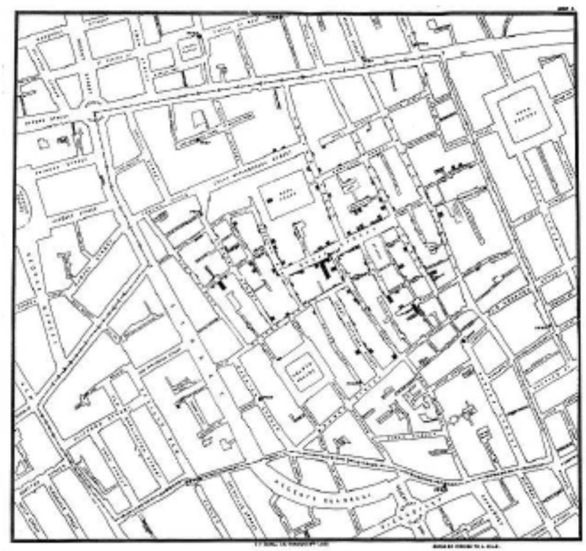
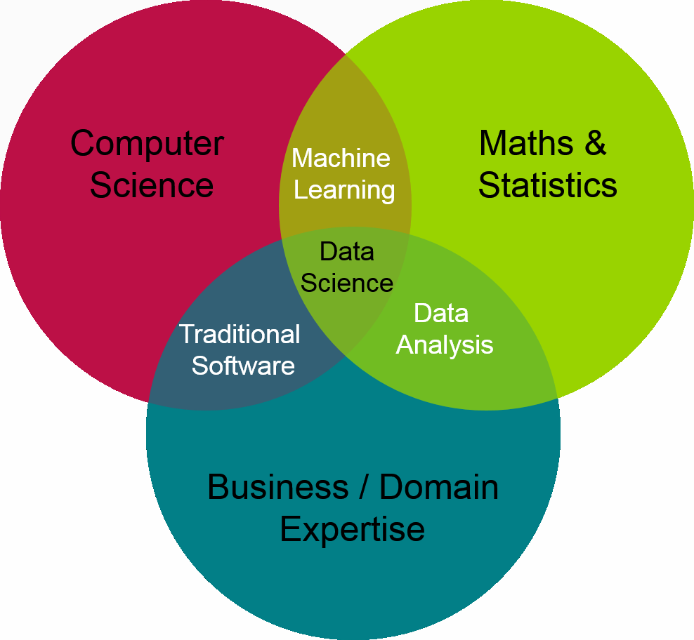

---
jupyter:
  jupytext:
    text_representation:
      extension: .md
      format_name: markdown
      format_version: '1.3'
      jupytext_version: 1.16.4
  kernelspec:
    display_name: Python 3 (ipykernel)
    language: python
    name: python3
---

<!-- #region editable=true raw_mimetype="" slideshow={"slide_type": "slide"} -->
# Лекция 1. Введение в машинное обучение и анализ данных

Машинное обучение и анализ данных

МГТУ им. Н.Э. Баумана

Красников Александр Сергеевич

2024
<!-- #endregion -->

```html editable=true slideshow={"slide_type": "skip"}
<style>
    /* Add your CSS styles here */
    table {
        font-family: Arial, sans-serif;
        border-collapse: collapse;
        width: 100%;
    }

    th, td {
        border: 0px solid #dddddd;
        text-align: left;
        padding: 8px;
    }

    /* Add more styles as needed */

    .strong {font-weight: bolder;}
</style>
```

<!-- #region editable=true slideshow={"slide_type": "slide"} -->
## Вместо эпиграфа

> Четвертая технологическая революция строится на вездесущем и мобильном Интернете, **искусственном интеллекте** и **машинном обучении** (Клаус Мартин Шваб, 2016)

<figure class="figure">
  
  <figcaption class="figure-caption">Клаус Мартин Шваб. Президент Всемирногго экономического форума</figcaption>
</figure>
<!-- #endregion -->

<!-- #region editable=true slideshow={"slide_type": "slide"} -->
## Интеллектуальная деятельность


<!-- #endregion -->

<!-- #region editable=true slideshow={"slide_type": "slide"} -->
### История решения интеллектуальных задач


- 3000/6000 лет до н. э. – письменность

- 2000 лет до н. э. – протоматематика, протоастрономия

- 3000 лет до н. э. – протохимия (получали медь, серебро, свинец)

- 5–6 в. до н.э. – математика как наука

- 5–2 в. до н.э. – физика (Китай, Греция)

- 19 в. – протоанализ данных
<!-- #endregion -->

<!-- #region editable=true slideshow={"slide_type": "slide"} -->
## Интеллектуальные задачи

- Формальные высокоинтеллектуальные задачи
- Экспертные задачи
- Рутинные задачи
- Творческие задачи
<!-- #endregion -->

<!-- #region editable=true slideshow={"slide_type": "subslide"} -->
### Формальные высокоинтеллектуальные задачи

<table>
  <tr>
    <td rowspan="2">
        <p>Например, игры (шахматы, карты, настольные и т. д.), решение математических и логических проблем (сложные математические вычисления, оптимизационые задачи) и т.п.</p>
        <p>Характеристика: высокое умственное напряжение, долгий процесс обучения, четкие правила и простота формализации.</p>
    </td>
    <td>
        <p>Не каждый человек способен освоить, либо необходим длительный процесс получения соответствующего навыка</p>
    </td>
    <td>
        
    </td>
  </tr>
  <tr>
    <td>
        <p>Легко решаются вычислительными машинами при наличии соответствующего программного обеспечения</p>
    </td>
    <td>
        
    </td>
  </tr>
</table>
<!-- #endregion -->

<!-- #region editable=true slideshow={"slide_type": "subslide"} -->
### Экспертные задачи

<table>
  <tr>
    <td rowspan="2">
        <p>Например, медицинская диагностика, инженерные задачи, программирование, планирование деятельности и т.п.</p>
        <p>Характеристика: требуется опыт, обучение по аналогии, «размытые» правила и сложность формализации.</p>
    </td>
    <td>
        <p>Выявление закономерностей по опытным данным, длительный процесс накопления данных</p>
    </td>
    <td>
        
    </td>
  </tr>
  <tr>
    <td>
        <p>При наличии накопленных данных закономерности выявляются автоматически методами машинного обучения</p>
    </td>
    <td>
        
    </td>
  </tr>
</table>
<!-- #endregion -->

<!-- #region editable=true slideshow={"slide_type": "subslide"} -->
### Рутинные задачи

<table>
  <tr>
    <td rowspan="2">
        <p>Например, узнавание визуальных объектов, звуков, ходьба, манипулирование предметами, речь, управление транспортными средствами, перевод тектса и многое другое.</p>
        <p>Характеристика: часто неосознанное решение и обучение в первые годы жизни, правила неформальные и часто субъективные, формализации практически не поддаются.</p>
    </td>
    <td>
        <p>Практически все люди владеют решением этих задач без видимой интеллектуальной нагрузки, овладение навыками осуществляется достаточно быстро, навыки очень устойчивы.</p>
    </td>
    <td>
        
    </td>
  </tr>
  <tr>
    <td>
        <p>Многие рутинные задачи машины решают уже давно</p>
    </td>
    <td>
        
    </td>
  </tr>
</table>
<!-- #endregion -->

<!-- #region editable=true slideshow={"slide_type": "subslide"} -->
### Творческие задачи

<table>
  <tr>
    <td rowspan="2">
        <p>Например, рисование, создание музыки, написание художественных текстов, изобретательская деятельность и всё, что связано с созданием чего-то нового.</p>
        <p>Характеристика: решение задач при «появлении вдохновения», обучение возможно, но не всегда эффективно (нужен талант), правил деятельности не существует, формализации не поддаются или поддаются крайне сложно.</p>
    </td>
    <td>
        <p>Некоторые люди владеют решением этих задач с детства, другие долго учатся. Деятельность без видимой интеллектуальной нагрузки, напротив – доставляет удовольствие. 
Навыки очень устойчивы.</p>
    </td>
    <td>
        
    </td>
  </tr>
  <tr>
    <td>
        <p>Совсем недавно, здесь было бы написано о невозможности. Сейчас все меньше таких задач не подвластно машинам</p>
    </td>
    <td>
        
    </td>
  </tr>
</table>
<!-- #endregion -->

<!-- #region editable=true slideshow={"slide_type": "slide"} -->
## Подходы к решению интеллектуальных задач

- Классический подход
- Подход, основанный на даных
<!-- #endregion -->

<!-- #region editable=true slideshow={"slide_type": "subslide"} -->
### Классический подход



Все зависимости выявляются и задаются «вручную».
<!-- #endregion -->

<!-- #region editable=true slideshow={"slide_type": "subslide"} -->
### Подход, основанный на даных


Данные собираются «вручную», но решающее правило строится автоматически в процессе обучения.
<!-- #endregion -->

<!-- #region editable=true slideshow={"slide_type": "slide"} -->
## История анализа данных

1. Регрессия к среднему
2. Вспышка холеры на Брод-стрит
3. Ирисы Фишера
4. Исследования начальника Архива морских карт в Вашингтоне
<!-- #endregion -->

<!-- #region editable=true slideshow={"slide_type": "subslide"} -->
### Регрессия к среднему

<table>
  <tr>
    <td rowspan="2">
        <p>205 пар родителей и 930 их взрослых детей «закон регрессии к среднему»</p>
        <p>Для многих непрерывных признаков (рост, интеллект и т.п.) взрослое потомство данного родителя отклоняется в меньшей степени от среднего значения для данной популяции, чем родитель</p>
    </td>
    <td>
        
    </td>
    <td>
        
    </td>
  </tr>
  <tr>
    <td>
        <p><a href="https://ru.wikipedia.org/wiki/Регрессия_к_среднему#История_исследований">https://ru.wikipedia.org/wiki/Регрессия_к_среднему#История_исследований</a></p>
    </td>
    <td>
        <p>Фрэнсис Гальтон (1822 - 1911)</p>
    </td>
  </tr>
</table>
<!-- #endregion -->

<!-- #region editable=true slideshow={"slide_type": "subslide"} -->
### Вспышка холеры на Брод-стрит

<table>
  <tr>
    <td rowspan="2">
        <p>Вспышка холеры на Брод-стрит в 1854 году</p>
        <p>Решение медицинской проблемы немедицинскими методами</p>
        <p>Простое решение (нет сложной математики)</p>
    </td>
    <td>
        
    </td>
    <td>
        
    </td>
  </tr>
  <tr>
    <td>
        <p><a href="https://ru.wikipedia.org/wiki/Вспышка_холеры_на_Брод-стрит">https://ru.wikipedia.org/wiki/Вспышка_холеры_на_Брод-стрит</a></p>
    </td>
    <td>
        <p>Джон Смит (1813 - 1858)</p>
    </td>
  </tr>
</table>
<!-- #endregion -->

<!-- #region editable=true slideshow={"slide_type": "subslide"} -->
### Ирисы Фишера

<table>
  <tr>
    <td rowspan="2">
        <p>Набор данных для задачи классификации, на примере которого Рональд Фишер в 1936 году продемонстрировал работу разработанного им метода дискриминантного анализа.Иногда его также называют ирисами Андерсона, так как данные были собраны американским ботаником Эдгаром Андерсоном.</p> 
        <p>Этот набор данных стал уже классическим, и часто используется в литературе для иллюстрации работы различных статистических алгоритмов.</p>
    </td>
    <td>
        
    </td>
    <td>
        
    </td>
  </tr>
  <tr>
    <td>
        <p><a href="https://ru.wikipedia.org/wiki/Ирисы_Фишера">https://ru.wikipedia.org/wiki/Ирисы_Фишера</a></p>
    </td>
    <td>
        <p>Роналд Эйлмер Фишер (1890 - 1962)</p>
    </td>
  </tr>
</table>
<!-- #endregion -->

<!-- #region editable=true slideshow={"slide_type": "subslide"} -->
### Исследования начальника Архива морских карт в Вашингтоне

<table>
  <tr>
    <td rowspan="2">
        <p>Первые «большие данные» в картографии – сбор сведений морских журналов</p>
        <p>Первая профессиональная соцсеть – обмен информацией, сотрудничество в анализе
течений (бутылочная почта)</p>
        <p>Сокращение времени плавания судов, пользуясь попутными ветрами и течениями</p> 
    </td>
    <td>
        
    </td>
    <td>
        
    </td>
  </tr>
  <tr>
    <td>
        <!-- -->
    </td>
    <td>
        <p>Мэтью-Фонтейн Мори (1807 - 1973)</p>
    </td>
  </tr>
</table>
<!-- #endregion -->

<!-- #region editable=true slideshow={"slide_type": "slide"} -->
## История анализа данных как науки

- 1956 год - первый семинар по проблемам искусственного интеллекта
  - задача: моделирование интеллекта человека математическими методами

- 50-е – 70-е годы — простейшие системы искусственного интеллекта 
  - системы дедукции для доказательства теорем
  - робот-психотерапевт eliza

- 80-е годы — развитие экспертных систем
  - моделирование работы эксперта с помощью правил
  - слишком много ручного труда для создания системы

- 90-е годы — развитие машинного обучения как области искусственного интеллекта 
  - нейронные сети
  - генетические алгоритмы
  - автоматический поиск сложных закономерностей

- начало 21 века — глубокое обучение (deep learning)
  - решение сложных задач распознавания с точностью, близкой к человеку
<!-- #endregion -->

<!-- #region editable=true slideshow={"slide_type": "subslide"} -->
## Различные названия 

- Статистический анализ данных (Statistical Data Analysis)
- Искусственный интеллект (Artifical Intelligence) - 1955
- Распознавание образов (Pattern Recognition)
- **Машинное обучение** (Machine Learning) - 1959
- Статистическое обучение (Statistical Learning)
- Интеллектуальный анализ данных (Data Mining) - 1989
- Извлечение знаний из баз данных (Knowledge Discowery in Databases) -1989
- Наука о данных (Data Science)
- Бизнес-аналитика (Business Intelligence, Business Analytics)
- Предсказательная аналитика (Predictive Analytics) - 2007
- Большие данные (Big Data) - 2008
- Аналитика больших данных (Big Data Analytics)
- Глубокое обучение (Deep Learning)
<!-- #endregion -->

<!-- #region editable=true slideshow={"slide_type": "subslide"} -->

<!-- #endregion -->

<!-- #region editable=true slideshow={"slide_type": "slide"} -->
# Зачем это все в ИБ?

ИИ проникает в информационную безопасность с каждым днем все сильнее. 

Недостаточный уровень осведомленности специалистов по ИБ может привести к пропущенным уязвимостям и ущербу защищаемой системе.

**Атака**
- Хакеры используют ChatGPT (фишинг, написание вирусов, обфускация кода и т.д.)
   - https://cybersecuritynews.com/hackers-abusing-chatgpt/
- Вирус внутри весов нейросети (качество модели при этом практически не страдает)
   - https://habr.com/ru/news/569498/
- Взлом моделей машинного обучения (обманки с помощью adversarial ML)
  - https://habr.com/ru/companies/pt/articles/416691/


**Защита**
- Обнаружение веб-атак с помощью модели автоэнкодера
  - https://habr.com/ru/companies/pt/articles/439202/
- Поведенческий анализ для обнаружения вредоносов
  - https://habr.com/ru/companies/pt/articles/734206/
- Защита машинного обучения (Синтетические данные: обезличивание и не только)
  - https://www.syntho.ai/ru/ai-generated-synthetic-data-easy-and-fast-access-to-high-quality-data/

<!-- #endregion -->

<!-- #region editable=true slideshow={"slide_type": "slide"} -->
## Правовое регулирование деятельности в области ИИ
<!-- #endregion -->

<!-- #region editable=true slideshow={"slide_type": "subslide"} -->
### Нормативно-правовая база РФ в области ИИ

**Законодательные акты**
- Указ Президента Российской Федерации от 10.10.2019 № 490 «О развитии искусственного интеллекта в Российской Федерации»
- Распоряжение Правительства Российской Федерации от 19 августа 2020 г. № 2129-р «Об утверждении Концепции развития регулирования отношений в сфере технологий искусственного интеллекта и робототехники на период до 2024 г.»
- Приказ Федеральной службы по надзору в сфере связи, информационных технологий и массовых коммуникаций от 5 сентября 2013 г. N 996 «Об утверждении требований и методов по обезличиванию персональных данных»

**Стандарты**
- **ГОСТ Р 59276-2020**: Системы искусственного интеллекта. Способы обеспечения доверия. Общие положения
- **ГОСТ Р 70462.1-2022**: Информационные технологии. Интеллект искусственный. Оценка робастности нейронных сетей. Часть 1. Обзор
- **ГОСТ Р 59898-2021**: Оценка качества систем искусственного интеллекта. Общие положения
<!-- #endregion -->

<!-- #region editable=true slideshow={"slide_type": "subslide"} -->
### Инициативы по регулированию ИИ в России

- Проект стратегии развития отрасли связи Российской Федерации на период до 2035 года
  - Этапы реализации: «…внедрение систем фильтрации компьютерных атак в сетевом трафике при оказании услуг связи, в том числе использующих технологии искусственного интеллекта…»

- ПНСТ «Искусственный интеллект. Техническая структура федеративной системы машинного обучения»
- ПНСТ «Искусственный интеллект. Большие данные. Обзор и требования по обеспечению сохранности данных»


https://bigdata.msu.ru/standards/

https://www.rst.gov.ru/portal/gost/home/standarts/aistandarts
<!-- #endregion -->

<!-- #region editable=true slideshow={"slide_type": "subslide"} -->
### Зарубежные нормативно-правовые акты в области ИИ

**Законодательные акты**
- EU AI ACT
- Data Security Law of the People's Republic of China
- USA: H.R.6580 - Algorithmic Accountability Act of 2022 117th Congress (2021-2022)

**Стандарты**
- ISO/IEC 20547-4:2020 - Information technology — Big data reference architecture — Part 4: Security and privacy
- European Union Agency for Cybersecurity: CYBERSECURITY OF AI AND STANDARDISATION
- NIST IR 8269. A Taxonomy and Terminology of Adversarial Machine Learning
<!-- #endregion -->

<!-- #region editable=true slideshow={"slide_type": "subslide"} -->
### Инициативы по регулированию ИИ в мире

- **US National Artificial Intelligence Initiative Office: National Artificial Intelligence Initiative**
  - Национальный инициативный проект по развитию ИИ в США включает в себя 6 направлений работы, в том числе модернизация законодательной базы и стандартов в области доверенного ИИ, усовершенствование качества и доступности данных и моделей ИИ, исследование возможностей применения ИИ в интересах безопасности 

- **OWASP Top 10 for Large Language Model Applications**
  1. Манипулятивные запросы к модели, вызывающие ее недекларированное поведение
  2. Небезопасная обработка входных данных
  3. Отравление данных обучения
  4. Отказ в обслуживании модели из-за слишком сложных запросов
  5. Уязвимости категории «цепочка поставок»
  6. …

- **NIST: AI RISK MANAGEMENT FRAMEWORK (AIRMF)**
  - AIRMF постулирует, что ИИ должен обладать следующими характеристиками: неизменная во времени надежность и устойчивость, безопасен для использования людьми, не случайный (системный), интерпретируемый, прозрачно регулируемый.

- **The Federal Trade Commission (FTC) guidance on the use of AI in automated decision-making systems**
  - В руководстве по использованию ИИ в автоматизированных системах принятия решений подчеркивается, что использование инструментов искусственного интеллекта должно быть прозрачным, объяснимым, справедливым, эмпирически обоснованным и подотчетным
<!-- #endregion -->

<!-- #region editable=true slideshow={"slide_type": "slide"} -->
## Инструменты для решения задач анализа данных

- теория вероятностей и математическая статистика
- программирование
- **машинное обучение** 

<!-- #endregion -->

<!-- #region editable=true slideshow={"slide_type": ""} -->

<!-- #endregion -->
