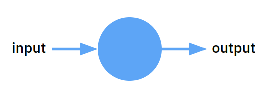

---
jupyter:
  jupytext:
    text_representation:
      extension: .md
      format_name: markdown
      format_version: '1.3'
      jupytext_version: 1.16.7
  kernelspec:
    display_name: Python 3 (ipykernel)
    language: python
    name: python3
---

<!-- #region id="oK3u9EdWGAN3" editable=true slideshow={"slide_type": ""} -->
# Обучение нейронной сети, используя библиотеку Keras в задачах регрессии и классификации
<!-- #endregion -->

<!-- #region id="y1FWR90xxpSl" editable=true slideshow={"slide_type": ""} -->
## Первая нейронная сеть на Keras. Решение задачи регрессии

<!-- #endregion -->

<!-- #region id="lsgGTfpbH4-M" editable=true slideshow={"slide_type": ""} -->
Обучим три нейронные сети для решения задач:
1. Нейрон для умножения
2. Нейросеть для сложения
3. Нейросеть для классификации изображений
<!-- #endregion -->

<!-- #region id="J2IRbGvlGxbK" editable=true slideshow={"slide_type": ""} -->
Давайте создадим нейронную сеть, состоящую из одного нейрона.


<!-- #endregion -->

<!-- #region id="ZctkOCawG3hi" editable=true slideshow={"slide_type": ""} -->
- `Sequential` - это класс последовательности слоев в нейронной сети, у нас пока будет только один слой, но сюда можно добавлять сколь угодно слоев и это будет сеть, состоящая из последовательности слоев.
- `Dense` - это класс полносвязного/линейного слоя, все нейроны связаны друг с другом.
- `units=1` - это количество нейронов в слое. У нас 1 нейрон.
- `input_shape=(1,)` - это входная размерность объекта. У нас только 1 вход.
- `activation='relu'` - это функция активации, которая добавляет в слой нелинейности, именно из-за неё мы можем получать более сложные результаты работы сети.
<!-- #endregion -->

```python editable=true slideshow={"slide_type": ""}
TF_ENABLE_ONEDNN_OPTS=0

import warnings
warnings.filterwarnings('ignore')
```

```python colab={"base_uri": "https://localhost:8080/"} id="fg5zrnfNG1QN" outputId="e2bef02d-1e46-4d8b-a314-5cfca05dd25f" editable=true slideshow={"slide_type": ""}
from keras.layers import Dense
from keras.models import Sequential


model = Sequential([
    Dense(1, input_shape=(1,), activation='relu')
])

model.summary()
```

```python colab={"base_uri": "https://localhost:8080/"} id="SEDpFNBmHvcd" outputId="bd63e244-6c2d-44ce-d6aa-11c6fa060c68" editable=true slideshow={"slide_type": ""}
model.get_weights()
```

<!-- #region id="zEKtGvqcGcNn" -->
Инициализация весов всегда разная, если её не зафиксировать:

<!-- #endregion -->

```python colab={"base_uri": "https://localhost:8080/"} id="2AuwJQvyHzEc" outputId="fbe02edf-1be5-4137-d22e-db6d1b39d6a5"
import tensorflow as tf
tf.random.set_seed(1)

model = Sequential([
    Dense(1, input_shape=(1,), activation='relu')
])

model.get_weights()
```

<!-- #region id="mfZ3eFidSbo2" -->
## Задача 1. Нейрон для умножения на 3
<!-- #endregion -->

<!-- #region id="d9UDd0y8TbJV" -->
Создадим обучающие данные
<!-- #endregion -->

```python id="aMwK0J81-AJ9"
import numpy as np

X = np.array([[1], [3], [2], [10], [4], [7], [8]])
y = np.array([[3, 9, 6, 30, 12, 21, 24]]).T
```

<!-- #region id="St5r8CNRWLfZ" -->
Для того, что обучить нейронную сеть для любой задачи нужно ответить на три вопроса:
1. Какая архитектура сети?
2. Что оптимизируем?
3. Как обучаем?
<!-- #endregion -->

<!-- #region id="0Pq6_oM6WhM5" -->
### Какая архитектура сети
<!-- #endregion -->

<!-- #region id="zPr5AmvYTexL" -->
Создадим сеть, она очень простая, состоит из одного слоя и одного нейрона.


<!-- #endregion -->

```python colab={"base_uri": "https://localhost:8080/"} id="c6UWgSx29ohw" outputId="b02723f6-81f9-4078-dd58-b0f56bd7345d"
from keras.layers import Dense
from keras.models import Sequential

model = Sequential([
    Dense(1, input_shape=(1,), activation='linear')
])

model.summary()
```

<!-- #region id="3CmqQUDHUZHX" -->
Два веса получилось из-за того, что для каждого нейрона в линейном слое есть смещение (bias).
<!-- #endregion -->

```python colab={"base_uri": "https://localhost:8080/"} id="-PuvdE1UBybd" outputId="54b78e4a-aa9d-4fb9-dac7-dc6a26510ead"
w1, w0 = model.get_weights()
w1, w0
```

<!-- #region id="dggCf3ulVz6Q" -->
Теперь сделаем предсказание этой моделью на одном объекте.
<!-- #endregion -->

```python colab={"base_uri": "https://localhost:8080/"} id="jPPywzv7Efft" outputId="3bf44b84-c156-4829-a001-1562ae1bbc7a"
X[:1]
```

<!-- #region id="kuozFM1FV4p4" -->
Предсказание получается очень далекими от истины, потому что сеть еще не знает, для чего её создали.
<!-- #endregion -->

```python colab={"base_uri": "https://localhost:8080/"} id="t3LOGp6aB7re" outputId="1d7f7272-83bc-4ac1-c620-21259bd961b0"
model.predict(X[:1])
```

```python colab={"base_uri": "https://localhost:8080/"} id="bGLbADogCGHa" outputId="ae018733-30b2-4ae8-e95d-4a32091219d6"
w1 * X[:1] + w0
```

```python colab={"base_uri": "https://localhost:8080/"} id="m5czkuSECNEi" outputId="f6c11d5f-f98c-4597-efa6-57a24de85a6a"
from keras.activations import linear
linear(w1 * X[:1] + w0)
```

<!-- #region id="JbFIQGjDWGbM" -->
### Что оптимизируем

У нас задача регрессии, поэтому будем брать функцию потерь для этой задачи, к примеру MSE (средняя квадратичная ошибка).

Вдобавок можно взять еще и метрику, которую будем считать и понимать, обучается ли сеть.
<!-- #endregion -->

<!-- #region id="3M3OUOvZXMXV" -->
### Как оптимизируем

Про этот вопрос будем более подробно говорить в следующих занятиях, но пока условимся, что оптимизатор помогает ошибке быстрее уменьшаться, а значит помогает сеть быстрее обучаться.

Есть несколько видов оптимизаторов, тот же градиентный спуск - это один из методов оптимизации для нейронной сети.
<!-- #endregion -->

```python id="L_ywc5J7-0r3"
model.compile(optimizer='sgd', loss='mse', metrics=['mae'])
```

```python colab={"base_uri": "https://localhost:8080/"} id="x6yykPl4-2MQ" outputId="02fbd20a-9482-4022-d44f-3822226d3720"
%%time
model.fit(X, y, epochs=100)
```

<!-- #region id="gbROlNn-YJOz" -->
Сеть обучается, ошибка падает, метрика становится лучше, всё замечательно.

Теперь проверим, а как модель работает на новых данных.
<!-- #endregion -->

```python colab={"base_uri": "https://localhost:8080/"} id="6hW87IUF_I-e" outputId="223e26ef-cb80-436d-bb18-8a2f006f7812"
user_inp1, user_inp2 = 5, -9
print(f"Проверка на новых данных: {user_inp1} {user_inp2}")
print("Предсказание нейронной сети: ")
print(model.predict(np.array([[user_inp1], [user_inp2]])))
```

<!-- #region id="wQqMjMcEYPcE" -->
Предсказания очень похожи на истину.
<!-- #endregion -->

<!-- #region id="3jBXtePgYXpT" -->
Еще можем посмотреть, как поменялись наши веса после обучения.
<!-- #endregion -->

```python colab={"base_uri": "https://localhost:8080/"} id="_-n4M6tdE57C" outputId="11a8ec1b-f991-4349-f3fb-e4d5323a779b"
nw1, nw0 = model.get_weights()
print('w1 before', w1, 'w1 after', nw1)
print('w0 before', w0, 'w0 after', nw0)
```

<!-- #region id="1s7-Pw6eYcOi" -->
И проверимся на всех обучающих данных.
<!-- #endregion -->

```python colab={"base_uri": "https://localhost:8080/", "height": 287} id="-t3MsXSIF6T1" outputId="ddb7c6e5-8c08-4d94-bfef-f3d6db718787"
import pandas as pd

pd.DataFrame({
   'true': np.squeeze(y),
   'pred': np.squeeze(model.predict(X))
})
```

<!-- #region id="560b4MkNbqhg" -->
## Задача 2. Сеть для сложения чисел
<!-- #endregion -->

<!-- #region id="1-ZItmaIbqhs" -->
Создадим обучающие данные
<!-- #endregion -->

```python id="zjNa5uVDb5w9"
X1 = np.random.randint(1, 10, size=50)
X2 = np.random.randint(1, 10, size=50)

y = X1 + X2
```

```python colab={"base_uri": "https://localhost:8080/"} id="Jt5efryQcHql" outputId="649389cf-a10d-4e58-cceb-1276fc55e519"
X = np.vstack([X1, X2]).T
X
```

```python colab={"base_uri": "https://localhost:8080/"} id="yuvCsiuochWf" outputId="21c66e03-3b18-479e-94e3-21b82cd5c1dc"
y = y[None]
y = y.T
y
```

<!-- #region id="euyhpaA1h7Ee" -->
Т.к. сети - это куча маленьких линейных регрессий, а им нужно масштабирование данных, то и для нейросетей, так же нужно масштабирование данных.
<!-- #endregion -->

```python id="oT7173S_f180" colab={"base_uri": "https://localhost:8080/"} outputId="8ca186b1-e4a9-48d5-daab-0e641cb5763c"
from sklearn.preprocessing import MinMaxScaler

mms = MinMaxScaler()
X_norm = mms.fit_transform(X)
X_norm
```

<!-- #region id="YYqaoqxgbqht" -->
Для того, что обучить нейронную сеть для любой задачи нужно ответить на три вопроса:
1. Какая архитектура сети?
2. Что оптимизируем?
3. Как обучаем?
<!-- #endregion -->

<!-- #region id="Q-BEwoGAbqht" -->
### Какая архитектура сети
<!-- #endregion -->

<!-- #region id="AI3mYCrbbqht" -->
Создадим сеть посложнее, она будет состоять уже из двух слоев, чтобы быстрее обучалась. В одном слое 3 нейрона, а в выходном слое 1 нейрон.


<!-- #endregion -->

<!-- #region id="U9Hci-A3S_M-" -->
При этом пользуемся `Sequential`, т.к. у нас слои последовательные, сначала 2 входа идут в 5 нейронов, а затем выходы из этих 5 нейронов идут в один нейрон.
<!-- #endregion -->

```python colab={"base_uri": "https://localhost:8080/"} id="_XzSVCcyGIJV" outputId="aa63c790-7cac-425c-f18b-ec9ccda462ef"
from keras.layers import Dense
from keras.models import Sequential


model = Sequential([
    Dense(3, input_shape=(2,), activation='linear'),
    Dense(1, activation='linear')
])

model.summary()
```

<!-- #region id="OJRvtgG1YxmH" -->
Что здесь происходит с весами и с самой архитектурой?

Количество весов для одного нейрона равно 2, т.к. два входа поступает, а вдобавок у каждого нейрона есть 1 bias, на первом слое 3 нейрона, значит суммарно весов на первом слое будет 9.

Второй слой ждет на вход 3 сигнала, еще 1 bias.

Получаем 9 + 4 = 13 обучаемых весов.
<!-- #endregion -->

```python colab={"base_uri": "https://localhost:8080/"} id="oOQrDNINZOJ2" outputId="37e9c363-c71e-449e-9e4f-4def63fe5ff8"
model.get_weights()
```

<!-- #region id="bmi5Nj8Obqhu" -->
### Что оптимизируем

Снова задача регрессии, поэтому берем функцию потерь MSE.
<!-- #endregion -->

<!-- #region id="442ai77pbqhu" -->
### Как оптимизируем

Возьмем тот же самый градиентный спуск со стохастикой.
<!-- #endregion -->

```python id="uuSt5bzsbqhu"
model.compile(optimizer='sgd', loss='mse', metrics=['mae'])
```

```python colab={"base_uri": "https://localhost:8080/"} outputId="366c4ffd-c2b2-4704-cd97-0e6b5253d396" id="Y2U7VmAcbqhv"
%%time
model.fit(X_norm, y, epochs=200)
```

<!-- #region id="tNfv4XxBbqhv" -->
Сеть обучается, ошибка падает, метрика становится лучше, всё замечательно.

Теперь проверим, а как модель работает на новых данных.
<!-- #endregion -->

```python colab={"base_uri": "https://localhost:8080/"} outputId="d8d3c35b-43bd-49c8-fe79-2443217b8aa3" id="_c2igAtsbqhv"
test_X = [[4, 2],
          [6, 2]]
test_X = mms.transform(test_X)
print("Предсказание нейронной сети: ")
print(model.predict(np.array(test_X)))
```

<!-- #region id="YnqP0EUUbqhv" -->
Предсказания очень похожи на истину.
<!-- #endregion -->

<!-- #region id="p4OVXPaIbqhv" -->
И проверимся на всех обучающих данных.
<!-- #endregion -->

```python colab={"base_uri": "https://localhost:8080/", "height": 381} outputId="3e81e3e4-177a-4777-cf60-4a4634491739" id="GIUnd40Ibqhv"
import pandas as pd

pd.DataFrame({
    'x1': X[:, 0],
    'x2': X[:, 1],
    'true': np.squeeze(y),
    'pred': np.squeeze(model.predict(X_norm))
}).head(10)
```

<!-- #region id="hfKwW-lVTQC1" -->
## Задача 3. Нейросеть для California housing
<!-- #endregion -->

<!-- #region id="3LkrhFC8QvOq" -->
Будем работать с набором данным `fetch_california_housing` из `sklearn`.
<!-- #endregion -->

```python colab={"base_uri": "https://localhost:8080/", "height": 206} outputId="626f333d-4d73-48ad-a970-c219a7f659f9" id="pDEf_L-lQvPA"
from sklearn.datasets import fetch_california_housing
import pandas as pd


data = fetch_california_housing()

X = pd.DataFrame(data['data'], columns=data['feature_names'])
y = data['target']

X.head()
```

```python colab={"base_uri": "https://localhost:8080/"} outputId="134d3068-6821-44cf-c245-bea2a1774f27" id="qGlJz8tWQvPC"
y
```

<!-- #region id="fkRGiXVZTudB" -->
#### Разделяем данные на обучающую и тестовую выборку
<!-- #endregion -->

```python colab={"base_uri": "https://localhost:8080/"} outputId="a686e6cc-c2ec-41aa-ccad-3e3af572120a" id="0Kr_m64uTudB"
from sklearn.model_selection import train_test_split

X_train, X_test, y_train, y_test = train_test_split(X.values, y, test_size=0.2, random_state=0)
X_train.shape, X_test.shape
```

<!-- #region id="815ut8JJTIM7" -->
#### Проектируем архитектуру для этой задачи
<!-- #endregion -->

```python colab={"base_uri": "https://localhost:8080/"} id="OtEKBEAXTVmN" outputId="36558e9c-4564-42cf-a21f-9791d598c0c3"
from keras.layers import Dense
from keras.models import Sequential


model = Sequential([
    Dense(16, input_shape=(8,), activation='relu'),
    Dense(1, activation='relu')
])

model.summary()
```

<!-- #region id="F9E1W4yCT0YC" -->
#### Компилируем модель ИНС

Подберите нужную функцию потерь и метрику. Оптимизатор можете использовать 'sgd'
<!-- #endregion -->

```python id="S4ADrJaoTeZf"
model.compile(optimizer='sgd', loss='mse', metrics=['mae'])
```

<!-- #region id="ebac-dNAUBtX" -->
#### Обучаем модель ИНС
<!-- #endregion -->

```python colab={"base_uri": "https://localhost:8080/"} id="bGJAwEVPTf8b" outputId="94a5fd28-d458-47e9-f59d-489e33d0fc3b"
model.fit(X_train, y_train, epochs=10)
```

<!-- #region id="EZaZYI7jULuL" -->
#### Сделайте вывод, хорошо ли модель обучается?

Если модель обучается плохо, необходимо внести изменения в работу.
<!-- #endregion -->

<!-- #region id="-IFadu85UZqU" -->
Сеть обучается плохо, так как данные не масштабированы.
<!-- #endregion -->

```python id="I0XP83bgUfnt"
from sklearn.preprocessing import MinMaxScaler

mms = MinMaxScaler()

X_train_n = mms.fit_transform(X_train)
X_test_n = mms.transform(X_test)
```

```python colab={"base_uri": "https://localhost:8080/"} id="7LS8kPIBUtEZ" outputId="ac4c356c-496d-495e-d646-b4f84e6d79ed"
model = Sequential([
    Dense(16, input_shape=(8,), activation='relu'),
    Dense(12, activation='relu'),
    Dense(1, activation='relu')
])

model.compile(optimizer='sgd', loss='mse', metrics=['mae'])

model.fit(X_train_n, y_train, epochs=20)
```

<!-- #region id="mvlGXR3yVMYo" -->
#### Делаем предсказания на тестовых данных
<!-- #endregion -->

```python id="gW7-vtIsVPdV" colab={"base_uri": "https://localhost:8080/"} outputId="ab039fe6-3ab0-4600-a4c4-a1ac883ad57d"
preds = model.predict(X_test_n)
```

<!-- #region id="NLsmmLVkVhkL" -->
#### Вычисляем метрику качества на тестовых данных
<!-- #endregion -->

```python colab={"base_uri": "https://localhost:8080/"} id="SEu1V0AmVTUr" outputId="0295137e-0362-481f-b2b5-20e69c7933d0"
from sklearn.metrics import mean_absolute_error

mean_absolute_error(preds, y_test)
```
